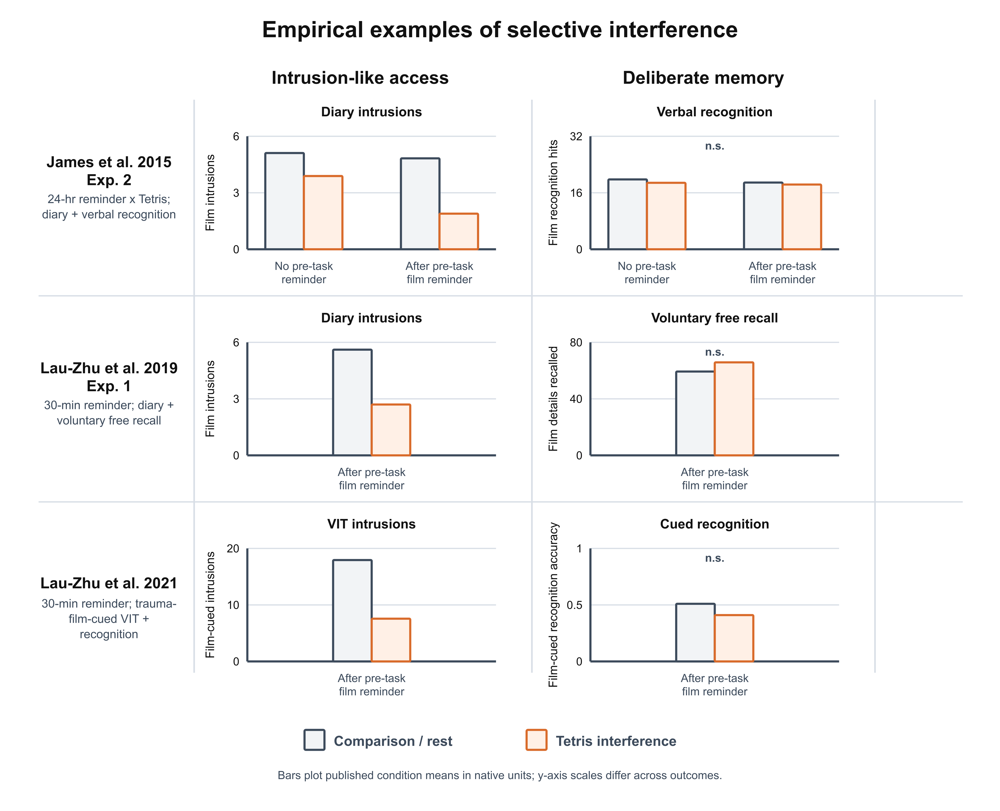
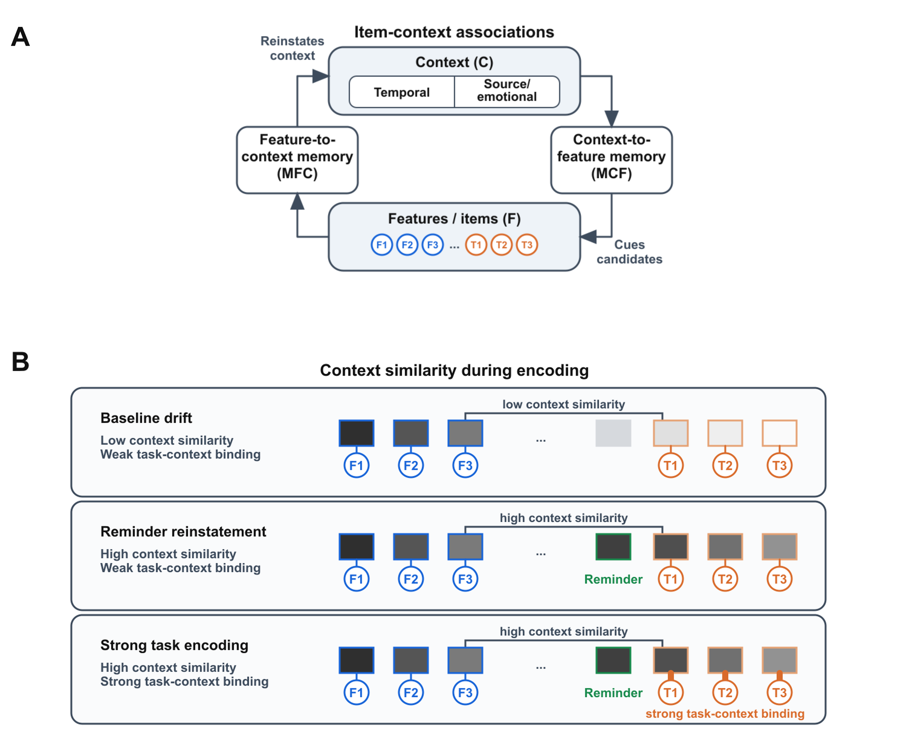
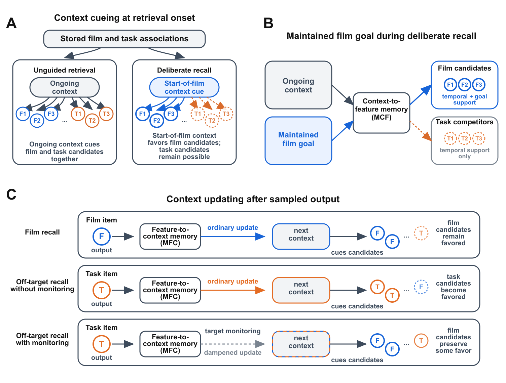
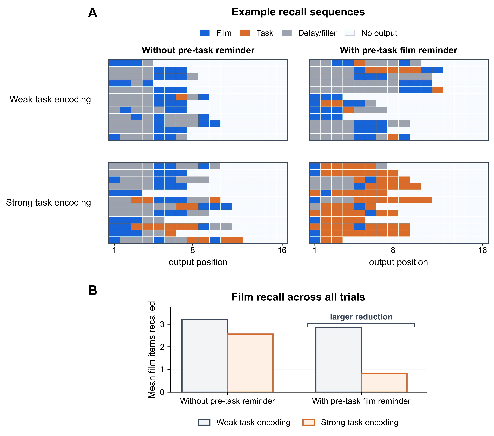
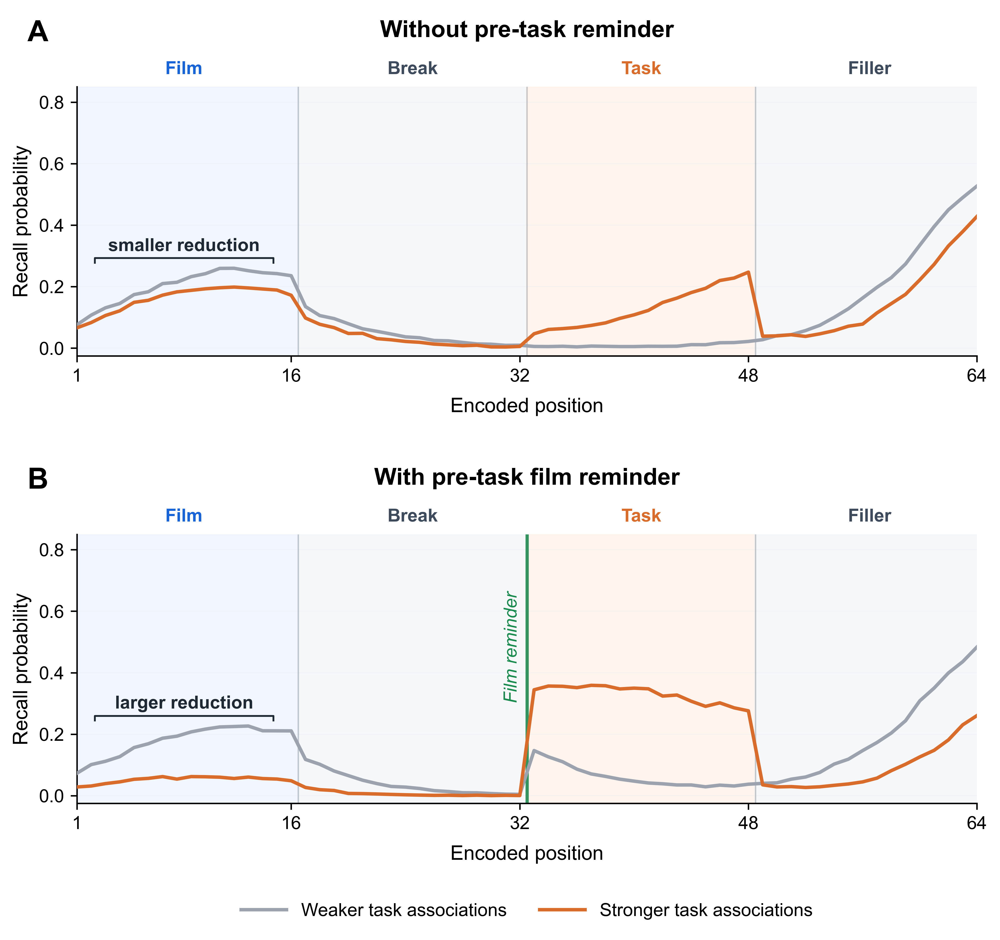
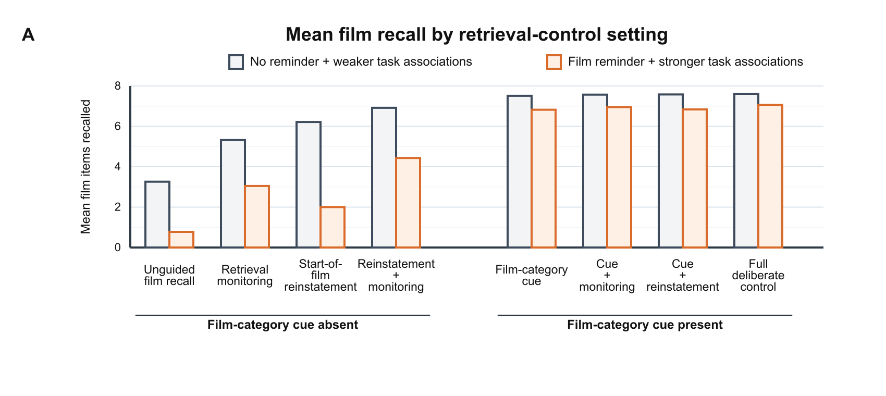
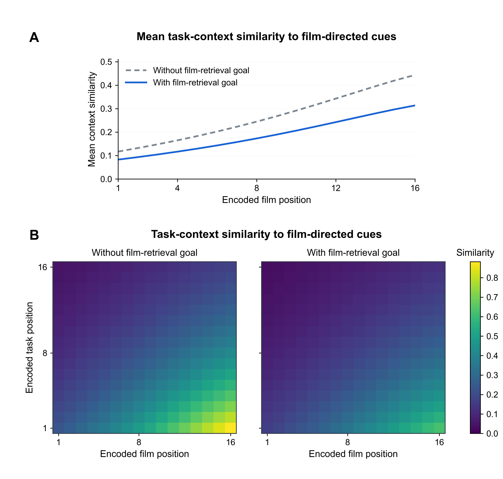
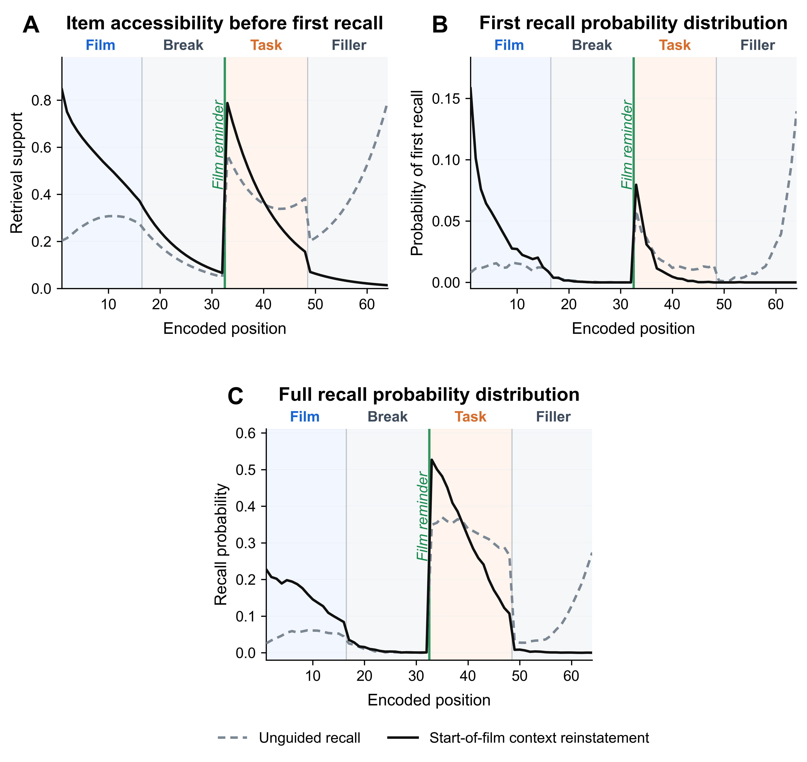
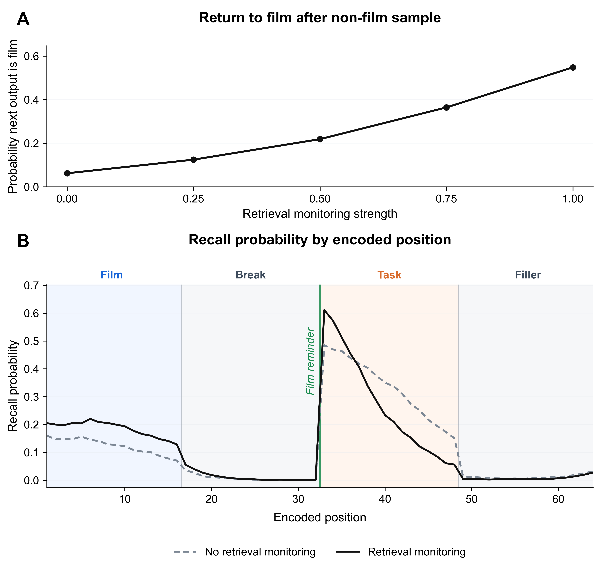
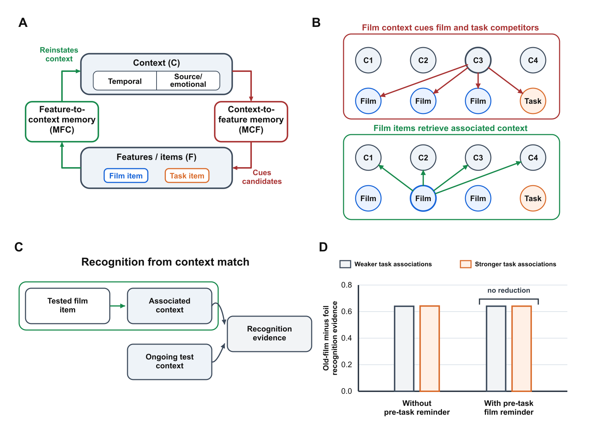

# Abstract

In the trauma-film paradigm, intrusive memories of a film can decrease when participants perform a visuospatial task after a later film reminder, while deliberate recall remains relatively intact.
This selective interference effect is often treated as evidence that involuntary and deliberate remembering depend on different memory representations.
Here we show that the same dissociation may follow without assuming separate representations.
We develop this alternative proposal in an emotional Context Maintenance and Retrieval (eCMR) model that predicts sequences of film and non-film recall events.
In the model, a film reminder before the task causes task information to be encoded in a film-like context, allowing later film cues to also activate task-related competitors and reduce unguided recall.
Deliberate recall is relatively spared because retrieval focused on film content prioritizes film memories even when competitors are active.
Decomposing retrieval control within a retrieved-context model further shows that other forms of control do not offer the same protection.
This motivates a more unified treatment of intrusion-like and deliberate remembering within a common computational framework.



# Introduction

{width="100%"}

Figure 1. **Paradigm variables and canonical selective interference effect.** (A) The modeled trauma-film paradigm includes film encoding, an intervening delay, a possible pre-task film reminder, an intervening task, a post-task delay, and a later test of unguided or voluntary recall. (B) The canonical selective interference effect is summarized as a schematic crossing reminder condition, intervening task, and retrieval measure. Columns distinguish whether the task is preceded by a film reminder, rows distinguish intrusion-like film access from voluntary film recall, and paired bars compare film output after a comparison task versus an interference task. The interference task produces the largest reduction in intrusion-like film access when it follows a film reminder, whereas voluntary film recall shows a smaller reduction under the same conditions. Bars are schematic and do not plot empirical counts, fitted values, or model output.



{width="100%"}

Figure 2. **Empirical examples of selective interference across trauma-film paradigms.** Rows show three exemplar studies: a delayed-reminder diary-plus-recognition design, a delayed-reminder diary-plus-free-recall design, and a trauma-film-cued vigilance-intrusion-plus-recognition design. Left panels plot intrusion-like film access and right panels plot deliberate memory. Gray bars indicate comparison or rest conditions and orange bars indicate Tetris interference. Bar heights reproduce published condition means in native study units, so y-axis scales differ across outcomes.



# A Retrieved-Context Account of Selective Interference

{width="100%"}

Figure 3. **Encoding and associative structure in the retrieved-context account.** (A) The model stores bidirectional item-context associations: context-to-feature associations cue candidate items from the current context, and feature-to-context associations reinstate context when an item is recalled or when a film reminder or test cue is presented. This associative structure determines which items can compete during later retrieval. (B) The interference intervention alters this structure during encoding. Without a pre-task reminder, task items are encoded in relatively distinct context states. With a pre-task film reminder, task encoding occurs after film-associated context has been reinstated. When task encoding is strong, task items become strongly linked to those film-overlapping context states. Thus, the same context that can cue film items can also cue task competitors during later retrieval. Blue marks film items or film-linked context, orange marks task items or task-linked context, green marks film reminder cues, and gray marks neutral, delay, comparison, or shared model structure.



{width="100%"}

Figure 4. **Retrieval operations in the retrieved-context account.** (A) The upper box represents stored film and task associations; the lower boxes compare the context state used to begin unguided retrieval and deliberate recall. Unguided retrieval begins from ongoing context, which can support film and task candidates together. Deliberate recall can begin with start-of-film context reinstatement, giving stronger support to film candidates while task candidates remain weakly supported. (B) A maintained film goal provides an additional deliberate-retrieval signal through context-to-feature memory. Ongoing context can still cue both film items and task competitors, but the film goal adds support to film candidates rather than to task competitors. (C) Rows compare film recall, unmonitored task recall, and monitored task recall. A recalled item updates the next context through feature-to-context memory, and that next context cues later candidates. Without monitoring, recalling a task item can shift later context toward task candidates; with retrieval monitoring, that task-item update is dampened, preserving some film-candidate support. Blue marks film items, film-biased context, or stronger film support; orange marks task items, task-biased context, or stronger task support; gray marks shared context and associative operations. Dashed outlines or arrows mark weaker support or dampened updating, not unavailable candidates.



# Simulation 1: Task Encoding and Contextual Overlap

{width="100%"}

Figure 5. **Simulation 1: unguided film recall after task encoding.** Reminder condition and task encoding strength were crossed while retrieval mode was held unguided; weak film cues were supplied periodically during recall in every condition. (A) Example generated recall sequences for each condition. Each horizontal lane is one simulated trial selected near the condition mean for film output, with output positions running left to right. Colors mark film items, task items, delay/filler items, and unfilled output positions. (B) Mean number of film items recalled across all simulated trials. Film-item recall was lowest when a film reminder preceded strong task encoding, isolating the unguided-retrieval component of the selective interference effect.



{width="100%"}

Figure 6. **Simulation 1: reminder-linked task encoding redistributes recall probability by encoded position.** Reminder condition and task encoding strength were crossed while retrieval was held unguided; weak film cues were supplied periodically during recall in all conditions. (A) Without a pre-task film reminder, recall probability by encoded position changes only modestly when task encoding is strengthened. (B) With a pre-task film reminder, strong task encoding reduces recall from film positions and increases recall from task positions. Curves compare weak and strong task encoding; shaded bands mark film, break, task, and filler positions, and the green vertical line marks the pre-task film reminder. Task encoding strength therefore changes recall probability by encoded position most clearly when task encoding follows a film reminder.



{width="100%"}

Figure 7. **Simulation 1: reminder reinstatement increases overlap between film and task contexts.** Reminder condition was varied before task encoding while retrieval was held unguided. (A) Mean task-context overlap for each encoded film position, averaging across encoded task positions. (B) Full film-by-task context-overlap matrices for the same conditions; each cell compares the context state associated with one encoded film position to the context state active at one encoded task position. Brighter cells indicate greater context overlap. The film reminder increases overlap between film-encoding and task-encoding contexts, especially for later film positions and early task positions.



# Simulation 2: Control Mechanisms for Deliberate Recall

{width="100%"}

Figure 8. **Simulation 2: deliberate film recall is protected from reminder-linked task interference.** Reminder condition and task encoding strength were crossed as in Simulation 1 while retrieval mode was varied between unguided recall and deliberate film recall. Deliberate film recall combined start-of-film context reinstatement, a maintained film goal, and moderate retrieval monitoring. Weak film cues were supplied periodically during recall in all conditions. Rows compare retrieval modes, columns compare reminder conditions, and paired bars compare weak versus strong task encoding. Strong task encoding reduced film recall most clearly when it followed a film reminder, but this reduction was much larger under unguided recall than under deliberate film recall. The model therefore simulates a selective interference effect: the reminder-plus-strong-task intervention strongly reduces unguided film access while leaving deliberate film recall relatively preserved.



{width="100%"}

Figure 9. **Simulation 2: different retrieval controls preserve film recall to different degrees.** Each control setting was evaluated at two endpoints of the interference manipulation: one without a pre-task reminder and with weak task encoding, and one with a pre-task film reminder and with strong task encoding. Weak film cues were supplied periodically during recall in all conditions. Mean film-item recall is shown for each control setting at the two endpoints. Start-of-film reinstatement and retrieval monitoring increase film recall in some conditions, but the smallest endpoint differences occur when deliberate recall includes a film-retrieval goal.



{width="100%"}

Figure 10. **Simulation 2: a film-retrieval goal separates film-directed retrieval from task context overlap.** The high-interference condition was held fixed: a film reminder preceded strong task encoding, and weak film cues were supplied periodically during recall. A film-retrieval goal is an internally maintained retrieval state that supports film items during deliberate recall, distinct from the external film reminder and test-phase film cues. (A) Mean overlap between task-encoding contexts and film-directed retrieval cues, averaging across encoded task positions for each encoded film position. (B) Full overlap matrices for the same condition. The left matrix uses temporal context alone; the right matrix adds the film-retrieval goal to the film-directed retrieval cue. Brighter cells indicate greater overlap with task-encoding context. Adding the film-retrieval goal reduces overlap between film-directed retrieval cues and task-encoding contexts, providing a route to film recall that depends less on temporal context remaining selective for film items.



{width="100%"}

Figure 11. **Simulation 2: start-of-film context reinstatement protects early encoded film positions.** Unguided recall was compared with start-of-film context reinstatement while the condition with a pre-task film reminder and strong task encoding was held fixed and retrieval monitoring was disabled. Start-of-film context reinstatement initializes retrieval by drifting the current context toward the state present at the start of film encoding. Weak film cues were supplied periodically during recall. Shaded bands mark film, break, task, and filler positions; the green line marks the reminder immediately before task encoding. (A) Item accessibility before the first recall attempt. Reinstatement increases accessibility most strongly for early encoded film positions. (B) First recall probability distribution. Reinstatement shifts recall initiation toward early film positions. (C) Full recall probability distribution. The early-film bias remains visible across the recall period, while later film positions remain more vulnerable under reminder-linked strong task encoding. Start-of-film context reinstatement therefore protects early encoded film positions by shifting retrieval initiation toward the start of the film sequence.



{width="100%"}

Figure 12. **Simulation 2: retrieval monitoring supports return to film recall.** The condition with a pre-task film reminder and strong task encoding was held fixed, start-of-film context reinstatement was present, and retrieval monitoring strength was varied. Retrieval monitoring dampens context updating after non-film samples during deliberate recall. Weak film cues were supplied periodically during recall. (A) Model-diagnostic probability that a non-film sample was followed by a film output as retrieval monitoring increased. (B) Recall probability by encoded position with no retrieval monitoring versus the moderate retrieval-monitoring setting used in the Simulation 2 anchor figure. Shaded bands mark film, break, task, and filler positions; the green line marks the reminder immediately before task encoding. Retrieval monitoring therefore supports film recall after search is pulled away from the film sequence, increasing film recall probability under reminder-linked strong task encoding.



# Simulation 4: Context-to-Item and Item-to-Context Test Formats

{width="100%"}

Figure 13. **Item-to-context retrieval bypasses reminder-linked task interference.** (A) CMR stores bidirectional associations between item features and context. Feature-to-context memory (MFC; green) lets an available item reinstate its associated context, whereas context-to-feature memory (MCF; red) lets context cue candidate items. (B) The two directions of retrieval differ in where task competition can enter. When film-associated context cues items through MCF, film items and reminder-linked task items can both receive support. When a film item reinstates context through MFC, retrieval targets context units instead, so task items are not competitors in that step. C1-C4 are example context units/features, and film/task circles are example item units; arrows show selected learned associations, not temporal order or the full model state. (C) In recognition, the tested film item is already available. The item retrieves associated context, which is compared with ongoing test context; stronger matches provide stronger evidence that the item appeared in the film. (D) Film recognition accuracy is plotted across the same reminder and task-encoding conditions used in the recall simulations. Accuracy is hit rate minus false-alarm rate for unstudied film-like lures. The reminder-plus-strong-task condition does not produce a corresponding reduction in recognition accuracy. Blue marks film items, orange marks task items, gray marks shared context or item-layer structure, green marks MFC, and red marks MCF.
