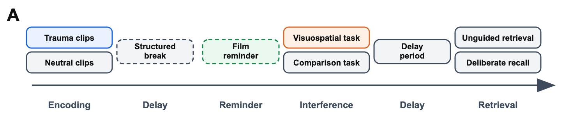
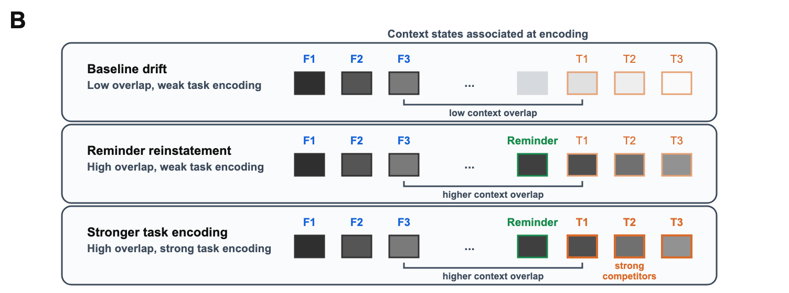
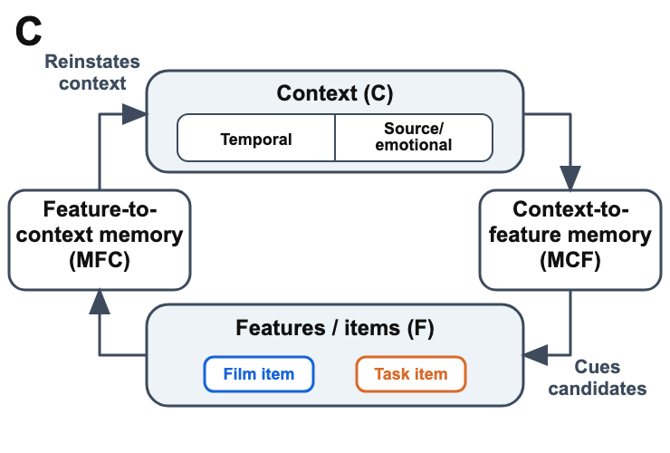
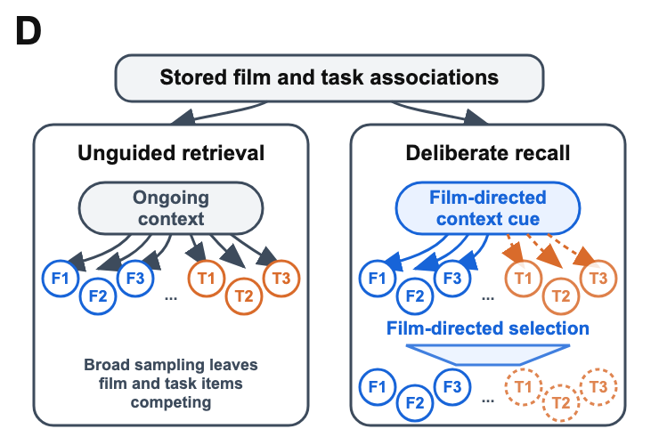

## Whole Figure

{.whole-figure height=5.7in}

## A. Simulated Paradigm

{.panel-wide}

::: {.notes}
The simulated paradigm varies encoding material, post-film task, delay/reminder structure, and retrieval mode within a common trauma-film phase structure; dashed blocks mark phases that vary across immediate and delayed post-reminder designs.

The simulations rely on three retrieved-context mechanisms.
Context-to-item retrieval uses current context to cue candidate items.
Competition follows when film items and task competitors are associated with similar context states.
Item-to-context retrieval allows recalled items, reminder cues, and supplied film items to reinstate associated context.
Film-directed retrieval control changes the starting cue and selection rule used to favor film items over task competitors.
The figure shows how these mechanisms map onto the trauma-film paradigm.
:::

## B. Contextual Associations

{.panel-wide}

::: {.notes}
Context states are shown as blocks associated with film, reminder, and task positions; task items become strong competitors when preserved or reminder-reinstated context overlaps with film-associated context and task associations are strong.

Contextual similarity is established during encoding.
Film items and task items are distinct item representations, but each is linked to the context state active when it is encountered.
Task items are most likely to share film-relevant context when they are encoded soon after the film, after a reminder has reinstated film-associated context, or under matching source/emotional conditions.
Delay and filler activity move context away from the film, reducing the likelihood that later retrieval cues film items and task competitors together.
These conditions determine whether the task adds strong competitors to the film's retrieval environment.
:::

## C. Retrieved-Context Cycle

{.panel-standard}

::: {.notes}
Feature-to-context memory ($M^{FC}$) and context-to-feature memory ($M^{CF}$) define reciprocal context-item pathways: recalled, reminded, or supplied items reinstate context, and current context cues competing candidates.

Item-to-context associations allow recalled items, reminder cues, and supplied film items to reinstate associated context.
In ordinary recall, a retrieved item shifts context toward the state in which that item was encoded, making nearby studied items more likely to be retrieved next.
This context-updating loop is the standard retrieved-context explanation of temporal contiguity and temporally organized recall across filled delays.
The same dynamics allow recent but irrelevant experiences to intrude during recall of a target episode, with intrusion frequency decaying gradually over intervening time.
In delayed-interference paradigms, a reminder of the film uses this same pathway to reinstate film-associated context before task encoding.
Delayed interference is therefore graded by reminder strength and subsequent drift, because those quantities determine how much film-associated context remains available when the task is encoded.
Film-related cues during monitoring and tests that supply a film item use the same item-to-context pathway during later access.
They can pull retrieval context toward film-associated states or retrieve a supplied item's associated context, reducing reliance on broad context-to-item sampling.
Interference items encoded later can add competitors to context-to-item retrieval, but they do not directly overwrite a film item's own item-to-context association.
Recognition-like access is therefore less exposed to the contextual-competition mechanism that reduces uncontrolled retrieval from ongoing context, while deliberate free recall remains a controlled version of context-to-item search.
:::

## D. Retrieval Control

{.panel-standard}

::: {.notes}
The same stored associations can support unguided retrieval or controlled retrieval, with film-directed cue construction and film-directed selection biasing access toward film items.

Deliberate recall is protected only to the extent that retrieval control changes the search.
Like uncontrolled retrieval, deliberate recall uses context-to-item retrieval and remains exposed to competitor interference.
The first control lever is cue construction or start-state control, which reinstates film-associated context before recall and biases search toward film items.
The second is competition focusing or filtering, which sharpens selection among candidates and favors strongly supported film items over weaker or off-target competitors.
These levers yield graded protection: deliberate recall can lose film items when competition is strong, but control can reduce that loss relative to uncontrolled retrieval from ongoing context.
:::

## Simulation Sweep: Interference Strength

{.simulation-wide}

::: {.notes}
Phase-resolved recall in the interference-strength sweep.
Serial-position curves show recall probability across the film, break, interference, and filler phases of the simulated paradigm, separately for no-reminder and reminder conditions.
Darker lines indicate stronger context-to-item learning for interference-task items.
The figure shows how the interference manipulation changes the distribution of retrieval across encoded phases, rather than only changing total film recall.

The first rendered sweep included here orients the reader to the simulated phase structure before the later sections develop the final manuscript contrasts.
These plots are diagnostic outputs from the interference-strength sweep, not stand-alone evidence for the full intrusion-voluntary-memory dissociation.
:::
