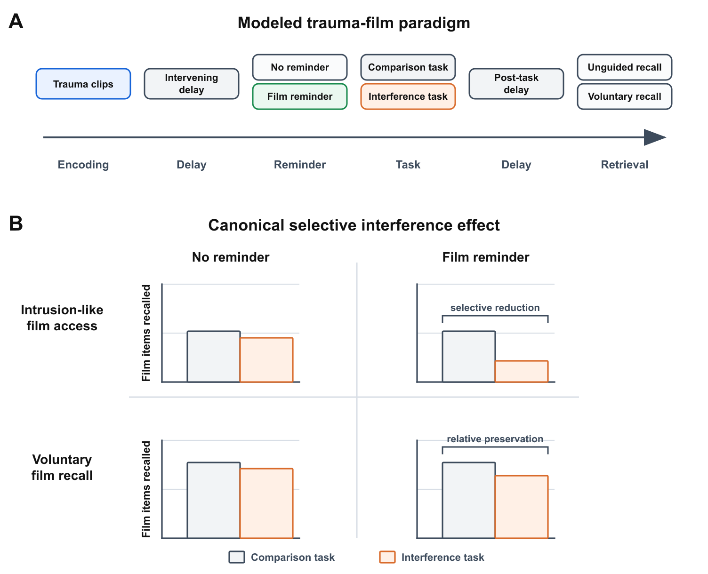
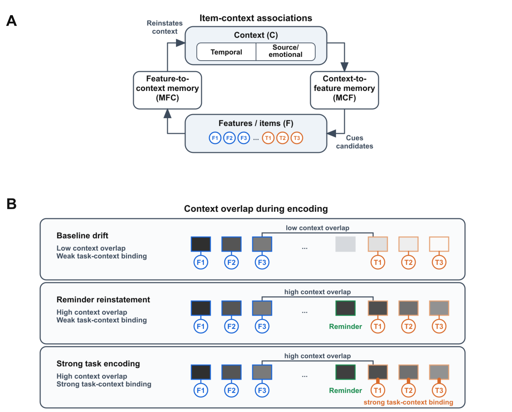
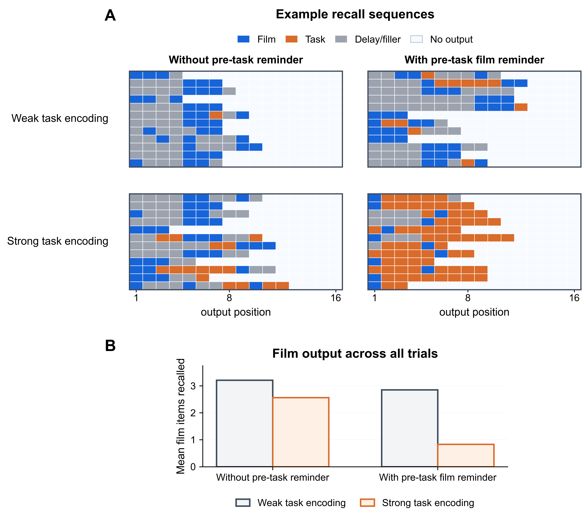
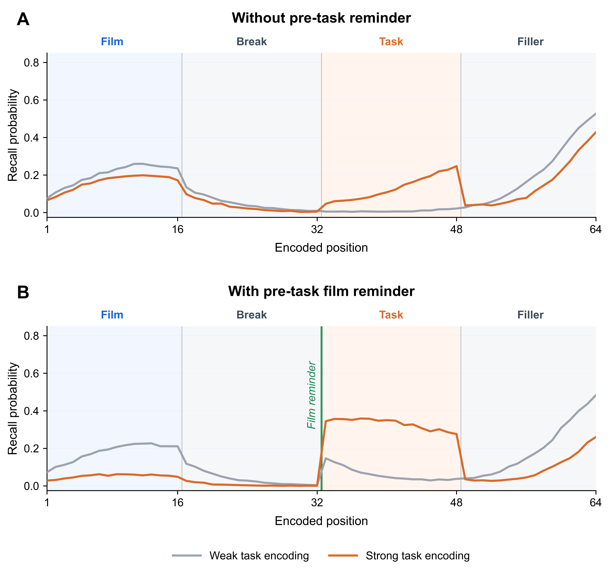
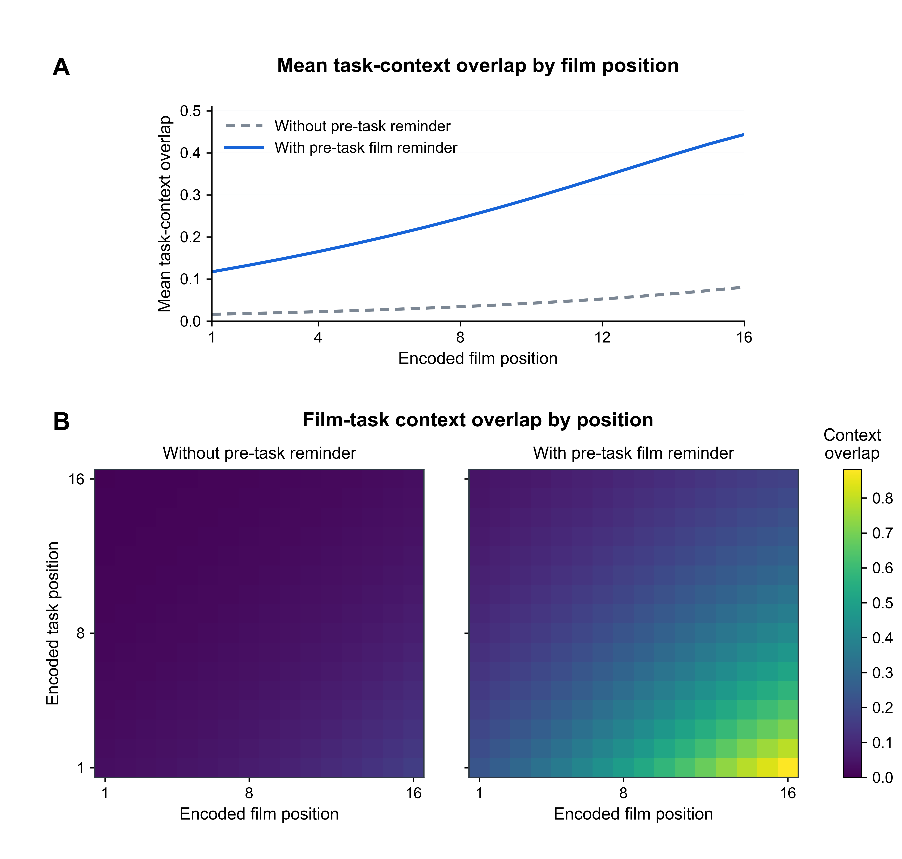
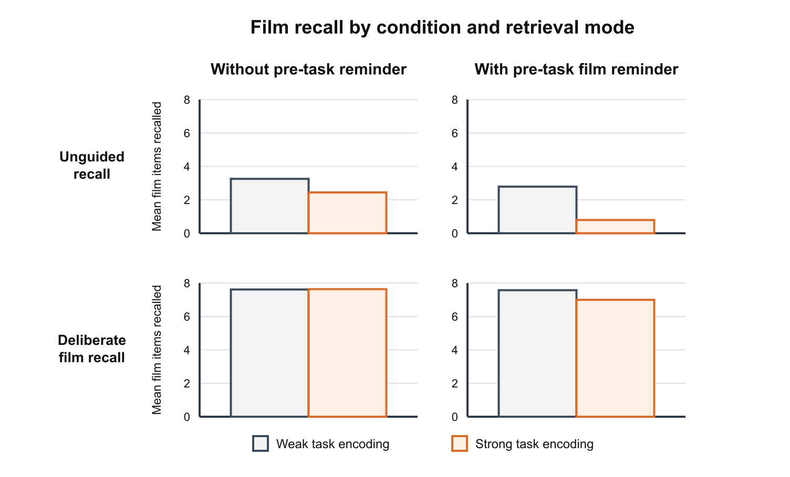
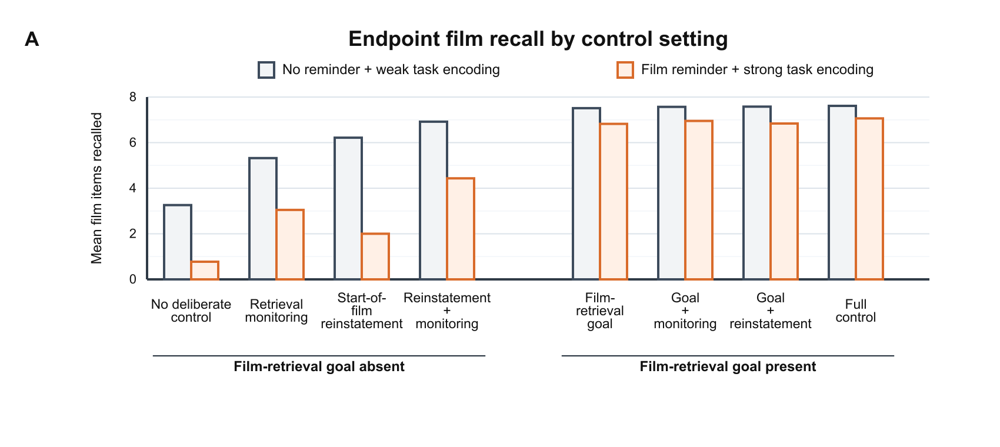
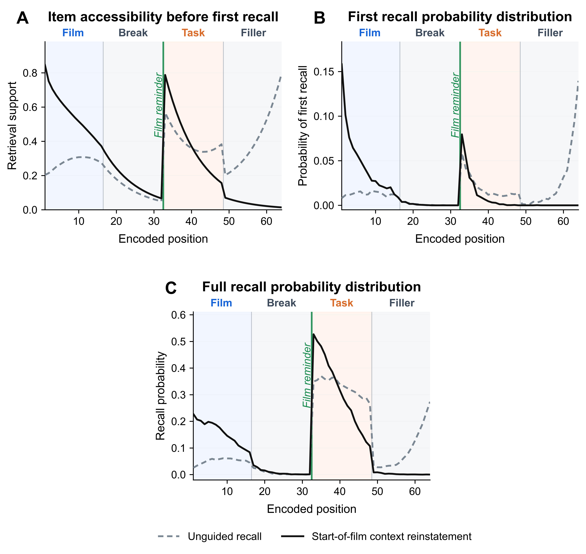
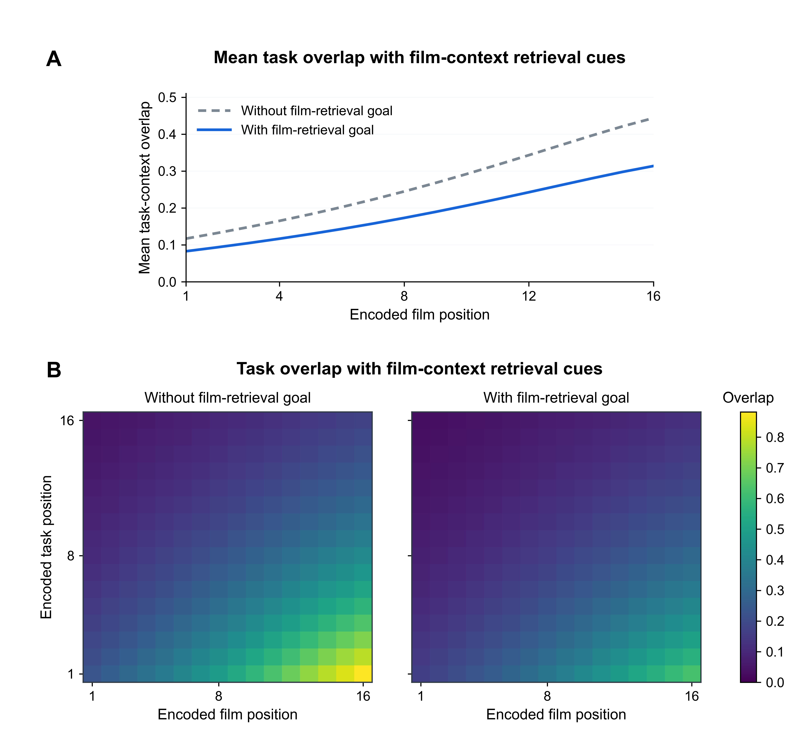
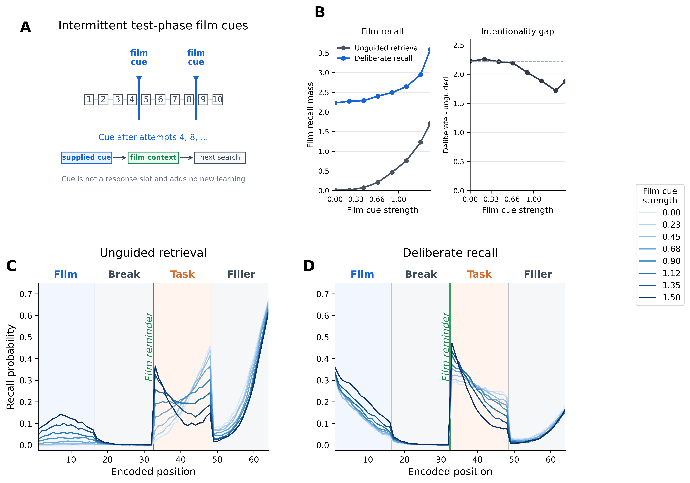

# Abstract

In the trauma-film paradigm, intrusive memories of a film can decrease when participants perform a visuospatial task after a later film reminder, while deliberate recall remains relatively intact.
This selective interference effect is often treated as evidence that involuntary and deliberate remembering depend on different memory representations.
Here we show that the same dissociation may follow without assuming separate representations.
We develop this alternative proposal in an emotional Context Maintenance and Retrieval (eCMR) model that predicts sequences of film and non-film recall events.
In the model, a film reminder before the task causes task information to be encoded in a film-like context, allowing later film cues to also activate task-related competitors and reduce unguided recall.
Deliberate recall is relatively spared because retrieval focused on film content prioritizes film memories even when competitors are active.
Decomposing retrieval control within a retrieved-context model further shows that other forms of control do not offer the same protection.
This motivates a more unified treatment of intrusion-like and deliberate remembering within a common computational framework.

# Introduction

Traumatic experience foregrounds a tension between durability and selectivity in episodic memory.
A rational analysis of episodic memory suggests that highly consequential events should be retained well enough for action-relevant details to inform later evaluation, planning, and choice [@boyle2025why; @zhou2025episodic].
At the same time, adaptive retrieval is selective: what comes to mind should normally depend on current concerns.
Intrusive memories after trauma suggest that durable encoding can outpace regulatory control.
In PTSD, the trauma event returns without being deliberately sought and without being well matched to the demands of the present [@ehlers2000cognitive; @brewin2010intrusive; @krans2009intrusive; @iyadurai2019intrusive].
Understanding why such memories arise, and how they differ from voluntary memory for the same event, is therefore a shared target for both clinical science and mechanistic theories of memory.

The trauma-film paradigm provides a controlled setting for comparing intrusive and voluntary memory for the same event [@holmes2008inducing; @james2016trauma].
Participants view distressing film material, record later intrusive memories of the film, and often complete voluntary-memory tests for the same material.
This design makes it possible to ask whether the same encoded event can remain available to deliberate retrieval while becoming more or less likely to return involuntarily.
In such research, voluntary memory can be relatively preserved, and its relationship to intrusion frequency can be weak, such that the two measures dissociate [@holmes2004trauma; @james2016trauma].
The same encoded episode can therefore support both involuntary and deliberate access, and these modes can come apart empirically.

Visuospatial interference tasks make this dissociation experimentally sharper.
When brief tasks such as Tetris are performed after film encoding, subsequent intrusions can be reduced while voluntary memory for the same material shows little measurable impairment [@holmes2009can; @holmes2010key; @deeprose2012imagery; @lau2019intrusive].
<!-- FIXME: Tommy will add a list of references here. -->
In delayed variants, participants return after about 24 hours to 3 days, receive visual reminder cues for the film, and then complete Tetris; these reminder-plus-Tetris procedures can similarly reduce subsequent intrusions [@james2015computer; @kessler2020visuospatial].
Similar procedures have also been extended to real-life traumatic events, including motor vehicle accidents, emergency caesarean section, and war-related trauma [@iyadurai2018preventing; @horsch2017reducing; @kanstrup2021single].
Two recent meta-analyses support effects of cognitive interventions on intrusive memories, although the evidence base is heterogeneous and recent null findings caution against treating the effect as settled or uniform [@asselbergs2023systematic; @varma2024experimental; @wessel2025evidence].
<!-- FIXME: Add our pre-print (available this week) and the two papers Emily added to the reference list recently. -->
This selective interference effect therefore raises a theoretical question:
when and why can a task delivered soon after film encoding, or after a later film reminder, alter one mode of retrieval more than another, even while both draw on the same recent experience?

The empirical target is an interaction, not only a difference between two memory measures.
The same interference manipulation should reduce unguided or intrusion-like film output more than deliberate film recall, over and above the general advantage for deliberate recall.
In the simulations below, we decompose this broad manipulation into two ingredients: whether a film reminder is presented before the task, and how strongly the task functions as an interference source.
This decomposition lets the model ask when a task becomes a strong competitor for film retrieval, and when retrieval control reduces the resulting interference effect.
@fig-empirical-target summarizes the modeled paradigm variables and the selective interference contrast.

::: {#fig-empirical-target fig-pos="H"}
{width=100%}

**Paradigm variables and canonical selective interference effect.**
**(A)** The modeled trauma-film paradigm includes film encoding, an intervening delay, a possible pre-task film reminder, an intervening task, a post-task delay, and a later test of unguided or voluntary recall.
**(B)** The canonical selective interference effect is summarized as a schematic crossing reminder condition, intervening task, and retrieval measure.
Columns distinguish whether the task is preceded by a film reminder, rows distinguish intrusion-like film access from voluntary film recall, and paired bars compare film output after a comparison task versus an interference task.
The interference task produces the largest reduction in intrusion-like film access when it follows a film reminder, whereas voluntary film recall shows a smaller reduction under the same conditions.
Bars are schematic and do not plot empirical counts, fitted values, or model output.
:::

Figure @fig-empirical-examples places this schematic target alongside exemplar trauma-film studies that vary in reminder timing and deliberate-memory test format.

::: {#fig-empirical-examples fig-pos="H"}
{width=100%}

**Empirical examples of selective interference across trauma-film paradigms.**
Rows show three exemplar studies: a delayed-reminder diary-plus-recognition design, a delayed-reminder diary-plus-free-recall design, and a trauma-film-cued vigilance-intrusion-plus-recognition design.
Left panels plot intrusion-like film access and right panels plot deliberate memory.
Gray bars indicate comparison or rest conditions and orange bars indicate Tetris interference.
Bar heights reproduce published condition means in native study units, so y-axis scales differ across outcomes.
:::

One prominent family of interpretations treats the selective interference effect as evidence that intrusion-supporting memory representations are more vulnerable to interference than representations supporting deliberate recall [@brewin1996dual; @brewin2014episodic].
Dual-representation accounts make this claim architecturally: traumatic experience is proposed to produce distinct sensory and contextual memory traces, with the first supporting involuntary re-experiencing and the second supporting deliberate recall [@brewin2010intrusive; @brewin2014episodic].
In immediate post-film interventions, a visuospatial task is then understood to draw on working-memory resources needed to maintain and consolidate sensory-perceptual imagery, reducing intrusion frequency while voluntary-memory measures remain relatively preserved [@baddeley2000working; @holmes2009can; @holmes2010key; @deeprose2012imagery; @lau2019intrusive].
For interventions delivered after a later reminder, related interpretations often appeal to reconsolidation or post-reactivation restabilization: the reminder reactivates the relevant trace, and the interfering task disrupts its later availability [@kindt2009beyond; @james2015computer].
Across these variants, selective interference is explained by treating the manipulation as acting more strongly on intrusion-supporting or reactivated memory than on the basis for deliberate recall.

Here we argue that selective interference need not be interpreted as evidence for differently vulnerable memory representations.
It may instead reflect differences in retrieval processes operating over a shared set of episodic representations.
Mechanisms supporting selective, goal-directed retrieval in voluntary recall may be sufficient to sidestep or overcome interference that nonetheless reduces the likelihood of unintentional recall.
On this interpretation, the selective interference effect reflects a capacity to intentionally focus retrieval on goal-relevant event information while reducing the influence of competing memories.

Formal modeling is useful here because the verbal dissociation leaves several commitments underspecified.
Computational accounts of emotional memory have begun to formalize how emotional-context retrieval dynamics can produce intrusions and how reminder cues and intervention strength alter the persistence of intrusive memories [@cohen2022memory; @bonsall2023temporal].
The present account centers on the selective interference effect: why the same film and interference manipulation can produce different effects across unguided and deliberate retrieval measures.
Explaining that dissociation requires specifying whether the task weakens film memory or adds competitors at retrieval, when those competitors are cued alongside film items, and how retrieval instructions or supplied cues change the outcome.
A model can therefore turn the retrieval-process interpretation into predictions about when selective interference should appear, rather than only redescribing the dissociation after the fact.

We formalize this proposal in an emotional variant [@talmi2019retrieved; @cohen2022memory] of the Context Maintenance and Retrieval (CMR) framework [@polyn2009context].
Retrieved-context models treat context as a gradually changing state that is shaped by experience, reinstated by retrieval, and used to cue later memory search [@howard2002distributed; @sederberg2008context; @polyn2009context].
In CMR, items and context are linked by bidirectional associations: context cues candidate items, and retrieved or supplied items reinstate associated context [@polyn2009context; @polyn2009task].

Controlled retrieval can be represented in CMR in several ways.
A retrieval goal can set the starting context for search by reinstating context associated with the target episode, rather than beginning from whatever context happens to be active at test.
Control can also make the current context cue more decisive, so that candidates strongly supported by that context are more likely to win retrieval than weaker competitors.
Finally, monitoring can evaluate sampled candidates against the retrieval goal, limiting how much off-target items shape subsequent search.
Prior retrieved-context models introduced related mechanisms to explain recall from goal-relevant context, differences in how selectively items are sampled, and the ability to keep retrieval focused on a target list [@sederberg2008context; @polyn2009context; @lohnas2015expanding].
Emotional CMR variants can preserve these retrieved-context mechanisms while adding emotional context and emotion-dependent binding [@talmi2019retrieved; @cohen2022memory].
Together, these properties make CMR a principled setting for a single-system retrieved-context account of selective interference.
<!-- FIXME: In the Discussion, be more explicit about where CMR3 does not itself distinguish voluntary and involuntary retrieval. -->

To map this framework onto the trauma-film paradigm, the model presents a film sequence, an intervening delay, film reminder cues, an interference task, and a post-task delay while context evolves.
In the simulations, the intervening and post-task delays are implemented as non-film filler items, so context continues to drift between film encoding, reminder, task encoding, and retrieval.
During the reminder phase, film reminder cues can reinstate film-associated context before task encoding, so task items are encoded while context remains similar to states associated with film items.
At retrieval, the current context state cues memory search, so film and task items receive retrieval support to the extent that they have been associated with similar context states.
Unguided and deliberate retrieval can draw on the same learned associations.
Unguided retrieval begins from the current context, which can support film and task candidates together, whereas deliberate recall can use control settings to orient search toward film targets.
A selective interference effect in this model would therefore reflect differential control over a shared associative memory, rather than selective vulnerability of separate memory representations.

The simulations develop the retrieved-context account through five linked demonstrations.
Simulation 1 builds the unguided interference component by showing how a task performed after a film reminder can become a retrieval competitor and reduce later film recall.
Simulation 2 asks which deliberate-retrieval control settings attenuate the resulting interference effect by changing where retrieval begins, how selectively candidates are sampled, and how much off-target samples shape ongoing search.
The next simulations examine how memory-test format changes access to the same encoded film and task associations.
Some trauma-film studies measure intrusions in the laboratory with vigilance-intrusion tasks, in which participants perform an attention task while film-related cues can be used to elicit intrusive film memories [@lau2019intrusive; @lau2021selectively].
In @lau2021selectively, trauma-film cues elicited more intrusion reports than foil cues, but cue condition did not clearly change the size of the interference effect.
Simulation 3 abstracts this retrieval-period cueing manipulation, testing whether film cues can increase film access without necessarily reducing the interference effect.
Simulation 4 turns to recognition, where a candidate film item is presented for judgment rather than first being recovered through free recall.
Simulation 5 explores which task properties make interference stronger or weaker.
Together, the simulations specify a retrieval mechanism for the selective interference effect and derive predictions about when the dissociation between intrusive and deliberate memory should appear across paradigms.

<!--
# Empirical and Theoretical Target
Probably necessary for a review-oriented journal, but we'll avoid for now.
-->

# A Retrieved-Context Account of Selective Interference

The simulations rely on three retrieved-context mechanisms.
First, current context cues candidate items, so film and task items can compete when they have been encoded in similar context states.
Second, retrieved, reminded, or supplied items reinstate associated context, allowing reminders and test cues to change the context that guides later retrieval.
These two item-context mechanisms are standard components of retrieved-context models [@sederberg2008context; @polyn2009context].
Third, controlled retrieval can alter this same retrieval process.
This control component changes three settings on the shared retrieval process: the context state from which search begins, how strongly the best-supported candidates are favored during selection, and how much off-target samples update later context.
These settings correspond to start-of-list context reinstatement, retrieval selectivity, and target monitoring in later CMR applications [@lohnas2015expanding].
@fig-retrieved-context-encoding-associations summarizes the encoding and associative structure used to explain the trauma-film paradigm.
@fig-retrieved-context-retrieval-operations then shows how those associations shape retrieval onset and later context updating.
In the sections below, film reminders are film cues presented before task encoding, so they can change the context in which task items are learned.
Test-phase film cues are film-related cues presented during retrieval or intrusion monitoring, as in vigilance-intrusion tasks.
Recognition tests present a candidate film item for judgment; Simulation 4 models this supplied-item access step without modeling the full recognition decision.



::: {#fig-retrieved-context-encoding-associations fig-pos="H"}
{width=100%}

**Encoding and associative structure in the retrieved-context account.**
**(A)** The model stores bidirectional item-context associations: context-to-feature associations cue candidate items from the current context, and feature-to-context associations reinstate context when an item is recalled or when a film reminder or test cue is presented.
This associative structure determines which items can compete during later retrieval.
**(B)** The interference intervention alters this structure during encoding.
Without a pre-task reminder, task items are encoded in relatively distinct context states.
With a pre-task film reminder, task encoding occurs after film-associated context has been reinstated.
When task encoding is strong, task items become strongly linked to those film-overlapping context states.
Thus, the same context that can cue film items can also cue task competitors during later retrieval.
Blue marks film items or film-linked context, orange marks task items or task-linked context, green marks film reminder cues, and gray marks neutral, delay, comparison, or shared model structure.
:::



::: {#fig-retrieved-context-retrieval-operations fig-pos="H"}
{width=100%}

**Retrieval operations in the retrieved-context account.**
**(A)** The upper box represents stored film and task associations; the lower boxes compare the context state used to begin unguided retrieval and deliberate recall.
Unguided retrieval begins from ongoing context, which can support film and task candidates together.
Deliberate recall can begin with start-of-film context reinstatement, giving stronger support to film candidates while task candidates remain weakly supported.
**(B)** A maintained film goal provides an additional deliberate-retrieval signal through context-to-feature memory.
Ongoing context can still cue both film items and task competitors, but the film goal adds support to film candidates rather than to task competitors.
**(C)** Rows compare film recall, unmonitored task recall, and monitored task recall.
A recalled item updates the next context through feature-to-context memory, and that next context cues later candidates.
Without monitoring, recalling a task item can shift later context toward task candidates; with retrieval monitoring, that task-item update is dampened, preserving some film-candidate support.
Blue marks film items, film-biased context, or stronger film support; orange marks task items, task-biased context, or stronger task support; gray marks shared context and associative operations.
Dashed outlines or arrows mark weaker support or dampened updating, not unavailable candidates.
:::



Contextual similarity is established during encoding.
We use item in the CMR sense to mean a discrete encoded unit, not the whole film: a film item can stand for a scene or segment, and task or filler items stand for events during the task or delay.
Film items and task items are distinct item representations, but each is linked to the context state active when it is encountered.
Task items are most likely to share film-associated temporal context when they are encoded soon after the film or after a reminder has reinstated film-associated context.
Task items can also share film-associated source context when they share a non-temporal source feature with film items.
Emotional extensions of CMR treat affect as one source-context dimension [@talmi2019retrieved; @cohen2022memory], so shared affective or source features can be represented as shared source context.
Delay periods, filled either by laboratory tasks or by later daily activity, move context away from the film, reducing the likelihood that film items and task competitors enter the same later retrieval competition.
These conditions determine whether film and task items enter the same retrieval competition; task encoding strength determines how strongly task items compete in that competition.
In the present model, shared source context can amplify competition when film and task items share the same source feature.

Context-to-item retrieval uses the current context state to cue candidate items.
Unguided retrieval approximates the retrieval condition relevant to intrusive or involuntary access: film memories can be sampled without an explicit goal to recall the film and without film cues supplied by the test.
When the current context resembles states associated with both film items and task items, it supports candidates from both phases.
This mixed cue makes film recall vulnerable to task competition: as task items receive support, any given film item becomes less likely to be selected over a competitor.
The amount of competition depends on how many task competitors are available, how strongly those competitors were encoded, and how similar their temporal or source context is to film context.
In these simulations, task modality is represented through task encoding strength and the similarity between task-associated context and film-associated context.

Item-to-context associations allow recalled items, reminder cues, and film items supplied by a test to reinstate associated context.
In ordinary recall, a retrieved item shifts context toward the state in which that item was encoded, making nearby studied items more likely to be retrieved next.
This context-updating loop is the standard retrieved-context explanation of temporal contiguity and temporally organized recall [@kahana1996associative; @howard2002distributed; @sederberg2008context].
The same dynamics can persist across filled delays, allowing recent but irrelevant experiences to intrude during recall of a target episode, with intrusion frequency decaying gradually over intervening time [@howard2008persistence; @zaromb2006temporal; @lohnas2015expanding].
When the interference task is delayed after film encoding, studies have presented a film reminder before the task and interpreted the procedure as memory reactivation [@james2015computer; @kessler2020visuospatial].
<!-- FIXME: Verify whether additional or alternative citations are needed for delayed reminder-plus-interference procedures. -->
On the present account, the reminder uses item-to-context associations to reinstate film-associated context, paralleling temporal-context explanations of human reminder effects after initial learning [@sederberg2011human].
The effect of a delayed interference task is therefore graded by reminder strength and subsequent drift: stronger reminder reinstatement and weaker subsequent drift leave more film-associated context available when the task is encoded.

Item-to-context associations also matter at test.
During recall or monitoring, retrieved or test-presented items update context as retrieval unfolds.
Retrieving a film item pulls context toward film-associated states and can support retrieval of additional film items.
When a task competitor is sampled, it pulls context toward task-associated states and can prolong competition.
Film-related cues provided by the test can likewise update context, making subsequent retrieval less dependent on maintaining film context internally.
More generally, episodic-updating studies show that returning to the original learning context can itself function as a reminder, reactivating a prior episode and influencing whether later material is linked to it [@hupbach2008dynamics].
Tests that provide a film item as the cue can be less vulnerable to this form of interference, because the model can use the supplied item to reinstate associated context rather than first selecting a film item from a context state that also supports task competitors [@lau2021selectively].

Deliberate recall is represented as controlled retrieval over the same stored associations used by unguided retrieval.
Protection of film recall depends on how these control settings change context-to-item search.
Like unguided retrieval, deliberate recall can still be guided by context states that cue both film items and task competitors, so it remains exposed to interference.
The first control setting is start-of-list context reinstatement, which drifts retrieval context toward the start of the encoded sequence before recall.
Because the film is encoded first in the present paradigm, that start state supports early film items more than later task or filler items.
The second is retrieval selectivity, which makes differences in current context-to-item support have stronger consequences for selection.
This setting favors film items only when the current retrieval context already supports them over competitors.
The third is retrieval monitoring, which limits how much sampled off-target items update later context.
Together, these settings provide graded protection: strong competition can still reduce deliberate film recall, but less than unguided retrieval from a context that supports both film and task candidates.

The simulations instantiate these commitments in an emotional CMR model [@talmi2019retrieved; @cohen2022memory].
The model departs from standard list-learning applications of CMR in two ways.
First, it treats the film sequence, intervening delay, reminder, post-film task, and post-task delay as one continuous stream through which context evolves.
Within that stream, reminder cues can reinstate film-associated context before task encoding.
Second, it simulates non-film material from the delay and task periods as distinct items that can be sampled during retrieval and compete with film items.
Because those items can win retrieval attempts, the model can express selective interference as a shift in what is retrieved rather than as weakening of film-item associations.

# Model Specification

The formal model keeps the standard CMR separation between item features, context, feature-to-context memory, and context-to-feature memory.
The section first defines these inherited representations and base parameters, then specifies the context-updating, learning, retrieval, and control operations used to configure the selective interference simulations.

## Representations and Parameters

Each study event $i$ has an orthonormal feature vector $f_i \in \mathbb{R}^{N}$, where $N$ is the number of encoded item features in the simulated paradigm.
The model maintains a unit-length context vector $c_i \in \mathbb{R}^{D}$, where $D$ is the number of context units.
The core context units represent the start state and item-associated temporal context.
Before encoding begins, context is initialized to the start state $c_0$, with the start unit active and item-associated temporal-context units inactive.
Subsequent events update this state, so the context associated with each film, task, or filler item depends on where it occurs in the continuous paradigm stream.
The model contains two associative matrices.
The matrix $M^{FC} \in \mathbb{R}^{D \times N}$ maps feature vectors to context input.
The matrix $M^{CF} \in \mathbb{R}^{N \times D}$ maps context to feature support.
All vectors are treated as column vectors, so $M^{FC} f$ is a context vector and $M^{CF} c$ is a feature-support vector.

@tbl-base-parameters lists the model parameters used in the equations below.
The notation is adapted across several retrieved-context and CMR implementations, including foundational free-recall models [@sederberg2008context; @polyn2009context], later likelihood-based variants [@kragel2015neural; @morton2016predictive], emotional CMR variants [@talmi2019retrieved; @cohen2022memory], and target-monitoring extensions [@lohnas2015expanding].

:::: {#tbl-base-parameters}
| Symbol | Name | Role |
|---|---|---|
| $\beta_{enc}$ | encoding drift rate | Context drift during study |
| $\beta_{start}$ | start drift rate | Drift toward start-of-list context at recall onset |
| $\beta_{rec}$ | recall drift rate | Context drift after recall |
| $\gamma$ | feature-to-context learning rate | Learning rate for $M^{FC}$ |
| $\lambda$ | context-to-feature learning scale | Baseline or phase-scaled learning rate for $M^{CF}$ |
| $\alpha$ | shared support | Pre-experimental shared support in $M^{CF}$ |
| $\delta$ | self support | Pre-experimental self-support in $M^{CF}$ |
| $\phi_s$ | primacy scale | Initial boost to context-to-feature learning |
| $\phi_d$ | primacy decay | Decay rate of primacy boost |
| $\tau$ | choice sensitivity | Sensitivity of choice to support differences |
| $\beta_{emot}$ | source-context drift rate | Source context drift |
| $\phi_{\mathrm{emot}}$ | source learning scale | Learning scale for the marked source feature |
| $\kappa$ | target-monitoring scale | Reduced context updating after sampled off-target candidates when target monitoring is enabled |
| $\theta_s$ | stop scale | Baseline stopping probability |
| $\theta_r$ | stop growth | Growth of stopping probability across retrieval-attempt positions |

Model parameters and roles in the model specification.
Base parameters are the unscaled values used by the model equations before simulation-specific multipliers are applied.
A phase is a segment of the simulated paradigm, such as film encoding, intervening delay, reminder, task encoding, post-task delay, or retrieval.
::::

Pre-experimental associations represent background memory structure already present before the simulated paradigm begins.
They give each item baseline self-support and shared support, so later retrieval reflects both pre-existing structure and associations learned during the film, task, and filler phases.
The selective interference simulations vary the new associations formed across phases.
These baseline associations are fixed model architecture and are held constant across the selective interference simulations.
For the start unit and item-associated temporal context units:

$$
M^{FC}_{pre}(j,i) =
\begin{cases}
1 - \gamma & \text{if } j = i + 1 \\
0 & \text{otherwise}
\end{cases}
$$ {#eq-mfc-pre}

$$
M^{CF}_{pre}(i,j) =
\begin{cases}
0 & \text{if } j = 0 \\
\delta & \text{if } j = i + 1 \\
\alpha & \text{if } j > 0 \text{ and } j \neq i + 1
\end{cases}
$$ {#eq-mcf-pre}

The start context has no pre-experimental context-to-feature support.
For context units corresponding to items, $\delta$ gives each item self-support and $\alpha$ gives all other items shared support.
This initialization supplies baseline support before experimental learning.

## Context Updating, Learning, and Retrieval

Context updating defines both gradual drift during encoding and reinstatement by recalled, reminded, or supplied items.
The same feature-to-context operation updates context when an item is encoded, recalled, or supplied as a cue.
When feature $f_i$ is active, it probes feature-to-context memory to retrieve context input:

$$
c_i^{\mathrm{IN}} = M^{FC} f_i
$$ {#eq-context-input}

The model normalizes this input to unit length, yielding $\widehat{c}_i^{\mathrm{IN}}$.
Context then drifts toward the normalized input with a drift rate $\beta$:

$$
c_i = \rho_i \, c_{i-1} + \beta \, \widehat{c}_i^{\mathrm{IN}}
$$ {#eq-context-update}

Let $d_i = c_{i-1} \cdot \widehat{c}_i^{\mathrm{IN}}$.
The normalization coefficient is:

$$
\rho_i = \sqrt{1 + \beta^2 (d_i^2 - 1)} - \beta d_i
$$ {#eq-context-rho}

The coefficient $\rho_i$ is the nonnegative solution that keeps $c_i$ at unit length.
Associative learning defines how encoded film, task, and filler events become later retrieval candidates.
When a new event is encoded, the active feature and updated context are associated via outer-product learning.
Feature-to-context associations update as:

$$
\Delta M^{FC} = \gamma c_i f_i^\top
$$ {#eq-mfc-learning}

A primacy function weights context-to-feature learning:

$$
\phi_i = \phi_s \, e^{-\phi_d \cdot i} + 1
$$ {#eq-primacy}

Context-to-feature associations update as:

$$
\Delta M^{CF} = \lambda \phi_i f_i c_i^\top
$$ {#eq-mcf-learning}

Here, $\lambda$ scales context-to-feature learning, while $\phi_s$ and $\phi_d$ define the size and decay of the primacy boost.
Retrieval uses the current context state to assign support to candidate items, sample from the resulting competition, and terminate the sampling sequence.
During context-guided retrieval, current context cues encoded items through $M^{CF}$:

$$
a_i = \left[M^{CF} c\right]_i
$$ {#eq-retrieval-support}

The choice sensitivity $\tau$ controls how strongly support differences affect choice among candidates:

$$
A_i = a_i^{\tau}
$$ {#eq-choice-sensitivity}

The probability of sampling item $i$, conditional on continuing retrieval, follows a Luce choice rule over currently unsampled items:

$$
P(i \mid \text{continue}) = \frac{A_i}{\sum_k A_k}
$$ {#eq-luce-choice}

At each retrieval step, the model may terminate with probability $P_{\mathrm{stop}}(j)$ or sample an item with probability $(1 - P_{\mathrm{stop}}(j)) \cdot P(i \mid \text{continue})$.
Termination probability grows with retrieval-attempt position:

$$
P_{\mathrm{stop}}(j) = \theta_s e^{j\theta_r}
$$ {#eq-stopping}

Here, $j$ is the number of items already sampled, $\theta_s$ sets the baseline termination probability, and $\theta_r$ controls its growth.
In simulations, this value is bounded to remain a valid probability.
After a sampled item $r_j$, context is updated through the same feature-to-context pathway:

$$
c_{j+1} = \rho_{\mathrm{rec},j} \, c_j + \beta_{rec} \, \widehat{M^{FC} f_{r_j}}
$$ {#eq-recall-context-update}

This sampled-item update drives context toward the sampled item's encoding neighborhood, biasing subsequent retrievals toward nearby items and producing temporal organization in retrieval.
Encoding operations use the context update and learning equations together, whereas reminders, sampled items, and film items supplied as test cues use the context update without adding a new recallable event.

## Retrieval Control

Retrieval-control settings alter the starting state and selection process used by the same context-to-feature retrieval operation.
Unguided retrieval and deliberate recall use the same retrieval-support and choice rules in @eq-retrieval-support and @eq-luce-choice.
They differ in the control settings applied to the retrieval state and sampling process.
The first deliberate-recall control setting is start-of-list context reinstatement:

$$
c_\text{start} = \rho_\text{start} \, c_N + \beta_{start} \, c_0
$$ {#eq-start-context-reinstatement}

Here, $\rho_\text{start}$ is calculated from @eq-context-rho using $\beta_{start}$.
Simulation settings can use the fitted $\beta_{start}$ value directly or multiply it to vary the degree of start-of-list context reinstatement.
The second control setting is retrieval selectivity, implemented by scaling $\tau$.
Higher $\tau$ makes selection more sensitive to differences in candidate support.
This setting protects film recall only when the retrieval context already gives film items stronger support than task competitors.
The third control setting is retrieval monitoring after an off-target item is sampled.
Let $t_i = 1$ for film items and $t_i = 0$ otherwise, and define $\kappa_i = t_i + (1 - t_i)\kappa$.
Retrieval monitoring modifies the sampled-item context update in @eq-recall-context-update.
With retrieval monitoring, the context update after sampled item $i$ becomes:

$$
c_{j+1} = \rho_{\mathrm{rec},j} \, c_j + \kappa_i\beta_{rec} \, \widehat{M^{FC} f_i}
$$ {#eq-target-monitoring-update}

When $\kappa < 1$, sampled off-target candidates have less influence on the next context state than sampled film items.
This convention is used for deliberate recall when simulations manipulate rejected-sample updating.
Tests that supply a film item are represented as cue-driven context reinstatement using the same feature-to-context input operation as @eq-context-input:

$$
c_\text{film}^{\mathrm{IN}} = M^{FC} f_\text{film}
$$ {#eq-film-cue-input}

Supplied film items therefore use the same feature-to-context operation as sampled and reminded items.

## Source Context

The source-context pathway adapts the emotional/source-context machinery of eCMR and CMR3 to the present trauma-film setting.
In published emotional CMR models, emotional features update a source-context subregion and can form item-context associations [@talmi2019retrieved; @cohen2022memory].
Here, we use the same architectural role for a simplified film-source dimension: a non-temporal context feature that can organize recall when shared across items [@polyn2009context; @talmi2019retrieved; @cohen2022memory].
In the present simulations, this pathway is represented by a simplified source feature vector $s_i$ with a marked film/source feature and a neutral/default feature.
Film items are assigned the marked source feature, whereas break, task, and filler items are assigned the neutral/default feature unless a later source-overlap manipulation states otherwise.
The source feature vector initializes $M^{FC}_{emot}$ so that an item can cue its source-context components:

$$
M^{FC}_{emot}(\cdot, i) = (1 - \gamma) s_i
$$ {#eq-emot-mfc-pre}

Source-context-to-feature support begins at zero:

$$
M^{CF}_{emot}(i, \cdot) = 0
$$ {#eq-emot-mcf-pre}

Thus, source context can update during experience before it contributes retrieval support.
Source-context components use the same context-update rule in @eq-context-update with source-context drift rate $\beta_{emot}$.
Let $\eta_s$ denote baseline source-context-to-feature learning and let $\phi_{\mathrm{emot},i}$ denote added learning for item $i$ in the marked source pathway.
With the binary vector above, $\phi_{\mathrm{emot},i} = \phi_{\mathrm{emot}} [s_i]_1$, so film items assigned the marked source feature receive $\phi_{\mathrm{emot}}$ and neutral/default items receive 0.
When source-context learning is engaged, the source components of context receive additional context-to-feature learning:

$$
\Delta M^{CF}_{emot} = \lambda \phi_i (\eta_s + \phi_{\mathrm{emot},i}) f_i c_{\mathrm{emot},i}^\top
$$ {#eq-emot-mcf-learning}

Here, $c_{\mathrm{emot},i}$ denotes the source components of context.
Source-context support enters retrieval through learned source context-to-feature associations and contributes to the same competition defined in @eq-retrieval-support.
Because $\eta_s$ is nonzero in the current simulations, neutral/default items can weakly bind the source context active during encoding without being assigned the marked film/source feature.
This lets task items inherit some influence from reinstated film-source context when the task is encoded after a film reminder, while still preserving a distinction between marked film items and neutral task competitors.

At retrieval onset, all current simulations include a fixed partial reinstatement of the marked film-source context.
This fixed source-context orientation represents the test setting orienting retrieval toward the film episode at the level of source context.
It is held constant across unguided and deliberate retrieval and is separate from the start-of-list context reinstatement manipulated in Simulation 2.
Task items are assigned the marked source feature only in later source-overlap variants.
When film and task items share the marked source feature and source context-to-feature learning is enabled, @eq-emot-mcf-learning can amplify competition beyond temporal proximity alone.

These equations define the item-context architecture used in all simulations.
During retrieval, the model samples one candidate at a time until stopping.
Task competitors reduce film recall when they are sampled instead of film items, using retrieval attempts that could otherwise have returned film material.

# Simulations

The simulations instantiate the retrieved-context account in a controlled trauma-film analogue: a laboratory task in which distressing film material is used to study memory processes relevant to responses to real-life trauma [@holmes2008inducing; @james2016trauma].
The simulations are organized into three linked groups: a core context-binding and retrieval-control demonstration, cue and test-format consequences of bidirectional item-context associations, and task-property boundary conditions.
Simulation 1 shows how a task performed after a film reminder attenuates film recall when task encoding is strong and occurs in context states that overlap with film encoding context.
Simulation 2 adds the intentionality manipulation by comparing unguided retrieval with deliberate recall and then decomposing the control settings that protect film recall during deliberate retrieval.
Simulation 3 asks how recall changes when the test periodically supplies film cues during retrieval, measuring both overall film recall and the film-recall gap between unguided and deliberate retrieval.
Simulation 4 compares context-to-item recall with supplied-item access formats.
Simulation 5 examines which task properties make the post-film task effective, including task encoding strength, contextual similarity, and source-context overlap.

:::: {#tbl-simulation-overview}
| Simulation | Main fixed structure | Varied or compared | Primary readout |
|---|---|---|---|
| 1 | Unguided retrieval settings; film, delay, task, and filler phases | No-reminder versus with-reminder task encoding; task encoding multiplier | Film and task recall by encoded position; film-task context overlap |
| 2 | With-reminder task-encoding condition from Simulation 1; task encoding multiplier fixed at 2.0 | Start-of-list context reinstatement, retrieval selectivity, and off-target context updating | Pre-recall support, recall initiation, overall recall, and film return after off-target samples |
| 3 | With-reminder task-encoding condition and matched unguided/deliberate retrieval settings | Strength of test-phase film cues | Film recall mass, intentionality gap, and recall by encoded position |
| 4 | Same encoded associations, without a full recognition-decision model | Context-guided recall versus supplied-item access | Whether supplied film information changes where interference enters retrieval |
| 5 | Shared phase structure | Task encoding strength, temporal-context overlap, and source-context overlap | Boundary conditions for stronger or weaker task competition |

Overview of what is held fixed, varied, and measured across simulations.
::::

## Methodology

The simulations require default values for context drift, associative learning, retrieval choice, and stopping before the trauma-film manipulations are applied.
Ideally, these values would be estimated from a selective interference experiment that implements the full paradigm modeled here: film encoding, reminder or no-reminder conditions, an interference task, a later retrieval test, and an observed dissociation between unguided and deliberate retrieval measures.
Such a dataset would also need trial-by-trial recall sequences that identify which film, task, and non-film candidates entered the retrieval stream and in what order, so the model could estimate retrieval competition rather than only final film memory scores.
Existing trauma-film studies define the target phenomenon, but they typically do not provide this model-fitting structure.
We therefore use an immediate affective free-recall dataset as a provisional anchor for core eCMR dynamics before applying the selective interference manipulations in simulation.
The anchor dataset included participants who reported concern about the war in Ukraine and studied and recalled lists of war-related and neutral photographs [@dupertuys2026ukraine].
The fitted dataset included 123 participants, four lists per participant, 492 immediate recall sequences, and 3,804 scored recall events.
The fit provides an externally estimated eCMR regime for deliberate context-guided recall of affective and neutral photographs.
The fitted parameters set the starting encoding, retrieval, and stopping dynamics before the selective interference manipulations are applied as phase-specific encoding or retrieval-control settings.
In these simulations, film items reinstate the marked source feature into source context, neutral/default events can weakly bind active source context, and retrieval begins with partial film-source reinstatement.
To accommodate the difference in total encoded items between the immediate-recall paradigm and the current simulations, the primacy profile is also moderated relative to the immediate-recall fit so that the film sequence is not dominated by an unrealistically steep first-item advantage.
@tbl-simulation-parameters gives the default numerical values used in the current simulations.

<!-- FIXME: Discuss whether a paradigm-matched selective interference dataset with externalized retrieval output should be collected or fitted for future parameter anchoring. -->

:::: {#tbl-simulation-parameters}
| Symbol | Value | Role |
|---|---:|---|
| $\beta_{enc}$ | 0.440 | Encoding drift rate |
| $\beta_{start}$ | 0.766 | Start drift rate |
| $\beta_{rec}$ | 0.678 | Recall drift rate |
| $\gamma$ | 0.468 | Feature-to-context learning rate |
| $\delta$ | 0.00022 | Pre-experimental self-support |
| $\alpha$ | 0 | Pre-experimental shared support |
| $\phi_s$ | 0.100 | Primacy scale used in simulations |
| $\phi_d$ | 1.500 | Primacy decay used in simulations |
| $\tau$ | 3.562 | Choice sensitivity |
| $\beta_{emot}$ | 0.696 | Source-context drift rate |
| $\phi_{\mathrm{emot}}$ | 0.130 | Learning scale for the marked source feature |
| $\eta_s$ | 0.050 | Baseline source-context-to-feature learning |
| $\beta_{\mathrm{film-source}}$ | 0.500 | Fixed film-source reinstatement at retrieval onset |
| $\theta_s$ | 0.0123 | Stop scale |
| $\theta_r$ | 0.372 | Stop growth |

Default numerical parameter values.
Values are from a pooled eCMR fit to the immediate free-recall sequences from @dupertuys2026ukraine, with $\alpha$ fixed to zero, except for the source-context and primacy settings described in the text.
::::

The current simulations update associations after context integration and disallow repeated sampling of the same item.
Across simulations, each condition sets phase-specific drift, learning, and retrieval-control parameters, then runs the model through encoding and retrieval.
Film, break/buffer, task, and filler items are encoded by the same CMR operations defined above.
When modeled as cue events, reminder cues and film items supplied as test cues update context through @eq-context-input and @eq-context-update without adding new recallable items.
Simulations that supply item information in a different test format state that separately.
Each simulated trial contains 16 film items, 16 break/buffer items, 16 task items, and 16 filler items unless otherwise noted.
Equal phase lengths make redistribution across film, task, and filler periods directly comparable.
Retrieval allows up to 48 sampling attempts.
In context-to-item recall simulations, all encoded film, break/buffer, task, and filler items can enter the retrieval competition.
The simulated retrieval sequence records sampled candidates rather than only final accepted responses.
This convention lets retrieval monitoring count an off-target sample as a retrieval attempt, attenuate its context update, and still allow search to continue.

A parameter sweep involves rerunning the full encode-then-retrieve simulation across planned values of a manipulated parameter.
For each simulation condition and manipulated parameter value, the model first completes the phase sequence, then enters retrieval and samples recallable items using @eq-luce-choice and @eq-stopping.
This procedure is repeated across simulated trials within each condition/value cell.
When figures plot recall across the encoded stream, they summarize retrieval after the full phase sequence has been encoded.
Recall curves are estimated across simulated trials by scoring which encoded items appeared in each retrieval sequence.
Serial-position curves plot the proportion of trials in which each encoding position was retrieved, and phase summaries average those proportions within phase.
Thus, position and phase labels identify the encoding positions, whereas recall probabilities refer to subsequent retrieval.

## Simulation 1: Task Encoding and Contextual Overlap

Simulation 1 demonstrates how a post-film task can reduce later film recall when task events are encoded in context states that overlap with the film sequence.
To separate task encoding strength from reminder-driven context reinstatement, the simulation runs both the no-reminder and with-reminder conditions across the same set of task encoding strengths.
We express task encoding strength as a task encoding multiplier that scales task-phase context-to-feature learning in @eq-mcf-learning: 0 removes new task context-to-feature learning, 1 applies the baseline fitted rate, and values above 1 strengthen task item-context binding.
In the no-reminder condition, the reminder-start and film-cue drift scales are set to zero.
In the with-reminder condition, context first shifts toward the start state and then receives sequential film reminder cues before task encoding.
Reminder cues update context without applying @eq-mfc-learning or @eq-mcf-learning and without adding new recallable items.
Retrieval settings are held fixed, so differences in recall reflect the item-context associations formed before retrieval rather than changes in retrieval control.
Because each film position is encoded with a different temporal-context state, the model predicts a serial-position pattern, not only an overall change in film recall.
Task items should compete most with the film positions whose encoding contexts are most similar to the contexts active during task encoding.
Simulation 1 first isolates the unguided side of the effect summarized in @fig-empirical-target.
It implements the empirical task contrast as a manipulation of task encoding strength, crossed with whether a film reminder precedes task encoding.
In the fixed-cue version shown in @fig-simulation1-unguided-sequence, weak film cues are supplied periodically during recall in all conditions.

::: {#fig-simulation1-unguided-sequence fig-pos="H"}
{width=100%}

**Simulation 1: unguided film recall after task encoding.**
Reminder condition and task encoding strength were crossed while retrieval mode was held unguided; weak film cues were supplied periodically during recall in every condition.
**(A)** Example generated recall sequences for each condition.
Each horizontal lane is one simulated trial selected near the condition mean for film output, with output positions running left to right.
Colors mark film items, task items, delay/filler items, and unfilled output positions.
**(B)** Mean number of film items recalled across all simulated trials.
Film-item recall was lowest when a film reminder preceded strong task encoding, isolating the unguided-retrieval component of the selective interference effect.
:::

These aggregate results establish the unguided interference component.
The diagnostics below first show how this redistribution appears across encoded positions, then examine how it follows from context overlap; Simulation 2 then asks which deliberate-retrieval controls attenuate this loss.
@tbl-simulation1-phase-settings summarizes the phase structure and settings used for Simulation 1.
In the table, break/buffer items implement the intervening delay, and filler items implement the post-task delay.
For each reminder condition and task encoding strength, serial-position curves show retrieval-test outcomes sorted by where each item appeared in the encoded sequence.
@fig-simulation1-context-overlap inspects the context-overlap structure that helps explain the aggregate film and task output in @fig-simulation1-unguided-sequence.
The context-similarity analysis asks how similar each film-encoding context is to the contexts active while task items are encoded, using cosine similarity over unit-normalized temporal context states.
The film-context support analysis asks which item classes receive retrieval support when the model is probed with an average film context after task encoding.
It forms that probe from the centroid of film encoding context states, applies it to $M^{CF}$, and sums support separately for film and task items.

:::: {#tbl-simulation1-phase-settings}
| Phase or setting | Current value | Role |
|---|---:|---|
| Film items | 16 | Target episode |
| Break/buffer items | 16 | Intervening non-film experience before reminder/task |
| Film reminder cues | 16 | Sequential film cues, no new learning |
| Task items | 16 | Potential competitors |
| Filler items | 16 | Post-task non-film experience |
| Maximum sampling attempts | 48 | Upper bound on sampled retrieval attempts |
| Simulated trials per condition | 5000 | For each reminder condition and task encoding multiplier |
| Break and filler drift/learning scales | 1.0 | Baseline non-film encoding settings |
| No-reminder drift scales | 0.0 | Omits reminder-start and reminder-cue reinstatement |
| With-reminder drift scales | 1.0 | Applies reminder-start and film cue reinstatement |
| Task encoding multiplier | 0.0--3.0 by 0.5 | Multiplies task-phase context-to-feature learning during task encoding |
| Film source marking | On | Film items carry the marked source feature |
| Task source marking | Off | Task items use the neutral/default source feature |
| Baseline source learning | 0.05 | Neutral/default items weakly bind active source context |
| Film-source retrieval orientation | 0.5 | Fixed partial reinstatement of marked film-source context at retrieval onset |

Phase structure and settings for Simulation 1.
Scale values multiply the corresponding base rates or learning strengths.
::::

::: {#fig-simulation1-recall-distributions fig-pos="H"}
{width=100%}

**Simulation 1: reminder-linked task encoding redistributes recall probability by encoded position.**
Reminder condition and task encoding strength were crossed while retrieval was held unguided; weak film cues were supplied periodically during recall in all conditions.
**(A)** Without a pre-task film reminder, recall probability by encoded position changes only modestly when task encoding is strengthened.
**(B)** With a pre-task film reminder, strong task encoding reduces recall from film positions and increases recall from task positions.
Curves compare weak and strong task encoding; shaded bands mark film, break, task, and filler positions, and the green vertical line marks the pre-task film reminder.
Task encoding strength therefore changes recall probability by encoded position most clearly when task encoding follows a film reminder.
:::

Without a pre-task film reminder, increasing the task encoding multiplier produces only modest loss of film recall and only modest gain in task recall, because task items become associated with later context states reached after drift away from the film.
With a pre-task film reminder, the same task-encoding manipulation produces a larger drop in film-position recall and a larger rise in task-position recall.
The condition with a pre-task film reminder therefore shows that task encoding strength matters most when task items are encoded in a film-related context state.
At the lowest and highest multiplier values, mean film recall in the no-reminder condition changes from 0.318 at task encoding multiplier 0.0 to 0.268 at multiplier 3.0, while mean task recall changes from 0.000 to 0.143.
In the condition with a pre-task film reminder, mean film recall changes from 0.306 to 0.064, while mean task recall changes from 0.000 to 0.384.

::: {#fig-simulation1-context-overlap fig-pos="H"}
{width=100%}

**Simulation 1: reminder reinstatement increases overlap between film and task contexts.**
Reminder condition was varied before task encoding while retrieval was held unguided.
**(A)** Mean task-context overlap for each encoded film position, averaging across encoded task positions.
**(B)** Full film-by-task context-overlap matrices for the same conditions; each cell compares the context state associated with one encoded film position to the context state active at one encoded task position.
Brighter cells indicate greater context overlap.
The film reminder increases overlap between film-encoding and task-encoding contexts, especially for later film positions and early task positions.
:::

@fig-simulation1-context-overlap explains why the no-reminder and with-reminder curves diverge.
Panel A summarizes temporal-context overlap between the states associated with film items and the states active during task encoding.
When a sequential film reminder reinstates film-associated context before task encoding, the task-encoding contexts become more similar to some film-position contexts than to others.
Panel B shows the corresponding film-position by task-position overlap matrix.
Task encoding strength then determines how strongly task items are bound to these overlapping task-encoding contexts, while film encoding settings remain unchanged.
The loss of film recall comes from stronger support for task items that can be cued by film-associated context.
In paradigm terms, the reminder leaves the model partly oriented toward the film as task encoding begins, so task events become linked to film-like temporal context as well as the active film-source state.
Task items remain distinct from film items but become increasingly likely to win retrieval from film-related cues.
Simulation 2 next examines whether deliberate retrieval control reduces the impact of these task-item associations by changing the retrieval start state and limiting how off-target samples update later search.

## Simulation 2: Control Mechanisms for Deliberate Recall

Simulation 2 turns from encoding conditions to retrieval control.
It asks whether deliberate film recall remains protected when reminder condition and task encoding strength are crossed.
The deliberate-recall setting combines three control mechanisms: start-of-film context reinstatement, a maintained film goal, and retrieval monitoring after off-target samples.
Start-of-film context reinstatement drifts context toward the state present at the start of film encoding before the first retrieval attempt.
The maintained film goal adds support for film items during candidate sampling.
Retrieval monitoring dampens context updating after off-target samples; in the anchor simulation, off-target context updates are partially dampened rather than fully suppressed.
The figure compares this deliberate-recall setting with unguided recall across the full reminder-by-task-encoding design.

::: {#fig-simulation2-control-cued-behavioral fig-pos="H"}

**Simulation 2: deliberate film recall is protected from reminder-linked task interference.**
Reminder condition and task encoding strength were crossed as in Simulation 1 while retrieval mode was varied between unguided recall and deliberate film recall.
Deliberate film recall combined start-of-film context reinstatement, a maintained film goal, and moderate retrieval monitoring.
Weak film cues were supplied periodically during recall in all conditions.
Rows compare retrieval modes, columns compare reminder conditions, and paired bars compare weak versus strong task encoding.
Strong task encoding reduced film recall most clearly when it followed a film reminder, but this reduction was much larger under unguided recall than under deliberate film recall.
The model therefore simulates a selective interference effect: the reminder-plus-strong-task intervention strongly reduces unguided film access while leaving deliberate film recall relatively preserved.
:::

In unguided recall, strengthening task encoding reduced film output modestly without a film reminder and strongly after a film reminder.
In deliberate film recall, the corresponding reduction after a film reminder was much smaller.
The next figure decomposes this deliberate-retrieval setting to show which control ingredients are responsible for preserving film recall under the high-interference endpoint.

::: {#fig-simulation2-retrieval-control-decomposition fig-pos="H"}
{width=100%}

**Simulation 2: different retrieval controls preserve film recall to different degrees.**
Each control setting was evaluated at two endpoints of the interference manipulation: one without a pre-task reminder and with weak task encoding, and one with a pre-task film reminder and with strong task encoding.
Weak film cues were supplied periodically during recall in all conditions.
Mean film-item recall is shown for each control setting at the two endpoints.
Start-of-film reinstatement and retrieval monitoring increase film recall in some conditions, but the smallest endpoint differences occur when deliberate recall includes a film-retrieval goal.
:::

::: {#fig-simulation2-start-context-reinstatement fig-pos="H"}

**Simulation 2: start-of-film context reinstatement protects early encoded film positions.**
Unguided recall was compared with start-of-film context reinstatement while the condition with a pre-task film reminder and strong task encoding was held fixed and retrieval monitoring was disabled.
Start-of-film context reinstatement initializes retrieval by drifting the current context toward the state present at the start of film encoding.
Weak film cues were supplied periodically during recall.
Shaded bands mark film, break, task, and filler positions; the green line marks the reminder immediately before task encoding.
**(A)** Item accessibility before the first recall attempt.
Reinstatement increases accessibility most strongly for early encoded film positions.
**(B)** First recall probability distribution.
Reinstatement shifts recall initiation toward early film positions.
**(C)** Full recall probability distribution.
The early-film bias remains visible across the recall period, while later film positions remain more vulnerable under reminder-linked strong task encoding.
Start-of-film context reinstatement therefore protects early encoded film positions by shifting retrieval initiation toward the start of the film sequence.
:::

::: {#fig-simulation2-target-monitoring-diagnostic fig-pos="H"}

**Simulation 2: retrieval monitoring supports return to film recall.**
The condition with a pre-task film reminder and strong task encoding was held fixed, start-of-film context reinstatement was present, and retrieval monitoring strength was varied.
Retrieval monitoring dampens context updating after non-film samples during deliberate recall.
Weak film cues were supplied periodically during recall.
**(A)** Model-diagnostic probability that a non-film sample was followed by a film output as retrieval monitoring increased.
**(B)** Recall probability by encoded position with no retrieval monitoring versus the moderate retrieval-monitoring setting used in the Simulation 2 anchor figure.
Shaded bands mark film, break, task, and filler positions; the green line marks the reminder immediately before task encoding.
Retrieval monitoring therefore supports film recall after search is pulled away from the film sequence, increasing film recall probability under reminder-linked strong task encoding.
:::

::: {#fig-simulation2-film-retrieval-goal-context-overlap fig-pos="H"}

**Simulation 2: a film-retrieval goal separates film-directed retrieval from task context overlap.**
The high-interference condition was held fixed: a film reminder preceded strong task encoding, and weak film cues were supplied periodically during recall.
A film-retrieval goal is an internally maintained retrieval state that supports film items during deliberate recall, distinct from the external film reminder and test-phase film cues.
**(A)** Mean overlap between task-encoding contexts and film-directed retrieval cues, averaging across encoded task positions for each encoded film position.
**(B)** Full overlap matrices for the same condition.
The left matrix uses temporal context alone; the right matrix adds the film-retrieval goal to the film-directed retrieval cue.
Brighter cells indicate greater overlap with task-encoding context.
Adding the film-retrieval goal reduces overlap between film-directed retrieval cues and task-encoding contexts, providing a route to film recall that depends less on temporal context remaining selective for film items.
:::

Film cues can also be presented after encoding is complete, during an intrusion-monitoring test.
Lau-Zhu et al. [-@lau2021selectively] manipulated this feature by comparing vigilance-intrusion periods with trauma-film cues versus foil cues.
Trauma-film cues increased intrusion reports, consistent with their intended role in eliciting film memories, but there was no clear evidence that cue condition changed the size of the interference effect.
Simulation 3 uses the model to examine this combination: film cues may raise access to film material while leaving task competitors active in the same retrieval competition.

## Simulation 3: Test-Phase Film Cues and Retrieval Intentionality

Simulation 3 abstracts the cueing feature of vigilance-intrusion tasks.
The model does not simulate the full task; it simulates the moment when a film cue is presented during an ongoing retrieval period.
Each cue is implemented as a randomly selected film cue supplied after every fourth retrieval attempt.
The cue updates temporal and source context through feature-to-context associations, after which ordinary context-to-item retrieval resumes.
The supplied cue does not occupy a response slot, does not make the cued item unavailable for later recall, and adds no new learning.
Cue strength controls how strongly each supplied cue pulls context toward the film state associated with that cue.
The plotted values express that pull relative to the fitted recall context-update rate $\beta_{rec}$.
The vertical reference line in @fig-simulation3-film-cue-inclusion marks the point at which a supplied cue would move context by about the same amount as one ordinary encoding update, approximately $\beta_{enc}$.

::: {#fig-simulation3-film-cue-inclusion fig-pos="H"}

**Test-phase film cues boost film recall, but deliberate recall remains advantaged.**
Simulation 3 compares unguided retrieval with deliberate recall while varying the strength of film cues supplied during retrieval.
**(A)** Numbered boxes represent ordinary retrieval attempts.
After every fourth attempt, the test supplies a film cue; the cue updates context before the next retrieval attempt, is not counted as a response, and adds no new learning.
**(B)** The left plot shows total film recall mass for unguided retrieval and deliberate recall as cue strength increases; the right plot shows the deliberate-minus-unguided gap.
Film recall increases with cue strength, but deliberate recall remains higher than unguided retrieval across weak-to-moderate cue values.
Only stronger cue values begin to narrow the gap.
**(C-D)** Curves plot recall probability at the retrieval test by encoded position, with darker lines indicating stronger film cue strength.
Under unguided retrieval, film cues modestly raise film recall but task and filler competitors remain prominent.
Under deliberate recall, film recall is already supported by start-of-list control, and these cues produce additional film recall without eliminating task competition.
:::

Panel B gives the primary test of the Simulation 3 prediction.
Weak-to-moderate test-phase film cues help unguided retrieval, especially relative to its low baseline, but they do not eliminate the deliberate-recall advantage.
For example, increasing film cue strength from 0.00 to 0.675 raises film recall mass from 0.008 to 0.210 under unguided retrieval and from 2.229 to 2.400 under deliberate recall, while the deliberate-minus-unguided gap changes only from 2.221 to 2.190.
This pattern separates greater film access from reduced interference.
A film cue can pull context toward film-associated states and increase film recall, especially during unguided retrieval.
The same cue need not remove the task competitors learned after the reminder, so the deliberate-minus-unguided gap can remain largely intact.
At stronger cue values, the gap begins to narrow because cue-driven reinstatement becomes strong enough to make film items dominate subsequent retrieval.

Panels C and D show how this effect unfolds over the full encoded sequence.
The cue manipulation does not remove the task competitors created by reminder-driven task encoding.
Instead, it changes the context available to subsequent search.
The result is a graded cue effect: film items supplied during retrieval can increase film recall, but they reduce selective interference only to the extent that the reinstated context favors film targets over task and filler competitors.

## Simulation 4: Context-to-Item and Item-to-Context Test Formats

Simulation 4 turns from vigilance-style cueing to recognition.
Recognition tests in the trauma-film literature present candidate film stills and ask participants to judge whether they appeared in the film [@lau2021selectively].
Retrieved-context models have also been extended to recognition more generally: a test probe can reinstate its associated context, and the match between reinstated context and the current retrieval context can contribute to an old-new decision [@healey2016four; @kahana2020computational].
Related recognition findings show that temporal context retrieved by one probe can influence recognition of nearby studied probes [@schwartz2005shadows].
The present simulation does not model decision criteria, foil familiarity, or confidence.
It isolates the supplied-item access step that recognition provides: the candidate film item is available first and can reinstate associated context before any need for that item to win a free-recall competition.
@fig-simulation4-test-format-schematic schematizes this distinction.
When recall requires context-to-item selection, overlapping context can support both film and task candidates, so interference can enter at item selection.
When the test supplies the film item, selection of that item is no longer the first step; the model instead asks what context the supplied item reinstates and whether access remains sensitive to the task associations created during encoding.
This provides a test-format consequence of the same bidirectional item-context loop examined in Simulation 3.

::: {#fig-simulation4-test-format-schematic fig-pos="H"}

**Retrieval format changes where interference can enter.**
Simulation 4 demonstrates a test-format consequence of context-to-item recall versus supplied-item access.
**(A)** When recall requires selecting an item from current context, the same context state can support multiple candidates; task items therefore compete with film items when both have been encoded in overlapping contexts.
When the test supplies a film item, that item reinstates its associated context instead, so the task item is not an equivalent competitor at the point of access.
**(B)** In CMR, this asymmetry corresponds to two retrieval directions: context-to-feature associations cue candidate items, whereas feature-to-context associations reinstate context from a supplied item.
Simulation 4 uses this distinction to show how recognition tests can preserve access even when context-guided recall remains sensitive to interference.
:::

## Simulation 5: Task Specificity and Source-Context Overlap

Simulation 5 explores why some post-film tasks should produce stronger interference than others.
The model does not treat "visuospatial" and "comparison" as built-in task categories.
Instead, a task matters through the properties of the material it adds to memory: how strongly task items are encoded, how much their temporal context overlaps with film context, and whether they share source context with film items.
These factors can vary independently, so a task label is interpretable only through its consequences for competitor strength, temporal-context overlap, and source-context overlap.

The task-specificity simulations therefore decompose three candidate routes to interference.
Increasing the task encoding multiplier changes how strongly task items win once cued.
Changing temporal overlap alters whether task items are cued alongside film items.
Changing source-context overlap tests whether non-temporal source matching can amplify competition beyond temporal proximity alone.
The predicted outcomes are film access, task-competitor retrieval, and retrieval outcomes by encoded phase or position.

# General Discussion

# References
