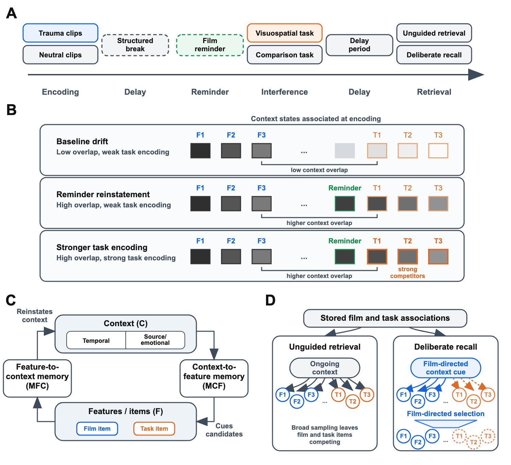
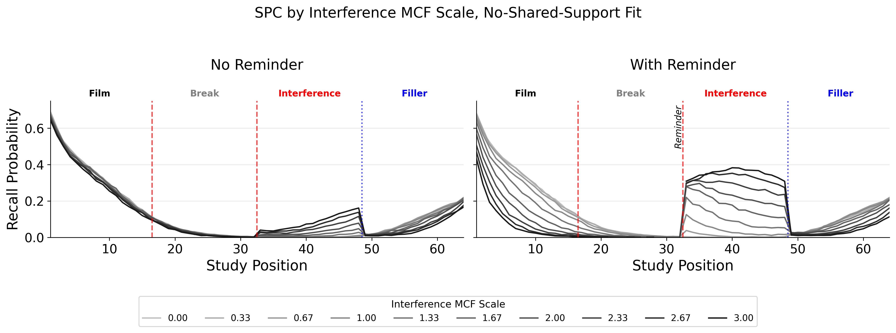

# Abstract

Visuospatial tasks performed after trauma-film encoding, or after a later reminder of the film, can reduce intrusive memories while leaving voluntary memory relatively intact.
This selective interference effect is often treated as evidence that intrusive and voluntary remembering depend on differently vulnerable memory representations.
Here we simulate an alternative retrieved-context account in an emotional Context Maintenance and Retrieval (eCMR) model, in which context reinstatement, competitor encoding, and retrieval control produce the selective-interference pattern without separately vulnerable representations.
In the model, film context remains active after encoding and can later be reinstated by reminders, so an interfering task performed in either state associates task items with context states similar to film context.
When later retrieval contexts cue both film items and task competitors, film items are less likely to be sampled during unguided retrieval, reducing intrusions even though film-item strength is not reduced.
Deliberate recall is less vulnerable when task goals provide a film-directed start cue and selection favors film items over competitors; externally supplied film-related cues can also steer access toward film context across test formats.
Together, the simulations reproduce selective impairment of unguided retrieval relative to deliberate recall and specify when the intrusion-voluntary-memory dissociation should be more or less pronounced, helping to interpret heterogeneity across empirical paradigms.
Selective interference is therefore compatible with a single retrieved-context system and is not by itself diagnostic of separate representational systems or selective trace weakening.

# Introduction

Traumatic experience foregrounds a tension between durability and selectivity in episodic memory.
Highly consequential events should be retained well enough in memory that critical details remain accessible long into the future.
At the same time, adaptive retrieval is selective: what comes to mind should normally depend on current cues, goals, and safety.
Intrusive memories after trauma suggest that durable encoding can outpace regulatory control.
The event returns without being deliberately sought and without being well matched to the demands of the present [@ehlers2000cognitive; @brewin2010intrusive; @krans2009intrusive; @iyadurai2019intrusive].
Understanding why such memories arise, and how they differ from voluntary memory for the same event, is therefore a shared target for both clinical science and basic memory theory.

The trauma-film paradigm provides a controlled setting for comparing intrusive and voluntary memory for the same event [@holmes2008inducing; @james2016trauma].
Participants view distressing film material, record later intrusive memories of the film, and often complete voluntary-memory tests for the same material.
This design makes it possible to ask whether the same encoded event can remain available to deliberate retrieval while becoming more or less likely to return involuntarily.
In such research, voluntary memory can be relatively preserved, and its relationship to intrusion frequency can be weak, such that the two measures dissociate [@holmes2004trauma; @james2016trauma].
The same encoded episode can therefore support both involuntary and deliberate access, and these modes can come apart empirically [@holmes2004trauma; @iyadurai2019intrusive].

Visuospatial interference tasks make this dissociation experimentally sharper.
When brief tasks such as Tetris are performed after film encoding, subsequent intrusions can be reduced while voluntary memory for the same material shows little measurable impairment [@holmes2009can; @holmes2010key; @deeprose2012imagery; @lau2019intrusive].
Related post-reminder studies show that a reminder-plus-Tetris procedure can reduce later intrusions after a longer delay [@james2015computer; @kessler2020visuospatial].
Similar procedures have also been extended to real-life traumatic events, including motor vehicle accidents, emergency caesarean section, and war-related trauma [@iyadurai2018preventing; @horsch2017reducing; @kanstrup2021single].
At the same time, the evidence base is heterogeneous, and recent reviews and replications caution against treating the effect as settled or uniform [@asselbergs2023systematic; @varma2024experimental; @wessel2025evidence].
This selective interference effect therefore raises a theoretical question:
when and why can a post-encoding or post-reminder manipulation alter one mode of retrieval more than another, even while both draw on the same recent experience?

One prominent family of interpretations treats the selective interference effect as evidence that the memory underlying intrusions is more vulnerable to interference than the memory supporting deliberate recall [@brewin1996dual; @brewin2014episodic].
Dual-representation accounts make this claim architecturally: traumatic experience is proposed to produce distinct sensory and contextual memory traces, with the first supporting involuntary re-experiencing and the second supporting deliberate recall [@brewin2010intrusive; @brewin2014episodic].
In immediate post-film interventions, a visuospatial task is then understood to compete with consolidation of the sensory or intrusion-supporting trace, reducing later intrusions while leaving the contextual trace and voluntary memory relatively preserved [@holmes2009can; @holmes2010key; @deeprose2012imagery].
For post-reminder interventions, related interpretations often appeal to reconsolidation or post-reactivation restabilization: the reminder reactivates the relevant trace, and the interfering task disrupts its later availability [@kindt2009beyond; @james2015computer].
Across these variants, selective interference is explained by treating the manipulation as acting more strongly on intrusion-supporting or reactivated memory than on the basis for deliberate recall.

Here we argue that selective interference need not be interpreted as evidence for differently vulnerable memory representations.
It may instead reflect differences in retrieval processes operating over a shared set of episodic representations.
Mechanisms supporting selective, goal-directed retrieval in voluntary recall may be sufficient to sidestep or overcome interference that nonetheless reduces the likelihood of unintentional recall.
On this interpretation, the selective-interference effect reflects a capacity to intentionally focus retrieval on goal-relevant event information while reducing the influence of competing memories.

We formalize and evaluate this proposal in an emotional Context Maintenance and Retrieval model [@talmi2019retrieved; @cohen2022memory; @polyn2009context].
Retrieved-context models explain recall by treating context as a gradually changing state that is updated by studied items, reinstated by recalled items, and used to cue later memory search [@howard2002distributed; @sederberg2008context; @polyn2009context].
CMR extends this framework by representing context-to-item and item-to-context associations across temporal, semantic, and source/contextual dimensions [@polyn2009context; @polyn2009task].
Control over memory search enters the framework in two related ways: start-of-recall context reinstatement can bias retrieval toward a target episode, while monitoring mechanisms can reject candidates that poorly match a target context [@sederberg2008context; @lohnas2015expanding].
Emotional CMR variants (i.e., eCMR and CMR3) add emotional context and emotion-dependent binding, allowing retrieved-context models to capture how affective content shapes recall organization, emotional intrusions, and intentional access [@talmi2019retrieved; @cohen2022memory].
Together, these commitments make the framework a principled setting for testing whether selective interference can arise within a single affectively-modulated episodic-memory system.

For selective interference, our model treats the film, any reminder, and subsequent interference as episodes encoded by binding item representations to a continuously evolving context representation [@yonelinas2019contextual; @howard2002distributed; @polyn2009context].
Post-film or post-reminder activity can therefore encode task items in context states similar to film-associated context states, including states reinstated by reminders.
At retrieval, the current context state cues memory search, so competition depends on how strongly film items and task items are associated with similar context states.
Deliberate recall can reduce vulnerability to this competition when retrieval begins from a more film-directed state and when selection favors film items over competitors.
The account therefore attributes the intrusion-voluntary-memory dissociation to retrieval modes and control settings applied to shared memory associations.
This reframes selective interference as a change in which competitors are cued by film-associated context states, rather than as reduced availability of film items after encoding or reminder reactivation.

Our simulations evaluate the account at the level where a retrieved-context model makes its distinctive predictions: the distribution and organization of recall across the film, interference, and delay phases of a trauma-film paradigm.
They first demonstrate the core selective-interference dissociation without separately vulnerable representations: an interference task can reduce unguided retrieval more than deliberate recall, even though the same stored film episode supports both.
They then distinguish the control mechanisms that protect deliberate recall, showing how a more film-directed retrieval state and a sharper decision rule produce different patterns of impairment in both recall rates and recall organization.
The next simulations separate the contributions of task encoding strength and contextual overlap, clarifying when task items are cued alongside film items and when they become strong competitors for film retrieval.
They also apply the same overlap logic to delayed interference, asking whether reminder-driven reinstatement makes later task items competitors by returning encoding context toward the film.
Follow-up simulations use the same framework to interpret heterogeneity across empirical paradigms, including cue-embedded intrusion and recognition tasks [@lau2021selectively].
They show that film-related cues during intrusion monitoring can narrow the intrusion-voluntary-memory dissociation by steering retrieval toward film context.
They also show that tests supplying a film item can be less vulnerable to interference, because the supplied item can reinstate its associated context instead of requiring retrieval to sample among film items and task competitors from a broad contextual cue.
The result is a mechanistic alternative to separately vulnerable memory representations and a set of specific hypotheses about when selective interference should appear and how it should vary across paradigms.

<!--
# Empirical and Theoretical Target
Probably necessary for a review-oriented journal, but we'll avoid for now.
-->

# A Retrieved-Context Account of Selective Interference

The simulations rely on three retrieved-context mechanisms.
Context-to-item retrieval uses current context to cue candidate items.
Competition follows when film items and task competitors are associated with similar context states.
Item-to-context retrieval allows recalled items, reminder cues, and supplied film items to reinstate associated context.
Film-directed retrieval control changes the starting cue and selection rule used to favor film items over task competitors.
@fig-retrieved-context-account shows how these mechanisms map onto the trauma-film paradigm.



::: {#fig-retrieved-context-account fig-pos="H"}
{width=100%}

**Retrieved-context account of selective interference.**
The account explains selective interference through context overlap, task encoding strength, and retrieval control within a shared memory system.
**(A)** The simulated paradigm includes film encoding, a structured break, a film reminder, interference or comparison task, a delay period, and retrieval tests.
**(B)** Film and task items remain distinct while becoming associated with context states active at encoding; contextual overlap makes task items likely to be cued alongside film items, and task encoding strength determines how strongly they compete once cued.
**(C)** Context-to-item associations cue candidate items, and item-to-context associations let recalled, reminded, or supplied items reinstate associated context.
**(D)** The same stored associations support unguided retrieval and deliberate recall, with deliberate recall gaining protection from a film-directed start cue and film-directed selection.
:::



Contextual similarity is established during encoding.
Film items and task items are distinct item representations, but each is linked to the context state active when it is encountered.
Task items are most likely to share film-relevant context when they are encoded soon after the film, after a reminder has reinstated film-associated context, or under matching affective conditions.
Delay and filler activity move context away from the film, reducing the likelihood that later retrieval cues film items and task competitors together.
These conditions determine whether task items are likely to be cued alongside film items; task encoding strength determines how strongly they compete once cued.
Emotional extensions of CMR represent affect as an additional context dimension [@talmi2019retrieved; @cohen2022memory].
In the present model, this affective-context stream can amplify competition when film and task items share the relevant affective feature.

Context-to-item retrieval uses the current context state to cue candidate items.
Here, unguided retrieval refers to broad context-to-item sampling with little film-directed guidance from task goals or external cues.
When a retrieval context resembles states associated with both film items and task items, the same cue supports both sets.
Such broad, weakly guided retrieval is especially vulnerable to this competition: as task competitors receive support, any given film item becomes less likely to be sampled as an intrusion.
The size of this effect depends on the number of competitors, their learned support, and the similarity between their associated temporal or affective context states and film context.
Perceptual modality contributes through those quantities: a visuospatial task is effective to the extent that it creates competitors with sufficient learned support or sufficiently similar associated context.

Item-to-context associations allow recalled items, reminder cues, and supplied film items to reinstate associated context.
In ordinary recall, a retrieved item shifts context toward the state in which that item was encoded, making nearby studied items more likely to be retrieved next.
This context-updating loop is the standard retrieved-context explanation of temporal contiguity and temporally organized recall across filled delays [@kahana1996associative; @howard2002distributed; @sederberg2008context].
The same dynamics allow recent but irrelevant experiences to intrude during recall of a target episode, with intrusion frequency decaying gradually over intervening time [@howard2008persistence; @zaromb2006temporal; @lohnas2015expanding].
In delayed-interference paradigms, a reminder of the film is used before task encoding in studies that interpret the procedure as memory reactivation [@james2015computer; @kessler2020visuospatial].
On the present account, the reminder uses the same item-to-context pathway to reinstate film-associated context, paralleling temporal-context explanations of human post-reminder effects [@sederberg2011human].
Delayed interference is therefore graded by reminder strength and subsequent drift, because those quantities determine how much film-associated context remains available when the task is encoded.

The same item-to-context pathway also matters at test.
During recall or monitoring, retrieved or presented items update context as retrieval unfolds.
Retrieving a film item pulls context toward film-associated states and can support additional film retrieval, whereas retrieving a task competitor pulls context toward task-associated states and can prolong competition.
Film-related cues supplied during test can likewise update context, making subsequent retrieval less dependent on internal cue maintenance.
Furthermore, retrieval tests that supply a film item can be less vulnerable to interference, because the supplied item can reinstate its associated context directly, sidestepping the problem of selecting between items associated with overlapping context states [@lau2021selectively].

Deliberate recall is protected only to the extent that retrieval control changes the search.
Deliberate recall using context-to-item retrieval remains exposed to competitor interference.
The first control lever is cue construction or start-state control, which reinstates film-associated context before recall and biases search toward film items.
The second is competition focusing or filtering, which sharpens selection among candidates and favors strongly supported film items over weaker or off-target competitors.
These levers yield graded protection: deliberate recall can lose film items when competition is strong, but endogenous film-directed control can reduce that loss relative to broad retrieval from ongoing context.

The simulations instantiate these commitments in an emotional CMR model with phase-specific encoding, reminder-driven reinstatement, retrieval-mode and control settings, and affective overlap [@talmi2019retrieved; @cohen2022memory].
The model departs from standard list-learning applications of CMR in two ways.
First, film, break/delay, post-film task, and filler/delay periods form a continuous encoded stream, and a film reminder can reinstate film-associated context before task encoding.
Second, non-film events from the break, task, and filler phases are encoded as distinct recallable items that can compete with film items during retrieval.
This setup lets selective interference appear as a redistribution of retrieval across encoded phases, rather than as a direct reduction in film-item strength.

# Model Specification

The specification below defines the model's representations, parameters, and initialization before turning to context updating, associative learning, retrieval, retrieval-control settings, and affective context.

## Representations and Parameters

Each study event $i$ has an orthonormal feature vector $f_i \in \mathbb{R}^{N}$, where $N$ is the number of encoded item features in the simulated paradigm.
The model maintains a unit-length context vector $c_i \in \mathbb{R}^{D}$, where $D$ is the number of context units.
The core context units represent the start state and item-associated temporal context.
Before encoding begins, context is initialized to the start state $c_0$, with the start unit active and item-associated temporal-context units inactive.
Subsequent events update this state, so the context associated with each film, task, or filler item depends on where it occurs in the continuous paradigm stream.
The model contains two associative matrices.
The matrix $M^{FC} \in \mathbb{R}^{D \times N}$ maps feature vectors to context input.
The matrix $M^{CF} \in \mathbb{R}^{N \times D}$ maps context to feature support.
All vectors are treated as column vectors, so $M^{FC} f$ is a context vector and $M^{CF} c$ is a feature-support vector.

Base parameter values are anchored by a pooled eCMR fit to the Ukraine war photographs free-recall data [@dupertuys2026ukraine].
@tbl-base-parameters lists the base parameters used by the model.

:::: {#tbl-base-parameters}
| Symbol | Name | Role |
|---|---|---|
| $\beta_{enc}$ | encoding drift rate | Context drift during study |
| $\beta_{start}$ | start drift rate | Start-of-list or film-directed context cueing |
| $\beta_{rec}$ | recall drift rate | Context drift after recall |
| $\gamma$ | feature-to-context learning rate | Learning rate for $M^{FC}$ |
| $\lambda$ | context-to-feature learning scale | Baseline or phase-scaled learning rate for $M^{CF}$ |
| $\alpha$ | shared support | Pre-experimental shared support in $M^{CF}$ |
| $\delta$ | self support | Pre-experimental self-support in $M^{CF}$ |
| $\phi_s$ | primacy scale | Initial boost to context-to-feature learning |
| $\phi_d$ | primacy decay | Decay rate of primacy boost |
| $\tau$ | choice sensitivity | Sharpness of retrieval competition |
| $\beta_{emot}$ | emotional-context drift rate | Context drift in the emotional pathway |
| $\phi_{\mathrm{emot}}$ | emotional learning scale | Emotional context-to-feature learning |
| $\kappa$ | target-monitoring scale | Reduced context updating after sampled non-film competitors when target monitoring is enabled |
| $\theta_s$ | stop scale | Baseline stopping probability |
| $\theta_r$ | stop growth | Growth of stopping probability across output positions |

Base parameters and theoretical roles.
The parameter anchor is external to the selective-interference simulations [@dupertuys2026ukraine].
::::

Pre-experimental associations represent background memory structure already present before the simulated paradigm begins.
They give each item baseline self-support and shared support, so later retrieval reflects both pre-existing structure and associations learned during the film, task, and filler phases.
Because the selective-interference simulations vary the new associations formed across phases, these baseline associations are treated as fixed model architecture rather than as the mechanism of interest.
For the start unit and item-associated temporal context units:

$$
M^{FC}_{pre}(j,i) =
\begin{cases}
1 - \gamma & \text{if } j = i + 1 \\
0 & \text{otherwise}
\end{cases}
$$ {#eq-mfc-pre}

$$
M^{CF}_{pre}(i,j) =
\begin{cases}
0 & \text{if } j = 0 \\
\delta & \text{if } j = i + 1 \\
\alpha & \text{if } j > 0 \text{ and } j \neq i + 1
\end{cases}
$$ {#eq-mcf-pre}

The start context has no pre-experimental context-to-feature support.
For context units corresponding to items, $\delta$ gives each item self-support and $\alpha$ gives all other items shared support.
This initialization supplies baseline support before experimental learning.

## Context Updating, Learning, and Retrieval

The same feature-to-context operation updates context when an item is encoded, recalled, or supplied as a cue.
When feature $f_i$ is active, it probes feature-to-context memory to retrieve context input:

$$
c_i^{\mathrm{IN}} = M^{FC} f_i
$$ {#eq-context-input}

The model normalizes this input to unit length, yielding $\widehat{c}_i^{\mathrm{IN}}$.
Context then drifts toward the normalized input with a drift rate $\beta$:

$$
c_i = \rho_i \, c_{i-1} + \beta \, \widehat{c}_i^{\mathrm{IN}}
$$ {#eq-context-update}

Let $d_i = c_{i-1} \cdot \widehat{c}_i^{\mathrm{IN}}$.
The normalization coefficient is:

$$
\rho_i = \sqrt{1 + \beta^2 (d_i^2 - 1)} - \beta d_i
$$ {#eq-context-rho}

The coefficient $\rho_i$ is the nonnegative solution that keeps $c_i$ at unit length.
When a new event is encoded, the active feature and updated context are also associated via outer-product learning.
Feature-to-context associations update as:

$$
\Delta M^{FC} = \gamma c_i f_i^\top
$$ {#eq-mfc-learning}

A primacy function weights context-to-feature learning:

$$
\phi_i = \phi_s \, e^{-\phi_d \cdot i} + 1
$$ {#eq-primacy}

Context-to-feature associations update as:

$$
\Delta M^{CF} = \lambda \phi_i f_i c_i^\top
$$ {#eq-mcf-learning}

Here, $\lambda$ scales context-to-feature learning, while $\phi_s$ and $\phi_d$ define the size and decay of the primacy boost.
During context-guided retrieval, current context cues encoded items through $M^{CF}$:

$$
a_i = \left[M^{CF} c\right]_i
$$ {#eq-retrieval-support}

The choice sensitivity $\tau$ sharpens competition among candidates:

$$
A_i = a_i^{\tau}
$$ {#eq-choice-sensitivity}

The probability of recalling item $i$, conditional on continuing recall, follows a Luce choice rule over currently unrecalled items:

$$
P(i \mid \text{recall}) = \frac{A_i}{\sum_k A_k}
$$ {#eq-luce-choice}

At each retrieval step, the model may terminate with probability $P_{\mathrm{stop}}(j)$ or recall an item with probability $(1 - P_{\mathrm{stop}}(j)) \cdot P(i \mid \text{recall})$.
Termination probability grows with output position:

$$
P_{\mathrm{stop}}(j) = \theta_s e^{j\theta_r}
$$ {#eq-stopping}

Here, $j$ is the number of items already recalled, $\theta_s$ sets the baseline termination probability, and $\theta_r$ controls its growth.
In simulations, this value is bounded to remain a valid probability.
After a recalled item $r_j$, context is updated through the same feature-to-context pathway:

$$
c_{j+1} = \rho_{\mathrm{rec},j} \, c_j + \beta_{rec} \, \widehat{M^{FC} f_{r_j}}
$$ {#eq-recall-context-update}

This recalled-item update drives context toward the recalled item's encoding neighborhood, biasing subsequent retrievals toward nearby items and producing temporal organization in retrieval.
Encoding operations use the context update and learning equations together, whereas reminders, recalled items, and supplied film items use the context update without adding a new recallable event.

## Retrieval Control

Unguided retrieval and deliberate recall use the same retrieval-support and choice rules in @eq-retrieval-support and @eq-luce-choice.
They differ in the control settings applied to the retrieval state and sampling process.
The first deliberate-recall control setting is film-directed start/context cueing:

$$
c_\text{start} = \rho_\text{start} \, c_N + \beta_{start} \, c_0
$$ {#eq-deliberate-start-cue}

The scale $m^{\beta}_\text{start}$ controls the strength of this cueing in deliberate recall.
The second control setting is sharper selection, implemented by scaling $\tau$.
Higher $\tau$ sharpens competition among all candidates.
It protects film recall only when film-directed cueing gives film items stronger support than task competitors.
The third control setting is target monitoring after a non-film item is sampled.
Let $t_i = 1$ for film items and $t_i = 0$ otherwise, and define $\kappa_i = t_i + (1 - t_i)\kappa$.
Target monitoring modifies the recalled-item context update in @eq-recall-context-update.
With target monitoring, the context update after sampled item $i$ becomes:

$$
c_{j+1} = \rho_{\mathrm{rec},j} \, c_j + \kappa_i\beta_{rec} \, \widehat{M^{FC} f_i}
$$ {#eq-target-monitoring-update}

When $\kappa < 1$, sampled non-film competitors have less influence on the next context state than sampled film items.
This convention is used for deliberate recall when simulations manipulate rejected-recall updating.
Tests that supply a film item are represented as cue-driven context reinstatement using the same feature-to-context input operation as @eq-context-input:

$$
c_\text{film}^{\mathrm{IN}} = M^{FC} f_\text{film}
$$ {#eq-film-cue-input}

This cue is not a separate retrieval system; it is the same feature-to-context operation applied to a supplied film item.

## Affective Context

The model also includes an affective-context pathway inherited from eCMR [@talmi2019retrieved; @cohen2022memory].
The affective pathway tests whether shared affective state can amplify competition; it does not make task affect the explanation of selective interference.
Each item has a two-unit affective feature vector $s_i$, with $s_i = [1, 0]^\top$ for items assigned the marked affective feature and $s_i = [0, 1]^\top$ for neutral or default items.
The vector $s_i$ is not a recallable item and is not a separate trace.
The affective feature vector initializes $M^{FC}_{emot}$ so that an item can cue its affective context components:

$$
M^{FC}_{emot}(\cdot, i) = (1 - \gamma) s_i
$$ {#eq-emot-mfc-pre}

Affective context-to-feature support begins at zero:

$$
M^{CF}_{emot}(i, \cdot) = 0
$$ {#eq-emot-mcf-pre}

Thus, affective context can update during experience before it contributes retrieval support.
Let $\phi_{\mathrm{emot},i}$ denote the added context-to-feature learning strength for item $i$ in the affective pathway.
With the binary vector above, $\phi_{\mathrm{emot},i} = \phi_{\mathrm{emot}} [s_i]_1$, so items assigned the marked affective feature receive $\phi_{\mathrm{emot}}$ and neutral or default items receive 0.
When affective learning is engaged, the affective components of context receive additional context-to-feature learning:

$$
\Delta M^{CF}_{emot} = \lambda \phi_i \phi_{\mathrm{emot},i} f_i c_{\mathrm{emot},i}^\top
$$ {#eq-emot-mcf-learning}

Here, $c_{\mathrm{emot},i}$ denotes the affective components of context.
When affective context-to-feature learning is disabled, affective context does not add retrieval support beyond the ordinary context-to-feature pathway.
When learned affective support is present, it contributes to the same context-to-feature competition defined in @eq-retrieval-support.
Task items are distinct item features and are assigned the marked affective feature only in affective-overlap variants.
When film and task items share the marked affective feature and affective context-to-feature learning is enabled, @eq-emot-mcf-learning can amplify competition beyond temporal proximity alone.

These equations define the item-context architecture used in all simulations.
Because retrieval proceeds as a sequence of competitive samples terminated by a growing stop probability, task competitors can reduce film retrieval by winning individual retrieval competitions before search terminates.

# Simulations

The simulations configure the model specification above rather than adding new mechanisms.
They use the same CMR operations to encode target film items, intervening non-film items, task items, and post-task filler items, and they use the same retrieval rule for unguided retrieval and deliberate recall.
The design is organized around empirical contrasts in clip content, post-clip task, and retrieval mode, with immediate and delayed/post-reminder timing variants.

:::: {#tbl-simulated-design}
| Design component | Variants | Model role |
|---|---|---|
| Film/clip items | Trauma/affective or neutral target clips | Film items are the target episode whose later access is measured; affective marking is enabled only for affective-overlap variants. |
| Task condition | Visuospatial interference task or comparison task | Task items are potential competitors encoded after film encoding or reminder reinstatement; task learning strength indexes how strongly they compete once cued. |
| Affective overlap | Film-only marking or shared film-task marking | Tests whether shared affective state amplifies task competition. |
| Timing/reinstatement | Immediate post-film task or delayed post-reminder task | Tests whether delayed reminders increase overlap by reinstating film-associated context before task encoding. |
| Buffer/filler experience | Pre-reminder buffer and post-task filler | Moves context away from film and adds non-film items that can enter retrieval competition. |
| Retrieval mode | Unguided retrieval or deliberate recall | Tests whether film-directed control protects voluntary access within the same retrieval architecture. |

Simulated design components and their model implementation.
The table maps empirical contrasts onto model operations rather than listing all phase-specific parameter values.
::::

Delayed/post-reminder simulations implement the reminder as two context-updating operations.
After the pre-reminder buffer, context first drifts toward the start state.
The model then applies film-item reminder cues sequentially, using @eq-context-input and @eq-context-update with a reminder-cue drift rate lower than encoding drift in the working simulations.
This lower drift rate represents the assumption that brief reminder images provide weaker contextual evidence than full film-item presentations.
Reminder cues do not apply @eq-mfc-learning or @eq-mcf-learning and do not add new recallable items.
The immediate variant omits the structured pre-reminder buffer and reminder operations, placing the task phase directly after film encoding.

Phase-specific parameter settings are introduced where the simulations vary them.
Task-learning settings index competitor strength, drift and reminder settings index contextual overlap, retrieval-control settings distinguish unguided retrieval from deliberate recall, and affective marking tests shared-state amplification.
Fixed settings for buffer and filler phases are treated as simulation configuration rather than as additional model mechanisms.

## Current Diagnostic Sweep

The first rendered sweep included here orients the reader to the simulated phase structure before the later sections develop the final manuscript contrasts.
These plots are diagnostic outputs from the interference-strength sweep, not stand-alone evidence for the full intrusion-voluntary-memory dissociation.
This figure will move into the relevant simulation section once the final simulation package is fixed.

::: {#fig-interference-sweep-spc fig-pos="H"}

Phase-resolved recall in the interference-strength sweep.
Serial-position curves show recall probability across the film, break, interference, and filler phases of the simulated paradigm, separately for no-reminder and reminder conditions.
Darker lines indicate stronger context-to-item learning for interference-task items.
The figure shows how the interference manipulation changes the distribution of retrieval across encoded phases, rather than only changing total film recall.
:::

The section scaffold below records what each simulation must establish before the final result text is written.
Each subsection specifies the core contrast, the primary readouts, and the main design decision still open at this stage.

## Simulation 1: Core Selective-Interference Dissociation

Premise: The basic selective-interference result is a 2 x 2 contrast between task competition and retrieval mode.
The section should compare weak or absent task competition with strong task competition under unguided retrieval and deliberate recall.
The core demonstration is that the same stored film episode and the same post-film task manipulation produce larger film-item impairment under unguided retrieval than under deliberate recall.

Primary readouts: The main figure should show phase-resolved recall so the reader can see where retrieval probability is redistributed across film, task, and filler phases.
A compact summary should also show film-item access and impairment from baseline for each retrieval mode.
Task-competitor recall should be reported or visible enough to show that lost film access is competition-driven.

Intended text take-away: This section establishes the core sufficiency result.
The model can reproduce the qualitative intrusion-voluntary-memory dissociation without separately weakening film items for one measure.
Deliberate recall may still be impaired; the claim is relative protection, not immunity.

Open specification: The deliberate-recall settings used here need to be fixed before this section is written as a result.
Those settings should be strong enough to create a retrieval-mode contrast but simple enough that Simulation 2 can still isolate the separate control mechanisms.

## Simulation 2: Control Mechanisms Underlying Deliberate-Recall Protection

Premise: Deliberate recall is not categorically protected.
Its relative sparing depends on control operations that make retrieval more film-directed.
This section should separate the contributions of film-directed start/context cueing, sharper selection through $\tau$, and target-monitoring or rejected-recall updating through $\kappa$ if that mechanism remains in the simulation package.

Primary readouts: The figure should show how each control lever changes film-item access and the phase-resolved organization of recall under a fixed task-competition setting.
The most useful contrast should include total film recall, task-competitor retrieval, and how closely recall remains tied to the film phase.

Intended text take-away: This section earns the "relatively intact voluntary memory" claim.
Sparing is a graded consequence of retrieval control rather than a property attached to voluntary tests as a category.
Weakening these control operations should make deliberate recall resemble unguided retrieval more closely.

Open specification: Decide whether target-monitoring through $\kappa$ is a core control mechanism or a sensitivity analysis.
The introduction currently emphasizes film-directed cueing and sharper selection more strongly than rejected-recall updating.

## Simulation 3: Competitor Strength and Contextual Overlap

Premise: An interference task becomes effective when it encodes competitors with enough learned support and with associated context states similar enough to film context.
This section asks what makes a task Tetris-like in model terms.
The design should separate task competitor strength from contextual overlap rather than letting one sweep carry both interpretations.

Primary readouts: The figure should cross or juxtapose a task-strength manipulation with an overlap manipulation and show both film-item access and task-competitor retrieval.
Phase-resolved recall remains useful here because the model's explanation depends on task items entering retrieval alongside film items.

Intended text take-away: This section explains what makes interference effective.
The account should not reduce to generic distraction, list length, or task difficulty.
Competitor strength determines whether cued task items can win retrieval competitions.
Contextual overlap determines whether task competitors are cued alongside film items before their strength can impair film retrieval.
Affective matching can be used as a sensitivity extension if it is run as a specific manipulation, but it should not become the main explanation unless the simulations make it central.

Open specification: Choose the primary operationalization of contextual overlap.
Candidates include task-phase drift, break/filler drift, reminder strength, and affective matching, but the section needs one main contrast and any others should be clearly secondary.

## Simulation 4: Reminder Reinstatement and Delayed Interference

Premise: The delayed-reminder case applies the overlap mechanism after context has drifted away from the film.
A reminder reinstates film context before competitor encoding by applying sequential film-item cues without new learning.

Primary readouts: The figure should show how weak versus strong reminder reinstatement changes phase-resolved recall and film-item access after a fixed task phase.
If delay or filler length is varied, the figure should make clear whether the effect comes from reinstatement strength, subsequent drift, or their combination.

Intended text take-away: This section connects the model to post-reminder interventions.
The reminder is not treated as a special storage-disruption device.
It restores the contextual condition required for later competitor encoding to affect film-item retrieval.

Open specification: Decide whether the main comparison is zero/weak reminder reinstatement versus strong reminder reinstatement, a reminder-strength sweep, a delay/drift sweep, or a compact factorial combination.

## Simulation 5: Heterogeneity Across Recall-Like Test Formats

Premise: Intrusion diaries, vigilance-style monitoring, free recall, and cued recall differ in how much they rely on broad context-to-item search versus film-directed retrieval support.
This section maps the model's retrieval-control mechanisms onto variation across recall-like empirical measures.
The section should only become a simulation result if each test format is assigned a concrete retrieval setting.
Candidate settings include unguided retrieval from ongoing context, monitoring with film-related cues, free recall with film-directed start cueing, and cued recall with stronger external support.

Primary readouts: The figure should show a graded vulnerability profile across retrieval settings under the same stored associations.
The useful result is a continuum of film-item impairment across retrieval settings.

Intended text take-away: This section interprets heterogeneity across empirical paradigms without treating intrusion and voluntary memory as fixed computational kinds.
The model predicts a continuum of vulnerability across recall-like tests depending on how much the task supports film-directed retrieval.

Open specification: The mapping from empirical test format to model setting is the main unresolved piece.
If the mapping remains qualitative, this material belongs in the discussion rather than as a numbered simulation.

## Simulation 6: Probe-Driven Access in Recognition-Like Tests

Premise: Tests that supply a film item are a limiting case of voluntary access because they begin closer to the target item than broad recall does.
This section preserves the useful part of the old recognition result without treating probe-driven access as categorically protected.
The section should remain separate only if the simulation directly implements supplied-film-item cueing and contrasts it with broad context-to-feature search.

Primary readouts: The figure should show that supplied film items can reinstate associated context and reduce exposure to task competitors under otherwise matched stored associations.
It should avoid implying a full recognition decision model unless such a mechanism is added.

Intended text take-away: This section handles tests that supply a film item and recognition-like measures as a probe-driven access case.
The claim is that probe-driven access reduces exposure to contextual competition, not that recognition escapes the mechanism in every design or that all voluntary memory has the same protection.

Open specification: Decide whether this section earns its own simulation or should be folded into Simulation 5 as one point on the retrieval-support continuum.

# General Discussion

# References
