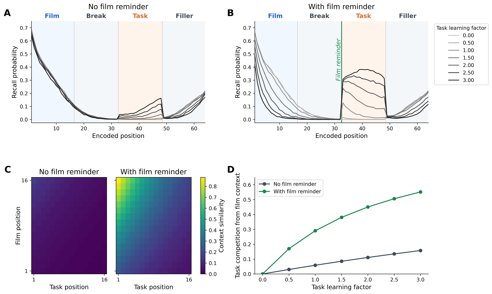
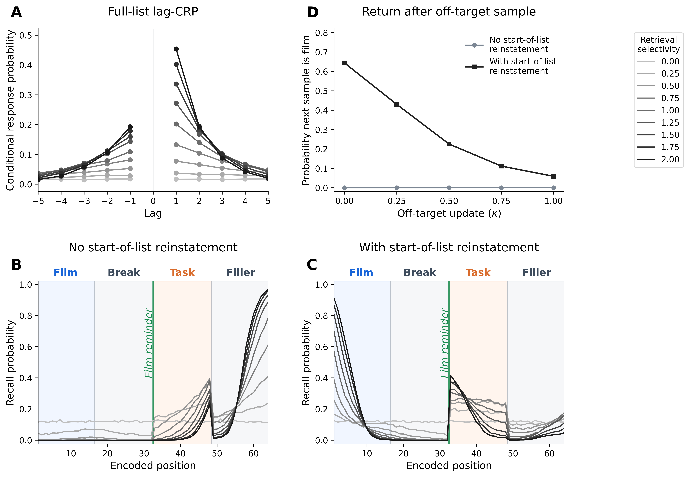

# Abstract

Visuospatial tasks performed after trauma-film encoding, or after a later reminder of the film, can reduce intrusive memories while leaving voluntary memory relatively intact.
This selective interference effect is often treated as evidence that intrusive and voluntary remembering depend on differently vulnerable memory representations.
Here we simulate an alternative retrieved-context account in an emotional Context Maintenance and Retrieval (eCMR) model, in which unguided retrieval and deliberate recall draw on the same film and task associations but differ in how strongly retrieval is constrained toward film items.
In the model, film context remains active after encoding and can later be reinstated by reminders, so an interfering task performed in either state associates task items with context states similar to film context.
At retrieval, overlapping context can cue both film items and task competitors, reducing the probability that film items win retrieval even though stored film-item associations remain unchanged.
Deliberate recall is less vulnerable when task goals provide a film-directed start cue and selection emphasizes film items over competitors; externally supplied film-related cues can also steer access toward film context across test formats.
Together, the simulations reproduce selective impairment of unguided retrieval relative to deliberate recall and specify when the intrusion-voluntary-memory dissociation should be more or less pronounced, helping to interpret heterogeneity across empirical paradigms.
Together, these results show that selective interference can arise from retrieval dynamics in a single retrieved-context system.

# Introduction

Traumatic experience foregrounds a tension between durability and selectivity in episodic memory.
Highly consequential events should be retained well enough in memory that critical details remain accessible long into the future.
At the same time, adaptive retrieval is selective: what comes to mind should normally depend on current cues, goals, and safety.
Intrusive memories after trauma suggest that durable encoding can outpace regulatory control.
The event returns without being deliberately sought and without being well matched to the demands of the present [@ehlers2000cognitive; @brewin2010intrusive; @krans2009intrusive; @iyadurai2019intrusive].
Understanding why such memories arise, and how they differ from voluntary memory for the same event, is therefore a shared target for both clinical science and basic memory theory.

The trauma-film paradigm provides a controlled setting for comparing intrusive and voluntary memory for the same event [@holmes2008inducing; @james2016trauma].
Participants view distressing film material, record later intrusive memories of the film, and often complete voluntary-memory tests for the same material.
This design makes it possible to ask whether the same encoded event can remain available to deliberate retrieval while becoming more or less likely to return involuntarily.
In such research, voluntary memory can be relatively preserved, and its relationship to intrusion frequency can be weak, such that the two measures dissociate [@holmes2004trauma; @james2016trauma].
The same encoded episode can therefore support both involuntary and deliberate access, and these modes can come apart empirically [@holmes2004trauma; @iyadurai2019intrusive].

Visuospatial interference tasks make this dissociation experimentally sharper.
When brief tasks such as Tetris are performed after film encoding, subsequent intrusions can be reduced while voluntary memory for the same material shows little measurable impairment [@holmes2009can; @holmes2010key; @deeprose2012imagery; @lau2019intrusive].
Related post-reminder studies show that a reminder-plus-Tetris procedure can reduce later intrusions after a longer delay [@james2015computer; @kessler2020visuospatial].
Similar procedures have also been extended to real-life traumatic events, including motor vehicle accidents, emergency caesarean section, and war-related trauma [@iyadurai2018preventing; @horsch2017reducing; @kanstrup2021single].
At the same time, the evidence base is heterogeneous, and recent reviews and replications caution against treating the effect as settled or uniform [@asselbergs2023systematic; @varma2024experimental; @wessel2025evidence].
This selective interference effect therefore raises a theoretical question:
when and why can a post-encoding or post-reminder manipulation alter one mode of retrieval more than another, even while both draw on the same recent experience?

One prominent family of interpretations treats the selective interference effect as evidence that the memory underlying intrusions is more vulnerable to interference than the memory supporting deliberate recall [@brewin1996dual; @brewin2014episodic].
Dual-representation accounts make this claim architecturally: traumatic experience is proposed to produce distinct sensory and contextual memory traces, with the first supporting involuntary re-experiencing and the second supporting deliberate recall [@brewin2010intrusive; @brewin2014episodic].
In immediate post-film interventions, a visuospatial task is then understood to compete with consolidation of the sensory or intrusion-supporting trace, reducing later intrusions while leaving the contextual trace and voluntary memory relatively preserved [@holmes2009can; @holmes2010key; @deeprose2012imagery].
For post-reminder interventions, related interpretations often appeal to reconsolidation or post-reactivation restabilization: the reminder reactivates the relevant trace, and the interfering task disrupts its later availability [@kindt2009beyond; @james2015computer].
Across these variants, selective interference is explained by treating the manipulation as acting more strongly on intrusion-supporting or reactivated memory than on the basis for deliberate recall.

Here we argue that selective interference need not be interpreted as evidence for differently vulnerable memory representations.
It may instead reflect differences in retrieval processes operating over a shared set of episodic representations.
Mechanisms supporting selective, goal-directed retrieval in voluntary recall may be sufficient to sidestep or overcome interference that nonetheless reduces the likelihood of unintentional recall.
On this interpretation, the selective-interference effect reflects a capacity to intentionally focus retrieval on goal-relevant event information while reducing the influence of competing memories.

We formalize and evaluate this proposal in an emotional Context Maintenance and Retrieval model [@talmi2019retrieved; @cohen2022memory; @polyn2009context].
Retrieved-context models explain recall by treating context as a gradually changing state that is updated by studied items, reinstated by recalled items, and used to cue later memory search [@howard2002distributed; @sederberg2008context; @polyn2009context].
CMR extends this framework by representing context-to-item and item-to-context associations across temporal, semantic, and source/contextual dimensions [@polyn2009context; @polyn2009task].
Control over memory search enters the framework in two related ways: start-of-recall context reinstatement can bias retrieval toward a target episode, while monitoring mechanisms can reject candidates that poorly match a target context [@sederberg2008context; @lohnas2015expanding].
Emotional CMR variants (i.e., eCMR and CMR3) instantiate this source-context machinery with emotional context and emotion-dependent binding, allowing retrieved-context models to capture how affective content shapes recall organization, emotional intrusions, and intentional access [@talmi2019retrieved; @cohen2022memory].
Together, these commitments make the framework a principled setting for demonstrating how selective interference can arise within a single retrieved-context system.

For selective interference, our model treats the film, any reminder, and subsequent interference as episodes encoded by binding item representations to a continuously evolving context representation [@yonelinas2019contextual; @howard2002distributed; @polyn2009context].
A film reminder can reinstate film-associated context before task encoding, and task events encoded in that state can later receive support from film-related retrieval cues.
At retrieval, the current context state cues memory search, so film items and task items compete when both are associated with similar context states.
Deliberate recall can reduce vulnerability to this competition when retrieval begins from a film-directed state and selection favors film items over competitors.
The account therefore attributes the intrusion-voluntary-memory dissociation to retrieval modes and control settings applied to shared memory associations.
Selective interference therefore reflects a change in how film-associated context cues the stored event set: task items can become more likely to win retrieval and, once retrieved, can pull context toward the task, even as film-item associations remain available.

Our simulations evaluate the account at the level where a retrieved-context model makes its distinctive predictions: the distribution and organization of recall across the film, interference, and delay phases of a trauma-film paradigm.
Simulation 1 establishes the context-binding interference component: a post-reminder task reduces film recall when task items are strongly learned while film-associated context has been reinstated.
Simulation 2 adds intentionality by comparing unguided retrieval and deliberate recall over matched film and task associations, then decomposes the film-directed start cueing and selection settings that protect deliberate recall.
Simulation 3 separates task properties by varying task-item learning strength, contextual overlap, and source-context overlap, rather than treating the visuospatial/comparison contrast as a primitive model label.
Simulation 4 evaluates cue support across test formats by varying film-related monitoring cues and tests that supply a film item [@lau2021selectively].
The result is a mechanistic alternative to separately vulnerable memory representations and a set of specific hypotheses about when selective interference should appear and how it should vary across paradigms.

<!--
# Empirical and Theoretical Target
Probably necessary for a review-oriented journal, but we'll avoid for now.
-->

# A Retrieved-Context Account of Selective Interference

The simulations rely on three retrieved-context mechanisms.
Context-to-item retrieval uses current context to cue candidate items.
Competition follows when film items and task competitors are associated with similar context states.
Item-to-context retrieval allows recalled items, reminder cues, and supplied film items to reinstate associated context.
Film-directed retrieval control changes the starting cue and selection rule used to favor film items over task competitors.
@fig-retrieved-context-account shows how these mechanisms map onto the trauma-film paradigm.



::: {#fig-retrieved-context-account fig-pos="H"}
{width=100%}

**A retrieved-context account of selective interference.**
Task items interfere when they are bound to film-associated context strongly enough to be cued with film items, and deliberate recall gains protection when film-directed control favors film items within the same association set.
**(A)** The simulated paradigm includes film encoding, a structured break, a film reminder, interference or comparison task, a delay period, and retrieval tests.
**(B)** Film and task items remain distinct while becoming associated with context states active at encoding; contextual overlap makes task items likely to be cued alongside film items, and task encoding strength determines how strongly they compete once cued.
**(C)** Context-to-item associations cue candidate items, and item-to-context associations let recalled, reminded, or supplied items reinstate associated context.
**(D)** The same stored associations support unguided retrieval and deliberate recall, with deliberate recall gaining protection from a film-directed start cue and film-directed selection.
:::



Contextual similarity is established during encoding.
Film items and task items are distinct item representations, but each is linked to the context state active when it is encountered.
Task items are most likely to share film-associated context when they are encoded soon after the film, after a reminder has reinstated film-associated context, or when they share a non-temporal source feature with film items.
Delay and filler activity move context away from the film, reducing the likelihood that later retrieval cues film items and task competitors together.
These conditions determine whether task items are likely to be cued alongside film items; task encoding strength determines how strongly they compete once cued.
Emotional extensions of CMR treat affect as one source-context dimension [@talmi2019retrieved; @cohen2022memory].
In the present model, this source-context pathway can amplify competition when film and task items share the marked source feature.

Context-to-item retrieval uses the current context state to cue candidate items.
Unguided retrieval is the model analogue of conditions in which film memories come to mind with little film-directed guidance from task goals or external cues.
When a retrieval context resembles states associated with both film items and task items, the same cue supports both sets.
Such broad, weakly guided retrieval is especially vulnerable to this competition: as task competitors receive support, any given film item becomes less likely to be selected for recall over competitor items.
The size of this effect depends on the number of competitors, their learned support, and the similarity between their associated temporal or source-context states and film context.
In these simulations, task modality is represented through those quantities: the learned support task items receive and the similarity between task-associated context and film-associated context.

Item-to-context associations allow recalled items, reminder cues, and supplied film items to reinstate associated context.
In ordinary recall, a retrieved item shifts context toward the state in which that item was encoded, making nearby studied items more likely to be retrieved next.
This context-updating loop is the standard retrieved-context explanation of temporal contiguity and temporally organized recall across filled delays [@kahana1996associative; @howard2002distributed; @sederberg2008context].
The same dynamics allow recent but irrelevant experiences to intrude during recall of a target episode, with intrusion frequency decaying gradually over intervening time [@howard2008persistence; @zaromb2006temporal; @lohnas2015expanding].
In delayed-interference paradigms, a reminder of the film is used before task encoding in studies that interpret the procedure as memory reactivation [@james2015computer; @kessler2020visuospatial].
On the present account, the reminder uses the same item-to-context pathway to reinstate film-associated context, paralleling temporal-context explanations of human post-reminder effects [@sederberg2011human].
Delayed interference is therefore graded by reminder strength and subsequent drift, because those quantities determine how much film-associated context remains available when the task is encoded.

The same item-to-context pathway also matters at test.
During recall or monitoring, retrieved or presented items update context as retrieval unfolds.
Retrieving a film item pulls context toward film-associated states and can support additional film retrieval, whereas retrieving a task competitor pulls context toward task-associated states and can prolong competition.
Film-related cues supplied during test can likewise update context, making subsequent retrieval less dependent on internal cue maintenance.
Furthermore, retrieval tests that supply a film item can be less vulnerable to interference, because the supplied item reinstates associated context and reduces reliance on selecting film items from a mixed competitor set [@lau2021selectively].

Deliberate recall is represented as film-directed retrieval over the same stored associations.
Its protection depends on how retrieval control changes the search.
Deliberate recall using context-to-item retrieval remains exposed to competitor interference.
The first control lever is cue construction or start-state control, which reinstates film-associated context before recall and biases search toward film items.
The second is competition focusing or filtering, which sharpens selection among candidates and favors strongly supported film items over weaker or off-target competitors.
These levers yield graded protection: deliberate recall can lose film items when competition is strong, but endogenous film-directed control can reduce that loss relative to broad retrieval from ongoing context.

The simulations instantiate these commitments in an emotional CMR model with phase-specific encoding, reminder-driven reinstatement, retrieval-mode and control settings, and source-context overlap [@talmi2019retrieved; @cohen2022memory].
The model departs from standard list-learning applications of CMR in two ways.
First, film, break/delay, post-film task, and filler/delay periods form a continuous encoded stream, and a film reminder can reinstate film-associated context before task encoding.
Second, non-film events from the break, task, and filler phases are encoded as distinct recallable items that can compete with film items during retrieval.
This setup lets selective interference appear as a redistribution of retrieval across encoded phases, rather than as a direct reduction in film-item strength.

# Model Specification

The formal model keeps the standard CMR separation between item features, context, feature-to-context memory, and context-to-feature memory.
The section first defines these inherited representations and baseline parameters, then specifies the context-updating, learning, retrieval, and control operations used to configure the selective-interference simulations.

## Representations and Parameters

Each study event $i$ has an orthonormal feature vector $f_i \in \mathbb{R}^{N}$, where $N$ is the number of encoded item features in the simulated paradigm.
The model maintains a unit-length context vector $c_i \in \mathbb{R}^{D}$, where $D$ is the number of context units.
The core context units represent the start state and item-associated temporal context.
Before encoding begins, context is initialized to the start state $c_0$, with the start unit active and item-associated temporal-context units inactive.
Subsequent events update this state, so the context associated with each film, task, or filler item depends on where it occurs in the continuous paradigm stream.
The model contains two associative matrices.
The matrix $M^{FC} \in \mathbb{R}^{D \times N}$ maps feature vectors to context input.
The matrix $M^{CF} \in \mathbb{R}^{N \times D}$ maps context to feature support.
All vectors are treated as column vectors, so $M^{FC} f$ is a context vector and $M^{CF} c$ is a feature-support vector.

@tbl-base-parameters lists the symbolic base parameters used by the model.
The table separates parameters that define the inherited CMR operations from parameters later scaled or manipulated in the simulations; numerical values and phase settings are specified in the simulation methodology.

:::: {#tbl-base-parameters}
| Symbol | Name | Role |
|---|---|---|
| $\beta_{enc}$ | encoding drift rate | Context drift during study |
| $\beta_{start}$ | start-cue parameter | Start-of-list context reinstatement or film-directed cueing |
| $\beta_{rec}$ | recall drift rate | Context drift after recall |
| $\gamma$ | feature-to-context learning rate | Learning rate for $M^{FC}$ |
| $\lambda$ | context-to-feature learning scale | Baseline or phase-scaled learning rate for $M^{CF}$ |
| $\alpha$ | shared support | Pre-experimental shared support in $M^{CF}$ |
| $\delta$ | self support | Pre-experimental self-support in $M^{CF}$ |
| $\phi_s$ | primacy scale | Initial boost to context-to-feature learning |
| $\phi_d$ | primacy decay | Decay rate of primacy boost |
| $\tau$ | choice sensitivity | Sharpness of retrieval competition |
| $\beta_{emot}$ | source-context drift rate | Source context drift |
| $\phi_{\mathrm{emot}}$ | source learning scale | Learning scale for the marked source feature |
| $\kappa$ | target-monitoring scale | Reduced context updating after sampled off-target candidates when target monitoring is enabled |
| $\theta_s$ | stop scale | Baseline stopping probability |
| $\theta_r$ | stop growth | Growth of stopping probability across retrieval-attempt positions |

Base parameters and roles in the model specification.
::::

Pre-experimental associations represent background memory structure already present before the simulated paradigm begins.
They give each item baseline self-support and shared support, so later retrieval reflects both pre-existing structure and associations learned during the film, task, and filler phases.
The selective-interference simulations vary the new associations formed across phases.
These baseline associations are fixed model architecture and are held constant across the selective-interference simulations.
For the start unit and item-associated temporal context units:

$$
M^{FC}_{pre}(j,i) =
\begin{cases}
1 - \gamma & \text{if } j = i + 1 \\
0 & \text{otherwise}
\end{cases}
$$ {#eq-mfc-pre}

$$
M^{CF}_{pre}(i,j) =
\begin{cases}
0 & \text{if } j = 0 \\
\delta & \text{if } j = i + 1 \\
\alpha & \text{if } j > 0 \text{ and } j \neq i + 1
\end{cases}
$$ {#eq-mcf-pre}

The start context has no pre-experimental context-to-feature support.
For context units corresponding to items, $\delta$ gives each item self-support and $\alpha$ gives all other items shared support.
This initialization supplies baseline support before experimental learning.

## Context Updating, Learning, and Retrieval

Context updating defines both gradual drift during encoding and reinstatement by recalled, reminded, or supplied items.
The same feature-to-context operation updates context when an item is encoded, recalled, or supplied as a cue.
When feature $f_i$ is active, it probes feature-to-context memory to retrieve context input:

$$
c_i^{\mathrm{IN}} = M^{FC} f_i
$$ {#eq-context-input}

The model normalizes this input to unit length, yielding $\widehat{c}_i^{\mathrm{IN}}$.
Context then drifts toward the normalized input with a drift rate $\beta$:

$$
c_i = \rho_i \, c_{i-1} + \beta \, \widehat{c}_i^{\mathrm{IN}}
$$ {#eq-context-update}

Let $d_i = c_{i-1} \cdot \widehat{c}_i^{\mathrm{IN}}$.
The normalization coefficient is:

$$
\rho_i = \sqrt{1 + \beta^2 (d_i^2 - 1)} - \beta d_i
$$ {#eq-context-rho}

The coefficient $\rho_i$ is the nonnegative solution that keeps $c_i$ at unit length.
Associative learning defines how encoded film, task, and filler events become later retrieval candidates.
When a new event is encoded, the active feature and updated context are associated via outer-product learning.
Feature-to-context associations update as:

$$
\Delta M^{FC} = \gamma c_i f_i^\top
$$ {#eq-mfc-learning}

A primacy function weights context-to-feature learning:

$$
\phi_i = \phi_s \, e^{-\phi_d \cdot i} + 1
$$ {#eq-primacy}

Context-to-feature associations update as:

$$
\Delta M^{CF} = \lambda \phi_i f_i c_i^\top
$$ {#eq-mcf-learning}

Here, $\lambda$ scales context-to-feature learning, while $\phi_s$ and $\phi_d$ define the size and decay of the primacy boost.
Retrieval uses the current context state to assign support to candidate items, sample from the resulting competition, and terminate the sampling sequence.
During context-guided retrieval, current context cues encoded items through $M^{CF}$:

$$
a_i = \left[M^{CF} c\right]_i
$$ {#eq-retrieval-support}

The choice sensitivity $\tau$ sharpens competition among candidates:

$$
A_i = a_i^{\tau}
$$ {#eq-choice-sensitivity}

The probability of sampling item $i$, conditional on continuing retrieval, follows a Luce choice rule over currently unsampled items:

$$
P(i \mid \text{continue}) = \frac{A_i}{\sum_k A_k}
$$ {#eq-luce-choice}

At each retrieval step, the model may terminate with probability $P_{\mathrm{stop}}(j)$ or sample an item with probability $(1 - P_{\mathrm{stop}}(j)) \cdot P(i \mid \text{continue})$.
Termination probability grows with retrieval-attempt position:

$$
P_{\mathrm{stop}}(j) = \theta_s e^{j\theta_r}
$$ {#eq-stopping}

Here, $j$ is the number of items already sampled, $\theta_s$ sets the baseline termination probability, and $\theta_r$ controls its growth.
In simulations, this value is bounded to remain a valid probability.
After a sampled item $r_j$, context is updated through the same feature-to-context pathway:

$$
c_{j+1} = \rho_{\mathrm{rec},j} \, c_j + \beta_{rec} \, \widehat{M^{FC} f_{r_j}}
$$ {#eq-recall-context-update}

This sampled-item update drives context toward the sampled item's encoding neighborhood, biasing subsequent retrievals toward nearby items and producing temporal organization in retrieval.
Encoding operations use the context update and learning equations together, whereas reminders, sampled items, and supplied film items use the context update without adding a new recallable event.

## Retrieval Control

Retrieval-control settings alter the starting state and selection process used by the same context-to-feature retrieval operation.
Unguided retrieval and deliberate recall use the same retrieval-support and choice rules in @eq-retrieval-support and @eq-luce-choice.
They differ in the control settings applied to the retrieval state and sampling process.
The first deliberate-recall control setting is film-directed start/context cueing:

$$
c_\text{start} = \rho_\text{start} \, c_N + \beta_{start} \, c_0
$$ {#eq-deliberate-start-cue}

Here, $\rho_\text{start}$ is calculated from @eq-context-rho using $\beta_{start}$.
Simulation settings can use the fitted $\beta_{start}$ value directly or multiply it to vary the degree of start-of-list context reinstatement.
The second control setting is sharper selection, implemented by scaling $\tau$.
Higher $\tau$ sharpens competition among all candidates.
It protects film recall only when film-directed cueing gives film items stronger support than task competitors.
The third control setting is target monitoring after an off-target item is sampled.
Let $t_i = 1$ for film items and $t_i = 0$ otherwise, and define $\kappa_i = t_i + (1 - t_i)\kappa$.
Target monitoring modifies the sampled-item context update in @eq-recall-context-update.
With target monitoring, the context update after sampled item $i$ becomes:

$$
c_{j+1} = \rho_{\mathrm{rec},j} \, c_j + \kappa_i\beta_{rec} \, \widehat{M^{FC} f_i}
$$ {#eq-target-monitoring-update}

When $\kappa < 1$, sampled off-target candidates have less influence on the next context state than sampled film items.
This convention is used for deliberate recall when simulations manipulate rejected-sample updating.
Tests that supply a film item are represented as cue-driven context reinstatement using the same feature-to-context input operation as @eq-context-input:

$$
c_\text{film}^{\mathrm{IN}} = M^{FC} f_\text{film}
$$ {#eq-film-cue-input}

Supplied film items therefore use the same feature-to-context operation as sampled and reminded items.

## Source Context

The source-context pathway provides a configurable non-temporal overlap dimension for later task-specificity simulations.
It generalizes the role that emotional context plays in eCMR to contextual features that can organize recall when shared across items [@polyn2009context; @talmi2019retrieved; @cohen2022memory].
In the present simulations, this pathway is represented by a simplified two-unit source feature vector $s_i$.
The marked source feature can be used to examine whether film and task items that share a non-temporal source state compete more strongly.
The source feature vector initializes $M^{FC}_{emot}$ so that an item can cue its source-context components:

$$
M^{FC}_{emot}(\cdot, i) = (1 - \gamma) s_i
$$ {#eq-emot-mfc-pre}

Source-context-to-feature support begins at zero:

$$
M^{CF}_{emot}(i, \cdot) = 0
$$ {#eq-emot-mcf-pre}

Thus, source context can update during experience before it contributes retrieval support.
Source-context components use the same context-update rule in @eq-context-update with source-context drift rate $\beta_{emot}$.
Let $\phi_{\mathrm{emot},i}$ denote the added context-to-feature learning strength for item $i$ in the source-context pathway.
With the binary vector above, $\phi_{\mathrm{emot},i} = \phi_{\mathrm{emot}} [s_i]_1$, so items assigned the marked source feature receive $\phi_{\mathrm{emot}}$ and neutral or default items receive 0.
When source-context learning is engaged, the source components of context receive additional context-to-feature learning:

$$
\Delta M^{CF}_{emot} = \lambda \phi_i \phi_{\mathrm{emot},i} f_i c_{\mathrm{emot},i}^\top
$$ {#eq-emot-mcf-learning}

Here, $c_{\mathrm{emot},i}$ denotes the source components of context.
Source-context support enters retrieval through learned source context-to-feature associations and contributes to the same competition defined in @eq-retrieval-support.
Task items are distinct item features and are assigned the marked source feature only in source-context-overlap variants.
When film and task items share the marked source feature and source context-to-feature learning is enabled, @eq-emot-mcf-learning can amplify competition beyond temporal proximity alone.

These equations define the item-context architecture used in all simulations.
Because retrieval proceeds as a sequence of competitive samples terminated by a growing stop probability, task competitors can reduce film-item access by winning individual retrieval competitions before search terminates.

# Simulations

The simulations instantiate the retrieved-context account in a controlled trauma-film analogue.
They evaluate four linked packages: context-binding interference, retrieval-mode differences, task specificity, and cue support across test formats.
Simulation 1 shows how a post-reminder task reduces film recall when task items receive strong context-to-feature learning while film-relevant context is active.
Simulation 2 adds the intentionality manipulation by comparing unguided retrieval with deliberate recall and then decomposing the film-directed control settings that reduce deliberate-recall vulnerability.
Simulation 3 examines which task properties make the post-film task effective, including task-item learning strength, contextual similarity, and source-context overlap.
Simulation 4 examines how film-related monitoring cues and tests that supply a film item change vulnerability across test formats.

## Methodology

Base parameters were anchored to an existing immediate free-recall dataset in which participants who reported concern about the war in Ukraine studied and recalled lists of war-related and neutral photographs [@dupertuys2026ukraine].
The fitted dataset included 123 participants, four lists per participant, 492 immediate recall sequences, and 3,804 scored recall events.
This dataset provides an externally estimated eCMR regime for deliberate context-guided recall of affective and neutral photographs.
The fitted parameters set baseline encoding, retrieval, and stopping dynamics before the selective-interference manipulations are applied as phase-specific encoding or retrieval-control settings.
@tbl-simulation-parameters gives the default numerical values used in the current simulations.

:::: {#tbl-simulation-parameters}
| Symbol | Value | Role |
|---|---:|---|
| $\beta_{enc}$ | 0.440 | Encoding drift rate |
| $\beta_{start}$ | 0.766 | Start-cue parameter |
| $\beta_{rec}$ | 0.678 | Recall drift rate |
| $\gamma$ | 0.468 | Feature-to-context learning rate |
| $\delta$ | 0.00022 | Pre-experimental self-support |
| $\alpha$ | 0 | Pre-experimental shared support |
| $\phi_s$ | 0.499 | Primacy scale |
| $\phi_d$ | 0.530 | Primacy decay |
| $\tau$ | 3.562 | Choice sensitivity |
| $\beta_{emot}$ | 0.696 | Source-context drift rate |
| $\phi_{\mathrm{emot}}$ | 0.130 | Learning scale for the marked source feature |
| $\theta_s$ | 0.0123 | Stop scale |
| $\theta_r$ | 0.372 | Stop growth |

Default numerical parameter values used in the current simulations.
Values are from a pooled eCMR fit to the immediate free-recall sequences from @dupertuys2026ukraine, with $\alpha$ fixed to zero.
::::

The current simulations update associations after context integration and disallow repeated sampling of the same item.

Each simulated trial contains 16 film items, 16 break/buffer items, 16 task items, and 16 filler items.
Equal phase lengths make redistribution across film, task, and filler periods directly comparable.
Retrieval allows up to 48 sampling attempts.
All encoded film, break/buffer, task, and filler items can enter the retrieval competition unless a later simulation explicitly changes the test format.
The simulated retrieval sequence records sampled candidates rather than only final accepted responses.
This convention allows later target-monitoring simulations to count an off-target sample as a retrieval attempt, attenuate its context update, and still allow search to continue.

Film, break/buffer, task, and filler items are encoded by the same CMR operations defined above.
Phase settings control temporal drift and context-to-feature learning strength.
In the no-reminder condition used for Simulation 1, the reminder-start and film-item reminder-cue drift scales are set to zero.
In the with-reminder condition, context first shifts toward the start state and then receives sequential film-item reminder cues before task encoding.
Reminder cues update context through @eq-context-input and @eq-context-update, but they do not apply @eq-mfc-learning or @eq-mcf-learning and do not add new recallable items.
@tbl-simulation-phase-settings summarizes the phase structure and settings used for the current Figure 2 simulations.

:::: {#tbl-simulation-phase-settings}
| Phase or setting | Current value | Role |
|---|---:|---|
| Film items | 16 | Target episode |
| Break/buffer items | 16 | Intervening non-film experience before reminder/task |
| Film reminder cues | 16 | Sequential film-item cues, no new learning |
| Task items | 16 | Potential competitors |
| Filler items | 16 | Post-task non-film experience |
| Maximum sampling attempts | 48 | Upper bound on sampled retrieval attempts |
| Simulated trials per sweep cell | 5000 | Replications used for Figure 2 estimates |
| Break and filler drift/learning scales | 1.0 | Baseline non-film encoding settings |
| No-reminder drift scales | 0.0 | Omits reminder-start and reminder-cue reinstatement |
| With-reminder drift scales | 1.0 | Applies reminder-start and film-item cue reinstatement |
| Task learning factor | 0.0--3.0 by 0.5 | Multiplies task-phase context-to-feature learning |
| Source marking | Off | No source-context-overlap manipulation in Simulation 1 |

Phase structure and settings for the current Figure 2 simulations.
Scale values multiply the corresponding base rates or learning strengths.
::::

For each condition and sweep value, the model encodes the phase sequence, enters retrieval, samples recallable items using @eq-luce-choice and @eq-stopping, and repeats this process across simulated trials.
Serial-position curves estimate the probability that each encoded position appears at least once in the sampled retrieval sequence.
The model-state analyses in Figure 2 quantify two quantities that explain the behavioral curves.
The context-similarity analysis computes cosine similarity between unit-normalized temporal context states associated with film-item encoding and temporal context states active during task-item encoding.
The support-allocation analysis forms a film-context cue from the centroid of film encoding context states, applies that cue to $M^{CF}$ after task encoding, and computes task support divided by the sum of film and task support.

## Simulation 1: Task Encoding and Contextual Overlap

Simulation 1 demonstrates how a post-film task can reduce later film recall when task events are encoded while film-relevant context is active.
To separate task encoding strength from reminder-driven context reinstatement, the simulation sweeps the task learning factor under no-reminder and with-reminder conditions.
The plotted task learning factor multiplies task-phase context-to-feature learning in @eq-mcf-learning.
Retrieval settings are held fixed, so differences in recall reflect the item-context associations formed before retrieval rather than changes in retrieval control.
Simulation 2 then examines whether film-directed retrieval control reduces the impact of those task-item associations on deliberate recall.

::: {#fig-simulation1-context-binding fig-pos="H"}

**Reminder-driven context overlap makes task encoding strength consequential for film recall.**
Simulation 1 demonstrates how task items can become competitors for film recall by varying task encoding strength with or without film-context reinstatement before task encoding.
**(A)** Without a film reminder, task items become associated with later context states reached after drift away from the film, so stronger task encoding produces only modest redistribution from film items to task items.
**(B)** With a film reminder, task items become associated with context states more similar to those associated with film items, so stronger task encoding produces larger redistribution from film items to task items.
**(C)** This behavioral contrast follows from the context trace: reminder cues make the context states active during task encoding more similar to the states associated with film items.
**(D)** When the model is cued with film context, stronger task encoding assigns a larger share of item support to task items, especially after a film reminder.
:::

Panels A and B show phase-resolved recall probability across encoded positions.
Without a film reminder, increasing task learning produces only modest loss of film recall and only modest gain in task recall, because task items become associated with later context states reached after drift away from the film.
With a film reminder, the same task-learning manipulation produces a much larger redistribution from film positions to task positions.
The with-reminder condition therefore shows that task strength matters most when task items are associated with film-associated context states.
The serial-position curves also show that the effect is not uniform across film positions: early film recall remains relatively protected under the current settings compared with recall for later film positions.
At the endpoints of the task-learning sweep, mean film recall in the no-reminder condition changes from 0.352 at task learning factor 0.0 to 0.317 at factor 3.0, while mean task recall changes from 0.000 to 0.084.
In the with-reminder condition, mean film recall changes from 0.340 to 0.086, while mean task recall changes from 0.000 to 0.354.

Panels C and D explain why the no-reminder and with-reminder curves diverge.
Panel C quantifies temporal-context similarity between the states associated with film items and the states active during task encoding.
When a reminder reinstates film-associated context before task encoding, the model encodes task items in states more similar to those associated with film items.
Panel D quantifies how much support task items receive from a film-context cue after task encoding.
As task context-to-feature learning increases, task items receive a larger share of item support when film-associated context cues retrieval, especially after the film reminder.
Across the task-learning sweep, film encoding settings remain unchanged.
The loss of film recall comes from stronger support for task items that can be cued by film-associated context.
Task items remain distinct from film items but become increasingly likely to win retrieval from film-related cues.
Simulation 2 next examines whether film-directed retrieval control reduces the impact of these task-item associations on deliberate recall.

## Simulation 2: Retrieval Mode and Film-Directed Control

Simulation 2 turns from encoding conditions to retrieval control.
The broader Simulation 2 package decomposes deliberate recall into three film-directed control operations: start-of-list context reinstatement, selection sharpening, and target monitoring.
Figure 3 isolates the first operation.
In the model, deliberate recall can begin by drifting current context toward the start-of-list state before the first retrieval attempt.
Because film items are encoded first, the start-of-list state is film-relevant in the present paradigm: reinstating it changes the context used to cue the first retrieval competition while leaving the learned film and task associations otherwise unchanged.
The simulation holds the post-reminder task condition fixed at task learning factor 2.0 and varies the degree of start-of-list context reinstatement.
The plotted reinstatement values are multiples of the fitted start-cue parameter, so 1.0 corresponds to $\beta_{start}$ in @eq-deliberate-start-cue.

::: {#fig-simulation2-start-context-reinstatement fig-pos="H"}

**Start-of-list context reinstatement protects film recall by changing the context that cues retrieval.**
Simulation 2 demonstrates how a deliberate-recall start operation can protect film recall after post-reminder task encoding by drifting retrieval context toward the start-of-list state immediately before the first retrieval attempt.
**(A)** Before any item is sampled, stronger start-of-list context reinstatement makes the retrieval context support early film items rather than late filler items.
**(B)** This pre-recall support shift makes recall more likely to begin with film items, especially items from the beginning of the film sequence.
**(C)** Across the sampled retrieval sequence, stronger start-of-list context reinstatement increases access to film items, with the largest gains concentrated near the beginning of the film sequence.
Because sampled early film items reinstate film-associated context, and because context drifts gradually during retrieval, a start-of-recall context shift can affect later samples as well as the first sampled item.
:::

Panel A probes $M^{CF}$ with the pre-recall retrieval context before Luce choice, stopping, or sampled-item context updating.
With no start-of-list context reinstatement, support is concentrated in late filler positions because the retrieval context reflects the post-filler state.
As start-of-list context reinstatement increases, support shifts toward early film positions.
Panels B and C apply the same retrieval settings to sampled retrieval sequences.
Panel B shows that this support shift changes recall initiation, with first recalls moving from filler positions when start-of-list context reinstatement is omitted to early film positions as reinstatement increases.
Panel C shows that the initiation shift has full-sequence consequences: sampled early film items reinstate film-associated context and raise film-item access across subsequent samples.
Under the strong task setting used here, task items remain available to be sampled later in the sequence, so the next step is to examine how selection operates once a retrieval cue has been set.

The second control setting is retrieval selectivity.
This manipulation scales the choice-sensitivity parameter $\tau$ in @eq-choice-sensitivity, changing how sharply candidate support is converted into selection probability.
It does not supply a film cue by itself.
Instead, it makes the candidate structure supplied by the current context more consequential.
Figure 4 crosses retrieval selectivity with start-of-list context reinstatement while holding the same post-reminder task condition fixed.
The final panel introduces target monitoring as a post-off-target recovery operation.
Here, target monitoring refers to control engaged after a sampled candidate is recognized as off target: the operation can reduce that candidate's influence on subsequent search and help reorient retrieval toward film-relevant context.
The concrete CMR-style implementation used here is rejected-sample updating.
Sampled off-target candidates still occupy retrieval attempts, but their context update is multiplied by $\kappa$, with $\kappa = 1$ giving the normal sampled-item update and $\kappa = 0$ preventing off-target context updating.

::: {#fig-simulation2-retrieval-selectivity fig-pos="H"}

**Retrieval selectivity sharpens the current search path, while target monitoring limits drift after off-target samples.**
Simulation 2 demonstrates why deliberate recall requires more than globally sharper selection by first varying retrieval selectivity after post-reminder task encoding, with or without start-of-list context reinstatement, and then examining a rejected-sample implementation of off-target recovery.
**(A)** With start-of-list reinstatement, higher retrieval selectivity increases short-lag transitions, indicating stronger local search around the currently active temporal neighborhood.
**(B)** Without start-of-list reinstatement, sharper local search amplifies recall of late non-film items because the ongoing retrieval context most strongly supports those positions.
**(C)** With start-of-list reinstatement, the same increase in retrieval selectivity amplifies recall of film items because retrieval begins from context that supports the start of the film sequence.
**(D)** A concrete rejected-sample implementation shows the same constraint: reducing the context update after off-target samples helps retrieval return to film items only when start-of-list reinstatement has already made film items accessible.
Together, the panels show that selection sharpening is conditional on the current retrieval context, whereas target monitoring can limit the aftereffects of off-target samples without supplying a film cue by itself.
:::

Panel A shows the local-search consequence of increasing retrieval selectivity in the start-of-list reinstatement condition.
Because the Luce choice rule exaggerates differences in candidate support, higher values make successive recalls cluster more strongly around nearby encoded positions.
Panels B and C show that the recall consequences of this local search depend on the retrieval context.
When recall begins from the ongoing post-filler context, increasing retrieval selectivity favors the late non-film items most strongly supported by that context.
When recall begins after start-of-list context reinstatement, increasing retrieval selectivity favors the early film items supported by the reinstated context.
Panel D conditions on transitions where the current sample is off target, retrieval continues, and at least one film item remains unsampled.
Without start-of-list context reinstatement, the probability that the next sample is a film item remains near zero across the $\kappa$ sweep.
With start-of-list context reinstatement, lowering $\kappa$ from 1.0 to 0.0 raises this film-return probability from 0.059 to 0.643.
Across Figures 3 and 4, deliberate recall is protected by a sequence of control settings: start-of-list context reinstatement supplies a film-relevant retrieval cue, retrieval selectivity sharpens whatever the current context supports, and target monitoring limits the context-updating consequences of sampled off-target candidates.

## Simulation 3: Task Specificity and Source-Context Overlap

Premise: Simulation 3 distinguishes task properties that affect interference: learned support for task items, temporal-context overlap with film items, and source-context overlap.
These properties specify when a task labeled visuospatial should produce strong competitors, and when a comparison task could do the same.
Temporal and source-context overlap can amplify task-item influence when task items are cued alongside film items.
This section should distinguish those task properties from the surface label of a task as visuospatial.

Primary readouts: The figure should show film-item access and task-competitor retrieval under task-strength and source-context-overlap variants.
If contextual overlap is also varied here, the display should make clear which factor changes competitor recruitment and which factor changes competitor success once cued.
Phase-resolved recall remains useful because the model's explanation depends on task items entering retrieval alongside film items.

Intended text take-away: The account does not require a special trace-weakening effect of visuospatial tasks.
Task effectiveness can be decomposed into retrieved-context properties: competitor strength, temporal-context overlap, source-context overlap, or their combination.
Source matching can be used as a sensitivity extension if it is run as a specific manipulation, but it should not become the main explanation unless the simulations make it central.

Open specification: Decide whether source-context overlap is a main simulation or a sensitivity analysis.
Decide whether comparison-task conditions are best represented as weak task learning, lower temporal overlap, lower source overlap, or a particular combination tied to an empirical contrast.
Reminder timing is not a separate numbered package in the current scaffold; graded reminder reinstatement or drift can enter here only if needed to specify contextual overlap for task-specificity contrasts.

## Simulation 4: Cue Support and Test-Format Extensions

Premise: Intrusion diaries, vigilance-style monitoring, free recall, cued recall, and recognition-like tests differ in how much they rely on broad context-to-feature search versus film-directed retrieval support.
This section asks how film-related monitoring cues and tests that supply a film item alter vulnerability to task interference.
The section should only become a simulation result if each test format is assigned a concrete retrieval or cueing setting.
Candidate settings include unguided retrieval from ongoing context, monitoring with film-related cues, deliberate recall with film-directed start cueing, cued recall with stronger external support, and supplied-film-item access.

Primary readouts: The figure should show a graded vulnerability profile across retrieval and cueing settings under the same stored associations.
The useful result is a continuum of film-item impairment across broad unguided search, film-cued monitoring, deliberate recall, and supplied-film-item access.
The display should avoid implying a full recognition decision model unless such a mechanism is added.

Intended text take-away: This section interprets heterogeneity across empirical paradigms without treating intrusion and voluntary memory as fixed computational kinds.
The model predicts a continuum of vulnerability depending on how much the task supports film-directed retrieval or supplies film items as cues.
Cue-rich tests should narrow the intrusion-voluntary-memory dissociation because they reduce reliance on broad context-to-feature sampling.

Open specification: The mapping from empirical test format to model setting is the main unresolved piece.
If the mapping remains qualitative, this material belongs in the discussion rather than as a numbered simulation.
Decide whether supplied-film-item access is implemented strongly enough to justify splitting this section into a separate recognition-like simulation later.

# General Discussion

# References
