## Figure 1

{fig-align="center" height="720"}

::: {.notes}
**A retrieved-context account of selective interference.**
Task items interfere when they are bound to film-associated context strongly enough to be cued with film items, and deliberate recall gains protection when film-directed control favors film items within the same association set.
**(A)** The simulated paradigm includes film encoding, a structured break, a film reminder, interference or comparison task, a delay period, and retrieval tests.
**(B)** Film and task items remain distinct while becoming associated with context states active at encoding; contextual overlap makes task items likely to be cued alongside film items, and task encoding strength determines how strongly they compete once cued.
**(C)** Context-to-item associations cue candidate items, and item-to-context associations let recalled, reminded, or supplied items reinstate associated context.
**(D)** The same stored associations support unguided retrieval and deliberate recall, with deliberate recall gaining protection from a film-directed start cue and film-directed selection.
:::

## Figure 1A

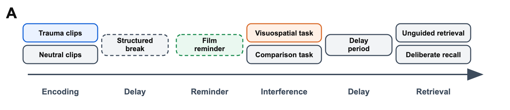{fig-align="center" width="100%"}

::: {.notes}
**A retrieved-context account of selective interference.**
Task items interfere when they are bound to film-associated context strongly enough to be cued with film items, and deliberate recall gains protection when film-directed control favors film items within the same association set.
**(A)** The simulated paradigm includes film encoding, a structured break, a film reminder, interference or comparison task, a delay period, and retrieval tests.
**(B)** Film and task items remain distinct while becoming associated with context states active at encoding; contextual overlap makes task items likely to be cued alongside film items, and task encoding strength determines how strongly they compete once cued.
**(C)** Context-to-item associations cue candidate items, and item-to-context associations let recalled, reminded, or supplied items reinstate associated context.
**(D)** The same stored associations support unguided retrieval and deliberate recall, with deliberate recall gaining protection from a film-directed start cue and film-directed selection.
:::

## Figure 1B

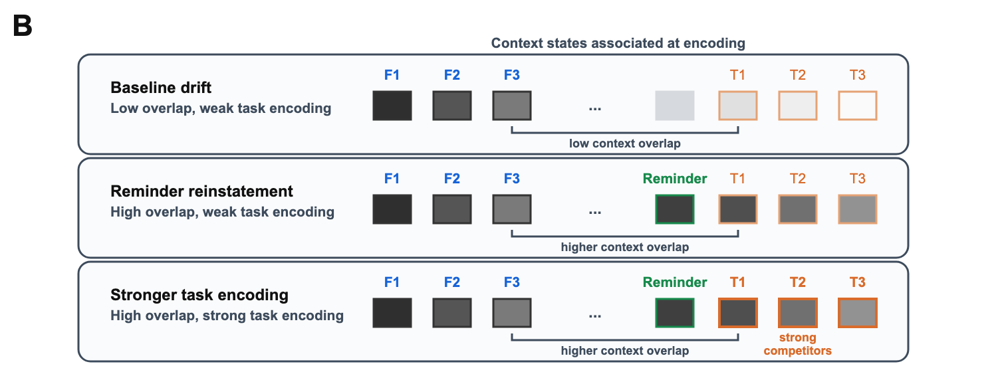{fig-align="center" width="100%"}

::: {.notes}
**A retrieved-context account of selective interference.**
Task items interfere when they are bound to film-associated context strongly enough to be cued with film items, and deliberate recall gains protection when film-directed control favors film items within the same association set.
**(A)** The simulated paradigm includes film encoding, a structured break, a film reminder, interference or comparison task, a delay period, and retrieval tests.
**(B)** Film and task items remain distinct while becoming associated with context states active at encoding; contextual overlap makes task items likely to be cued alongside film items, and task encoding strength determines how strongly they compete once cued.
**(C)** Context-to-item associations cue candidate items, and item-to-context associations let recalled, reminded, or supplied items reinstate associated context.
**(D)** The same stored associations support unguided retrieval and deliberate recall, with deliberate recall gaining protection from a film-directed start cue and film-directed selection.
:::

## Figure 1C

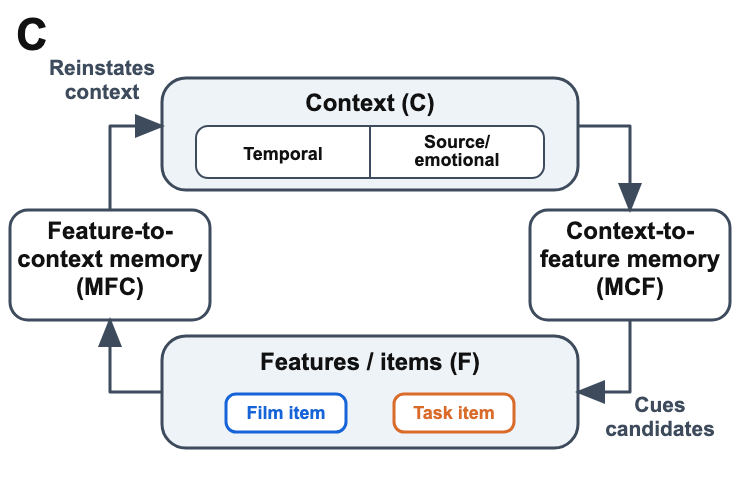{fig-align="center" height="700"}

::: {.notes}
**A retrieved-context account of selective interference.**
Task items interfere when they are bound to film-associated context strongly enough to be cued with film items, and deliberate recall gains protection when film-directed control favors film items within the same association set.
**(A)** The simulated paradigm includes film encoding, a structured break, a film reminder, interference or comparison task, a delay period, and retrieval tests.
**(B)** Film and task items remain distinct while becoming associated with context states active at encoding; contextual overlap makes task items likely to be cued alongside film items, and task encoding strength determines how strongly they compete once cued.
**(C)** Context-to-item associations cue candidate items, and item-to-context associations let recalled, reminded, or supplied items reinstate associated context.
**(D)** The same stored associations support unguided retrieval and deliberate recall, with deliberate recall gaining protection from a film-directed start cue and film-directed selection.
:::

## Figure 1D

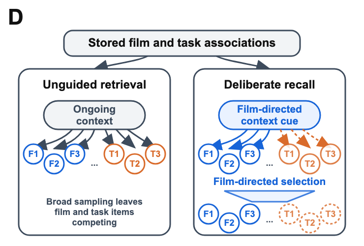{fig-align="center" height="700"}

::: {.notes}
**A retrieved-context account of selective interference.**
Task items interfere when they are bound to film-associated context strongly enough to be cued with film items, and deliberate recall gains protection when film-directed control favors film items within the same association set.
**(A)** The simulated paradigm includes film encoding, a structured break, a film reminder, interference or comparison task, a delay period, and retrieval tests.
**(B)** Film and task items remain distinct while becoming associated with context states active at encoding; contextual overlap makes task items likely to be cued alongside film items, and task encoding strength determines how strongly they compete once cued.
**(C)** Context-to-item associations cue candidate items, and item-to-context associations let recalled, reminded, or supplied items reinstate associated context.
**(D)** The same stored associations support unguided retrieval and deliberate recall, with deliberate recall gaining protection from a film-directed start cue and film-directed selection.
:::

## Figure 2

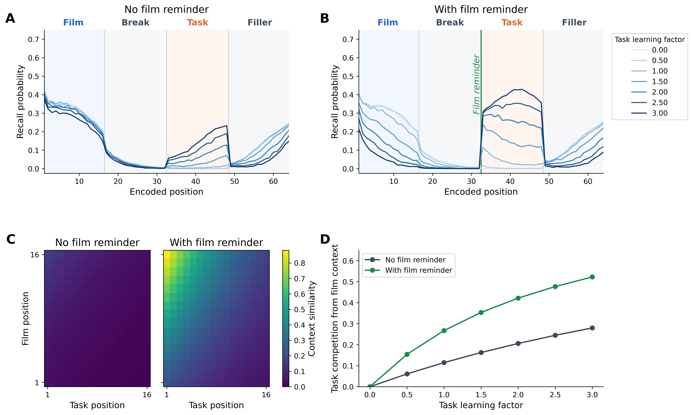{fig-align="center" height="720"}

::: {.notes}
**Reminder-driven context overlap makes task encoding strength consequential for film recall.**
Simulation 1 demonstrates how task items can become competitors for film recall by varying task encoding strength with or without a sequential film-item reminder before task encoding.
**(A)** Without a film reminder, task items become associated with later context states reached after drift away from the film, so stronger task encoding produces only modest redistribution from film items to task items.
**(B)** With a film reminder, task items become associated with context states more similar to those associated with film items, so stronger task encoding produces larger redistribution from film items to task items.
**(C)** The temporal-context trace remains position-resolved: reminder cues make the states active during task encoding more similar to positions along the film context trajectory.
**(D)** When the model is probed with a broad film-context cue and the active source context, stronger task encoding assigns a larger share of item support to task items, especially after a film reminder.
:::

## Figure 2A-B

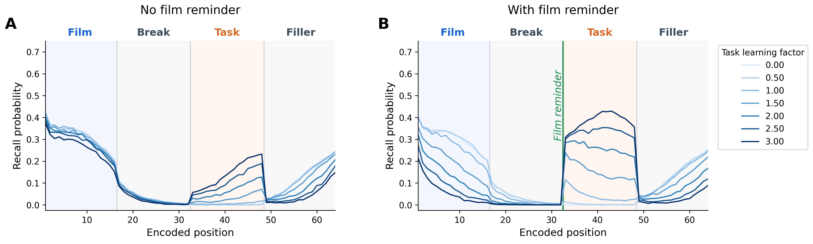{fig-align="center" width="100%"}

::: {.notes}
**Reminder-driven context overlap makes task encoding strength consequential for film recall.**
Simulation 1 demonstrates how task items can become competitors for film recall by varying task encoding strength with or without a sequential film-item reminder before task encoding.
**(A)** Without a film reminder, task items become associated with later context states reached after drift away from the film, so stronger task encoding produces only modest redistribution from film items to task items.
**(B)** With a film reminder, task items become associated with context states more similar to those associated with film items, so stronger task encoding produces larger redistribution from film items to task items.
**(C)** The temporal-context trace remains position-resolved: reminder cues make the states active during task encoding more similar to positions along the film context trajectory.
**(D)** When the model is probed with a broad film-context cue and the active source context, stronger task encoding assigns a larger share of item support to task items, especially after a film reminder.
:::

## Figure 2C

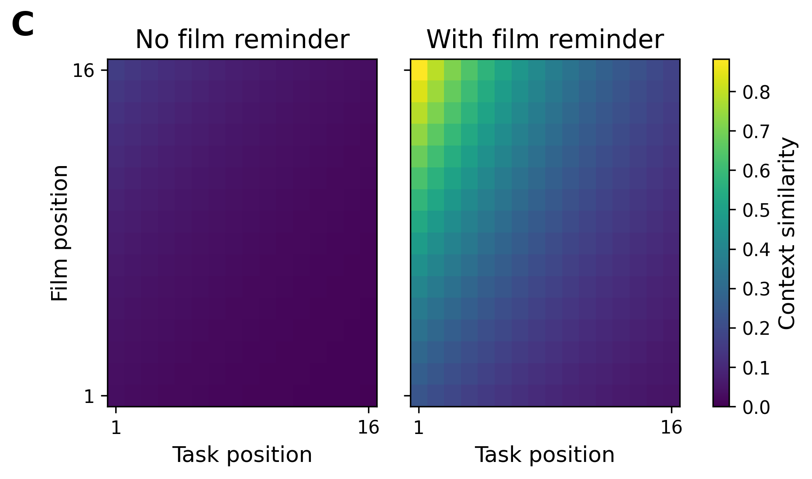{fig-align="center" height="700"}

::: {.notes}
**Reminder-driven context overlap makes task encoding strength consequential for film recall.**
Simulation 1 demonstrates how task items can become competitors for film recall by varying task encoding strength with or without a sequential film-item reminder before task encoding.
**(A)** Without a film reminder, task items become associated with later context states reached after drift away from the film, so stronger task encoding produces only modest redistribution from film items to task items.
**(B)** With a film reminder, task items become associated with context states more similar to those associated with film items, so stronger task encoding produces larger redistribution from film items to task items.
**(C)** The temporal-context trace remains position-resolved: reminder cues make the states active during task encoding more similar to positions along the film context trajectory.
**(D)** When the model is probed with a broad film-context cue and the active source context, stronger task encoding assigns a larger share of item support to task items, especially after a film reminder.
:::

## Figure 2D

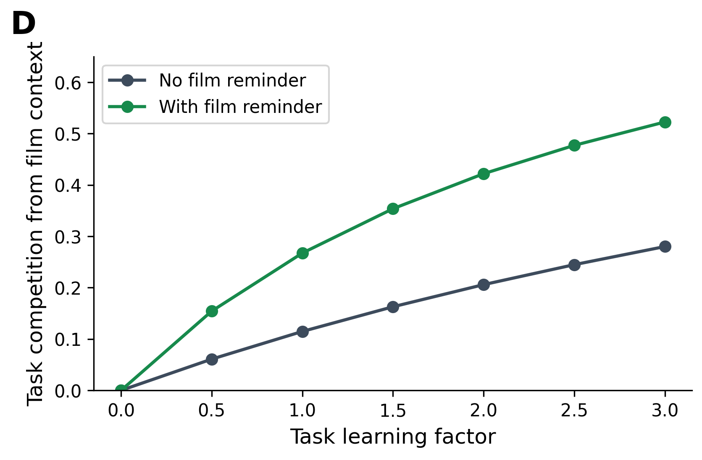{fig-align="center" width="100%"}

::: {.notes}
**Reminder-driven context overlap makes task encoding strength consequential for film recall.**
Simulation 1 demonstrates how task items can become competitors for film recall by varying task encoding strength with or without a sequential film-item reminder before task encoding.
**(A)** Without a film reminder, task items become associated with later context states reached after drift away from the film, so stronger task encoding produces only modest redistribution from film items to task items.
**(B)** With a film reminder, task items become associated with context states more similar to those associated with film items, so stronger task encoding produces larger redistribution from film items to task items.
**(C)** The temporal-context trace remains position-resolved: reminder cues make the states active during task encoding more similar to positions along the film context trajectory.
**(D)** When the model is probed with a broad film-context cue and the active source context, stronger task encoding assigns a larger share of item support to task items, especially after a film reminder.
:::

## Figure 3

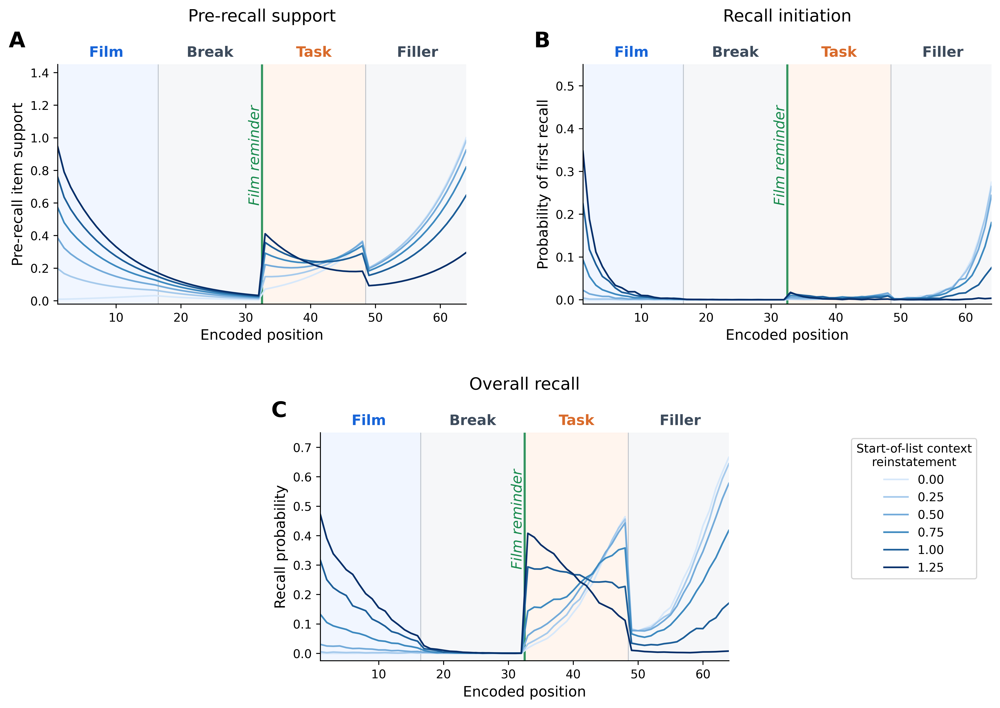{fig-align="center" height="720"}

::: {.notes}
**Start-of-list context reinstatement protects film recall by changing the context that cues retrieval.**
Simulation 2 demonstrates how a deliberate-recall start operation can protect film recall after post-reminder task encoding by drifting retrieval context toward the start-of-list state immediately before the first retrieval attempt.
**(A)** Before any item is sampled, stronger start-of-list context reinstatement makes the retrieval context support early film items rather than late filler items.
**(B)** This pre-recall support shift makes recall more likely to begin with film items, especially items from the beginning of the film sequence.
**(C)** Across the sampled retrieval sequence, stronger start-of-list context reinstatement increases access to film items, with the largest gains concentrated near the beginning of the film sequence.
Because sampled early film items reinstate nearby early-film context, and because context drifts gradually during retrieval, a start-of-recall context shift can affect later samples as well as the first sampled item.
:::

## Figure 3A

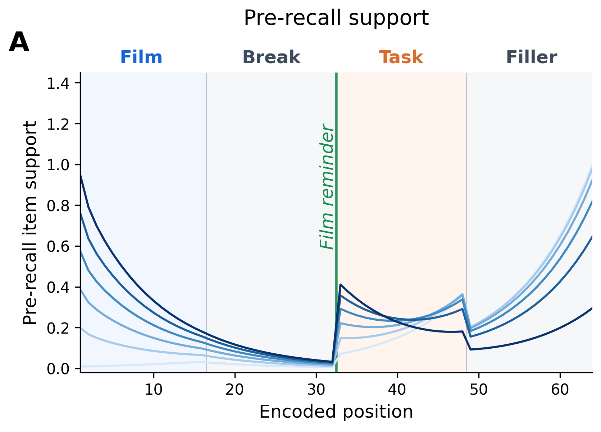{fig-align="center" width="100%"}

::: {.notes}
**Start-of-list context reinstatement protects film recall by changing the context that cues retrieval.**
Simulation 2 demonstrates how a deliberate-recall start operation can protect film recall after post-reminder task encoding by drifting retrieval context toward the start-of-list state immediately before the first retrieval attempt.
**(A)** Before any item is sampled, stronger start-of-list context reinstatement makes the retrieval context support early film items rather than late filler items.
**(B)** This pre-recall support shift makes recall more likely to begin with film items, especially items from the beginning of the film sequence.
**(C)** Across the sampled retrieval sequence, stronger start-of-list context reinstatement increases access to film items, with the largest gains concentrated near the beginning of the film sequence.
Because sampled early film items reinstate nearby early-film context, and because context drifts gradually during retrieval, a start-of-recall context shift can affect later samples as well as the first sampled item.
:::

## Figure 3B

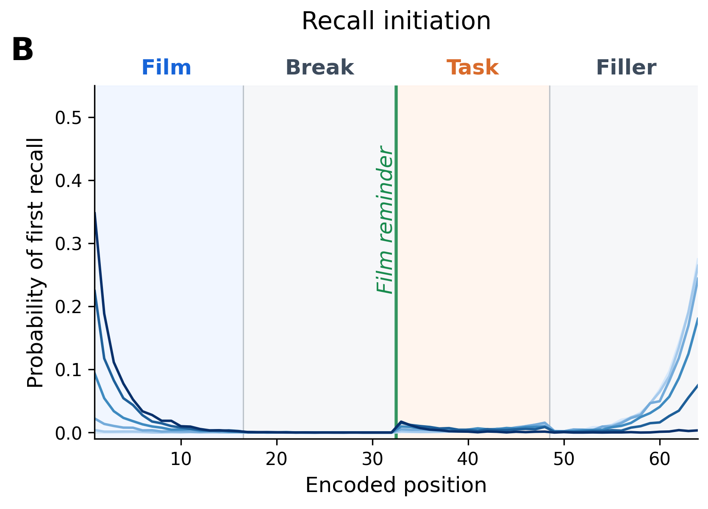{fig-align="center" width="100%"}

::: {.notes}
**Start-of-list context reinstatement protects film recall by changing the context that cues retrieval.**
Simulation 2 demonstrates how a deliberate-recall start operation can protect film recall after post-reminder task encoding by drifting retrieval context toward the start-of-list state immediately before the first retrieval attempt.
**(A)** Before any item is sampled, stronger start-of-list context reinstatement makes the retrieval context support early film items rather than late filler items.
**(B)** This pre-recall support shift makes recall more likely to begin with film items, especially items from the beginning of the film sequence.
**(C)** Across the sampled retrieval sequence, stronger start-of-list context reinstatement increases access to film items, with the largest gains concentrated near the beginning of the film sequence.
Because sampled early film items reinstate nearby early-film context, and because context drifts gradually during retrieval, a start-of-recall context shift can affect later samples as well as the first sampled item.
:::

## Figure 3C

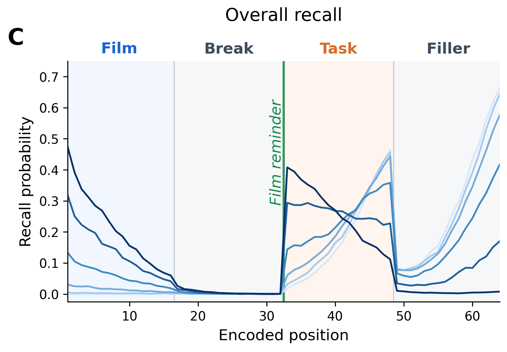{fig-align="center" width="100%"}

::: {.notes}
**Start-of-list context reinstatement protects film recall by changing the context that cues retrieval.**
Simulation 2 demonstrates how a deliberate-recall start operation can protect film recall after post-reminder task encoding by drifting retrieval context toward the start-of-list state immediately before the first retrieval attempt.
**(A)** Before any item is sampled, stronger start-of-list context reinstatement makes the retrieval context support early film items rather than late filler items.
**(B)** This pre-recall support shift makes recall more likely to begin with film items, especially items from the beginning of the film sequence.
**(C)** Across the sampled retrieval sequence, stronger start-of-list context reinstatement increases access to film items, with the largest gains concentrated near the beginning of the film sequence.
Because sampled early film items reinstate nearby early-film context, and because context drifts gradually during retrieval, a start-of-recall context shift can affect later samples as well as the first sampled item.
:::

## Figure 4

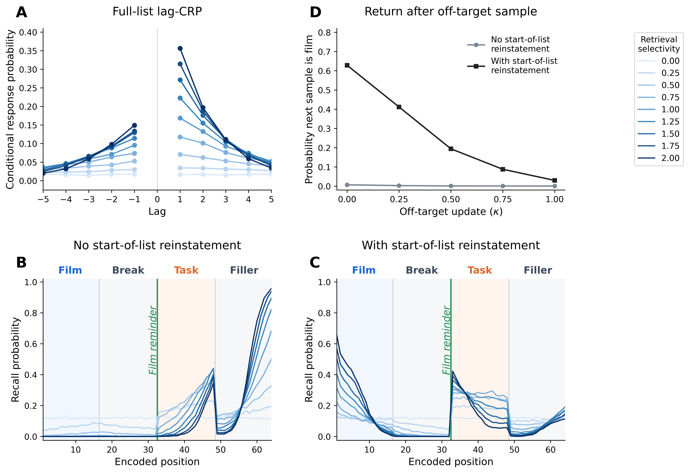{fig-align="center" height="720"}

::: {.notes}
**Retrieval selectivity sharpens the current search path, while target monitoring limits drift after off-target samples.**
Simulation 2 demonstrates why deliberate recall requires more than globally sharper selection by first varying retrieval selectivity after post-reminder task encoding, with or without start-of-list context reinstatement, and then examining a rejected-sample implementation of off-target recovery.
**(A)** With start-of-list reinstatement, higher retrieval selectivity increases short-lag transitions, indicating stronger local search around the currently active temporal neighborhood.
**(B)** Without start-of-list reinstatement, sharper local search amplifies recall of late non-film items because the ongoing retrieval context most strongly supports those positions.
**(C)** With start-of-list reinstatement, the same increase in retrieval selectivity amplifies recall of film items because retrieval begins from context that supports the start of the film sequence.
**(D)** A concrete rejected-sample implementation shows the same constraint: reducing the context update after off-target samples helps retrieval return to film items only when start-of-list reinstatement has already made film items accessible.
Together, the panels show that selection sharpening is conditional on the current retrieval context, whereas target monitoring can limit the aftereffects of off-target samples without supplying a film cue by itself.
:::

## Figure 4A

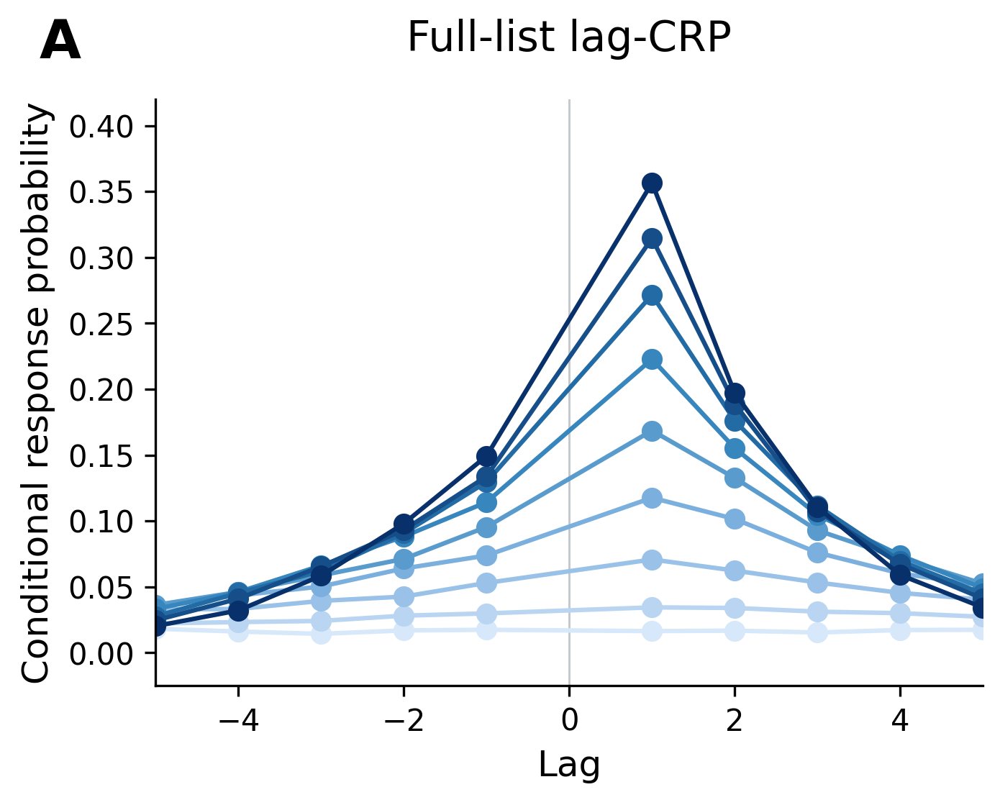{fig-align="center" width="100%"}

::: {.notes}
**Retrieval selectivity sharpens the current search path, while target monitoring limits drift after off-target samples.**
Simulation 2 demonstrates why deliberate recall requires more than globally sharper selection by first varying retrieval selectivity after post-reminder task encoding, with or without start-of-list context reinstatement, and then examining a rejected-sample implementation of off-target recovery.
**(A)** With start-of-list reinstatement, higher retrieval selectivity increases short-lag transitions, indicating stronger local search around the currently active temporal neighborhood.
**(B)** Without start-of-list reinstatement, sharper local search amplifies recall of late non-film items because the ongoing retrieval context most strongly supports those positions.
**(C)** With start-of-list reinstatement, the same increase in retrieval selectivity amplifies recall of film items because retrieval begins from context that supports the start of the film sequence.
**(D)** A concrete rejected-sample implementation shows the same constraint: reducing the context update after off-target samples helps retrieval return to film items only when start-of-list reinstatement has already made film items accessible.
Together, the panels show that selection sharpening is conditional on the current retrieval context, whereas target monitoring can limit the aftereffects of off-target samples without supplying a film cue by itself.
:::

## Figure 4B-C

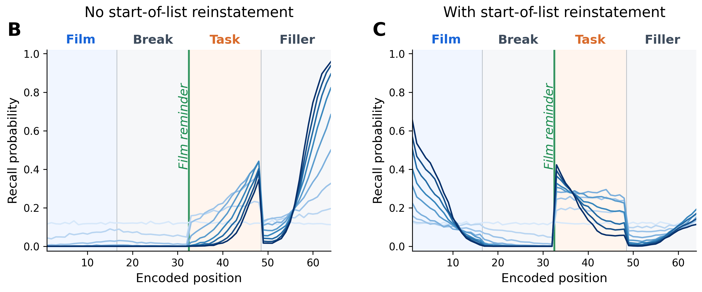{fig-align="center" width="100%"}

::: {.notes}
**Retrieval selectivity sharpens the current search path, while target monitoring limits drift after off-target samples.**
Simulation 2 demonstrates why deliberate recall requires more than globally sharper selection by first varying retrieval selectivity after post-reminder task encoding, with or without start-of-list context reinstatement, and then examining a rejected-sample implementation of off-target recovery.
**(A)** With start-of-list reinstatement, higher retrieval selectivity increases short-lag transitions, indicating stronger local search around the currently active temporal neighborhood.
**(B)** Without start-of-list reinstatement, sharper local search amplifies recall of late non-film items because the ongoing retrieval context most strongly supports those positions.
**(C)** With start-of-list reinstatement, the same increase in retrieval selectivity amplifies recall of film items because retrieval begins from context that supports the start of the film sequence.
**(D)** A concrete rejected-sample implementation shows the same constraint: reducing the context update after off-target samples helps retrieval return to film items only when start-of-list reinstatement has already made film items accessible.
Together, the panels show that selection sharpening is conditional on the current retrieval context, whereas target monitoring can limit the aftereffects of off-target samples without supplying a film cue by itself.
:::

## Figure 4D

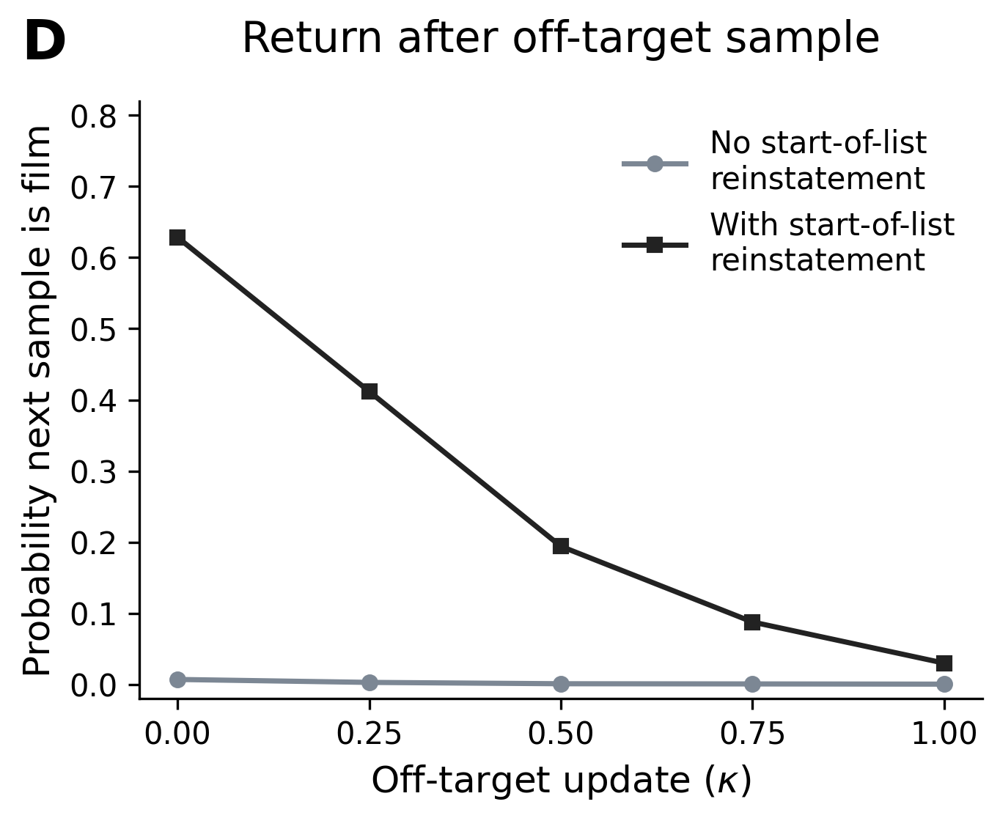{fig-align="center" width="100%"}

::: {.notes}
**Retrieval selectivity sharpens the current search path, while target monitoring limits drift after off-target samples.**
Simulation 2 demonstrates why deliberate recall requires more than globally sharper selection by first varying retrieval selectivity after post-reminder task encoding, with or without start-of-list context reinstatement, and then examining a rejected-sample implementation of off-target recovery.
**(A)** With start-of-list reinstatement, higher retrieval selectivity increases short-lag transitions, indicating stronger local search around the currently active temporal neighborhood.
**(B)** Without start-of-list reinstatement, sharper local search amplifies recall of late non-film items because the ongoing retrieval context most strongly supports those positions.
**(C)** With start-of-list reinstatement, the same increase in retrieval selectivity amplifies recall of film items because retrieval begins from context that supports the start of the film sequence.
**(D)** A concrete rejected-sample implementation shows the same constraint: reducing the context update after off-target samples helps retrieval return to film items only when start-of-list reinstatement has already made film items accessible.
Together, the panels show that selection sharpening is conditional on the current retrieval context, whereas target monitoring can limit the aftereffects of off-target samples without supplying a film cue by itself.
:::

## Figure 5

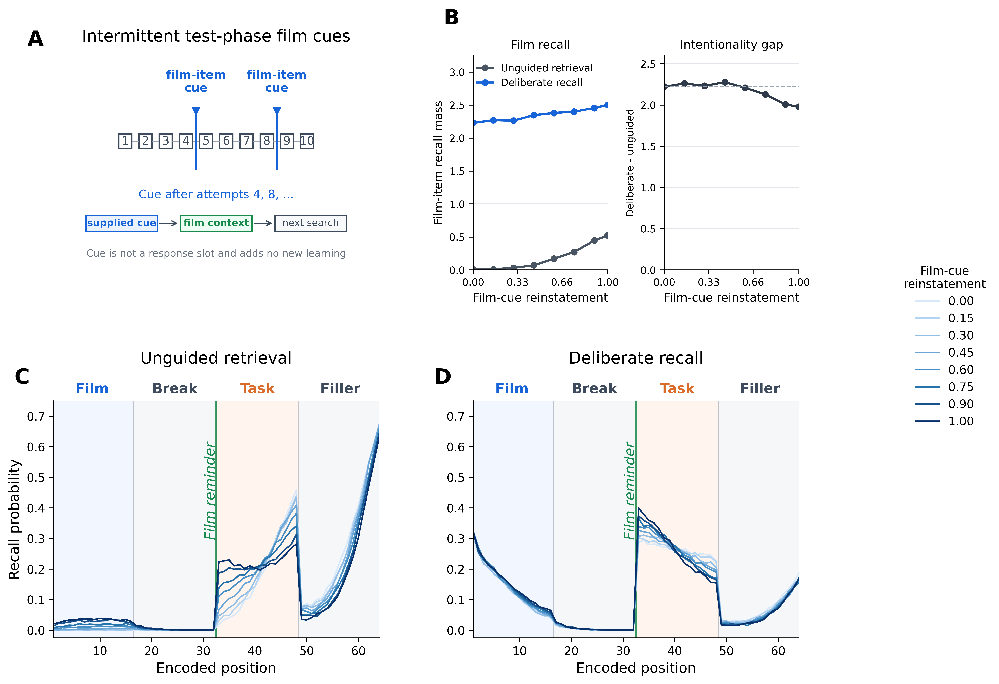{fig-align="center" height="720"}

::: {.notes}
**Intermittent test-phase film cues increase film access without replacing the intentionality manipulation.**
Simulation 3 compares unguided retrieval with deliberate recall while varying the strength of intermittent supplied film-item cues during retrieval.
**(A)** Supplied film cues occur after scheduled retrieval attempts, update context, and then allow the next ordinary retrieval competition; they are not counted as responses and do not add learning.
**(B)** Film-item recall increases with cue strength, but the deliberate-minus-unguided intentionality gap remains nearly stable across weak-to-moderate cue reinstatement.
Only stronger cue reinstatement begins to narrow the gap.
**(C)** Under unguided retrieval, supplied film cues modestly raise film recall but task and filler competitors remain prominent.
**(D)** Under deliberate recall, film recall is already supported by start-of-list control, and supplied cues produce additional film access without eliminating task competition.
:::

## Figure 5A

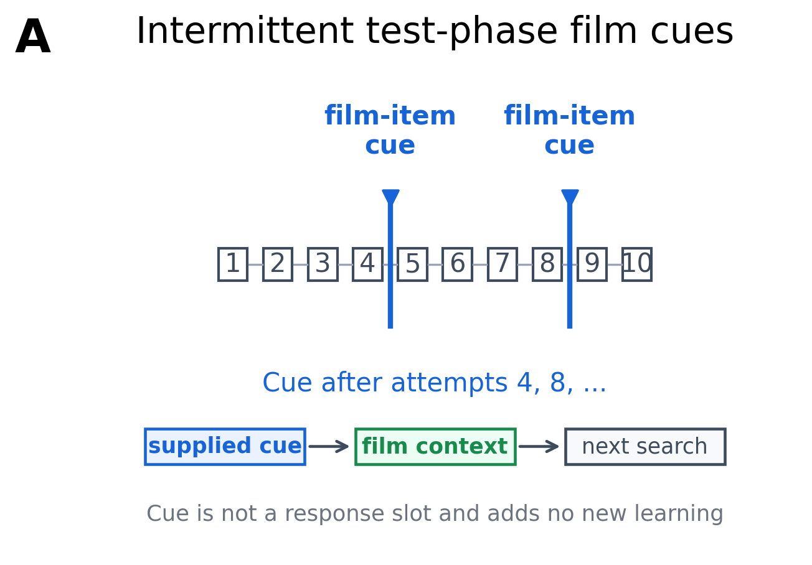{fig-align="center" height="700"}

::: {.notes}
**Intermittent test-phase film cues increase film access without replacing the intentionality manipulation.**
Simulation 3 compares unguided retrieval with deliberate recall while varying the strength of intermittent supplied film-item cues during retrieval.
**(A)** Supplied film cues occur after scheduled retrieval attempts, update context, and then allow the next ordinary retrieval competition; they are not counted as responses and do not add learning.
**(B)** Film-item recall increases with cue strength, but the deliberate-minus-unguided intentionality gap remains nearly stable across weak-to-moderate cue reinstatement.
Only stronger cue reinstatement begins to narrow the gap.
**(C)** Under unguided retrieval, supplied film cues modestly raise film recall but task and filler competitors remain prominent.
**(D)** Under deliberate recall, film recall is already supported by start-of-list control, and supplied cues produce additional film access without eliminating task competition.
:::

## Figure 5B

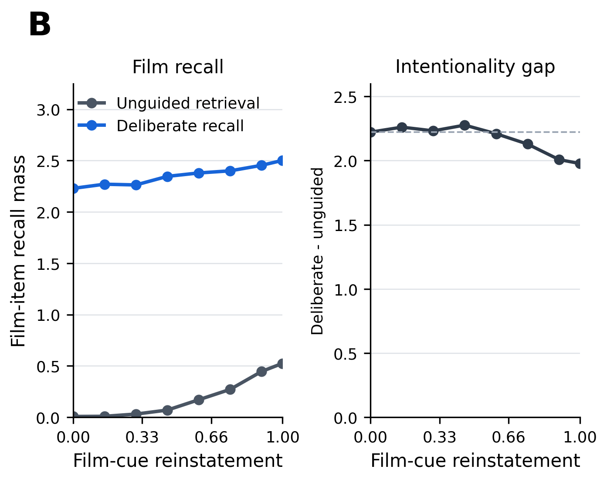{fig-align="center" width="100%"}

::: {.notes}
**Intermittent test-phase film cues increase film access without replacing the intentionality manipulation.**
Simulation 3 compares unguided retrieval with deliberate recall while varying the strength of intermittent supplied film-item cues during retrieval.
**(A)** Supplied film cues occur after scheduled retrieval attempts, update context, and then allow the next ordinary retrieval competition; they are not counted as responses and do not add learning.
**(B)** Film-item recall increases with cue strength, but the deliberate-minus-unguided intentionality gap remains nearly stable across weak-to-moderate cue reinstatement.
Only stronger cue reinstatement begins to narrow the gap.
**(C)** Under unguided retrieval, supplied film cues modestly raise film recall but task and filler competitors remain prominent.
**(D)** Under deliberate recall, film recall is already supported by start-of-list control, and supplied cues produce additional film access without eliminating task competition.
:::

## Figure 5C-D

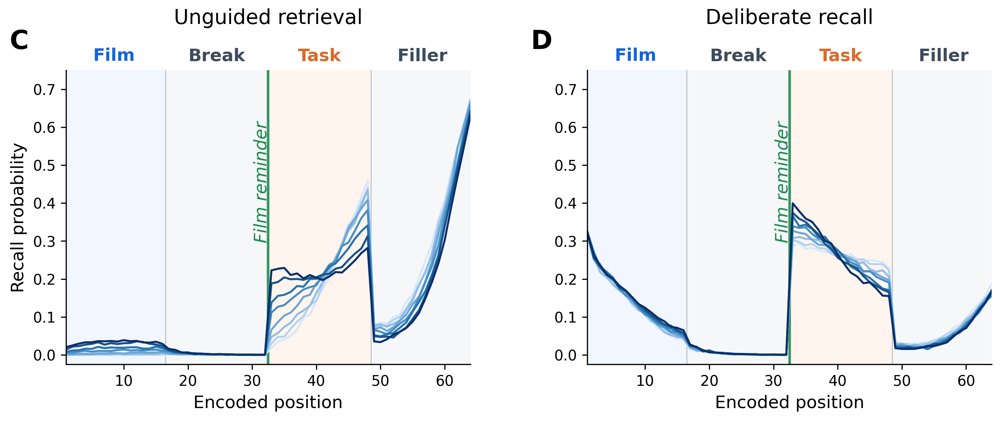{fig-align="center" width="100%"}

::: {.notes}
**Intermittent test-phase film cues increase film access without replacing the intentionality manipulation.**
Simulation 3 compares unguided retrieval with deliberate recall while varying the strength of intermittent supplied film-item cues during retrieval.
**(A)** Supplied film cues occur after scheduled retrieval attempts, update context, and then allow the next ordinary retrieval competition; they are not counted as responses and do not add learning.
**(B)** Film-item recall increases with cue strength, but the deliberate-minus-unguided intentionality gap remains nearly stable across weak-to-moderate cue reinstatement.
Only stronger cue reinstatement begins to narrow the gap.
**(C)** Under unguided retrieval, supplied film cues modestly raise film recall but task and filler competitors remain prominent.
**(D)** Under deliberate recall, film recall is already supported by start-of-list control, and supplied cues produce additional film access without eliminating task competition.
:::

## Figure 6

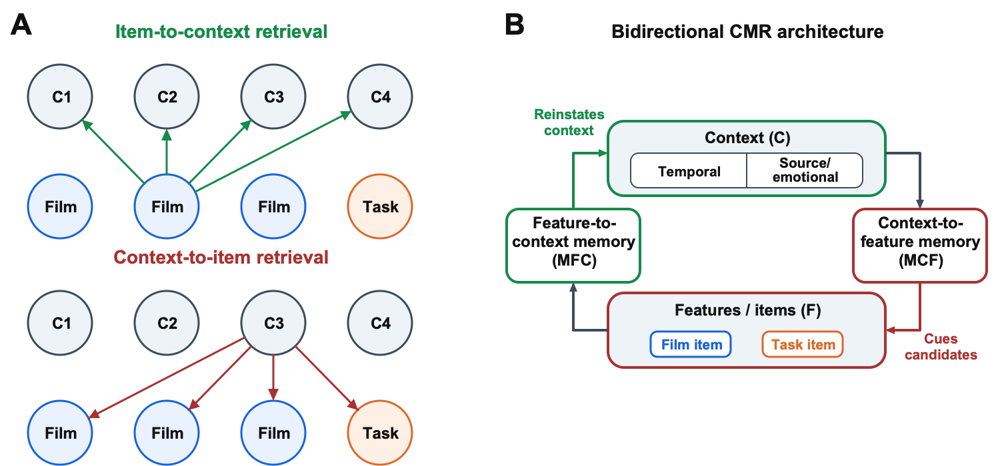{fig-align="center" width="100%"}

::: {.notes}
**Retrieval format changes where interference can enter.**
Simulation 4 distinguishes context-guided retrieval from supplied-item retrieval.
**(A)** When retrieval begins from context, the same context state can cue multiple candidates; task items therefore compete with film items when both have been encoded in overlapping contexts.
When retrieval begins from a supplied film item, the item reinstates its associated context instead, so the task item is not an equivalent competitor at the point of access.
**(B)** In CMR, this asymmetry corresponds to two retrieval directions: context-to-feature associations cue candidate items, whereas feature-to-context associations reinstate context from a supplied item.
Simulation 4 uses this distinction to ask why item-cued or recognition-like tests may show preserved access even when context-guided recall is sensitive to interference.
:::
