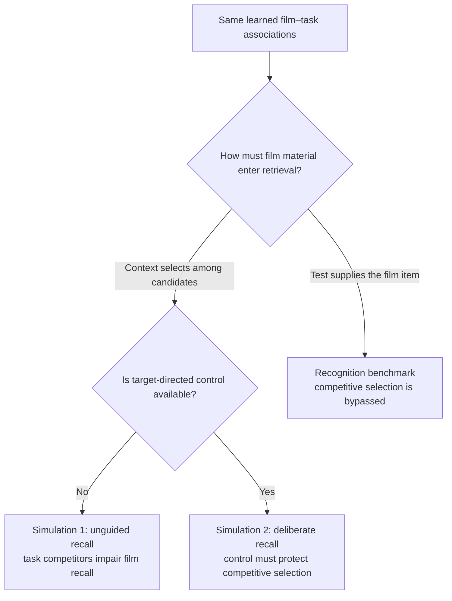

Yes—the logic is compelling, provided recognition becomes a short bridge rather than merely moving the entire current Simulation 3 upward.

The argumentative progression becomes:

1. **Simulation 1 establishes the interference problem.**  
   Reminder-linked task learning causes task and film items to compete when current context must generate a candidate.

2. **Recognition establishes the easy boundary case.**  
   Recognition supplies the film item. It therefore does not need to win the same context-to-item competition. Preserved recognition is expected—but that expected result explains why recognition-heavy studies cannot isolate retrieval intentionality.

3. **Simulation 2 tackles the difficult question.**  
   Deliberate recall still requires film material to be generated from a mixed candidate set. How can it remain relatively preserved? Now the three retrieval-control mechanisms matter.

That ordering also deconstructs “deliberate remembering” in exactly the way the meeting notes suggest:

- Recognition is deliberate, but supplies the candidate.
- Deliberate recall is deliberate, but requires candidate generation.
- Unguided recall requires candidate generation without the same target-directed control.

So recognition cleanly separates **test format** from **intentionality** before Simulation 2 asks what intentional control contributes.

The transition could work like this:

> Simulation 1 shows that reminder-linked task learning produces competition when retrieval begins from context. The same learned associations need not impair every test format equally. When the test supplies a film item, that item can reinstate associated context without first winning selection against task competitors.

Then, after the recognition result:

> This expected boundary condition isolates what item presentation provides. It does not explain how deliberate recall remains relatively preserved, because recall still requires film items to be selected from candidates that include reminder-linked task material. Simulation 2 therefore asks which forms of retrieval control can protect that selection.

My recommendation is therefore:

- Keep recognition.
- Move it between Simulations 1 and 2.
- Present it as a short, unnumbered **“Recognition as a test-format boundary”** analysis.
- Explicitly call the flat result expected.
- Reduce its current four-panel figure to the indispensable access-route comparison and result.
- Let Simulation 2 remain the final and strongest simulation.

I would not fold it fully into Simulation 1, because Simulation 1 currently holds retrieval fixed to isolate competitor formation. A short bridge preserves that clean experimental job.

No changes made. If you approve this structural decision, I’ll next show the exact move-and-compression proposal before touching the manuscript.

===

Found it. This is real human-authored provenance, not an AI ledger.

- The [July 3 meeting notes](/Users/jordangunn/workspace/selective_interference_v2/notes/meeting_notes_2026-07-03.md:110) explicitly record:

  > Deborah idea:  
  > Simulation 1: Unguided  
  > Simulation 2: Recognition  
  > Simulation 3: Control  
  > Likely go with Deborah’s idea.

- A July 5 Word comment independently restates the decision: “recognition should come before the control-mechanism section, not after it.” :codex-file-citation{path="/Users/jordangunn/workspace/selective_interference_v2/notes/advisor_feedback_composite_0630_intro_0703_model.docx" purpose="source" artifact_kind="document" page_number="55"}

- I reviewed the full [July 5 Codex transcript](/Users/jordangunn/.codex/sessions/2026/07/05/rollout-2026-07-05T12-30-07-019f320a-f78c-79a0-a2ba-9319ebca2cc0.jsonl). You personally entered the same meeting note there at 21:08 BST, then said the advisor-feedback document also contained meeting notes.

- On July 25, Rik explicitly recalled an agreement to “move earlier or scrap” recognition and said retained recognition should precede the more interesting recall-control material. :codex-file-citation{path="/Users/jordangunn/workspace/selective_interference_v2/notes/selective_interference_clean_24_07_2026_rh.docx" purpose="source" artifact_kind="document" page_number="6"}

The caveat: no post–July 27 record preserves the final meeting decision. The August notes omit recognition, and a full transcript search found nothing after that meeting. One July 21 Deborah comment superficially retained recognition as Simulation 3, but its subject was interleaving theory and results—not clearly reconsidering recognition’s order.

So the best-supported reconstruction is:

**current Simulation 1 → compressed recognition as new Simulation 2 → current control Simulation 2 renumbered Simulation 3**

That ordering is also logically compelling: establish interference first, show the simple test-format boundary second, then end with the richer question of how deliberate recall controls competition. Recognition becomes a stepping stone rather than the anticlimactic finale Rik disliked.

No files were changed. The sensible next step is a zero-edit relocation outline for your review.