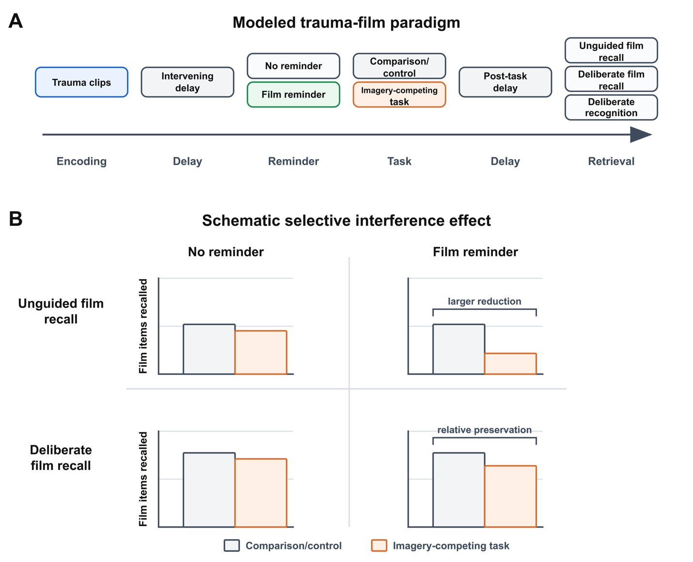
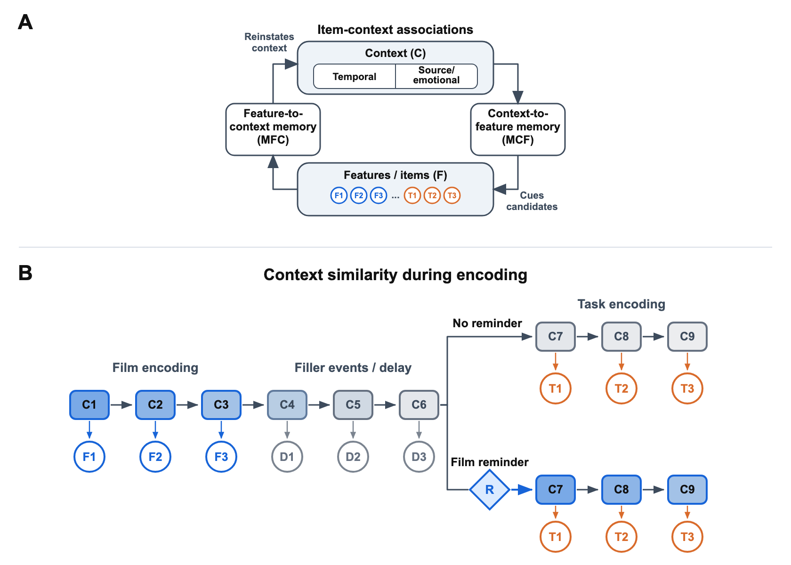
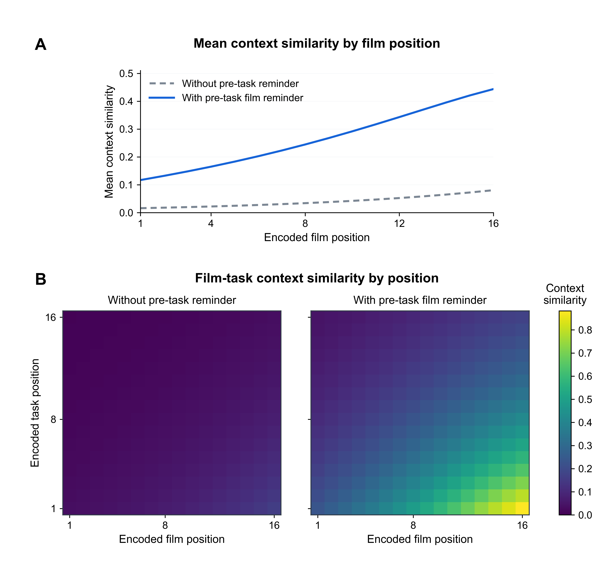

---
review:
  schema: 2
  author: GJ
  authors:
    GJ: Gunn, Jordan
    EH: Emily Holmes
    RH: Rik Henson
  reference: reference.qmd
  created_at: '2026-09-27T11:13:22Z'
  imports:
    ffd4f5e18b79896c761e622f70276ccd9fbf23670396f039e5167a9818638305: review/exchanges/ffd4f5e18b79896c761e622f70276ccd9fbf23670396f039e5167a9818638305.docx
---

# Competition and control in episodic memory search: A retrieved-context account of selective []{#c1-start}interference[]{#c1-end}{~~~> whereby an imagery~~}{#s1 by=EH at=2026-07-27T14:28:00Z}<!-- review-data: {"provenance":{"source":"review/exchanges/ffd4f5e18b79896c761e622f70276ccd9fbf23670396f039e5167a9818638305.docx","word_id":"2","kind":"ins","story":"word/document.xml","path":"/w:document/w:body/w:p[3]/w:ins[1]"}} -->{~~~>-~~}{#s2 by=EH at=2026-07-27T14:30:00Z}<!-- review-data: {"provenance":{"source":"review/exchanges/ffd4f5e18b79896c761e622f70276ccd9fbf23670396f039e5167a9818638305.docx","word_id":"3","kind":"ins","story":"word/document.xml","path":"/w:document/w:body/w:p[3]/w:ins[2]"}} -->{~~~>competing task can reduce in~~}{#s3 by=EH at=2026-07-27T14:28:00Z}<!-- review-data: {"provenance":{"source":"review/exchanges/ffd4f5e18b79896c761e622f70276ccd9fbf23670396f039e5167a9818638305.docx","word_id":"4","kind":"ins","story":"word/document.xml","path":"/w:document/w:body/w:p[3]/w:ins[3]"}} -->{~~~>voluntary~~}{#s4 by=EH at=2026-07-27T14:30:00Z}<!-- review-data: {"provenance":{"source":"review/exchanges/ffd4f5e18b79896c761e622f70276ccd9fbf23670396f039e5167a9818638305.docx","word_id":"5","kind":"ins","story":"word/document.xml","path":"/w:document/w:body/w:p[3]/w:ins[4]"}} -->{~~~> memories~~}{#s5 by=EH at=2026-07-27T14:28:00Z}<!-- review-data: {"provenance":{"source":"review/exchanges/ffd4f5e18b79896c761e622f70276ccd9fbf23670396f039e5167a9818638305.docx","word_id":"6","kind":"ins","story":"word/document.xml","path":"/w:document/w:body/w:p[3]/w:ins[5]"}} -->

Jordan B Gunn

[]{#s6-start}Department of Psychology, University of Cambridge[]{#s6-end}{~~~>~~}{#s6 by=EH at=2026-07-27T14:29:00Z}<!-- review-data: {"provenance":{"source":"review/exchanges/ffd4f5e18b79896c761e622f70276ccd9fbf23670396f039e5167a9818638305.docx","word_id":"7","kind":"ins","story":"word/document.xml","path":"/w:document/w:body/w:p[6]/w:pPr/w:rPr/w:ins"}} -->

[]{#s7-start}[]{#s7-end}{~~~>~~}{#s7 by=EH at=2026-07-27T14:29:00Z}<!-- review-data: {"provenance":{"source":"review/exchanges/ffd4f5e18b79896c761e622f70276ccd9fbf23670396f039e5167a9818638305.docx","word_id":"8","kind":"ins","story":"word/document.xml","path":"/w:document/w:body/w:p[7]/w:pPr/w:rPr/w:ins"}} -->

[]{#s8-start}[]{#s9-start}[]{#s9-end}{~~~>~~}{#s9 by=EH at=2026-07-27T14:29:00Z}<!-- review-data: {"provenance":{"source":"review/exchanges/ffd4f5e18b79896c761e622f70276ccd9fbf23670396f039e5167a9818638305.docx","word_id":"10","kind":"pPrChange","story":"word/document.xml","path":"/w:document/w:body/w:p[8]/w:pPr/w:pPrChange"}} -->[]{#s8-end}{~~~>~~}{#s8 by=EH at=2026-07-27T15:07:00Z}<!-- review-data: {"provenance":{"source":"review/exchanges/ffd4f5e18b79896c761e622f70276ccd9fbf23670396f039e5167a9818638305.docx","word_id":"9","kind":"del","story":"word/document.xml","path":"/w:document/w:body/w:p[8]/w:pPr/w:rPr/w:del"}} -->

{~~ ~>~~}{#s10 by=EH at=2026-07-27T15:07:00Z}<!-- review-data: {"provenance":{"source":"review/exchanges/ffd4f5e18b79896c761e622f70276ccd9fbf23670396f039e5167a9818638305.docx","word_id":"11","kind":"del","story":"word/document.xml","path":"/w:document/w:body/w:p[9]/w:del"}} -->

# Author Note

This is an in-progress working draft. Please do not cite, quote, or circulate without the authors’ written permission.

*Keywords*: intrusive memories, voluntary memory, trauma-film paradigm, visuospatial intervention, selective interference, retrieved-context theory, computational modeling{~~~>, imagery competing task intervention~~}{#s11 by=EH at=2026-07-27T14:29:00Z}<!-- review-data: {"provenance":{"source":"review/exchanges/ffd4f5e18b79896c761e622f70276ccd9fbf23670396f039e5167a9818638305.docx","word_id":"13","kind":"ins","story":"word/document.xml","path":"/w:document/w:body/w:p[14]/w:ins"}} -->

# Competition and control in episodic memory search: A retrieved-context account of selective interference

# Abstract

Goal-directed remembering can stay relatively robust even when interference makes the same material less likely to come to mind inadvertently. Studies using the trauma-film paradigm examine this asymmetry in memory for distressing films: an imagery-competing task performed after a film reminder can reduce later []{#c17-start}{~~~>involuntary ~~}{#s12 by=RH at=2026-07-25T10:10:00Z}<!-- review-data: {"provenance":{"source":"review/exchanges/ffd4f5e18b79896c761e622f70276ccd9fbf23670396f039e5167a9818638305.docx","word_id":"18","kind":"ins","story":"word/document.xml","path":"/w:document/w:body/w:p[18]/w:ins[1]"}} -->[]{#c17-end}{~~~>~~}{#s13 by=GJ}<!-- review-data: {"provenance":{"source":"review/exchanges/ffd4f5e18b79896c761e622f70276ccd9fbf23670396f039e5167a9818638305.docx","word_id":"19","kind":"conflictIns","story":"word/document.xml","path":"/w:document/w:body/w:p[18]/w14:conflictIns[1]"}} -->intrusions while leaving goal-directed remembering relatively intact. This selective interference effect is often interpreted through {~~~>clinical ~~}{#s14 by=EH at=2026-07-27T14:29:00Z}<!-- review-data: {"provenance":{"source":"review/exchanges/ffd4f5e18b79896c761e622f70276ccd9fbf23670396f039e5167a9818638305.docx","word_id":"20","kind":"ins","story":"word/document.xml","path":"/w:document/w:body/w:p[18]/w:ins[2]"}} -->theories of traumatic memory in which intrusive and goal-directed remembering depend on different memory representations. Here we show that the same dissociation may follow from retrieved-context dynamics developed to explain episodic memory more generally. We develop this account in an emotional Context Maintenance and Retrieval (eCMR) model that predicts sequences of film and non-film recall events. The model links task items to film-associated context reinstated by a film reminder. That context can later cue []{#c21-start}task competitors []{#c21-end}as well as film items. In the model, strong task competitors reduce []{#c22-start}unguided []{#c22-end}film recall {~~~>([]{#c24-start}[]{#c25-start}[]{#c26-start}intrusions~~}{#s15 by=RH at=2026-07-25T10:10:00Z}<!-- review-data: {"provenance":{"source":"review/exchanges/ffd4f5e18b79896c761e622f70276ccd9fbf23670396f039e5167a9818638305.docx","word_id":"23","kind":"ins","story":"word/document.xml","path":"/w:document/w:body/w:p[18]/w:ins[3]"}} -->[]{#c24-end}{~~~>{~~~>~~}{#s16 by=RH at=2026-07-25T10:11:00Z}<!-- review-data: {"provenance":{"source":"review/exchanges/ffd4f5e18b79896c761e622f70276ccd9fbf23670396f039e5167a9818638305.docx","word_id":"28","kind":"ins","story":"word/document.xml","path":"/w:document/w:body/w:p[18]/w14:conflictIns[2]/w:ins"}} -->~~}{#s17 by=GJ}<!-- review-data: {"provenance":{"source":"review/exchanges/ffd4f5e18b79896c761e622f70276ccd9fbf23670396f039e5167a9818638305.docx","word_id":"27","kind":"conflictIns","story":"word/document.xml","path":"/w:document/w:body/w:p[18]/w14:conflictIns[2]"}} -->[]{#c25-end}{~~~>~~}{#s18 by=GJ}<!-- review-data: {"provenance":{"source":"review/exchanges/ffd4f5e18b79896c761e622f70276ccd9fbf23670396f039e5167a9818638305.docx","word_id":"29","kind":"conflictIns","story":"word/document.xml","path":"/w:document/w:body/w:p[18]/w14:conflictIns[3]"}} -->[]{#c26-end}{~~~>~~}{#s19 by=GJ}<!-- review-data: {"provenance":{"source":"review/exchanges/ffd4f5e18b79896c761e622f70276ccd9fbf23670396f039e5167a9818638305.docx","word_id":"30","kind":"conflictIns","story":"word/document.xml","path":"/w:document/w:body/w:p[18]/w14:conflictIns[4]"}} -->{~~~>) ~~}{#s20 by=RH at=2026-07-25T10:10:00Z}<!-- review-data: {"provenance":{"source":"review/exchanges/ffd4f5e18b79896c761e622f70276ccd9fbf23670396f039e5167a9818638305.docx","word_id":"31","kind":"ins","story":"word/document.xml","path":"/w:document/w:body/w:p[18]/w:ins[4]"}} -->more than deliberate film recall when a maintained film-category cue selectively favors film candidates. []{#c32-start}[]{#c33-start}Deliberate recognition is less affected than deliberate recall because the model evaluates a presented candidate item’s fit to context rather than selecting among film and task candidates. []{#c32-end}[]{#c33-end}We discuss how these results motivate tests of selective interference in standard episodic memory paradigms.

# Introduction

Traumatic experience foregrounds a tension between accessibility and selectivity in episodic memory. From a functional perspective, events with lasting significance need to remain accessible in memory so remembered details can guide later decisions ([Zhou et al., 2025](#ref-zhou2025episodic)). At the same time, adaptive retrieval is selective: what comes to mind should normally depend on current goals, cues, and circumstances. Intrusive memories after trauma show how highly accessible event memories can strain the selectivity of retrieval. {~~~>Intrusive memories are those which are recalled involuntary typically in the f~~}{#s21 by=EH at=2026-07-27T14:36:00Z}<!-- review-data: {"provenance":{"source":"review/exchanges/ffd4f5e18b79896c761e622f70276ccd9fbf23670396f039e5167a9818638305.docx","word_id":"35","kind":"ins","story":"word/document.xml","path":"/w:document/w:body/w:p[20]/w:ins[1]"}} -->{~~~>orm of brief visual image of scenes within a traumatic event. ~~}{#s22 by=EH at=2026-07-27T14:37:00Z}<!-- review-data: {"provenance":{"source":"review/exchanges/ffd4f5e18b79896c761e622f70276ccd9fbf23670396f039e5167a9818638305.docx","word_id":"36","kind":"ins","story":"word/document.xml","path":"/w:document/w:body/w:p[20]/w:ins[2]"}} -->In posttraumatic stress disorder (PTSD), such memories can come to mind unbidden in inappropriate circumstances, causing distress and interfering with ongoing activity ([Brewin et al., 2010](#ref-brewin2010intrusive); [Ehlers & Clark, 2000](#ref-ehlers2000cognitive); [Iyadurai et al., 2019](#ref-iyadurai2019intrusive); [Krans et al., 2009](#ref-krans2009intrusive)). Explaining how episodic memory keeps consequential event memories accessible while regulating their retrieval is therefore a shared target for both clinical science and mechanistic theories of memory.

The trauma-film paradigm provides a controlled setting for comparing intrusive and voluntary memory for the same material ([Holmes & Bourne, 2008](#ref-holmes2008inducing); []{#c37-start}[James et al., 2016](#ref-james2016trauma)[]{#c37-end}). Participants view a distressing film, record later intrusions, and often complete {~~v~>~~}{#s23 by=EH at=2026-07-27T14:39:00Z}<!-- review-data: {"provenance":{"source":"review/exchanges/ffd4f5e18b79896c761e622f70276ccd9fbf23670396f039e5167a9818638305.docx","word_id":"38","kind":"del","story":"word/document.xml","path":"/w:document/w:body/w:p[21]/w:del[1]"}} -->{~~~>both inv~~}{#s24 by=EH at=2026-07-27T14:38:00Z}<!-- review-data: {"provenance":{"source":"review/exchanges/ffd4f5e18b79896c761e622f70276ccd9fbf23670396f039e5167a9818638305.docx","word_id":"39","kind":"ins","story":"word/document.xml","path":"/w:document/w:body/w:p[21]/w:ins[1]"}} -->{~~~>oluntary and v~~}{#s25 by=EH at=2026-07-27T14:39:00Z}<!-- review-data: {"provenance":{"source":"review/exchanges/ffd4f5e18b79896c761e622f70276ccd9fbf23670396f039e5167a9818638305.docx","word_id":"40","kind":"ins","story":"word/document.xml","path":"/w:document/w:body/w:p[21]/w:ins[2]"}} -->oluntary-memory tests of its contents. This design makes it possible to ask whether the same material can remain accessible to voluntary retrieval while becoming more or less likely to come to mind involuntarily. In such research, intrusion frequency is often only weakly related to voluntary-memory performance ([Holmes et al., 2004](#ref-holmes2004trauma); []{#c41-start}[James et al., 2016](#ref-james2016trauma)[]{#c41-end}). Memory for the same film can therefore arise involuntarily{~~~>,~~}{#s26 by=RH at=2026-07-25T10:14:00Z}<!-- review-data: {"provenance":{"source":"review/exchanges/ffd4f5e18b79896c761e622f70276ccd9fbf23670396f039e5167a9818638305.docx","word_id":"42","kind":"ins","story":"word/document.xml","path":"/w:document/w:body/w:p[21]/w:ins[3]"}} --> or be retrieved voluntarily, and {~~the~>~~}{#s27 by=RH at=2026-07-25T10:14:00Z}<!-- review-data: {"provenance":{"source":"review/exchanges/ffd4f5e18b79896c761e622f70276ccd9fbf23670396f039e5167a9818638305.docx","word_id":"43","kind":"del","story":"word/document.xml","path":"/w:document/w:body/w:p[21]/w:del[2]"}} -->{~~~>these~~}{#s28 by=RH at=2026-07-25T10:14:00Z}<!-- review-data: {"provenance":{"source":"review/exchanges/ffd4f5e18b79896c761e622f70276ccd9fbf23670396f039e5167a9818638305.docx","word_id":"44","kind":"ins","story":"word/document.xml","path":"/w:document/w:body/w:p[21]/w:ins[4]"}} --> two outcomes {~~need not vary together~>~~}{#s29 by=RH at=2026-07-25T10:14:00Z}<!-- review-data: {"provenance":{"source":"review/exchanges/ffd4f5e18b79896c761e622f70276ccd9fbf23670396f039e5167a9818638305.docx","word_id":"45","kind":"del","story":"word/document.xml","path":"/w:document/w:body/w:p[21]/w:del[3]"}} -->{~~~> can be largely independent~~}{#s30 by=RH at=2026-07-25T10:14:00Z}<!-- review-data: {"provenance":{"source":"review/exchanges/ffd4f5e18b79896c761e622f70276ccd9fbf23670396f039e5167a9818638305.docx","word_id":"46","kind":"ins","story":"word/document.xml","path":"/w:document/w:body/w:p[21]/w:ins[5]"}} -->.

Researchers have sharpened this dissociation using the imagery-competing task intervention (ICTI) and related procedures. In an ICTI, participants receive reminders of the target event and then complete a brief task designed to compete with the visual imagery those reminders call to mind (deBettencourt et al., 2026; Highfield et al., 2025). Imagery-competing tasks administered within hours of film viewing have reduced later film intrusions while voluntary memory for the same material has remained relatively intact ([Asselbergs et al., 2024](#ref-asselbergs2024effectiveness), [Deeprose et al., 2012](#ref-deeprose2012imagery); [Holmes et al., 2009](#ref-holmes2009can), [2010](#ref-holmes2010key); [Lau-Zhu et al., 2019](#ref-lau2019intrusive), [2021](#ref-lau2021selectively)). In delayed variants{~~~>,~~}{#s31 by=RH at=2026-07-25T10:15:00Z}<!-- review-data: {"provenance":{"source":"review/exchanges/ffd4f5e18b79896c761e622f70276ccd9fbf23670396f039e5167a9818638305.docx","word_id":"47","kind":"ins","story":"word/document.xml","path":"/w:document/w:body/w:p[22]/w:ins"}} --> participants return a day or more after film viewing and receive a reminder before completing the task. These studies likewise report reduced intrusions while recognition performance remains relatively intact ([James et al., 2015](#ref-james2015computer); [Kessler et al., 2020](#ref_kessler2018reducing)). Clinical studies have also found that ICTIs reduce intrusive memories after real-world trauma ([Beckenstrom et al., 2026](#ref-beckenstrom2026digital); [Iyadurai et al., 2023](#ref-iyadurai2023reducing); [Kanstrup et al., 2024](#ref-kanstrup2024guided); [Kessler et al., 2018](#ref_kessler2018reducing); [Ramineni et al., 2023](#ref-ramineni2023treating)). The pattern of reduced intrusions alongside relatively preserved voluntary memory is termed ‘the selective interference effect’ ([Lau-Zhu et al., 2019](#ref-lau2019intrusive), [2021](#ref-lau2021selectively)). Explaining this effect within a broader theory of episodic memory search is the central aim of this work.

One prominent existing explanation holds that intrusive and voluntary remembering depend on separate memory representations that are differently vulnerable to interference ([Brewin et al., 1996](#ref-brewin1996dual); [Brewin, 2014](#ref_brennan2021investigating)). Dual-representation accounts give this interpretation an architectural basis. They {~~link ~>~~}{#s32 by=RH at=2026-07-25T10:16:00Z}<!-- review-data: {"provenance":{"source":"review/exchanges/ffd4f5e18b79896c761e622f70276ccd9fbf23670396f039e5167a9818638305.docx","word_id":"22","kind":"del","story":"word/document.xml","path":"/w:document/w:body/w:p[23]/w:del[1]"}} -->{~~~>postulate that ~~}{#s33 by=RH at=2026-07-25T10:16:00Z}<!-- review-data: {"provenance":{"source":"review/exchanges/ffd4f5e18b79896c761e622f70276ccd9fbf23670396f039e5167a9818638305.docx","word_id":"23","kind":"ins","story":"word/document.xml","path":"/w:document/w:body/w:p[23]/w:ins[1]"}} -->{~~coherent ~>~~}{#s34 by=RH at=2026-07-25T10:16:00Z}<!-- review-data: {"provenance":{"source":"review/exchanges/ffd4f5e18b79896c761e622f70276ccd9fbf23670396f039e5167a9818638305.docx","word_id":"24","kind":"del","story":"word/document.xml","path":"/w:document/w:body/w:p[23]/w:del[2]"}} -->voluntary recollection {~~to ~>~~}{#s35 by=RH at=2026-07-25T10:17:00Z}<!-- review-data: {"provenance":{"source":"review/exchanges/ffd4f5e18b79896c761e622f70276ccd9fbf23670396f039e5167a9818638305.docx","word_id":"25","kind":"del","story":"word/document.xml","path":"/w:document/w:body/w:p[23]/w:del[3]"}} -->{~~~>arises from ~~}{#s36 by=RH at=2026-07-25T10:17:00Z}<!-- review-data: {"provenance":{"source":"review/exchanges/ffd4f5e18b79896c761e622f70276ccd9fbf23670396f039e5167a9818638305.docx","word_id":"26","kind":"ins","story":"word/document.xml","path":"/w:document/w:body/w:p[23]/w:ins[2]"}} -->hippocampally{~~~>-~~}{#s37 by=RH at=2026-07-25T10:16:00Z}<!-- review-data: {"provenance":{"source":"review/exchanges/ffd4f5e18b79896c761e622f70276ccd9fbf23670396f039e5167a9818638305.docx","word_id":"27","kind":"ins","story":"word/document.xml","path":"/w:document/w:body/w:p[23]/w:ins[3]"}} -->{~~ ~>~~}{#s38 by=RH at=2026-07-25T10:16:00Z}<!-- review-data: {"provenance":{"source":"review/exchanges/ffd4f5e18b79896c761e622f70276ccd9fbf23670396f039e5167a9818638305.docx","word_id":"28","kind":"del","story":"word/document.xml","path":"/w:document/w:body/w:p[23]/w:del[4]"}} -->supported representations that bind event elements within a spatiotemporal context ([Bird et al., 2012](#ref-bird2012hippocampus); [Bisby et al., 2020](#ref-bisby2020reduced)){~~. T~>~~}{#s39 by=RH at=2026-07-25T10:17:00Z}<!-- review-data: {"provenance":{"source":"review/exchanges/ffd4f5e18b79896c761e622f70276ccd9fbf23670396f039e5167a9818638305.docx","word_id":"29","kind":"del","story":"word/document.xml","path":"/w:document/w:body/w:p[23]/w:del[5]"}} -->{~~~>, whereas ~~}{#s40 by=RH at=2026-07-25T10:17:00Z}<!-- review-data: {"provenance":{"source":"review/exchanges/ffd4f5e18b79896c761e622f70276ccd9fbf23670396f039e5167a9818638305.docx","word_id":"30","kind":"ins","story":"word/document.xml","path":"/w:document/w:body/w:p[23]/w:ins[4]"}} -->{~~hey suggest that ~>~~}{#s41 by=RH at=2026-07-25T10:17:00Z}<!-- review-data: {"provenance":{"source":"review/exchanges/ffd4f5e18b79896c761e622f70276ccd9fbf23670396f039e5167a9818638305.docx","word_id":"31","kind":"del","story":"word/document.xml","path":"/w:document/w:body/w:p[23]/w:del[6]"}} -->intrusive re-experiencing {~~is due~>~~}{#s42 by=RH at=2026-07-25T10:17:00Z}<!-- review-data: {"provenance":{"source":"review/exchanges/ffd4f5e18b79896c761e622f70276ccd9fbf23670396f039e5167a9818638305.docx","word_id":"32","kind":"del","story":"word/document.xml","path":"/w:document/w:body/w:p[23]/w:del[7]"}} -->{~~~>arises from~~}{#s43 by=RH at=2026-07-25T10:17:00Z}<!-- review-data: {"provenance":{"source":"review/exchanges/ffd4f5e18b79896c761e622f70276ccd9fbf23670396f039e5167a9818638305.docx","word_id":"33","kind":"ins","story":"word/document.xml","path":"/w:document/w:body/w:p[23]/w:ins[5]"}} -->{~~ to~>~~}{#s44 by=RH at=2026-07-25T10:17:00Z}<!-- review-data: {"provenance":{"source":"review/exchanges/ffd4f5e18b79896c761e622f70276ccd9fbf23670396f039e5167a9818638305.docx","word_id":"34","kind":"del","story":"word/document.xml","path":"/w:document/w:body/w:p[23]/w:del[8]"}} --> activation of sensory and affective representations supported by amygdala and sensory systems ([Bisby et al., 2020](#ref-bisby2020reduced); [Brewin et al., 2010](#ref-brewin2010intrusive)). When the task follows soon after film viewing, it is proposed to interfere with consolidation of the sensory-perceptual representation ([Holmes et al., 2009](#ref-holmes2009can), [2010](#ref-holmes2010key)). When the intervention is delayed{~~~> after film viewing (e.g. 24 hours later) ~~}{#s45 by=EH at=2026-07-27T14:42:00Z}<!-- review-data: {"provenance":{"source":"review/exchanges/ffd4f5e18b79896c761e622f70276ccd9fbf23670396f039e5167a9818638305.docx","word_id":"27","kind":"ins","story":"word/document.xml","path":"/w:document/w:body/w:p[23]/w:ins[6]"}} -->, the reminder is instead treated as reactivating the relevant memory before the task, allowing the interference procedure to alter later availability through reconsolidation or post-reactivation updating ([James et al., 2015](#ref-james2015computer); [Kindt et al., 2009](#ref-kindt2009beyond)). The selective interference effect is therefore interpreted as evidence that the intervention disrupts the sensory-bound representation{~~~>s~~}{#s46 by=RH at=2026-07-25T10:18:00Z}<!-- review-data: {"provenance":{"source":"review/exchanges/ffd4f5e18b79896c761e622f70276ccd9fbf23670396f039e5167a9818638305.docx","word_id":"35","kind":"ins","story":"word/document.xml","path":"/w:document/w:body/w:p[23]/w:ins[7]"}} --> {~~~>that ~~}{#s47 by=RH at=2026-07-25T10:18:00Z}<!-- review-data: {"provenance":{"source":"review/exchanges/ffd4f5e18b79896c761e622f70276ccd9fbf23670396f039e5167a9818638305.docx","word_id":"36","kind":"ins","story":"word/document.xml","path":"/w:document/w:body/w:p[23]/w:ins[8]"}} -->support{~~ing~>~~}{#s48 by=RH at=2026-07-25T10:18:00Z}<!-- review-data: {"provenance":{"source":"review/exchanges/ffd4f5e18b79896c761e622f70276ccd9fbf23670396f039e5167a9818638305.docx","word_id":"37","kind":"del","story":"word/document.xml","path":"/w:document/w:body/w:p[23]/w:del[9]"}} --> intrusions more strongly than the contextualized representation{~~~>s~~}{#s49 by=RH at=2026-07-25T10:18:00Z}<!-- review-data: {"provenance":{"source":"review/exchanges/ffd4f5e18b79896c761e622f70276ccd9fbf23670396f039e5167a9818638305.docx","word_id":"38","kind":"ins","story":"word/document.xml","path":"/w:document/w:body/w:p[23]/w:ins[9]"}} --> {~~~>that ~~}{#s50 by=RH at=2026-07-25T10:18:00Z}<!-- review-data: {"provenance":{"source":"review/exchanges/ffd4f5e18b79896c761e622f70276ccd9fbf23670396f039e5167a9818638305.docx","word_id":"39","kind":"ins","story":"word/document.xml","path":"/w:document/w:body/w:p[23]/w:ins[10]"}} -->support{~~ing~>~~}{#s51 by=RH at=2026-07-25T10:18:00Z}<!-- review-data: {"provenance":{"source":"review/exchanges/ffd4f5e18b79896c761e622f70276ccd9fbf23670396f039e5167a9818638305.docx","word_id":"40","kind":"del","story":"word/document.xml","path":"/w:document/w:body/w:p[23]/w:del[10]"}} --> voluntary recollection ([Deeprose et al, 2012](#ref-deeprose2012imagery); [Lau-Zhu et al., 2019](#ref-lau2019intrusive)).

Here we argue that preserved voluntary memory does not, by itself, establish that a separate representation was spared. More generally, differences in retrieval outcomes need not reveal differences in what was stored. The selective interference effect can instead arise from differences in how the same memory is cued and controlled at retrieval.

Retrieved-context models offer a general theory of episodic memory search in which context can guide goal-directed remembering and give rise to unintended intrusions ([Cohen & Kahana, 2022](#ref-cohen2022memory); [Lohnas et al., 2015](#ref-lohnas2015expanding); [Polyn et al., 2011](#ref-polyn2011semantic)). Yet, to our knowledge, they have not explained how a single episodic memory system can yield different effects of interference under unguided and goal-directed retrieval. To address this gap, we model unguided and deliberate recall as arising from the same learned associations. We evaluate alternative mechanisms for controlling how those associations guide deliberate recall, asking whether they reduce the effect of interference or merely raise recall overall. Selective interference therefore provides a demanding test: []{#c70-start}[]{#c71-start}preserved voluntary memory must emerge from the model rather than be assumed to follow from deliberate retrieval.[]{#c70-end}[]{#c71-end}

In our account, task material interferes with film recall by becoming a competitor during later memory search. Film events become associated with context, a gradually changing mental representation of recent experience ([Howard & Kahana, 2002](#ref-howard2002distributed); [Polyn et al, 2009a](#ref-polyn2009context)). A film reminder reinstates this film-associated context{~~~>, ~~}{#s52 by=RH at=2026-07-25T10:20:00Z}<!-- review-data: {"provenance":{"source":"review/exchanges/ffd4f5e18b79896c761e622f70276ccd9fbf23670396f039e5167a9818638305.docx","word_id":"72","kind":"ins","story":"word/document.xml","path":"/w:document/w:body/w:p[26]/w:ins[1]"}} -->{~~~>such that any ~~}{#s53 by=RH at=2026-07-25T10:22:00Z}<!-- review-data: {"provenance":{"source":"review/exchanges/ffd4f5e18b79896c761e622f70276ccd9fbf23670396f039e5167a9818638305.docx","word_id":"73","kind":"ins","story":"word/document.xml","path":"/w:document/w:body/w:p[26]/w:ins[2]"}} -->{~~ ~>~~}{#s54 by=RH at=2026-07-25T10:22:00Z}<!-- review-data: {"provenance":{"source":"review/exchanges/ffd4f5e18b79896c761e622f70276ccd9fbf23670396f039e5167a9818638305.docx","word_id":"74","kind":"del","story":"word/document.xml","path":"/w:document/w:body/w:p[26]/w:del[1]"}} -->{~~associated ~>~~}{#s55 by=RH at=2026-07-25T10:21:00Z}<!-- review-data: {"provenance":{"source":"review/exchanges/ffd4f5e18b79896c761e622f70276ccd9fbf23670396f039e5167a9818638305.docx","word_id":"75","kind":"del","story":"word/document.xml","path":"/w:document/w:body/w:p[26]/w:del[2]"}} -->{~~task material ~>~~}{#s56 by=RH at=2026-07-25T10:22:00Z}<!-- review-data: {"provenance":{"source":"review/exchanges/ffd4f5e18b79896c761e622f70276ccd9fbf23670396f039e5167a9818638305.docx","word_id":"76","kind":"del","story":"word/document.xml","path":"/w:document/w:body/w:p[26]/w:del[3]"}} -->{~~is encoded~>~~}{#s57 by=RH at=2026-07-25T10:21:00Z}<!-- review-data: {"provenance":{"source":"review/exchanges/ffd4f5e18b79896c761e622f70276ccd9fbf23670396f039e5167a9818638305.docx","word_id":"77","kind":"del","story":"word/document.xml","path":"/w:document/w:body/w:p[26]/w:del[4]"}} -->{~~. ~>~~}{#s58 by=RH at=2026-07-25T10:22:00Z}<!-- review-data: {"provenance":{"source":"review/exchanges/ffd4f5e18b79896c761e622f70276ccd9fbf23670396f039e5167a9818638305.docx","word_id":"78","kind":"del","story":"word/document.xml","path":"/w:document/w:body/w:p[26]/w:del[5]"}} -->{~~T~>~~}{#s59 by=RH at=2026-07-25T10:21:00Z}<!-- review-data: {"provenance":{"source":"review/exchanges/ffd4f5e18b79896c761e622f70276ccd9fbf23670396f039e5167a9818638305.docx","word_id":"79","kind":"del","story":"word/document.xml","path":"/w:document/w:body/w:p[26]/w:del[6]"}} -->{~~~>t~~}{#s60 by=RH at=2026-07-25T10:21:00Z}<!-- review-data: {"provenance":{"source":"review/exchanges/ffd4f5e18b79896c761e622f70276ccd9fbf23670396f039e5167a9818638305.docx","word_id":"80","kind":"ins","story":"word/document.xml","path":"/w:document/w:body/w:p[26]/w:ins[3]"}} -->ask material {~~~>following shortly afterwards~~}{#s61 by=RH at=2026-07-25T10:22:00Z}<!-- review-data: {"provenance":{"source":"review/exchanges/ffd4f5e18b79896c761e622f70276ccd9fbf23670396f039e5167a9818638305.docx","word_id":"81","kind":"ins","story":"word/document.xml","path":"/w:document/w:body/w:p[26]/w:ins[4]"}} -->{~~then~>~~}{#s62 by=RH at=2026-07-25T10:22:00Z}<!-- review-data: {"provenance":{"source":"review/exchanges/ffd4f5e18b79896c761e622f70276ccd9fbf23670396f039e5167a9818638305.docx","word_id":"82","kind":"del","story":"word/document.xml","path":"/w:document/w:body/w:p[26]/w:del[7]"}} --> {~~~>also ~~}{#s63 by=RH at=2026-07-25T10:22:00Z}<!-- review-data: {"provenance":{"source":"review/exchanges/ffd4f5e18b79896c761e622f70276ccd9fbf23670396f039e5167a9818638305.docx","word_id":"83","kind":"ins","story":"word/document.xml","path":"/w:document/w:body/w:p[26]/w:ins[5]"}} -->becomes {~~~>associated~~}{#s64 by=RH at=2026-07-25T10:21:00Z}<!-- review-data: {"provenance":{"source":"review/exchanges/ffd4f5e18b79896c761e622f70276ccd9fbf23670396f039e5167a9818638305.docx","word_id":"84","kind":"ins","story":"word/document.xml","path":"/w:document/w:body/w:p[26]/w:ins[6]"}} -->{~~linked~>~~}{#s65 by=RH at=2026-07-25T10:21:00Z}<!-- review-data: {"provenance":{"source":"review/exchanges/ffd4f5e18b79896c761e622f70276ccd9fbf23670396f039e5167a9818638305.docx","word_id":"85","kind":"del","story":"word/document.xml","path":"/w:document/w:body/w:p[26]/w:del[8]"}} --> to the []{#c86-start}reinstated context[]{#c86-end}. When this context later guides retrieval, it {~~~>therefore ~~}{#s66 by=RH at=2026-07-25T10:23:00Z}<!-- review-data: {"provenance":{"source":"review/exchanges/ffd4f5e18b79896c761e622f70276ccd9fbf23670396f039e5167a9818638305.docx","word_id":"87","kind":"ins","story":"word/document.xml","path":"/w:document/w:body/w:p[26]/w:ins[7]"}} -->{~~supports ~>~~}{#s67 by=RH at=2026-07-25T10:23:00Z}<!-- review-data: {"provenance":{"source":"review/exchanges/ffd4f5e18b79896c761e622f70276ccd9fbf23670396f039e5167a9818638305.docx","word_id":"88","kind":"del","story":"word/document.xml","path":"/w:document/w:body/w:p[26]/w:del[9]"}} -->{~~~>cues ~~}{#s68 by=RH at=2026-07-25T10:23:00Z}<!-- review-data: {"provenance":{"source":"review/exchanges/ffd4f5e18b79896c761e622f70276ccd9fbf23670396f039e5167a9818638305.docx","word_id":"89","kind":"ins","story":"word/document.xml","path":"/w:document/w:body/w:p[26]/w:ins[8]"}} -->task items {~~alongside ~>~~}{#s69 by=RH at=2026-07-25T10:23:00Z}<!-- review-data: {"provenance":{"source":"review/exchanges/ffd4f5e18b79896c761e622f70276ccd9fbf23670396f039e5167a9818638305.docx","word_id":"90","kind":"del","story":"word/document.xml","path":"/w:document/w:body/w:p[26]/w:del[10]"}} -->{~~~>as well as ~~}{#s70 by=RH at=2026-07-25T10:23:00Z}<!-- review-data: {"provenance":{"source":"review/exchanges/ffd4f5e18b79896c761e622f70276ccd9fbf23670396f039e5167a9818638305.docx","word_id":"91","kind":"ins","story":"word/document.xml","path":"/w:document/w:body/w:p[26]/w:ins[9]"}} -->film items, placing them in competition for recall.

How strongly this competition affects performance depends on []{#c92-start}retrieval control and test format. In deliberate recall, a maintained film-category cue can give film candidates an additional source of support without equally supporting task competitors. Deliberate recognition can also be less affected because the test presents candidate film items for judgment rather than requiring selection among film and task candidates. []{#c92-end}{~~The same contextual associations can therefore yield different effects of interference as retrieval goals and test format change. ~>~~}{#s71 by=RH at=2026-07-25T10:25:00Z}<!-- review-data: {"provenance":{"source":"review/exchanges/ffd4f5e18b79896c761e622f70276ccd9fbf23670396f039e5167a9818638305.docx","word_id":"93","kind":"del","story":"word/document.xml","path":"/w:document/w:body/w:p[27]/w:del"}} -->We formalize this retrieval account in an []{#c94-start}emotional variant ([]{#c94-end}[Cohen & Kahana, 2022](#ref-cohen2022memory); [Talmi et al., 2019](#ref-talmi2019retrieved)) of the Context Maintenance and Retrieval (CMR) model ([Polyn et al., 2009a](#ref-polyn2009context)).

We test this account in three simulations that move from competitor formation to the roles of retrieval control and test format. [Figure 1](#fig-empirical-target){~~~>A~~}{#s72 by=RH at=2026-07-25T10:27:00Z}<!-- review-data: {"provenance":{"source":"review/exchanges/ffd4f5e18b79896c761e622f70276ccd9fbf23670396f039e5167a9818638305.docx","word_id":"95","kind":"ins","story":"word/document.xml","path":"/w:document/w:body/w:p[28]/w:ins[1]"}} --> summarizes the modeled paradigm {~~and the~>~~}{#s73 by=RH at=2026-07-25T10:27:00Z}<!-- review-data: {"provenance":{"source":"review/exchanges/ffd4f5e18b79896c761e622f70276ccd9fbf23670396f039e5167a9818638305.docx","word_id":"96","kind":"del","story":"word/document.xml","path":"/w:document/w:body/w:p[28]/w:del[1]"}} -->{~~~>while~~}{#s74 by=RH at=2026-07-25T10:27:00Z}<!-- review-data: {"provenance":{"source":"review/exchanges/ffd4f5e18b79896c761e622f70276ccd9fbf23670396f039e5167a9818638305.docx","word_id":"97","kind":"ins","story":"word/document.xml","path":"/w:document/w:body/w:p[28]/w:ins[2]"}} --> {~~~>[Figure 1](#fig-empirical-target)B summarizes the canonical pattern of results ~~}{#s75 by=RH at=2026-07-25T10:27:00Z}<!-- review-data: {"provenance":{"source":"review/exchanges/ffd4f5e18b79896c761e622f70276ccd9fbf23670396f039e5167a9818638305.docx","word_id":"98","kind":"ins","story":"word/document.xml","path":"/w:document/w:body/w:p[28]/w:ins[3]"}} -->{~~selective-interference contrast between~>~~}{#s76 by=RH at=2026-07-25T10:27:00Z}<!-- review-data: {"provenance":{"source":"review/exchanges/ffd4f5e18b79896c761e622f70276ccd9fbf23670396f039e5167a9818638305.docx","word_id":"99","kind":"del","story":"word/document.xml","path":"/w:document/w:body/w:p[28]/w:del[2]"}} -->{~~~>for~~}{#s77 by=RH at=2026-07-25T10:27:00Z}<!-- review-data: {"provenance":{"source":"review/exchanges/ffd4f5e18b79896c761e622f70276ccd9fbf23670396f039e5167a9818638305.docx","word_id":"100","kind":"ins","story":"word/document.xml","path":"/w:document/w:body/w:p[28]/w:ins[4]"}} --> unguided and deliberate film recall{~~~>, i.e., the selective interference effect~~}{#s78 by=RH at=2026-07-25T10:28:00Z}<!-- review-data: {"provenance":{"source":"review/exchanges/ffd4f5e18b79896c761e622f70276ccd9fbf23670396f039e5167a9818638305.docx","word_id":"101","kind":"ins","story":"word/document.xml","path":"/w:document/w:body/w:p[28]/w:ins[5]"}} -->. Simulation 1 tests the account’s core interference account by varying whether film-associated context is reinstated before task encoding and how strongly task material becomes linked to that context. Simulation 2 compares start-of-film context reinstatement, a maintained film-category cue, and retrieval monitoring to determine which control operations can account for the relative preservation of deliberate recall. []{#c102-start}Simulation 3 extends the account to deliberate recognition, isolating the role of test format. []{#c102-end}Together, the simulations specify a mechanistic alternative to selective-vulnerability accounts and identify when intrusive and voluntary remembering should diverge.

[]{#fig-empirical-target .anchor}Figure 1

**Modeled trauma-film paradigm and schematic selective-interference effect.** **(A)** The modeled trauma-film paradigm includes film encoding, an intervening delay, a possible pre-task film reminder, an []{#c104-start}intervening[]{#c104-end} task, a post-task delay, and a later test of unguided or deliberate film recall. **(B)** The recall simulations target an {~~an ~>~~}{#s79 by=RH at=2026-07-25T10:28:00Z}<!-- review-data: {"provenance":{"source":"review/exchanges/ffd4f5e18b79896c761e622f70276ccd9fbf23670396f039e5167a9818638305.docx","word_id":"105","kind":"del","story":"word/document.xml","path":"/w:document/w:body/w:p[30]/w:del[1]"}} -->interaction among reminder condition, intervening task, and retrieval condition. Columns distinguish whether the task is preceded by a film reminder, rows distinguish unguided film recall from deliberate film recall, and paired bars compare film recall after a comparison/control condition versus an imagery-competing task condition. Following a film reminder, the task condition reduces unguided film recall more than deliberate film recall. Bars are schematic{~~~>; for individual experiments that contribute to this canonical pattern, see Figure 2~~}{#s80 by=RH at=2026-07-25T10:31:00Z}<!-- review-data: {"provenance":{"source":"review/exchanges/ffd4f5e18b79896c761e622f70276ccd9fbf23670396f039e5167a9818638305.docx","word_id":"106","kind":"ins","story":"word/document.xml","path":"/w:document/w:body/w:p[30]/w:ins"}} -->{~~ and do not depict empirical counts, fitted values, or model output~>~~}{#s81 by=RH at=2026-07-25T10:31:00Z}<!-- review-data: {"provenance":{"source":"review/exchanges/ffd4f5e18b79896c761e622f70276ccd9fbf23670396f039e5167a9818638305.docx","word_id":"107","kind":"del","story":"word/document.xml","path":"/w:document/w:body/w:p[30]/w:del[2]"}} -->.

{width="6.5in" height="5.273611111111111in"}

## Intentionality and Test Format in Selective Interference

Empirical tests of selective interference combine different intrusion measures with different voluntary memory tests. Diary measures record intrusions that arise during daily life, whereas laboratory intrusion tasks collect reports during a defined monitoring period, sometimes while film cues are present. Voluntary memory is commonly assessed either by recall tests, which require participants to bring film details to mind, or by recognition tests, which present verbal or visual candidates for judgment (James et al., 2016; Lau-Zhu et al., 2019, 2021). These combinations vary in both retrieval intentionality and test format. Figure 2 illustrates selected examples.

Figure 2

; [Lau-Zhu et al., 2019](#ref-lau2019intrusive), [2021](#ref-lau2021selectively); [McConnell et al., 2026](#ref-mcconnell2026testing)). Left panels show intrusion or involuntary-memory outcomes, and right panels show deliberate-memory outcomes. Gray bars indicate the study-specific comparison or control condition and orange bars indicate the imagery-competing task condition. Bracket labels summarize the plotted contrast and do not denote a uniform significance test. Bar heights reproduce reported condition means in their original units, so scales differ across outcomes.](assets/media/image2.png){width="6.5in" height="6.612020997375328in"}

[]{#c110-start}Many prominent demonstrations of selective interference compare diary or laboratory intrusion reports with recognition tests (Holmes et al., 2009, 2010; James et al., 2015; Lau-Zhu et al., 2021). Such comparisons confound retrieval intentionality with test format. Intrusion reports depend on film material coming to mind, whereas recognition measures the ability to judge material supplied by the test. Preserved recognition therefore does not establish that film material remains similarly accessible during deliberate recall or that intentionality alone produced the dissociation.[]{#c110-end}

Free recall permits a more direct comparison with intrusion reports because both outcomes require film material to enter memory search before it can be reported. Selective interference has been observed with free recall, showing that the effect is not confined to recognition-based comparisons (Lau-Zhu et al., 2019). Intrusion reports and free recall are not equivalent, but this comparison more directly tests whether goal-directed retrieval preserves access to film material. Accordingly, we use unguided versus deliberate recall to examine retrieval control []{#c111-start}and deliberate recognition to examine the separate contribution of test format[]{#c111-end}. []{#c112-start}The resulting challenge is to explain both forms of relative preservation within a common episodic memory system.[]{#c112-end}

# A Retrieved-Context Account of Selective Interference

Retrieved-context models explain recall as a search guided by a changing context state {~~~>that is ~~}{#s82 by=RH at=2026-07-25T10:33:00Z}<!-- review-data: {"provenance":{"source":"review/exchanges/ffd4f5e18b79896c761e622f70276ccd9fbf23670396f039e5167a9818638305.docx","word_id":"114","kind":"ins","story":"word/document.xml","path":"/w:document/w:body/w:p[41]/w:ins"}} -->shaped by recent experience and prior retrieval. In CMR, bidirectional associations link items and context: context cues candidate items, while retrieved items and items presented at test reinstate the contexts associated with them ([Howard & Kahana, 2002](#ref-howard2002distributed); [Polyn et al., 2009a](#ref-polyn2009context), [2009b](#ref-polyn2009task); [Sederberg et al., 2008](#ref-sederberg2008context)). We first describe how these operations organize deliberate and unguided recall. We then use this framework to explain how task material becomes a competitor for film recall, how deliberate recall controls that competition, []{#c115-start}and why presenting a candidate item changes its effect on deliberate recognition.[]{#c115-end}

**How Context Organizes Recall**

Retrieved-context models were developed most prominently from laboratory free-recall studies in which participants deliberately studied and recalled a series of word lists. In this setting, recall favors recently studied items, and successive recalls tend to come from nearby study positions ([Howard & Kahana, 2002](#ref-howard2002distributed); [Kahana, 1996](#ref-kahana1996associative); [Sederberg et al., 2008](#ref-sederberg2008context)). Recency follows because retrieval context remains similar to contexts from recent study and recall events. Temporal contiguity follows because recalling an item reinstates context from its study position, which resembles the contexts associated with nearby items. Temporal contiguity is not confined to this setting. It has been observed in autobiographical recall, when words were delivered hourly by smartphone, and following an audio-guided museum tour (Cortis Mack et al., 2017; Diamond & Levine, 2020; Moreton & Ward, 2010). Temporal organization is weaker but still detectable after incidental encoding, a pattern that retrieved-context models can capture (Healey, 2018; Mundorf et al., 2021). The present account therefore extends the same contextual cuing and reinstatement mechanisms to memory for an incidentally encoded film.

Recall is also organized by shared content, task, and source. Semantically related items, items encoded under the same task, and items from the same source can cluster during recall ([Lohnas et al., 2023](#ref-lohnas2023event); [Morton & Polyn, 2016](#ref-morton2016predictive); [Polyn et al., 2009a](#ref-polyn2009context), [2009b](#ref-polyn2009task), [2012](#ref-polyn2012neural)). CMR captures semantic and source organization by allowing each form of information to contribute to the context state that guides retrieval. A target-category or source cue can therefore favor one subset of items even while temporal associations continue to organize retrieval within that subset ([Lohnas et al., 2026](#ref-lohnas2026specialized); [Polyn et al., 2011](#ref-polyn2011semantic)).

Emotional memory gives source organization a further role in the model used here. Emotional items can cluster together, and emotional material is often remembered better than neutral material ([Talmi et al., 2007](#ref-talmi2007contribution); [Talmi, 2013](#ref-talmi2013enhanced); [Talmi & Moscovitch, 2004](#ref-talmi2004semantic)). Emotional CMR represents affective information as a source-like context dimension and allows emotional items to form stronger source-context associations ([Cohen & Kahana, 2022](#ref-cohen2022memory); [Talmi et al., 2019](#ref-talmi2019retrieved)). In the present account, []{#c117-start}film events therefore share affective source information while remaining distinct items with different temporal associations.[]{#c117-end}

## How Task Material Competes for Recall

The same contextual processes that organize target recall can also bring material outside the intended target into recall. In multi-list free recall, participants sometimes report items from earlier lists instead of the list they were asked to recall ([Howard et al., 2008](#ref-howard2008persistence); [Lohnas et al., 2015](#ref-lohnas2015expanding); [Zaromb et al., 2006](#ref-zaromb2006temporal)). Those prior-list intrusions are structured: they are biased toward recently studied prior lists and vary with intervening study or delay. Retrieved-context models explain this structure because current context can continue to support items from recent or related episodes. Although that support declines with further experience, some non-target items remain candidates for recall.

In the model, film, task, and delay periods are represented as sequences of potentially recallable events that update context. Film events correspond roughly to successive scenes or segments, such as a conversation between a couple, an approaching car, or an accident. For the task and delay periods, []{#c119-start}they represent non-film events that can also be encoded and later sampled for retrieval.[]{#c119-end}

Task events become competitors when they are encoded while film-associated context is active, either soon after the film or after a reminder reinstates that context. When participants return to an earlier learning context, new material can become linked to the earlier episode ([Hupbach et al., 2008](#ref-hupbach2008dynamics); [Sederberg et al., 2011](#ref-sederberg2011human)). Under either condition, task events can acquire associations with context that also supports film events. The simulations focus on the delayed case by reinstating film-associated context before task encoding and varying how strongly task events become associated with that context. This manipulation adds task competitors without changing the film-item associations formed during film encoding. Panel B of [Figure 3](#X510f1211e07a3ef8f4aa5eaadde4214adc1a9dc) summarizes this encoding structure.

Figure 3

**Encoding and associative structure in the retrieved-context account.** **(A)** []{#c120-start}The model stores bidirectional item-context associations: context-to-feature associations cue candidate items, while feature-to-context associations reinstate associated context. []{#c120-end}**(B)** Squares show successive context states, circles show events encoded in those states (F, film; D, filler or delay; T, task), and the diamond marks the film reminder. Arrows trace the encoding sequence from left to right until it branches into the no-reminder and reminder conditions. Film events are shown in blue, filler or delay events in gray, and task events in orange. Context states shift from blue toward gray as intervening events reduce their similarity to film-associated context. Without a reminder, the task sequence is encoded in these later context states. The film reminder instead reinstates film-associated context before the same task sequence is encoded, returning context to the film-phase hues. Task items can therefore become associated with context that also supports film items during later retrieval.

{width="6.5in" height="4.647222222222222in"}

## Retrieval Control in Deliberate Recall

Previous retrieved-context models have allowed target and nontarget memories to enter the same intentional search (Lohnas et al., 2015; Cohen & Kahana, 2022). Cohen and Kahana, for example, classified recalls from the intended context as voluntary and recalls from prior contexts as involuntary intrusions, {~~while ~>~~}{#s83 by=RH at=2026-07-25T11:02:00Z}<!-- review-data: {"provenance":{"source":"review/exchanges/ffd4f5e18b79896c761e622f70276ccd9fbf23670396f039e5167a9818638305.docx","word_id":"122","kind":"del","story":"word/document.xml","path":"/w:document/w:body/w:p[56]/w:del[1]"}} -->generating both through the same context-guided retrieval process. The present comparison []{#c123-start}instead []{#c123-end}holds learned associations constant across unguided and deliberate recall. Any difference in their susceptibility to competition must therefore arise from control applied during deliberate retrieval. We consider three candidate processes that alter successive stages of search: orienting search toward the target []{#c124-start}sequence []{#c124-end}before sampling, maintaining target-selective support during sampling, and limiting the influence of an off-target memory after it is sampled. The following paragraphs develop these processes in the order in which they act{~~ and apply each to film recall~>~~}{#s84 by=RH at=2026-07-25T11:04:00Z}<!-- review-data: {"provenance":{"source":"review/exchanges/ffd4f5e18b79896c761e622f70276ccd9fbf23670396f039e5167a9818638305.docx","word_id":"125","kind":"del","story":"word/document.xml","path":"/w:document/w:body/w:p[56]/w:del[2]"}} -->.

A retrieval goal may first orient memory search toward target material. When people are asked to recall an earlier studied list after studying a more recent one, their early responses are often already biased toward the instructed list rather than showing a gradual search backward through recent-list items ([Healey & Wahlheim, 2024](#ref-healey2024peppr); [Lohnas et al., 2015](#ref-lohnas2015expanding)). Recall also shows a reliable tendency to start near the beginning of a studied list, especially when the usual end-of-list advantage is weakened by a delay ([Healey & Kahana, 2014](#ref-healey2014memory); [Herrema & Kahana, 2024](#ref-herrema2024first); [Howard & Kahana, 1999](#ref-howard1999contextual)). Start-of-list context reinstatement mechanisms account for these patterns by []{#c126-start}shifting the current context toward the state associated with the beginning of the target list before retrieval begins []{#c126-end}([Healey & Wahlheim, 2024](#ref-healey2024peppr); [Kragel et al., 2015](#ref-kragel2015neural); [Lohnas et al., 2015](#ref-lohnas2015expanding); [Morton & Polyn, 2016](#ref-morton2016predictive)). In the present simulations, start-of-film reinstatement applies the same principle by shifting the retrieval state toward context from the beginning of film before candidate sampling begins. This candidate tests whether orienting the start of search toward the target episode can reduce the effect of task competition once ordinary context-guided sampling resumes.

Orienting the start of search does not determine which candidates receive support as search unfolds. A retrieval goal may therefore also remain active during sampling, selectively supporting target memories. When people study mixed-category material and are asked to retrieve only one category, they can restrict recall to the target subset while temporal organization remains visible within that subset ([Lohnas et al., 2026](#ref-lohnas2026specialized); [Polyn et al., 2011](#ref-polyn2011semantic)). In this kind of task,{~~~> intracranial recordings have revealed that~~}{#s85 by=RH at=2026-07-25T11:07:00Z}<!-- review-data: {"provenance":{"source":"review/exchanges/ffd4f5e18b79896c761e622f70276ccd9fbf23670396f039e5167a9818638305.docx","word_id":"127","kind":"ins","story":"word/document.xml","path":"/w:document/w:body/w:p[58]/w:ins"}} --> category-selective activity tracks retrieval effort, remains active between reported recalls, and weakens before extra-category intrusions ([Norman et al., 2017](#ref-norman2017neuronal)). Retrieved-context models provide a formal precedent for this kind of non-temporal support: semantic, task, and source information can contribute to candidate support alongside temporal context ([Morton & Polyn, 2016](#ref-morton2016predictive); [Polyn et al., 2009a](#ref-polyn2009context), [2009b](#ref-polyn2009task)). Category-directed search has been formalized in associative memory models, and recent review work treats this as a natural but still underdeveloped direction for CMR ([Lohnas et al., 2026](#ref-lohnas2026specialized); [Raaijmakers & Shiffrin, 1980](#ref-raaijmakers1980sam)). A maintained film-category cue implements this form of control by adding support to film candidates without equally supporting task competitors. Because task candidates remain available through their associations with the current context, this candidate tests whether continuing target-selective support can reduce the effect of competition without removing the competitors.

Even target-selective support need not prevent an off-target memory from being sampled. Retrieval monitoring acts after a candidate has been sampled. Deliberate recall may therefore also involve monitoring sampled candidates and limiting their influence on subsequent search. Evidence for this possibility comes from externalized recall tasks where participants report every word that comes to mind and mark errors. These instructions reveal many more intrusions than standard recall, and many sampled intrusions are marked as errors, indicating that off-target candidates can enter retrieval without being accepted as target memories ([Lohnas et al., 2015](#ref-lohnas2015expanding); [Unsworth et al., 2010](#ref-unsworth2010understanding)). Monitoring affects subsequent retrieval: when people fail to identify one response correctly, they are worse at rejecting the next intrusion ([Unsworth et al., 2010](#ref-unsworth2010understanding)). Sampled intrusions can also pull search away from the target list, as intrusions tend to cluster with other intrusions from related prior-list or semantic contexts ([Unsworth et al., 2010](#ref-unsworth2010understanding); [Zaromb et al., 2006](#ref-zaromb2006temporal)). Retrieved-context implementations have treated monitoring as a target-match filter while still allowing rejected items to update the next retrieval context ([Lohnas et al., 2015](#ref-lohnas2015expanding)). Retrieval monitoring is implemented here by limiting how strongly a sampled non-film candidate updates context without changing the support that allowed it to be sampled. This candidate tests whether limiting the carryover of off-target retrieval can help deliberate recall recover after competition has already occurred. Figure 4 summarizes the three candidate processes and their positions in the retrieval cycle.

Figure 4

![**Retrieval operations in the retrieved-context account.** The three panels locate retrieval control before, during, and after candidate sampling. **(A)** Unguided and deliberate recall probe the same stored film and task associations from different initial context states. Unguided recall begins from ongoing context, which can cue film and task candidates together. Deliberate recall can instead begin with start-of-film context reinstatement, which favors film candidates while leaving task candidates possible. **(B)** During sampling, ongoing context supports both film and task candidates, while a maintained film-category cue supplies additional support only to film candidates. **(C)** After an item has been sampled, feature-to-context memory updates the context used for the next sampling step. A sampled film item keeps subsequent search biased toward film candidates. Without monitoring, a sampled task item can redirect search toward task candidates. Retrieval monitoring dampens this task-item update, preserving some support for film candidates. Blue marks film items and film-favoring context or support; orange marks task items and task-favoring context or support. Gray elements depict the stored associations, ongoing context, and []{#c128-start}MCF or MFC []{#c128-end}pathways used across the compared conditions. Dashed outlines and arrows indicate weaker support or dampened updating, not unavailable candidates.](assets/media/image4.png){alt="Image preview" width="6.5in" height="4.925694444444445in"}

## []{#c129-start}Deliberate Recognition

The control mechanisms considered above alter context-guided recall. Recognition instead uses the model’s bidirectional item-context associations in the opposite direction. During recall, current context cues candidate items, so a film item must be selected from candidates that can include task competitors. During recognition, a presented probe reinstates context associated with earlier encounters, and recognition evidence depends on the match between that context and the context active at test (Healey & Kahana, 2016; Jin et al., 2024). Task items therefore do not compete to be selected in place of the film probe, although task learning may still affect the contextual evidence it retrieves. Recognition thus bypasses competition during context-to-item selection while remaining sensitive to any effects on the context retrieved by the probe.[]{#c129-end}

Taken together, the account separates what is learned from how it is later retrieved. Task events can become linked to film-associated context, while retrieval goals and test operations determine how strongly those associations affect access to film material. Selective interference can therefore emerge within a common episodic memory system without requiring intrusive and voluntary remembering to depend on separately vulnerable representations.

# Model Specification {#model-specification-1}

The formal model places film and non-film material within a common item-context memory. During recall, both enter the same sampling process, so task competition can alter what is retrieved while the associations supporting film memory remain available ([Polyn et al., 2009a](#ref-polyn2009context); [Sederberg et al., 2008](#ref-sederberg2008context)). We first specify the representations and learning rules that constitute this memory. The remaining subsections define the manipulations of reminder presence and task association strength used in Simulation 1, the retrieval control mechanisms compared in Simulation 2, and the operation used to model deliberate recognition in Simulation 3.

The formal model represents this sampling process with separate item and context representations. Each encoded event at position $i$ is represented by an item feature vector {~~$f_{i}$~>$f_{i}$~~}{#o1}<!-- review-data: {"object":{"kind":"equation","source":"review/exchanges/ffd4f5e18b79896c761e622f70276ccd9fbf23670396f039e5167a9818638305.docx","story":"word/document.xml","path":"/w:document/w:body/w:p[70]/m:oMath[2]","revisions":["s86"],"source_hash":"5972e6bdcb34d11ee9fb33e7419322c40be40e21eccfee9ec421e801698805ef"},"revisions":{"s86":{"author":"Gunn, Jordan","date":"2026-07-25T13:08:00Z","status":"pending","provenance":{"source":"review/exchanges/ffd4f5e18b79896c761e622f70276ccd9fbf23670396f039e5167a9818638305.docx","word_id":"131","kind":"ins","story":"word/document.xml","path":"/w:document/w:body/w:p[70]/m:oMath[2]/m:sSub/m:sSubPr/m:ctrlPr/w:ins"}}}} -->, a one-hot vector that distinguishes that event from other encoded events in the simulated paradigm. Context {~~$c_{i}$~>$c_{i}$~~}{#o2}<!-- review-data: {"object":{"kind":"equation","source":"review/exchanges/ffd4f5e18b79896c761e622f70276ccd9fbf23670396f039e5167a9818638305.docx","story":"word/document.xml","path":"/w:document/w:body/w:p[70]/m:oMath[3]","revisions":["s87"],"source_hash":"c6baf8629bd5b6176191cf856b82fe3b1314d5848592864d7f3102ab4f40af87"},"revisions":{"s87":{"author":"Gunn, Jordan","date":"2026-07-25T13:08:00Z","status":"pending","provenance":{"source":"review/exchanges/ffd4f5e18b79896c761e622f70276ccd9fbf23670396f039e5167a9818638305.docx","word_id":"132","kind":"ins","story":"word/document.xml","path":"/w:document/w:body/w:p[70]/m:oMath[3]/m:sSub/m:sSubPr/m:ctrlPr/w:ins"}}}} --> denotes the internal context state after event $i$ has updated context. As film, task, and filler events occur, they update context and become associated with the context active around them. During recall, the current context state determines which candidate items receive support.

During encoding, items and states of context are linked through bidirectional associations represented in two matrices. Context-to-feature []{#c133-start}memory, {~~$M^{CF}$~>$M^{CF}$~~}{#o3}<!-- review-data: {"object":{"kind":"equation","source":"review/exchanges/ffd4f5e18b79896c761e622f70276ccd9fbf23670396f039e5167a9818638305.docx","story":"word/document.xml","path":"/w:document/w:body/w:p[71]/m:oMath[1]","revisions":["s88"],"source_hash":"7a74790cfcddab22fc08f8eaaf8360eec50fb2e8c77066efd66f5575f41ac6c9"},"revisions":{"s88":{"author":"Gunn, Jordan","date":"2026-07-25T13:08:00Z","status":"pending","provenance":{"source":"review/exchanges/ffd4f5e18b79896c761e622f70276ccd9fbf23670396f039e5167a9818638305.docx","word_id":"134","kind":"ins","story":"word/document.xml","path":"/w:document/w:body/w:p[71]/m:oMath[1]/m:sSup/m:sSupPr/m:ctrlPr/w:ins"}}}} -->, maps context states to item support, allowing current context to cue candidate items during recall. Feature-to-context memory, {~~$M^{FC}$~>$M^{FC}$~~}{#o4}<!-- review-data: {"object":{"kind":"equation","source":"review/exchanges/ffd4f5e18b79896c761e622f70276ccd9fbf23670396f039e5167a9818638305.docx","story":"word/document.xml","path":"/w:document/w:body/w:p[71]/m:oMath[2]","revisions":["s89"],"source_hash":"24ab7f33db2d914416065fd6e939b398957c15ca434234a3203e7579ddc1eeb3"},"revisions":{"s89":{"author":"Gunn, Jordan","date":"2026-07-25T13:08:00Z","status":"pending","provenance":{"source":"review/exchanges/ffd4f5e18b79896c761e622f70276ccd9fbf23670396f039e5167a9818638305.docx","word_id":"135","kind":"ins","story":"word/document.xml","path":"/w:document/w:body/w:p[71]/m:oMath[2]/m:sSup/m:sSupPr/m:ctrlPr/w:ins"}}}} -->, maps item features to context states so that cued, reminded, or recalled items can reinstate associated context. All vectors are treated as column vectors, so {~~$M^{FC}f_{i}$~>$M^{FC}f_{i}$~~}{#o5}<!-- review-data: {"object":{"kind":"equation","source":"review/exchanges/ffd4f5e18b79896c761e622f70276ccd9fbf23670396f039e5167a9818638305.docx","story":"word/document.xml","path":"/w:document/w:body/w:p[71]/m:oMath[3]","revisions":["s90","s91"],"source_hash":"03e9937fe41f4efba786ebd8cb45d60a4c830a001b676e7913154f40adc1ff0b"},"revisions":{"s90":{"author":"Gunn, Jordan","date":"2026-07-25T13:08:00Z","status":"pending","provenance":{"source":"review/exchanges/ffd4f5e18b79896c761e622f70276ccd9fbf23670396f039e5167a9818638305.docx","word_id":"136","kind":"ins","story":"word/document.xml","path":"/w:document/w:body/w:p[71]/m:oMath[3]/m:sSup/m:sSupPr/m:ctrlPr/w:ins"}},"s91":{"author":"Gunn, Jordan","date":"2026-07-25T13:08:00Z","status":"pending","provenance":{"source":"review/exchanges/ffd4f5e18b79896c761e622f70276ccd9fbf23670396f039e5167a9818638305.docx","word_id":"137","kind":"ins","story":"word/document.xml","path":"/w:document/w:body/w:p[71]/m:oMath[3]/m:sSub/m:sSubPr/m:ctrlPr/w:ins"}}}} --> is a context vector and {~~$M^{CF}c_{i}$~>$M^{CF}c_{i}$~~}{#o6}<!-- review-data: {"object":{"kind":"equation","source":"review/exchanges/ffd4f5e18b79896c761e622f70276ccd9fbf23670396f039e5167a9818638305.docx","story":"word/document.xml","path":"/w:document/w:body/w:p[71]/m:oMath[4]","revisions":["s92","s93"],"source_hash":"31ed2876cc9b3c63dc173d7c8294eb031d670c5042838c19584199ba5d1f6697"},"revisions":{"s92":{"author":"Gunn, Jordan","date":"2026-07-25T13:08:00Z","status":"pending","provenance":{"source":"review/exchanges/ffd4f5e18b79896c761e622f70276ccd9fbf23670396f039e5167a9818638305.docx","word_id":"138","kind":"ins","story":"word/document.xml","path":"/w:document/w:body/w:p[71]/m:oMath[4]/m:sSup/m:sSupPr/m:ctrlPr/w:ins"}},"s93":{"author":"Gunn, Jordan","date":"2026-07-25T13:08:00Z","status":"pending","provenance":{"source":"review/exchanges/ffd4f5e18b79896c761e622f70276ccd9fbf23670396f039e5167a9818638305.docx","word_id":"139","kind":"ins","story":"word/document.xml","path":"/w:document/w:body/w:p[71]/m:oMath[4]/m:sSub/m:sSubPr/m:ctrlPr/w:ins"}}}} --> is a feature-support vector.[]{#c133-end}

Context and corresponding associations are further subdivided into temporal and source components. Temporal context distinguishes unique items so different film, task, and filler events can produce distinct context states even if items come from the same phase of the paradigm or share other features. Source context represents coarser information shared across related events, allowing recall to be shaped by task, semantic, or source relationships among items ([Polyn et al., 2009a](#ref-polyn2009context), [2009b](#ref-polyn2009task)). Emotional CMR variants distinguish emotional from neutral material in source context and give emotionally salient items stronger source-context associations ([Cohen & Kahana, 2022](#ref-cohen2022memory); [Talmi et al., 2019](#ref-talmi2019retrieved)). In the present implementation, each item also has a source feature vector {~~$s_{i}$~>$s_{i}$~~}{#o7}<!-- review-data: {"object":{"kind":"equation","source":"review/exchanges/ffd4f5e18b79896c761e622f70276ccd9fbf23670396f039e5167a9818638305.docx","story":"word/document.xml","path":"/w:document/w:body/w:p[72]/m:oMath","revisions":["s94"],"source_hash":"e77dde88d4cbd5671ad5ceab1a08d3cd37ec3d1162c644fa14f4070f9c848457"},"revisions":{"s94":{"author":"Gunn, Jordan","date":"2026-07-25T13:08:00Z","status":"pending","provenance":{"source":"review/exchanges/ffd4f5e18b79896c761e622f70276ccd9fbf23670396f039e5167a9818638305.docx","word_id":"140","kind":"ins","story":"word/document.xml","path":"/w:document/w:body/w:p[72]/m:oMath/m:sSub/m:sSubPr/m:ctrlPr/w:ins"}}}} -->. Film items share a film-source feature, whereas task and filler items carry a neutral/default source feature.

Table 1

| Symbol | Role | Main use |
|------------------------|------------------------|------------------------|
| {~~$$f_{i}$$~>$$f_{i}$$~~}{#o8}<!-- review-data: {"object":{"kind":"equation","source":"review/exchanges/ffd4f5e18b79896c761e622f70276ccd9fbf23670396f039e5167a9818638305.docx","story":"word/document.xml","path":"/w:document/w:body/w:tbl[1]/w:tr[2]/w:tc[1]/w:p/m:oMathPara","revisions":["s95"],"source_hash":"4c00e0d310dbf0732a7fbdbe537341cc4c65e17ec71e646fc234098a4c4d9804"},"revisions":{"s95":{"author":"Gunn, Jordan","date":"2026-07-25T13:08:00Z","status":"pending","provenance":{"source":"review/exchanges/ffd4f5e18b79896c761e622f70276ccd9fbf23670396f039e5167a9818638305.docx","word_id":"142","kind":"ins","story":"word/document.xml","path":"/w:document/w:body/w:tbl[1]/w:tr[2]/w:tc[1]/w:p/m:oMathPara/m:oMath/m:sSub/m:sSubPr/m:ctrlPr/w:ins"}}}} --> | Item feature vector for encoded event $i$ | Encoding, reminders, recall updates, recognition probes |
| {~~$$s_{i}$$~>$$s_{i}$$~~}{#o9}<!-- review-data: {"object":{"kind":"equation","source":"review/exchanges/ffd4f5e18b79896c761e622f70276ccd9fbf23670396f039e5167a9818638305.docx","story":"word/document.xml","path":"/w:document/w:body/w:tbl[1]/w:tr[3]/w:tc[1]/w:p/m:oMathPara","revisions":["s96"],"source_hash":"12a4eb9d1e588d9050efb70637dd2fd12ad8c6dd1d6592d016c1454b1ef76560"},"revisions":{"s96":{"author":"Gunn, Jordan","date":"2026-07-25T13:08:00Z","status":"pending","provenance":{"source":"review/exchanges/ffd4f5e18b79896c761e622f70276ccd9fbf23670396f039e5167a9818638305.docx","word_id":"143","kind":"ins","story":"word/document.xml","path":"/w:document/w:body/w:tbl[1]/w:tr[3]/w:tc[1]/w:p/m:oMathPara/m:oMath/m:sSub/m:sSubPr/m:ctrlPr/w:ins"}}}} --> | Source feature vector distinguishing film from non-film items | Source-context encoding |
| {~~$$c_{i}$$~>$$c_{i}$$~~}{#o10}<!-- review-data: {"object":{"kind":"equation","source":"review/exchanges/ffd4f5e18b79896c761e622f70276ccd9fbf23670396f039e5167a9818638305.docx","story":"word/document.xml","path":"/w:document/w:body/w:tbl[1]/w:tr[4]/w:tc[1]/w:p/m:oMathPara","revisions":["s97"],"source_hash":"7d177842cb9c9eefa4a69a5e29e2e564e0727e482fcc5777a7115f33c757f21d"},"revisions":{"s97":{"author":"Gunn, Jordan","date":"2026-07-25T13:08:00Z","status":"pending","provenance":{"source":"review/exchanges/ffd4f5e18b79896c761e622f70276ccd9fbf23670396f039e5167a9818638305.docx","word_id":"144","kind":"ins","story":"word/document.xml","path":"/w:document/w:body/w:tbl[1]/w:tr[4]/w:tc[1]/w:p/m:oMathPara/m:oMath/m:sSub/m:sSubPr/m:ctrlPr/w:ins"}}}} --> | Context state after encoded event $i$ | Encoding and learning |
| {~~$$M^{FC}$$~>$$M^{FC}$$~~}{#o11}<!-- review-data: {"object":{"kind":"equation","source":"review/exchanges/ffd4f5e18b79896c761e622f70276ccd9fbf23670396f039e5167a9818638305.docx","story":"word/document.xml","path":"/w:document/w:body/w:tbl[1]/w:tr[5]/w:tc[1]/w:p/m:oMathPara","revisions":["s98"],"source_hash":"5003c69b5e7612313ae14fc8871f7bb0f1b7d6bb9f4cbb285df7f019023e81e3"},"revisions":{"s98":{"author":"Gunn, Jordan","date":"2026-07-25T13:08:00Z","status":"pending","provenance":{"source":"review/exchanges/ffd4f5e18b79896c761e622f70276ccd9fbf23670396f039e5167a9818638305.docx","word_id":"145","kind":"ins","story":"word/document.xml","path":"/w:document/w:body/w:tbl[1]/w:tr[5]/w:tc[1]/w:p/m:oMathPara/m:oMath/m:sSup/m:sSupPr/m:ctrlPr/w:ins"}}}} --> | Feature-to-context associations | Context reinstatement from encoded, cued, sampled, or probed items |
| {~~$$M^{CF}$$~>$$M^{CF}$$~~}{#o12}<!-- review-data: {"object":{"kind":"equation","source":"review/exchanges/ffd4f5e18b79896c761e622f70276ccd9fbf23670396f039e5167a9818638305.docx","story":"word/document.xml","path":"/w:document/w:body/w:tbl[1]/w:tr[6]/w:tc[1]/w:p/m:oMathPara","revisions":["s99"],"source_hash":"cc40dd89b7f78ba2b7a8e9821946d18094ea236ce94fc21860ed73dca0af1ae8"},"revisions":{"s99":{"author":"Gunn, Jordan","date":"2026-07-25T13:08:00Z","status":"pending","provenance":{"source":"review/exchanges/ffd4f5e18b79896c761e622f70276ccd9fbf23670396f039e5167a9818638305.docx","word_id":"146","kind":"ins","story":"word/document.xml","path":"/w:document/w:body/w:tbl[1]/w:tr[6]/w:tc[1]/w:p/m:oMathPara/m:oMath/m:sSup/m:sSupPr/m:ctrlPr/w:ins"}}}} --> | Context-to-feature associations | Candidate support during context-guided recall |
| $$\alpha$$ | Background support from nonpaired item-associated context units | Initial {~~$M^{CF}$~>$M^{CF}$~~}{#o13}<!-- review-data: {"object":{"kind":"equation","source":"review/exchanges/ffd4f5e18b79896c761e622f70276ccd9fbf23670396f039e5167a9818638305.docx","story":"word/document.xml","path":"/w:document/w:body/w:tbl[1]/w:tr[7]/w:tc[3]/w:p/m:oMath","revisions":["s100"],"source_hash":"7a74790cfcddab22fc08f8eaaf8360eec50fb2e8c77066efd66f5575f41ac6c9"},"revisions":{"s100":{"author":"Gunn, Jordan","date":"2026-07-25T13:08:00Z","status":"pending","provenance":{"source":"review/exchanges/ffd4f5e18b79896c761e622f70276ccd9fbf23670396f039e5167a9818638305.docx","word_id":"147","kind":"ins","story":"word/document.xml","path":"/w:document/w:body/w:tbl[1]/w:tr[7]/w:tc[3]/w:p/m:oMath/m:sSup/m:sSupPr/m:ctrlPr/w:ins"}}}} --> |
| $$\delta$$ | Support from each item’s paired context unit | Initial {~~$M^{CF}$~>$M^{CF}$~~}{#o14}<!-- review-data: {"object":{"kind":"equation","source":"review/exchanges/ffd4f5e18b79896c761e622f70276ccd9fbf23670396f039e5167a9818638305.docx","story":"word/document.xml","path":"/w:document/w:body/w:tbl[1]/w:tr[8]/w:tc[3]/w:p/m:oMath","revisions":["s101"],"source_hash":"7a74790cfcddab22fc08f8eaaf8360eec50fb2e8c77066efd66f5575f41ac6c9"},"revisions":{"s101":{"author":"Gunn, Jordan","date":"2026-07-25T13:08:00Z","status":"pending","provenance":{"source":"review/exchanges/ffd4f5e18b79896c761e622f70276ccd9fbf23670396f039e5167a9818638305.docx","word_id":"148","kind":"ins","story":"word/document.xml","path":"/w:document/w:body/w:tbl[1]/w:tr[8]/w:tc[3]/w:p/m:oMath/m:sSup/m:sSupPr/m:ctrlPr/w:ins"}}}} --> |
| {~~$$\beta_{enc}$$~>$$\beta_{enc}$$~~}{#o15}<!-- review-data: {"object":{"kind":"equation","source":"review/exchanges/ffd4f5e18b79896c761e622f70276ccd9fbf23670396f039e5167a9818638305.docx","story":"word/document.xml","path":"/w:document/w:body/w:tbl[1]/w:tr[9]/w:tc[1]/w:p/m:oMathPara","revisions":["s102"],"source_hash":"01c37ad4e09d39ad73f6028433dde619497e0774d0b0f4362b88903ca523e721"},"revisions":{"s102":{"author":"Gunn, Jordan","date":"2026-07-25T13:08:00Z","status":"pending","provenance":{"source":"review/exchanges/ffd4f5e18b79896c761e622f70276ccd9fbf23670396f039e5167a9818638305.docx","word_id":"149","kind":"ins","story":"word/document.xml","path":"/w:document/w:body/w:tbl[1]/w:tr[9]/w:tc[1]/w:p/m:oMathPara/m:oMath/m:sSub/m:sSubPr/m:ctrlPr/w:ins"}}}} --> | Drift toward item-cued context input during encoding | Film, task, and filler encoding |
| {~~$$\beta_{rec}$$~>$$\beta_{rec}$$~~}{#o16}<!-- review-data: {"object":{"kind":"equation","source":"review/exchanges/ffd4f5e18b79896c761e622f70276ccd9fbf23670396f039e5167a9818638305.docx","story":"word/document.xml","path":"/w:document/w:body/w:tbl[1]/w:tr[10]/w:tc[1]/w:p/m:oMathPara","revisions":["s103"],"source_hash":"46b44b3bae2e66f1889f0326007767876934c2dde7a3e134a72bde0c9109541e"},"revisions":{"s103":{"author":"Gunn, Jordan","date":"2026-07-25T13:08:00Z","status":"pending","provenance":{"source":"review/exchanges/ffd4f5e18b79896c761e622f70276ccd9fbf23670396f039e5167a9818638305.docx","word_id":"150","kind":"ins","story":"word/document.xml","path":"/w:document/w:body/w:tbl[1]/w:tr[10]/w:tc[1]/w:p/m:oMathPara/m:oMath/m:sSub/m:sSubPr/m:ctrlPr/w:ins"}}}} --> | Drift toward a sampled item’s associated context | Recall updates |
| {~~$$\beta_{emot}$$~>$$\beta_{emot}$$~~}{#o17}<!-- review-data: {"object":{"kind":"equation","source":"review/exchanges/ffd4f5e18b79896c761e622f70276ccd9fbf23670396f039e5167a9818638305.docx","story":"word/document.xml","path":"/w:document/w:body/w:tbl[1]/w:tr[11]/w:tc[1]/w:p/m:oMathPara","revisions":["s104"],"source_hash":"8861ce586d40dee65f2f7dc01798be620147c7c48c92bce1d8abad62d4edba6e"},"revisions":{"s104":{"author":"Gunn, Jordan","date":"2026-07-25T13:08:00Z","status":"pending","provenance":{"source":"review/exchanges/ffd4f5e18b79896c761e622f70276ccd9fbf23670396f039e5167a9818638305.docx","word_id":"151","kind":"ins","story":"word/document.xml","path":"/w:document/w:body/w:tbl[1]/w:tr[11]/w:tc[1]/w:p/m:oMathPara/m:oMath/m:sSub/m:sSubPr/m:ctrlPr/w:ins"}}}} --> | Drift in the source-context component | Source-context encoding |
| $$\gamma$$ | Feature-to-context learning rate | Updates to {~~$M^{FC}$~>$M^{FC}$~~}{#o18}<!-- review-data: {"object":{"kind":"equation","source":"review/exchanges/ffd4f5e18b79896c761e622f70276ccd9fbf23670396f039e5167a9818638305.docx","story":"word/document.xml","path":"/w:document/w:body/w:tbl[1]/w:tr[12]/w:tc[3]/w:p/m:oMath","revisions":["s105"],"source_hash":"24ab7f33db2d914416065fd6e939b398957c15ca434234a3203e7579ddc1eeb3"},"revisions":{"s105":{"author":"Gunn, Jordan","date":"2026-07-25T13:08:00Z","status":"pending","provenance":{"source":"review/exchanges/ffd4f5e18b79896c761e622f70276ccd9fbf23670396f039e5167a9818638305.docx","word_id":"152","kind":"ins","story":"word/document.xml","path":"/w:document/w:body/w:tbl[1]/w:tr[12]/w:tc[3]/w:p/m:oMath/m:sSup/m:sSupPr/m:ctrlPr/w:ins"}}}} --> |
| $$\lambda$$ | Context-to-feature learning scale | Updates to {~~$M^{CF}$~>$M^{CF}$~~}{#o19}<!-- review-data: {"object":{"kind":"equation","source":"review/exchanges/ffd4f5e18b79896c761e622f70276ccd9fbf23670396f039e5167a9818638305.docx","story":"word/document.xml","path":"/w:document/w:body/w:tbl[1]/w:tr[13]/w:tc[3]/w:p/m:oMath","revisions":["s106"],"source_hash":"7a74790cfcddab22fc08f8eaaf8360eec50fb2e8c77066efd66f5575f41ac6c9"},"revisions":{"s106":{"author":"Gunn, Jordan","date":"2026-07-25T13:08:00Z","status":"pending","provenance":{"source":"review/exchanges/ffd4f5e18b79896c761e622f70276ccd9fbf23670396f039e5167a9818638305.docx","word_id":"153","kind":"ins","story":"word/document.xml","path":"/w:document/w:body/w:tbl[1]/w:tr[13]/w:tc[3]/w:p/m:oMath/m:sSup/m:sSupPr/m:ctrlPr/w:ins"}}}} --> |
| {~~$$\phi_{i}$$~>$$\phi_{i}$$~~}{#o20}<!-- review-data: {"object":{"kind":"equation","source":"review/exchanges/ffd4f5e18b79896c761e622f70276ccd9fbf23670396f039e5167a9818638305.docx","story":"word/document.xml","path":"/w:document/w:body/w:tbl[1]/w:tr[14]/w:tc[1]/w:p/m:oMathPara","revisions":["s107"],"source_hash":"d85f3fb41c5bd933542e241d9de499160616bb618f7efa2f992f63403f296d22"},"revisions":{"s107":{"author":"Gunn, Jordan","date":"2026-07-25T13:08:00Z","status":"pending","provenance":{"source":"review/exchanges/ffd4f5e18b79896c761e622f70276ccd9fbf23670396f039e5167a9818638305.docx","word_id":"154","kind":"ins","story":"word/document.xml","path":"/w:document/w:body/w:tbl[1]/w:tr[14]/w:tc[1]/w:p/m:oMathPara/m:oMath/m:sSub/m:sSubPr/m:ctrlPr/w:ins"}}}} --> | Primacy learning scale for event $i$ | Context-to-feature learning |
| {~~$$\phi_{emot}$$~>$$\phi_{emot}$$~~}{#o21}<!-- review-data: {"object":{"kind":"equation","source":"review/exchanges/ffd4f5e18b79896c761e622f70276ccd9fbf23670396f039e5167a9818638305.docx","story":"word/document.xml","path":"/w:document/w:body/w:tbl[1]/w:tr[15]/w:tc[1]/w:p/m:oMathPara","revisions":["s108"],"source_hash":"f2fb575d4f2e33f92a23020374f0b9b155c4d9c29de5e4acae45cd4b9c683f82"},"revisions":{"s108":{"author":"Gunn, Jordan","date":"2026-07-25T13:08:00Z","status":"pending","provenance":{"source":"review/exchanges/ffd4f5e18b79896c761e622f70276ccd9fbf23670396f039e5167a9818638305.docx","word_id":"155","kind":"ins","story":"word/document.xml","path":"/w:document/w:body/w:tbl[1]/w:tr[15]/w:tc[1]/w:p/m:oMathPara/m:oMath/m:sSub/m:sSubPr/m:ctrlPr/w:ins"}}}} --> | Added source-context learning for film items | Film-source encoding |
| $$\tau$$ | Degree to which sampling favors higher-support candidates | Candidate sampling |
| {~~$$\theta_{s},\theta_{r}$$~>$$\theta_{s},\theta_{r}$$~~}{#o22}<!-- review-data: {"object":{"kind":"equation","source":"review/exchanges/ffd4f5e18b79896c761e622f70276ccd9fbf23670396f039e5167a9818638305.docx","story":"word/document.xml","path":"/w:document/w:body/w:tbl[1]/w:tr[17]/w:tc[1]/w:p/m:oMathPara","revisions":["s109","s110"],"source_hash":"be777d2a147f84765edabb43af9c6b71b2c5192e903d02065f48c2ee14decda8"},"revisions":{"s109":{"author":"Gunn, Jordan","date":"2026-07-25T13:08:00Z","status":"pending","provenance":{"source":"review/exchanges/ffd4f5e18b79896c761e622f70276ccd9fbf23670396f039e5167a9818638305.docx","word_id":"156","kind":"ins","story":"word/document.xml","path":"/w:document/w:body/w:tbl[1]/w:tr[17]/w:tc[1]/w:p/m:oMathPara/m:oMath/m:sSub[1]/m:sSubPr/m:ctrlPr/w:ins"}},"s110":{"author":"Gunn, Jordan","date":"2026-07-25T13:08:00Z","status":"pending","provenance":{"source":"review/exchanges/ffd4f5e18b79896c761e622f70276ccd9fbf23670396f039e5167a9818638305.docx","word_id":"157","kind":"ins","story":"word/document.xml","path":"/w:document/w:body/w:tbl[1]/w:tr[17]/w:tc[1]/w:p/m:oMathPara/m:oMath/m:sSub[2]/m:sSubPr/m:ctrlPr/w:ins"}}}} --> | Baseline tendency to stop and its growth across sampled outputs | Recall termination |
| $$\kappa$$ | Degree to which sampled non-film items carry context forward | Retrieval monitoring |
| {~~$$\omega_{cat}$$~>$$\omega_{cat}$$~~}{#o23}<!-- review-data: {"object":{"kind":"equation","source":"review/exchanges/ffd4f5e18b79896c761e622f70276ccd9fbf23670396f039e5167a9818638305.docx","story":"word/document.xml","path":"/w:document/w:body/w:tbl[1]/w:tr[19]/w:tc[1]/w:p/m:oMathPara","revisions":["s111"],"source_hash":"28391883ee801752268e10d2113c7d500cc0955a1585da39c147fa43cc6f558f"},"revisions":{"s111":{"author":"Gunn, Jordan","date":"2026-07-25T13:08:00Z","status":"pending","provenance":{"source":"review/exchanges/ffd4f5e18b79896c761e622f70276ccd9fbf23670396f039e5167a9818638305.docx","word_id":"158","kind":"ins","story":"word/document.xml","path":"/w:document/w:body/w:tbl[1]/w:tr[19]/w:tc[1]/w:p/m:oMathPara/m:oMath/m:sSub/m:sSubPr/m:ctrlPr/w:ins"}}}} --> | Added support for candidates matching the film-category cue | Maintained film-category cue |

: Core notation used in the model specification. Parameters are defined with the operations they control, and numerical values are reported with the simulation methodology.

[]{#s112-start}[]{#s113-start}[]{#s113-end}{~~~>~~}{#s113 by=RH at=2026-07-25T11:28:00Z}<!-- review-data: {"provenance":{"source":"review/exchanges/ffd4f5e18b79896c761e622f70276ccd9fbf23670396f039e5167a9818638305.docx","word_id":"160","kind":"pPrChange","story":"word/document.xml","path":"/w:document/w:body/w:p[75]/w:pPr/w:pPrChange"}} -->[]{#s112-end}{~~~>~~}{#s112 by=RH at=2026-07-25T11:28:00Z}<!-- review-data: {"provenance":{"source":"review/exchanges/ffd4f5e18b79896c761e622f70276ccd9fbf23670396f039e5167a9818638305.docx","word_id":"159","kind":"ins","story":"word/document.xml","path":"/w:document/w:body/w:p[75]/w:pPr/w:rPr/w:ins"}} -->

## Encoding the Paradigm Sequence {#encoding-the-paradigm-sequence-1}

[]{#c162-start}Film[]{#c162-end}, task, and filler events become later recall candidates through context updating and item-context learning. Each event updates context and becomes associated with the resulting state. During later recall, candidate support depends on how strongly studied items are associated with the context states active during retrieval.

Before the simulated film starts, context is initialized to {~~$c_{0}$~>$c_{0}$~~}{#o24}<!-- review-data: {"object":{"kind":"equation","source":"review/exchanges/ffd4f5e18b79896c761e622f70276ccd9fbf23670396f039e5167a9818638305.docx","story":"word/document.xml","path":"/w:document/w:body/w:p[78]/m:oMath[1]","revisions":["s114"],"source_hash":"6c1f4883a9feb94ea248c230779d50e93bb7728a3039854a823b602d761d1301"},"revisions":{"s114":{"author":"Gunn, Jordan","date":"2026-07-25T13:08:00Z","status":"pending","provenance":{"source":"review/exchanges/ffd4f5e18b79896c761e622f70276ccd9fbf23670396f039e5167a9818638305.docx","word_id":"163","kind":"ins","story":"word/document.xml","path":"/w:document/w:body/w:p[78]/m:oMath[1]/m:sSub/m:sSubPr/m:ctrlPr/w:ins"}}}} -->, a start state with no item-associated context units active. Memory matrices are initialized with pre-experimental associations that reflect baseline structure already present before the simulated paradigm begins. In {~~$M^{FC}$~>$M^{FC}$~~}{#o25}<!-- review-data: {"object":{"kind":"equation","source":"review/exchanges/ffd4f5e18b79896c761e622f70276ccd9fbf23670396f039e5167a9818638305.docx","story":"word/document.xml","path":"/w:document/w:body/w:p[78]/m:oMath[2]","revisions":["s115"],"source_hash":"24ab7f33db2d914416065fd6e939b398957c15ca434234a3203e7579ddc1eeb3"},"revisions":{"s115":{"author":"Gunn, Jordan","date":"2026-07-25T13:08:00Z","status":"pending","provenance":{"source":"review/exchanges/ffd4f5e18b79896c761e622f70276ccd9fbf23670396f039e5167a9818638305.docx","word_id":"164","kind":"ins","story":"word/document.xml","path":"/w:document/w:body/w:p[78]/m:oMath[2]/m:sSup/m:sSupPr/m:ctrlPr/w:ins"}}}} -->, each item $i$ can cue its paired context unit with weight $1 - \gamma$. In {~~$M^{CF}$~>$M^{CF}$~~}{#o26}<!-- review-data: {"object":{"kind":"equation","source":"review/exchanges/ffd4f5e18b79896c761e622f70276ccd9fbf23670396f039e5167a9818638305.docx","story":"word/document.xml","path":"/w:document/w:body/w:p[78]/m:oMath[5]","revisions":["s116"],"source_hash":"7a74790cfcddab22fc08f8eaaf8360eec50fb2e8c77066efd66f5575f41ac6c9"},"revisions":{"s116":{"author":"Gunn, Jordan","date":"2026-07-25T13:08:00Z","status":"pending","provenance":{"source":"review/exchanges/ffd4f5e18b79896c761e622f70276ccd9fbf23670396f039e5167a9818638305.docx","word_id":"165","kind":"ins","story":"word/document.xml","path":"/w:document/w:body/w:p[78]/m:oMath[5]/m:sSup/m:sSupPr/m:ctrlPr/w:ins"}}}} -->, each item is most strongly supported by its paired context unit, with weight $\delta$. The other item-associated context units provide weaker background support to that item, with weight $\alpha$. The start state {~~$c_{0}$~>$c_{0}$~~}{#o27}<!-- review-data: {"object":{"kind":"equation","source":"review/exchanges/ffd4f5e18b79896c761e622f70276ccd9fbf23670396f039e5167a9818638305.docx","story":"word/document.xml","path":"/w:document/w:body/w:p[78]/m:oMath[8]","revisions":["s117"],"source_hash":"6c1f4883a9feb94ea248c230779d50e93bb7728a3039854a823b602d761d1301"},"revisions":{"s117":{"author":"Gunn, Jordan","date":"2026-07-25T13:08:00Z","status":"pending","provenance":{"source":"review/exchanges/ffd4f5e18b79896c761e622f70276ccd9fbf23670396f039e5167a9818638305.docx","word_id":"166","kind":"ins","story":"word/document.xml","path":"/w:document/w:body/w:p[78]/m:oMath[8]/m:sSub/m:sSubPr/m:ctrlPr/w:ins"}}}} --> initially provides no item support in {~~$M^{CF}$~>$M^{CF}$~~}{#o28}<!-- review-data: {"object":{"kind":"equation","source":"review/exchanges/ffd4f5e18b79896c761e622f70276ccd9fbf23670396f039e5167a9818638305.docx","story":"word/document.xml","path":"/w:document/w:body/w:p[78]/m:oMath[9]","revisions":["s118"],"source_hash":"7a74790cfcddab22fc08f8eaaf8360eec50fb2e8c77066efd66f5575f41ac6c9"},"revisions":{"s118":{"author":"Gunn, Jordan","date":"2026-07-25T13:08:00Z","status":"pending","provenance":{"source":"review/exchanges/ffd4f5e18b79896c761e622f70276ccd9fbf23670396f039e5167a9818638305.docx","word_id":"167","kind":"ins","story":"word/document.xml","path":"/w:document/w:body/w:p[78]/m:oMath[9]/m:sSup/m:sSupPr/m:ctrlPr/w:ins"}}}} -->. The initial entries of {~~$M^{FC}$~>$M^{FC}$~~}{#o29}<!-- review-data: {"object":{"kind":"equation","source":"review/exchanges/ffd4f5e18b79896c761e622f70276ccd9fbf23670396f039e5167a9818638305.docx","story":"word/document.xml","path":"/w:document/w:body/w:p[78]/m:oMath[10]","revisions":["s119"],"source_hash":"24ab7f33db2d914416065fd6e939b398957c15ca434234a3203e7579ddc1eeb3"},"revisions":{"s119":{"author":"Gunn, Jordan","date":"2026-07-25T13:08:00Z","status":"pending","provenance":{"source":"review/exchanges/ffd4f5e18b79896c761e622f70276ccd9fbf23670396f039e5167a9818638305.docx","word_id":"168","kind":"ins","story":"word/document.xml","path":"/w:document/w:body/w:p[78]/m:oMath[10]/m:sSup/m:sSupPr/m:ctrlPr/w:ins"}}}} --> and {~~$M^{CF}$~>$M^{CF}$~~}{#o30}<!-- review-data: {"object":{"kind":"equation","source":"review/exchanges/ffd4f5e18b79896c761e622f70276ccd9fbf23670396f039e5167a9818638305.docx","story":"word/document.xml","path":"/w:document/w:body/w:p[78]/m:oMath[11]","revisions":["s120"],"source_hash":"7a74790cfcddab22fc08f8eaaf8360eec50fb2e8c77066efd66f5575f41ac6c9"},"revisions":{"s120":{"author":"Gunn, Jordan","date":"2026-07-25T13:08:00Z","status":"pending","provenance":{"source":"review/exchanges/ffd4f5e18b79896c761e622f70276ccd9fbf23670396f039e5167a9818638305.docx","word_id":"169","kind":"ins","story":"word/document.xml","path":"/w:document/w:body/w:p[78]/m:oMath[11]/m:sSup/m:sSupPr/m:ctrlPr/w:ins"}}}} --> are therefore:

{~~$$M_{pre}^{FC}(j,i) = \left\{ \begin{matrix}
1 - \gamma & \text{if }j = i + 1 \\
0 & \text{otherwise}
\end{matrix} \right.\ \quad\quad(1)$$~>$$M_{pre}^{FC}(j,i) = \left\{ \begin{matrix}
1 - \gamma & \text{if }j = i + 1 \\
0 & \text{otherwise}
\end{matrix} \right.\ \quad\quad(1)$$~~}{#o31}<!-- review-data: {"object":{"kind":"equation","source":"review/exchanges/ffd4f5e18b79896c761e622f70276ccd9fbf23670396f039e5167a9818638305.docx","story":"word/document.xml","path":"/w:document/w:body/w:p[79]/m:oMathPara","revisions":["s121","s122","s123","s124","s125"],"source_hash":"f3beb0ba678358db73f7fa8b443a94be9427502906510ec2e57e0632f55d3406"},"revisions":{"s121":{"author":"Gunn, Jordan","date":"2026-07-25T13:08:00Z","status":"pending","provenance":{"source":"review/exchanges/ffd4f5e18b79896c761e622f70276ccd9fbf23670396f039e5167a9818638305.docx","word_id":"171","kind":"ins","story":"word/document.xml","path":"/w:document/w:body/w:p[79]/m:oMathPara/m:oMath/m:sSubSup/m:sSubSupPr/m:ctrlPr/w:ins"}},"s122":{"author":"Gunn, Jordan","date":"2026-07-25T13:08:00Z","status":"pending","provenance":{"source":"review/exchanges/ffd4f5e18b79896c761e622f70276ccd9fbf23670396f039e5167a9818638305.docx","word_id":"172","kind":"ins","story":"word/document.xml","path":"/w:document/w:body/w:p[79]/m:oMathPara/m:oMath/m:d[1]/m:dPr/m:ctrlPr/w:ins"}},"s123":{"author":"Gunn, Jordan","date":"2026-07-25T13:08:00Z","status":"pending","provenance":{"source":"review/exchanges/ffd4f5e18b79896c761e622f70276ccd9fbf23670396f039e5167a9818638305.docx","word_id":"173","kind":"ins","story":"word/document.xml","path":"/w:document/w:body/w:p[79]/m:oMathPara/m:oMath/m:d[2]/m:dPr/m:ctrlPr/w:ins"}},"s124":{"author":"Gunn, Jordan","date":"2026-07-25T13:08:00Z","status":"pending","provenance":{"source":"review/exchanges/ffd4f5e18b79896c761e622f70276ccd9fbf23670396f039e5167a9818638305.docx","word_id":"174","kind":"ins","story":"word/document.xml","path":"/w:document/w:body/w:p[79]/m:oMathPara/m:oMath/m:d[2]/m:e/m:m/m:mPr/m:ctrlPr/w:ins"}},"s125":{"author":"Gunn, Jordan","date":"2026-07-25T13:08:00Z","status":"pending","provenance":{"source":"review/exchanges/ffd4f5e18b79896c761e622f70276ccd9fbf23670396f039e5167a9818638305.docx","word_id":"175","kind":"ins","story":"word/document.xml","path":"/w:document/w:body/w:p[79]/m:oMathPara/m:oMath/m:d[3]/m:dPr/m:ctrlPr/w:ins"}}}} -->

{~~$$M_{pre}^{CF}(i,j) = \left\{ \begin{matrix}
0 & \text{if }j = 0 \\
\delta & \text{if }j = i + 1 \\
\alpha & \text{if }j > 0\text{ and }j \neq i + 1
\end{matrix} \right.\ \quad\quad(2)$$~>$$M_{pre}^{CF}(i,j) = \left\{ \begin{matrix}
0 & \text{if }j = 0 \\
\delta & \text{if }j = i + 1 \\
\alpha & \text{if }j > 0\text{ and }j \neq i + 1
\end{matrix} \right.\ \quad\quad(2)$$~~}{#o32}<!-- review-data: {"object":{"kind":"equation","source":"review/exchanges/ffd4f5e18b79896c761e622f70276ccd9fbf23670396f039e5167a9818638305.docx","story":"word/document.xml","path":"/w:document/w:body/w:p[80]/m:oMathPara","revisions":["s126","s127","s128","s129","s130"],"source_hash":"826dd5b40690651f16eab9032c282e3a5e4eee68e2a17652b96474e2a9896509"},"revisions":{"s126":{"author":"Gunn, Jordan","date":"2026-07-25T13:08:00Z","status":"pending","provenance":{"source":"review/exchanges/ffd4f5e18b79896c761e622f70276ccd9fbf23670396f039e5167a9818638305.docx","word_id":"177","kind":"ins","story":"word/document.xml","path":"/w:document/w:body/w:p[80]/m:oMathPara/m:oMath/m:sSubSup/m:sSubSupPr/m:ctrlPr/w:ins"}},"s127":{"author":"Gunn, Jordan","date":"2026-07-25T13:08:00Z","status":"pending","provenance":{"source":"review/exchanges/ffd4f5e18b79896c761e622f70276ccd9fbf23670396f039e5167a9818638305.docx","word_id":"178","kind":"ins","story":"word/document.xml","path":"/w:document/w:body/w:p[80]/m:oMathPara/m:oMath/m:d[1]/m:dPr/m:ctrlPr/w:ins"}},"s128":{"author":"Gunn, Jordan","date":"2026-07-25T13:08:00Z","status":"pending","provenance":{"source":"review/exchanges/ffd4f5e18b79896c761e622f70276ccd9fbf23670396f039e5167a9818638305.docx","word_id":"179","kind":"ins","story":"word/document.xml","path":"/w:document/w:body/w:p[80]/m:oMathPara/m:oMath/m:d[2]/m:dPr/m:ctrlPr/w:ins"}},"s129":{"author":"Gunn, Jordan","date":"2026-07-25T13:08:00Z","status":"pending","provenance":{"source":"review/exchanges/ffd4f5e18b79896c761e622f70276ccd9fbf23670396f039e5167a9818638305.docx","word_id":"180","kind":"ins","story":"word/document.xml","path":"/w:document/w:body/w:p[80]/m:oMathPara/m:oMath/m:d[2]/m:e/m:m/m:mPr/m:ctrlPr/w:ins"}},"s130":{"author":"Gunn, Jordan","date":"2026-07-25T13:08:00Z","status":"pending","provenance":{"source":"review/exchanges/ffd4f5e18b79896c761e622f70276ccd9fbf23670396f039e5167a9818638305.docx","word_id":"181","kind":"ins","story":"word/document.xml","path":"/w:document/w:body/w:p[80]/m:oMathPara/m:oMath/m:d[3]/m:dPr/m:ctrlPr/w:ins"}}}} -->

When event $i$ is encountered, its representation {~~$f_{i}$~>$f_{i}$~~}{#o33}<!-- review-data: {"object":{"kind":"equation","source":"review/exchanges/ffd4f5e18b79896c761e622f70276ccd9fbf23670396f039e5167a9818638305.docx","story":"word/document.xml","path":"/w:document/w:body/w:p[81]/m:oMath[2]","revisions":["s131"],"source_hash":"5972e6bdcb34d11ee9fb33e7419322c40be40e21eccfee9ec421e801698805ef"},"revisions":{"s131":{"author":"Gunn, Jordan","date":"2026-07-25T13:08:00Z","status":"pending","provenance":{"source":"review/exchanges/ffd4f5e18b79896c761e622f70276ccd9fbf23670396f039e5167a9818638305.docx","word_id":"182","kind":"ins","story":"word/document.xml","path":"/w:document/w:body/w:p[81]/m:oMath[2]/m:sSub/m:sSubPr/m:ctrlPr/w:ins"}}}} --> retrieves context input through feature-to-context memory:

[]{#eq-context-input .anchor}{~~$$c_{i}^{IN} = M^{FC}f_{i}.\quad\quad(3)$$~>$$c_{i}^{IN} = M^{FC}f_{i}\quad\quad(3)$$~~}{#o34}<!-- review-data: {"object":{"kind":"equation","source":"review/exchanges/ffd4f5e18b79896c761e622f70276ccd9fbf23670396f039e5167a9818638305.docx","story":"word/document.xml","path":"/w:document/w:body/w:p[82]/m:oMathPara","revisions":["s132","s133","s134","s135","s136"],"source_hash":"093b23b463b65059dd74d1ca854b5e62e0604b9f550e25dff1e5eae523383670"},"revisions":{"s132":{"author":"Gunn, Jordan","date":"2026-07-25T13:08:00Z","status":"pending","provenance":{"source":"review/exchanges/ffd4f5e18b79896c761e622f70276ccd9fbf23670396f039e5167a9818638305.docx","word_id":"184","kind":"ins","story":"word/document.xml","path":"/w:document/w:body/w:p[82]/m:oMathPara/m:oMath/m:sSubSup/m:sSubSupPr/m:ctrlPr/w:ins"}},"s133":{"author":"Gunn, Jordan","date":"2026-07-25T13:08:00Z","status":"pending","provenance":{"source":"review/exchanges/ffd4f5e18b79896c761e622f70276ccd9fbf23670396f039e5167a9818638305.docx","word_id":"185","kind":"ins","story":"word/document.xml","path":"/w:document/w:body/w:p[82]/m:oMathPara/m:oMath/m:sSup/m:sSupPr/m:ctrlPr/w:ins"}},"s134":{"author":"Gunn, Jordan","date":"2026-07-25T13:08:00Z","status":"pending","provenance":{"source":"review/exchanges/ffd4f5e18b79896c761e622f70276ccd9fbf23670396f039e5167a9818638305.docx","word_id":"186","kind":"ins","story":"word/document.xml","path":"/w:document/w:body/w:p[82]/m:oMathPara/m:oMath/m:sSub/m:sSubPr/m:ctrlPr/w:ins"}},"s135":{"author":"Rik Henson","date":"2026-07-25T11:28:00Z","status":"pending","provenance":{"source":"review/exchanges/ffd4f5e18b79896c761e622f70276ccd9fbf23670396f039e5167a9818638305.docx","word_id":"187","kind":"del","story":"word/document.xml","path":"/w:document/w:body/w:p[82]/m:oMathPara/m:oMath/m:r[2]/w:del"}},"s136":{"author":"Gunn, Jordan","date":"2026-07-25T13:08:00Z","status":"pending","provenance":{"source":"review/exchanges/ffd4f5e18b79896c761e622f70276ccd9fbf23670396f039e5167a9818638305.docx","word_id":"188","kind":"ins","story":"word/document.xml","path":"/w:document/w:body/w:p[82]/m:oMathPara/m:oMath/m:d/m:dPr/m:ctrlPr/w:ins"}}}} -->

Context then drifts toward the normalized input. The coefficient {~~$\rho_{i}$~>$\rho_{i}$~~}{#o35}<!-- review-data: {"object":{"kind":"equation","source":"review/exchanges/ffd4f5e18b79896c761e622f70276ccd9fbf23670396f039e5167a9818638305.docx","story":"word/document.xml","path":"/w:document/w:body/w:p[83]/m:oMath","revisions":["s137"],"source_hash":"037d870152f5a0e1d51936ad39a8677b7847b4194358a89ef1474f8d081b0546"},"revisions":{"s137":{"author":"Gunn, Jordan","date":"2026-07-25T13:08:00Z","status":"pending","provenance":{"source":"review/exchanges/ffd4f5e18b79896c761e622f70276ccd9fbf23670396f039e5167a9818638305.docx","word_id":"189","kind":"ins","story":"word/document.xml","path":"/w:document/w:body/w:p[83]/m:oMath/m:sSub/m:sSubPr/m:ctrlPr/w:ins"}}}} --> keeps context normalized after the update:

[]{#eq-context-update .anchor}{~~$$c_{i} = \rho_{i}c_{i - 1} + \beta_{enc}{\widehat{c}}_{i}^{IN}.\quad\quad(4)$$~>$$c_{i} = \rho_{i}c_{i - 1} + \beta_{enc}{\widehat{c}}_{i}^{IN}\quad\quad(4)$$~~}{#o36}<!-- review-data: {"object":{"kind":"equation","source":"review/exchanges/ffd4f5e18b79896c761e622f70276ccd9fbf23670396f039e5167a9818638305.docx","story":"word/document.xml","path":"/w:document/w:body/w:p[84]/m:oMathPara","revisions":["s138","s139","s140","s141","s142","s143","s144","s145"],"source_hash":"dde82f801fbf6b87afde4772e43eae00d9fc078bc9467dcfb92100c29cd4534c"},"revisions":{"s138":{"author":"Gunn, Jordan","date":"2026-07-25T13:08:00Z","status":"pending","provenance":{"source":"review/exchanges/ffd4f5e18b79896c761e622f70276ccd9fbf23670396f039e5167a9818638305.docx","word_id":"191","kind":"ins","story":"word/document.xml","path":"/w:document/w:body/w:p[84]/m:oMathPara/m:oMath/m:sSub[1]/m:sSubPr/m:ctrlPr/w:ins"}},"s139":{"author":"Gunn, Jordan","date":"2026-07-25T13:08:00Z","status":"pending","provenance":{"source":"review/exchanges/ffd4f5e18b79896c761e622f70276ccd9fbf23670396f039e5167a9818638305.docx","word_id":"192","kind":"ins","story":"word/document.xml","path":"/w:document/w:body/w:p[84]/m:oMathPara/m:oMath/m:sSub[2]/m:sSubPr/m:ctrlPr/w:ins"}},"s140":{"author":"Gunn, Jordan","date":"2026-07-25T13:08:00Z","status":"pending","provenance":{"source":"review/exchanges/ffd4f5e18b79896c761e622f70276ccd9fbf23670396f039e5167a9818638305.docx","word_id":"193","kind":"ins","story":"word/document.xml","path":"/w:document/w:body/w:p[84]/m:oMathPara/m:oMath/m:sSub[3]/m:sSubPr/m:ctrlPr/w:ins"}},"s141":{"author":"Gunn, Jordan","date":"2026-07-25T13:08:00Z","status":"pending","provenance":{"source":"review/exchanges/ffd4f5e18b79896c761e622f70276ccd9fbf23670396f039e5167a9818638305.docx","word_id":"194","kind":"ins","story":"word/document.xml","path":"/w:document/w:body/w:p[84]/m:oMathPara/m:oMath/m:sSub[4]/m:sSubPr/m:ctrlPr/w:ins"}},"s142":{"author":"Gunn, Jordan","date":"2026-07-25T13:08:00Z","status":"pending","provenance":{"source":"review/exchanges/ffd4f5e18b79896c761e622f70276ccd9fbf23670396f039e5167a9818638305.docx","word_id":"195","kind":"ins","story":"word/document.xml","path":"/w:document/w:body/w:p[84]/m:oMathPara/m:oMath/m:sSubSup/m:sSubSupPr/m:ctrlPr/w:ins"}},"s143":{"author":"Gunn, Jordan","date":"2026-07-25T13:08:00Z","status":"pending","provenance":{"source":"review/exchanges/ffd4f5e18b79896c761e622f70276ccd9fbf23670396f039e5167a9818638305.docx","word_id":"196","kind":"ins","story":"word/document.xml","path":"/w:document/w:body/w:p[84]/m:oMathPara/m:oMath/m:sSubSup/m:e/m:acc/m:accPr/m:ctrlPr/w:ins"}},"s144":{"author":"Rik Henson","date":"2026-07-25T11:28:00Z","status":"pending","provenance":{"source":"review/exchanges/ffd4f5e18b79896c761e622f70276ccd9fbf23670396f039e5167a9818638305.docx","word_id":"197","kind":"del","story":"word/document.xml","path":"/w:document/w:body/w:p[84]/m:oMathPara/m:oMath/m:r[3]/w:del"}},"s145":{"author":"Gunn, Jordan","date":"2026-07-25T13:08:00Z","status":"pending","provenance":{"source":"review/exchanges/ffd4f5e18b79896c761e622f70276ccd9fbf23670396f039e5167a9818638305.docx","word_id":"198","kind":"ins","story":"word/document.xml","path":"/w:document/w:body/w:p[84]/m:oMathPara/m:oMath/m:d/m:dPr/m:ctrlPr/w:ins"}}}} -->

Each event also encodes associations between its item features and the current context state. Feature-to-context learning updates {~~$M^{FC}$~>$M^{FC}$~~}{#o37}<!-- review-data: {"object":{"kind":"equation","source":"review/exchanges/ffd4f5e18b79896c761e622f70276ccd9fbf23670396f039e5167a9818638305.docx","story":"word/document.xml","path":"/w:document/w:body/w:p[85]/m:oMath","revisions":["s146"],"source_hash":"24ab7f33db2d914416065fd6e939b398957c15ca434234a3203e7579ddc1eeb3"},"revisions":{"s146":{"author":"Gunn, Jordan","date":"2026-07-25T13:08:00Z","status":"pending","provenance":{"source":"review/exchanges/ffd4f5e18b79896c761e622f70276ccd9fbf23670396f039e5167a9818638305.docx","word_id":"199","kind":"ins","story":"word/document.xml","path":"/w:document/w:body/w:p[85]/m:oMath/m:sSup/m:sSupPr/m:ctrlPr/w:ins"}}}} --> so later cues or sampled items can reinstate associated context:

[]{#eq-mfc-learning .anchor}{~~$$\Delta M^{FC} = \gamma c_{i}f_{i}^{\top}.\quad\quad(5)$$~>$$\Delta M^{FC} = \gamma c_{i}f_{i}^{\top}\quad\quad(5)$$~~}{#o38}<!-- review-data: {"object":{"kind":"equation","source":"review/exchanges/ffd4f5e18b79896c761e622f70276ccd9fbf23670396f039e5167a9818638305.docx","story":"word/document.xml","path":"/w:document/w:body/w:p[86]/m:oMathPara","revisions":["s147","s148","s149","s150","s151"],"source_hash":"bc9d6faf16d275044b9ddbeaa84f4fe530a16beb73d7f754d9f7c9bcc2b6ddb7"},"revisions":{"s147":{"author":"Gunn, Jordan","date":"2026-07-25T13:08:00Z","status":"pending","provenance":{"source":"review/exchanges/ffd4f5e18b79896c761e622f70276ccd9fbf23670396f039e5167a9818638305.docx","word_id":"201","kind":"ins","story":"word/document.xml","path":"/w:document/w:body/w:p[86]/m:oMathPara/m:oMath/m:sSup/m:sSupPr/m:ctrlPr/w:ins"}},"s148":{"author":"Gunn, Jordan","date":"2026-07-25T13:08:00Z","status":"pending","provenance":{"source":"review/exchanges/ffd4f5e18b79896c761e622f70276ccd9fbf23670396f039e5167a9818638305.docx","word_id":"202","kind":"ins","story":"word/document.xml","path":"/w:document/w:body/w:p[86]/m:oMathPara/m:oMath/m:sSub/m:sSubPr/m:ctrlPr/w:ins"}},"s149":{"author":"Gunn, Jordan","date":"2026-07-25T13:08:00Z","status":"pending","provenance":{"source":"review/exchanges/ffd4f5e18b79896c761e622f70276ccd9fbf23670396f039e5167a9818638305.docx","word_id":"203","kind":"ins","story":"word/document.xml","path":"/w:document/w:body/w:p[86]/m:oMathPara/m:oMath/m:sSubSup/m:sSubSupPr/m:ctrlPr/w:ins"}},"s150":{"author":"Rik Henson","date":"2026-07-25T11:28:00Z","status":"pending","provenance":{"source":"review/exchanges/ffd4f5e18b79896c761e622f70276ccd9fbf23670396f039e5167a9818638305.docx","word_id":"204","kind":"del","story":"word/document.xml","path":"/w:document/w:body/w:p[86]/m:oMathPara/m:oMath/m:r[4]/w:del"}},"s151":{"author":"Gunn, Jordan","date":"2026-07-25T13:08:00Z","status":"pending","provenance":{"source":"review/exchanges/ffd4f5e18b79896c761e622f70276ccd9fbf23670396f039e5167a9818638305.docx","word_id":"205","kind":"ins","story":"word/document.xml","path":"/w:document/w:body/w:p[86]/m:oMathPara/m:oMath/m:d/m:dPr/m:ctrlPr/w:ins"}}}} -->

Context-to-feature learning updates {~~$M^{CF}$~>$M^{CF}$~~}{#o39}<!-- review-data: {"object":{"kind":"equation","source":"review/exchanges/ffd4f5e18b79896c761e622f70276ccd9fbf23670396f039e5167a9818638305.docx","story":"word/document.xml","path":"/w:document/w:body/w:p[87]/m:oMath","revisions":["s152"],"source_hash":"7a74790cfcddab22fc08f8eaaf8360eec50fb2e8c77066efd66f5575f41ac6c9"},"revisions":{"s152":{"author":"Gunn, Jordan","date":"2026-07-25T13:08:00Z","status":"pending","provenance":{"source":"review/exchanges/ffd4f5e18b79896c761e622f70276ccd9fbf23670396f039e5167a9818638305.docx","word_id":"206","kind":"ins","story":"word/document.xml","path":"/w:document/w:body/w:p[87]/m:oMath/m:sSup/m:sSupPr/m:ctrlPr/w:ins"}}}} --> so later context can support the item during sampling:

[]{#eq-mcf-learning .anchor}{~~$$\Delta M^{CF} = \lambda\phi_{i}f_{i}c_{i}^{\top}.\quad\quad(6)$$~>$$\Delta M^{CF} = \lambda\phi_{i}f_{i}c_{i}^{\top}\quad\quad(6)$$~~}{#o40}<!-- review-data: {"object":{"kind":"equation","source":"review/exchanges/ffd4f5e18b79896c761e622f70276ccd9fbf23670396f039e5167a9818638305.docx","story":"word/document.xml","path":"/w:document/w:body/w:p[88]/m:oMathPara","revisions":["s153","s154","s155","s156","s157","s158"],"source_hash":"ca27379f556592731ace47f3951e8d5bb68b1d3ef7c6e68c2e92c16dc01a77c1"},"revisions":{"s153":{"author":"Gunn, Jordan","date":"2026-07-25T13:08:00Z","status":"pending","provenance":{"source":"review/exchanges/ffd4f5e18b79896c761e622f70276ccd9fbf23670396f039e5167a9818638305.docx","word_id":"208","kind":"ins","story":"word/document.xml","path":"/w:document/w:body/w:p[88]/m:oMathPara/m:oMath/m:sSup/m:sSupPr/m:ctrlPr/w:ins"}},"s154":{"author":"Gunn, Jordan","date":"2026-07-25T13:08:00Z","status":"pending","provenance":{"source":"review/exchanges/ffd4f5e18b79896c761e622f70276ccd9fbf23670396f039e5167a9818638305.docx","word_id":"209","kind":"ins","story":"word/document.xml","path":"/w:document/w:body/w:p[88]/m:oMathPara/m:oMath/m:sSub[1]/m:sSubPr/m:ctrlPr/w:ins"}},"s155":{"author":"Gunn, Jordan","date":"2026-07-25T13:08:00Z","status":"pending","provenance":{"source":"review/exchanges/ffd4f5e18b79896c761e622f70276ccd9fbf23670396f039e5167a9818638305.docx","word_id":"210","kind":"ins","story":"word/document.xml","path":"/w:document/w:body/w:p[88]/m:oMathPara/m:oMath/m:sSub[2]/m:sSubPr/m:ctrlPr/w:ins"}},"s156":{"author":"Gunn, Jordan","date":"2026-07-25T13:08:00Z","status":"pending","provenance":{"source":"review/exchanges/ffd4f5e18b79896c761e622f70276ccd9fbf23670396f039e5167a9818638305.docx","word_id":"211","kind":"ins","story":"word/document.xml","path":"/w:document/w:body/w:p[88]/m:oMathPara/m:oMath/m:sSubSup/m:sSubSupPr/m:ctrlPr/w:ins"}},"s157":{"author":"Rik Henson","date":"2026-07-25T11:28:00Z","status":"pending","provenance":{"source":"review/exchanges/ffd4f5e18b79896c761e622f70276ccd9fbf23670396f039e5167a9818638305.docx","word_id":"212","kind":"del","story":"word/document.xml","path":"/w:document/w:body/w:p[88]/m:oMathPara/m:oMath/m:r[4]/w:del"}},"s158":{"author":"Gunn, Jordan","date":"2026-07-25T13:08:00Z","status":"pending","provenance":{"source":"review/exchanges/ffd4f5e18b79896c761e622f70276ccd9fbf23670396f039e5167a9818638305.docx","word_id":"213","kind":"ins","story":"word/document.xml","path":"/w:document/w:body/w:p[88]/m:oMathPara/m:oMath/m:d/m:dPr/m:ctrlPr/w:ins"}}}} -->

Here, $\gamma$ controls feature-to-context learning while $\lambda$ scales context-to-feature learning. To capture primacy effects in recall, the scale {~~$\phi_{i}$~>$\phi_{i}$~~}{#o41}<!-- review-data: {"object":{"kind":"equation","source":"review/exchanges/ffd4f5e18b79896c761e622f70276ccd9fbf23670396f039e5167a9818638305.docx","story":"word/document.xml","path":"/w:document/w:body/w:p[89]/m:oMath[3]","revisions":["s159"],"source_hash":"3045aa38e4b4c56cf1faa784b08f2fb75dabb4bdc91cd7214befb14b7f422dce"},"revisions":{"s159":{"author":"Gunn, Jordan","date":"2026-07-25T13:08:00Z","status":"pending","provenance":{"source":"review/exchanges/ffd4f5e18b79896c761e622f70276ccd9fbf23670396f039e5167a9818638305.docx","word_id":"214","kind":"ins","story":"word/document.xml","path":"/w:document/w:body/w:p[89]/m:oMath[3]/m:sSub/m:sSubPr/m:ctrlPr/w:ins"}}}} --> boosts context-to-feature learning for early items in the paradigm and decays across subsequent items.

Encoding events also have a source feature vector {~~$s_{i}$~>$s_{i}$~~}{#o42}<!-- review-data: {"object":{"kind":"equation","source":"review/exchanges/ffd4f5e18b79896c761e622f70276ccd9fbf23670396f039e5167a9818638305.docx","story":"word/document.xml","path":"/w:document/w:body/w:p[90]/m:oMath[1]","revisions":["s160"],"source_hash":"e77dde88d4cbd5671ad5ceab1a08d3cd37ec3d1162c644fa14f4070f9c848457"},"revisions":{"s160":{"author":"Gunn, Jordan","date":"2026-07-25T13:08:00Z","status":"pending","provenance":{"source":"review/exchanges/ffd4f5e18b79896c761e622f70276ccd9fbf23670396f039e5167a9818638305.docx","word_id":"215","kind":"ins","story":"word/document.xml","path":"/w:document/w:body/w:p[90]/m:oMath[1]/m:sSub/m:sSubPr/m:ctrlPr/w:ins"}}}} --> that distinguishes film items from non-film items. The source component of context follows the same normalized-drift form as temporal context, with source drift rate {~~$\beta_{emot}$~>$\beta_{emot}$~~}{#o43}<!-- review-data: {"object":{"kind":"equation","source":"review/exchanges/ffd4f5e18b79896c761e622f70276ccd9fbf23670396f039e5167a9818638305.docx","story":"word/document.xml","path":"/w:document/w:body/w:p[90]/m:oMath[2]","revisions":["s161"],"source_hash":"ca443b841346eedc02cff159b96e4ff903af579a820a66f4b1ac3ea2797eef42"},"revisions":{"s161":{"author":"Gunn, Jordan","date":"2026-07-25T13:08:00Z","status":"pending","provenance":{"source":"review/exchanges/ffd4f5e18b79896c761e622f70276ccd9fbf23670396f039e5167a9818638305.docx","word_id":"216","kind":"ins","story":"word/document.xml","path":"/w:document/w:body/w:p[90]/m:oMath[2]/m:sSub/m:sSubPr/m:ctrlPr/w:ins"}}}} -->. All items can form associations with the source context active for that event, scaled by a baseline source-learning term {~~$\eta_{s}$~>$\eta_{s}$~~}{#o44}<!-- review-data: {"object":{"kind":"equation","source":"review/exchanges/ffd4f5e18b79896c761e622f70276ccd9fbf23670396f039e5167a9818638305.docx","story":"word/document.xml","path":"/w:document/w:body/w:p[90]/m:oMath[3]","revisions":["s162"],"source_hash":"e91672a77fa2e0f58fdba4b60cfd54ba76aeb696f050d8c44ca69b990c1d7c8a"},"revisions":{"s162":{"author":"Gunn, Jordan","date":"2026-07-25T13:08:00Z","status":"pending","provenance":{"source":"review/exchanges/ffd4f5e18b79896c761e622f70276ccd9fbf23670396f039e5167a9818638305.docx","word_id":"217","kind":"ins","story":"word/document.xml","path":"/w:document/w:body/w:p[90]/m:oMath[3]/m:sSub/m:sSubPr/m:ctrlPr/w:ins"}}}} -->. For film encoding events, the source-context portion of the context-to-feature update receives an additional {~~$\phi_{emot}$~>$\phi_{emot}$~~}{#o45}<!-- review-data: {"object":{"kind":"equation","source":"review/exchanges/ffd4f5e18b79896c761e622f70276ccd9fbf23670396f039e5167a9818638305.docx","story":"word/document.xml","path":"/w:document/w:body/w:p[90]/m:oMath[4]","revisions":["s163"],"source_hash":"14fcff61a6d3a00b142029434aa05e40f76fb5d796eb9f17ce80e905082d41d4"},"revisions":{"s163":{"author":"Gunn, Jordan","date":"2026-07-25T13:08:00Z","status":"pending","provenance":{"source":"review/exchanges/ffd4f5e18b79896c761e622f70276ccd9fbf23670396f039e5167a9818638305.docx","word_id":"218","kind":"ins","story":"word/document.xml","path":"/w:document/w:body/w:p[90]/m:oMath[4]/m:sSub/m:sSubPr/m:ctrlPr/w:ins"}}}} --> scale to reflect stronger encoding of emotional material in the trauma-film paradigm ([Cohen & Kahana, 2022](#ref-cohen2022memory); [Talmi et al., 2019](#ref-talmi2019retrieved)). Task and filler events carry the neutral/default source feature, so they use the baseline source-learning scale without the added film-source term. After encoding, film, task, and filler candidates can all enter later recall through the temporal and source-context associations learned for each item.

## Task Encoding After a Film Reminder

After the film-delay period, the simulated paradigm can present film reminders before the task begins. The reminder phase reinstates film-associated context before task items are encoded. Task items encoded from that state can later receive support for recall from context that also supports film material.

The reminder phase begins by updating context toward the start state of the film sequence. Let {~~$c_{b}$~>$c_{b}$~~}{#o46}<!-- review-data: {"object":{"kind":"equation","source":"review/exchanges/ffd4f5e18b79896c761e622f70276ccd9fbf23670396f039e5167a9818638305.docx","story":"word/document.xml","path":"/w:document/w:body/w:p[93]/m:oMath","revisions":["s164"],"source_hash":"1b43cbeedae0064c515da32d997c89654ba9c2bc9c5461838f3f247d2d6b3c9e"},"revisions":{"s164":{"author":"Gunn, Jordan","date":"2026-07-25T13:08:00Z","status":"pending","provenance":{"source":"review/exchanges/ffd4f5e18b79896c761e622f70276ccd9fbf23670396f039e5167a9818638305.docx","word_id":"220","kind":"ins","story":"word/document.xml","path":"/w:document/w:body/w:p[93]/m:oMath/m:sSub/m:sSubPr/m:ctrlPr/w:ins"}}}} --> denote the context state after the break period. The reminder-phase start update is:

{~~$$c_{r,0} = \rho_{r,0}c_{b} + \beta_{rem,start}c_{0}.\quad\quad(7)$$~>$$c_{r,0} = \rho_{r,0}c_{b} + \beta_{rem,start}c_{0}.\quad\quad(7)$$~~}{#o47}<!-- review-data: {"object":{"kind":"equation","source":"review/exchanges/ffd4f5e18b79896c761e622f70276ccd9fbf23670396f039e5167a9818638305.docx","story":"word/document.xml","path":"/w:document/w:body/w:p[94]/m:oMathPara","revisions":["s165","s166","s167","s168","s169","s170"],"source_hash":"22058355d6cd19d04b3c0eb5ac0a0d5d9bf31b27ccbb7ccec6325f3c775a133a"},"revisions":{"s165":{"author":"Gunn, Jordan","date":"2026-07-25T13:08:00Z","status":"pending","provenance":{"source":"review/exchanges/ffd4f5e18b79896c761e622f70276ccd9fbf23670396f039e5167a9818638305.docx","word_id":"222","kind":"ins","story":"word/document.xml","path":"/w:document/w:body/w:p[94]/m:oMathPara/m:oMath/m:sSub[1]/m:sSubPr/m:ctrlPr/w:ins"}},"s166":{"author":"Gunn, Jordan","date":"2026-07-25T13:08:00Z","status":"pending","provenance":{"source":"review/exchanges/ffd4f5e18b79896c761e622f70276ccd9fbf23670396f039e5167a9818638305.docx","word_id":"223","kind":"ins","story":"word/document.xml","path":"/w:document/w:body/w:p[94]/m:oMathPara/m:oMath/m:sSub[2]/m:sSubPr/m:ctrlPr/w:ins"}},"s167":{"author":"Gunn, Jordan","date":"2026-07-25T13:08:00Z","status":"pending","provenance":{"source":"review/exchanges/ffd4f5e18b79896c761e622f70276ccd9fbf23670396f039e5167a9818638305.docx","word_id":"224","kind":"ins","story":"word/document.xml","path":"/w:document/w:body/w:p[94]/m:oMathPara/m:oMath/m:sSub[3]/m:sSubPr/m:ctrlPr/w:ins"}},"s168":{"author":"Gunn, Jordan","date":"2026-07-25T13:08:00Z","status":"pending","provenance":{"source":"review/exchanges/ffd4f5e18b79896c761e622f70276ccd9fbf23670396f039e5167a9818638305.docx","word_id":"225","kind":"ins","story":"word/document.xml","path":"/w:document/w:body/w:p[94]/m:oMathPara/m:oMath/m:sSub[4]/m:sSubPr/m:ctrlPr/w:ins"}},"s169":{"author":"Gunn, Jordan","date":"2026-07-25T13:08:00Z","status":"pending","provenance":{"source":"review/exchanges/ffd4f5e18b79896c761e622f70276ccd9fbf23670396f039e5167a9818638305.docx","word_id":"226","kind":"ins","story":"word/document.xml","path":"/w:document/w:body/w:p[94]/m:oMathPara/m:oMath/m:sSub[5]/m:sSubPr/m:ctrlPr/w:ins"}},"s170":{"author":"Gunn, Jordan","date":"2026-07-25T13:08:00Z","status":"pending","provenance":{"source":"review/exchanges/ffd4f5e18b79896c761e622f70276ccd9fbf23670396f039e5167a9818638305.docx","word_id":"227","kind":"ins","story":"word/document.xml","path":"/w:document/w:body/w:p[94]/m:oMathPara/m:oMath/m:d/m:dPr/m:ctrlPr/w:ins"}}}} -->

The model then applies a sequence of film-item reminder cues. Each item from the film phase is presented as a reminder cue in the order it was encoded. Feature-to-context memory retrieves reminder input as in [Equation 3](#eq-context-input), and context drifts toward that input using the normalized update in [Equation 4](#eq-context-update) with the reminder drift rate. Reminder cues update context but do not become recallable items and do not add new context-to-feature learning. This isolates the reminder’s effect to reinstating film-associated context rather than adding new film-item associations.

Task events are then encoded by the ordinary event-learning rules with the reminder-updated context as the starting state. Task items carry the neutral/default source feature rather than the film-source feature, so they do not receive the added {~~$\phi_{emot}$~>$\phi_{emot}$~~}{#o48}<!-- review-data: {"object":{"kind":"equation","source":"review/exchanges/ffd4f5e18b79896c761e622f70276ccd9fbf23670396f039e5167a9818638305.docx","story":"word/document.xml","path":"/w:document/w:body/w:p[96]/m:oMath[1]","revisions":["s171"],"source_hash":"14fcff61a6d3a00b142029434aa05e40f76fb5d796eb9f17ce80e905082d41d4"},"revisions":{"s171":{"author":"Gunn, Jordan","date":"2026-07-25T13:08:00Z","status":"pending","provenance":{"source":"review/exchanges/ffd4f5e18b79896c761e622f70276ccd9fbf23670396f039e5167a9818638305.docx","word_id":"228","kind":"ins","story":"word/document.xml","path":"/w:document/w:body/w:p[96]/m:oMath[1]/m:sSub/m:sSubPr/m:ctrlPr/w:ins"}}}} --> term. To vary task association strength, the simulations apply a multiplier {~~$m_{task}\ {}$~>$m_{task}\ {}$~~}{#o49}<!-- review-data: {"object":{"kind":"equation","source":"review/exchanges/ffd4f5e18b79896c761e622f70276ccd9fbf23670396f039e5167a9818638305.docx","story":"word/document.xml","path":"/w:document/w:body/w:p[96]/m:oMath[2]","revisions":["s172"],"source_hash":"189a4cd40f61885bbc761701f2b5b480f2150a5595272bc380420013f16f3ac6"},"revisions":{"s172":{"author":"Gunn, Jordan","date":"2026-07-25T13:08:00Z","status":"pending","provenance":{"source":"review/exchanges/ffd4f5e18b79896c761e622f70276ccd9fbf23670396f039e5167a9818638305.docx","word_id":"229","kind":"ins","story":"word/document.xml","path":"/w:document/w:body/w:p[96]/m:oMath[2]/m:sSub/m:sSubPr/m:ctrlPr/w:ins"}}}} -->to context-to-feature learning for task events:

[]{#eq-task-mcf-learning .anchor}{~~$$\Delta M_{task}^{CF} = m_{task}\lambda\phi_{i}f_{i}c_{i}^{\top}.\quad\quad(8)$$~>$$\Delta M_{task}^{CF} = m_{task}\lambda\phi_{i}f_{i}c_{i}^{\top}\quad\quad(8)$$~~}{#o50}<!-- review-data: {"object":{"kind":"equation","source":"review/exchanges/ffd4f5e18b79896c761e622f70276ccd9fbf23670396f039e5167a9818638305.docx","story":"word/document.xml","path":"/w:document/w:body/w:p[97]/m:oMathPara","revisions":["s173","s174","s175","s176","s177","s178","s179"],"source_hash":"98f8b8b4c43140f0eb873fbb55ab7f61d6c5bea34a7c56f6e54eef2bc34b9169"},"revisions":{"s173":{"author":"Gunn, Jordan","date":"2026-07-25T13:08:00Z","status":"pending","provenance":{"source":"review/exchanges/ffd4f5e18b79896c761e622f70276ccd9fbf23670396f039e5167a9818638305.docx","word_id":"231","kind":"ins","story":"word/document.xml","path":"/w:document/w:body/w:p[97]/m:oMathPara/m:oMath/m:sSubSup[1]/m:sSubSupPr/m:ctrlPr/w:ins"}},"s174":{"author":"Gunn, Jordan","date":"2026-07-25T13:08:00Z","status":"pending","provenance":{"source":"review/exchanges/ffd4f5e18b79896c761e622f70276ccd9fbf23670396f039e5167a9818638305.docx","word_id":"232","kind":"ins","story":"word/document.xml","path":"/w:document/w:body/w:p[97]/m:oMathPara/m:oMath/m:sSub[1]/m:sSubPr/m:ctrlPr/w:ins"}},"s175":{"author":"Gunn, Jordan","date":"2026-07-25T13:08:00Z","status":"pending","provenance":{"source":"review/exchanges/ffd4f5e18b79896c761e622f70276ccd9fbf23670396f039e5167a9818638305.docx","word_id":"233","kind":"ins","story":"word/document.xml","path":"/w:document/w:body/w:p[97]/m:oMathPara/m:oMath/m:sSub[2]/m:sSubPr/m:ctrlPr/w:ins"}},"s176":{"author":"Gunn, Jordan","date":"2026-07-25T13:08:00Z","status":"pending","provenance":{"source":"review/exchanges/ffd4f5e18b79896c761e622f70276ccd9fbf23670396f039e5167a9818638305.docx","word_id":"234","kind":"ins","story":"word/document.xml","path":"/w:document/w:body/w:p[97]/m:oMathPara/m:oMath/m:sSub[3]/m:sSubPr/m:ctrlPr/w:ins"}},"s177":{"author":"Gunn, Jordan","date":"2026-07-25T13:08:00Z","status":"pending","provenance":{"source":"review/exchanges/ffd4f5e18b79896c761e622f70276ccd9fbf23670396f039e5167a9818638305.docx","word_id":"235","kind":"ins","story":"word/document.xml","path":"/w:document/w:body/w:p[97]/m:oMathPara/m:oMath/m:sSubSup[2]/m:sSubSupPr/m:ctrlPr/w:ins"}},"s178":{"author":"Rik Henson","date":"2026-07-25T11:29:00Z","status":"pending","provenance":{"source":"review/exchanges/ffd4f5e18b79896c761e622f70276ccd9fbf23670396f039e5167a9818638305.docx","word_id":"236","kind":"del","story":"word/document.xml","path":"/w:document/w:body/w:p[97]/m:oMathPara/m:oMath/m:r[4]/w:del"}},"s179":{"author":"Gunn, Jordan","date":"2026-07-25T13:08:00Z","status":"pending","provenance":{"source":"review/exchanges/ffd4f5e18b79896c761e622f70276ccd9fbf23670396f039e5167a9818638305.docx","word_id":"237","kind":"ins","story":"word/document.xml","path":"/w:document/w:body/w:p[97]/m:oMathPara/m:oMath/m:d/m:dPr/m:ctrlPr/w:ins"}}}} -->

This sensitivity manipulation determines how strongly the context active during task encoding later supports task items during recall. Task items encoded after the reminder become competitors in later recall because they are associated with context states that are also linked to film material. The associations formed during film encoding remain unchanged.

## Context-Guided Recall and Test-Phase Cues

Unguided and deliberate recall both require film items to be sampled from a candidate set that also includes task and filler items. At sampling step *j*, the current context state assigns support to each candidate by probing context-to-feature memory:

{~~$$a_{i,j} = \left\lbrack M^{CF}c_{j} \right\rbrack_{i}.\quad\quad(9)$$~>$$a_{i,j} = \left\lbrack M^{CF}c_{j} \right\rbrack_{i}\quad\quad(9)$$~~}{#o51}<!-- review-data: {"object":{"kind":"equation","source":"review/exchanges/ffd4f5e18b79896c761e622f70276ccd9fbf23670396f039e5167a9818638305.docx","story":"word/document.xml","path":"/w:document/w:body/w:p[101]/m:oMathPara","revisions":["s180","s181","s182","s183","s184","s185","s186"],"source_hash":"4944126031bea4888d01b2ecd424c86017dd3903ebfec538e98959b6b6daa0e2"},"revisions":{"s180":{"author":"Gunn, Jordan","date":"2026-07-25T13:08:00Z","status":"pending","provenance":{"source":"review/exchanges/ffd4f5e18b79896c761e622f70276ccd9fbf23670396f039e5167a9818638305.docx","word_id":"240","kind":"ins","story":"word/document.xml","path":"/w:document/w:body/w:p[101]/m:oMathPara/m:oMath/m:sSub[1]/m:sSubPr/m:ctrlPr/w:ins"}},"s181":{"author":"Gunn, Jordan","date":"2026-07-25T13:08:00Z","status":"pending","provenance":{"source":"review/exchanges/ffd4f5e18b79896c761e622f70276ccd9fbf23670396f039e5167a9818638305.docx","word_id":"241","kind":"ins","story":"word/document.xml","path":"/w:document/w:body/w:p[101]/m:oMathPara/m:oMath/m:sSub[2]/m:sSubPr/m:ctrlPr/w:ins"}},"s182":{"author":"Gunn, Jordan","date":"2026-07-25T13:08:00Z","status":"pending","provenance":{"source":"review/exchanges/ffd4f5e18b79896c761e622f70276ccd9fbf23670396f039e5167a9818638305.docx","word_id":"242","kind":"ins","story":"word/document.xml","path":"/w:document/w:body/w:p[101]/m:oMathPara/m:oMath/m:sSub[2]/m:e/m:d/m:dPr/m:ctrlPr/w:ins"}},"s183":{"author":"Gunn, Jordan","date":"2026-07-25T13:08:00Z","status":"pending","provenance":{"source":"review/exchanges/ffd4f5e18b79896c761e622f70276ccd9fbf23670396f039e5167a9818638305.docx","word_id":"243","kind":"ins","story":"word/document.xml","path":"/w:document/w:body/w:p[101]/m:oMathPara/m:oMath/m:sSub[2]/m:e/m:d/m:e/m:sSup/m:sSupPr/m:ctrlPr/w:ins"}},"s184":{"author":"Gunn, Jordan","date":"2026-07-25T13:08:00Z","status":"pending","provenance":{"source":"review/exchanges/ffd4f5e18b79896c761e622f70276ccd9fbf23670396f039e5167a9818638305.docx","word_id":"244","kind":"ins","story":"word/document.xml","path":"/w:document/w:body/w:p[101]/m:oMathPara/m:oMath/m:sSub[2]/m:e/m:d/m:e/m:sSub/m:sSubPr/m:ctrlPr/w:ins"}},"s185":{"author":"Rik Henson","date":"2026-07-25T11:29:00Z","status":"pending","provenance":{"source":"review/exchanges/ffd4f5e18b79896c761e622f70276ccd9fbf23670396f039e5167a9818638305.docx","word_id":"245","kind":"del","story":"word/document.xml","path":"/w:document/w:body/w:p[101]/m:oMathPara/m:oMath/m:r[2]/w:del"}},"s186":{"author":"Gunn, Jordan","date":"2026-07-25T13:08:00Z","status":"pending","provenance":{"source":"review/exchanges/ffd4f5e18b79896c761e622f70276ccd9fbf23670396f039e5167a9818638305.docx","word_id":"246","kind":"ins","story":"word/document.xml","path":"/w:document/w:body/w:p[101]/m:oMathPara/m:oMath/m:d/m:dPr/m:ctrlPr/w:ins"}}}} -->

The context vector {~~$c_{j}$~>$c_{j}$~~}{#o52}<!-- review-data: {"object":{"kind":"equation","source":"review/exchanges/ffd4f5e18b79896c761e622f70276ccd9fbf23670396f039e5167a9818638305.docx","story":"word/document.xml","path":"/w:document/w:body/w:p[102]/m:oMath","revisions":["s187"],"source_hash":"b4edee5a29d018ce2283f507c97a4c176923df14c92147b1d8190195bbd191ba"},"revisions":{"s187":{"author":"Gunn, Jordan","date":"2026-07-25T13:08:00Z","status":"pending","provenance":{"source":"review/exchanges/ffd4f5e18b79896c761e622f70276ccd9fbf23670396f039e5167a9818638305.docx","word_id":"247","kind":"ins","story":"word/document.xml","path":"/w:document/w:body/w:p[102]/m:oMath/m:sSub/m:sSubPr/m:ctrlPr/w:ins"}}}} --> includes both temporal and source-context components. Candidates already sampled in the current recall period are excluded from later sampling.

Sampling follows a Luce choice rule over the remaining candidates ([Luce, 1959](#ref-luce1959individual)):

[]{#eq-luce-choice .anchor}{~~$$P(i \mid continue) = \frac{a_{i,j}^{\tau}}{\sum_{remaining\ k}^{}a_{k,j}^{\tau}}.\quad\quad(10)$$~>$$P(i \mid continue) = \frac{a_{i,j}^{\tau}}{\sum_{remaining\ k}^{}a_{k,j}^{\tau}}\quad\quad(10)$$~~}{#o53}<!-- review-data: {"object":{"kind":"equation","source":"review/exchanges/ffd4f5e18b79896c761e622f70276ccd9fbf23670396f039e5167a9818638305.docx","story":"word/document.xml","path":"/w:document/w:body/w:p[104]/m:oMathPara","revisions":["s188","s189","s190","s191","s192","s193","s194"],"source_hash":"8ebb70b2564627d5983e3cc33fa849c59c92eac0d1313bf19881717bc2713cac"},"revisions":{"s188":{"author":"Gunn, Jordan","date":"2026-07-25T13:08:00Z","status":"pending","provenance":{"source":"review/exchanges/ffd4f5e18b79896c761e622f70276ccd9fbf23670396f039e5167a9818638305.docx","word_id":"249","kind":"ins","story":"word/document.xml","path":"/w:document/w:body/w:p[104]/m:oMathPara/m:oMath/m:d[1]/m:dPr/m:ctrlPr/w:ins"}},"s189":{"author":"Gunn, Jordan","date":"2026-07-25T13:08:00Z","status":"pending","provenance":{"source":"review/exchanges/ffd4f5e18b79896c761e622f70276ccd9fbf23670396f039e5167a9818638305.docx","word_id":"250","kind":"ins","story":"word/document.xml","path":"/w:document/w:body/w:p[104]/m:oMathPara/m:oMath/m:f/m:fPr/m:ctrlPr/w:ins"}},"s190":{"author":"Gunn, Jordan","date":"2026-07-25T13:08:00Z","status":"pending","provenance":{"source":"review/exchanges/ffd4f5e18b79896c761e622f70276ccd9fbf23670396f039e5167a9818638305.docx","word_id":"251","kind":"ins","story":"word/document.xml","path":"/w:document/w:body/w:p[104]/m:oMathPara/m:oMath/m:f/m:num/m:sSubSup/m:sSubSupPr/m:ctrlPr/w:ins"}},"s191":{"author":"Gunn, Jordan","date":"2026-07-25T13:08:00Z","status":"pending","provenance":{"source":"review/exchanges/ffd4f5e18b79896c761e622f70276ccd9fbf23670396f039e5167a9818638305.docx","word_id":"252","kind":"ins","story":"word/document.xml","path":"/w:document/w:body/w:p[104]/m:oMathPara/m:oMath/m:f/m:den/m:nary/m:naryPr/m:ctrlPr/w:ins"}},"s192":{"author":"Gunn, Jordan","date":"2026-07-25T13:08:00Z","status":"pending","provenance":{"source":"review/exchanges/ffd4f5e18b79896c761e622f70276ccd9fbf23670396f039e5167a9818638305.docx","word_id":"253","kind":"ins","story":"word/document.xml","path":"/w:document/w:body/w:p[104]/m:oMathPara/m:oMath/m:f/m:den/m:nary/m:e/m:sSubSup/m:sSubSupPr/m:ctrlPr/w:ins"}},"s193":{"author":"Rik Henson","date":"2026-07-25T11:29:00Z","status":"pending","provenance":{"source":"review/exchanges/ffd4f5e18b79896c761e622f70276ccd9fbf23670396f039e5167a9818638305.docx","word_id":"254","kind":"del","story":"word/document.xml","path":"/w:document/w:body/w:p[104]/m:oMathPara/m:oMath/m:r[3]/w:del"}},"s194":{"author":"Gunn, Jordan","date":"2026-07-25T13:08:00Z","status":"pending","provenance":{"source":"review/exchanges/ffd4f5e18b79896c761e622f70276ccd9fbf23670396f039e5167a9818638305.docx","word_id":"255","kind":"ins","story":"word/document.xml","path":"/w:document/w:body/w:p[104]/m:oMathPara/m:oMath/m:d[2]/m:dPr/m:ctrlPr/w:ins"}}}} -->

Following likelihood-based CMR implementations, stopping is modeled as a position-dependent hazard independent of current candidate support ([Kragel et al., 2015](#ref-kragel2015neural); [Morton & Polyn, 2016](#ref-morton2016predictive)):

[]{#eq-stopping .anchor}{~~$$P_{stop}(j) = \theta_{s}e^{j\theta_{r}}.\quad\quad(11)$$~>$$P_{stop}(j) = \theta_{s}e^{j\theta_{r}}\quad\quad(11)$$~~}{#o54}<!-- review-data: {"object":{"kind":"equation","source":"review/exchanges/ffd4f5e18b79896c761e622f70276ccd9fbf23670396f039e5167a9818638305.docx","story":"word/document.xml","path":"/w:document/w:body/w:p[106]/m:oMathPara","revisions":["s195","s196","s197","s198","s199","s200","s201"],"source_hash":"90194928f7404cbe9ae4a152576e6e108b663176e63e09f4749e4ef40bce0d36"},"revisions":{"s195":{"author":"Gunn, Jordan","date":"2026-07-25T13:08:00Z","status":"pending","provenance":{"source":"review/exchanges/ffd4f5e18b79896c761e622f70276ccd9fbf23670396f039e5167a9818638305.docx","word_id":"257","kind":"ins","story":"word/document.xml","path":"/w:document/w:body/w:p[106]/m:oMathPara/m:oMath/m:sSub[1]/m:sSubPr/m:ctrlPr/w:ins"}},"s196":{"author":"Gunn, Jordan","date":"2026-07-25T13:08:00Z","status":"pending","provenance":{"source":"review/exchanges/ffd4f5e18b79896c761e622f70276ccd9fbf23670396f039e5167a9818638305.docx","word_id":"258","kind":"ins","story":"word/document.xml","path":"/w:document/w:body/w:p[106]/m:oMathPara/m:oMath/m:d[1]/m:dPr/m:ctrlPr/w:ins"}},"s197":{"author":"Gunn, Jordan","date":"2026-07-25T13:08:00Z","status":"pending","provenance":{"source":"review/exchanges/ffd4f5e18b79896c761e622f70276ccd9fbf23670396f039e5167a9818638305.docx","word_id":"259","kind":"ins","story":"word/document.xml","path":"/w:document/w:body/w:p[106]/m:oMathPara/m:oMath/m:sSub[2]/m:sSubPr/m:ctrlPr/w:ins"}},"s198":{"author":"Gunn, Jordan","date":"2026-07-25T13:08:00Z","status":"pending","provenance":{"source":"review/exchanges/ffd4f5e18b79896c761e622f70276ccd9fbf23670396f039e5167a9818638305.docx","word_id":"260","kind":"ins","story":"word/document.xml","path":"/w:document/w:body/w:p[106]/m:oMathPara/m:oMath/m:sSup/m:sSupPr/m:ctrlPr/w:ins"}},"s199":{"author":"Gunn, Jordan","date":"2026-07-25T13:08:00Z","status":"pending","provenance":{"source":"review/exchanges/ffd4f5e18b79896c761e622f70276ccd9fbf23670396f039e5167a9818638305.docx","word_id":"261","kind":"ins","story":"word/document.xml","path":"/w:document/w:body/w:p[106]/m:oMathPara/m:oMath/m:sSup/m:sup/m:sSub/m:sSubPr/m:ctrlPr/w:ins"}},"s200":{"author":"Rik Henson","date":"2026-07-25T11:29:00Z","status":"pending","provenance":{"source":"review/exchanges/ffd4f5e18b79896c761e622f70276ccd9fbf23670396f039e5167a9818638305.docx","word_id":"262","kind":"del","story":"word/document.xml","path":"/w:document/w:body/w:p[106]/m:oMathPara/m:oMath/m:r[2]/w:del"}},"s201":{"author":"Gunn, Jordan","date":"2026-07-25T13:08:00Z","status":"pending","provenance":{"source":"review/exchanges/ffd4f5e18b79896c761e622f70276ccd9fbf23670396f039e5167a9818638305.docx","word_id":"263","kind":"ins","story":"word/document.xml","path":"/w:document/w:body/w:p[106]/m:oMathPara/m:oMath/m:d[2]/m:dPr/m:ctrlPr/w:ins"}}}} -->

This value is bounded to remain a valid probability. Because stopping is independent of candidate support, interference is read from the identity of sampled items. A sampled task or filler item takes the place of a possible film sample.

After a candidate is sampled, feature-to-context memory updates context toward the sampled item’s associated context:

{~~$$c_{j + 1} = \rho_{rec,j}c_{j} + \beta_{rec}\widehat{M^{FC}f_{r_{j}}}.\quad\quad(12)$$~>$$c_{j + 1} = \rho_{rec,j}c_{j} + \beta_{rec}\widehat{M^{FC}f_{r_{j}}}\quad\quad(12)$$~~}{#o55}<!-- review-data: {"object":{"kind":"equation","source":"review/exchanges/ffd4f5e18b79896c761e622f70276ccd9fbf23670396f039e5167a9818638305.docx","story":"word/document.xml","path":"/w:document/w:body/w:p[109]/m:oMathPara","revisions":["s202","s203","s204","s205","s206","s207","s208","s209","s210","s211"],"source_hash":"3ae99268c2cb39bf4a1b8b90887f84c2cc8d9799fe98bb8d8953845dd8ea0e14"},"revisions":{"s202":{"author":"Gunn, Jordan","date":"2026-07-25T13:08:00Z","status":"pending","provenance":{"source":"review/exchanges/ffd4f5e18b79896c761e622f70276ccd9fbf23670396f039e5167a9818638305.docx","word_id":"265","kind":"ins","story":"word/document.xml","path":"/w:document/w:body/w:p[109]/m:oMathPara/m:oMath/m:sSub[1]/m:sSubPr/m:ctrlPr/w:ins"}},"s203":{"author":"Gunn, Jordan","date":"2026-07-25T13:08:00Z","status":"pending","provenance":{"source":"review/exchanges/ffd4f5e18b79896c761e622f70276ccd9fbf23670396f039e5167a9818638305.docx","word_id":"266","kind":"ins","story":"word/document.xml","path":"/w:document/w:body/w:p[109]/m:oMathPara/m:oMath/m:sSub[2]/m:sSubPr/m:ctrlPr/w:ins"}},"s204":{"author":"Gunn, Jordan","date":"2026-07-25T13:08:00Z","status":"pending","provenance":{"source":"review/exchanges/ffd4f5e18b79896c761e622f70276ccd9fbf23670396f039e5167a9818638305.docx","word_id":"267","kind":"ins","story":"word/document.xml","path":"/w:document/w:body/w:p[109]/m:oMathPara/m:oMath/m:sSub[3]/m:sSubPr/m:ctrlPr/w:ins"}},"s205":{"author":"Gunn, Jordan","date":"2026-07-25T13:08:00Z","status":"pending","provenance":{"source":"review/exchanges/ffd4f5e18b79896c761e622f70276ccd9fbf23670396f039e5167a9818638305.docx","word_id":"268","kind":"ins","story":"word/document.xml","path":"/w:document/w:body/w:p[109]/m:oMathPara/m:oMath/m:sSub[4]/m:sSubPr/m:ctrlPr/w:ins"}},"s206":{"author":"Gunn, Jordan","date":"2026-07-25T13:08:00Z","status":"pending","provenance":{"source":"review/exchanges/ffd4f5e18b79896c761e622f70276ccd9fbf23670396f039e5167a9818638305.docx","word_id":"269","kind":"ins","story":"word/document.xml","path":"/w:document/w:body/w:p[109]/m:oMathPara/m:oMath/m:acc/m:accPr/m:ctrlPr/w:ins"}},"s207":{"author":"Gunn, Jordan","date":"2026-07-25T13:08:00Z","status":"pending","provenance":{"source":"review/exchanges/ffd4f5e18b79896c761e622f70276ccd9fbf23670396f039e5167a9818638305.docx","word_id":"270","kind":"ins","story":"word/document.xml","path":"/w:document/w:body/w:p[109]/m:oMathPara/m:oMath/m:acc/m:e/m:sSup/m:sSupPr/m:ctrlPr/w:ins"}},"s208":{"author":"Gunn, Jordan","date":"2026-07-25T13:08:00Z","status":"pending","provenance":{"source":"review/exchanges/ffd4f5e18b79896c761e622f70276ccd9fbf23670396f039e5167a9818638305.docx","word_id":"271","kind":"ins","story":"word/document.xml","path":"/w:document/w:body/w:p[109]/m:oMathPara/m:oMath/m:acc/m:e/m:sSub/m:sSubPr/m:ctrlPr/w:ins"}},"s209":{"author":"Gunn, Jordan","date":"2026-07-25T13:08:00Z","status":"pending","provenance":{"source":"review/exchanges/ffd4f5e18b79896c761e622f70276ccd9fbf23670396f039e5167a9818638305.docx","word_id":"272","kind":"ins","story":"word/document.xml","path":"/w:document/w:body/w:p[109]/m:oMathPara/m:oMath/m:acc/m:e/m:sSub/m:sub/m:sSub/m:sSubPr/m:ctrlPr/w:ins"}},"s210":{"author":"Rik Henson","date":"2026-07-25T11:29:00Z","status":"pending","provenance":{"source":"review/exchanges/ffd4f5e18b79896c761e622f70276ccd9fbf23670396f039e5167a9818638305.docx","word_id":"273","kind":"del","story":"word/document.xml","path":"/w:document/w:body/w:p[109]/m:oMathPara/m:oMath/m:r[3]/w:del"}},"s211":{"author":"Gunn, Jordan","date":"2026-07-25T13:08:00Z","status":"pending","provenance":{"source":"review/exchanges/ffd4f5e18b79896c761e622f70276ccd9fbf23670396f039e5167a9818638305.docx","word_id":"274","kind":"ins","story":"word/document.xml","path":"/w:document/w:body/w:p[109]/m:oMathPara/m:oMath/m:d/m:dPr/m:ctrlPr/w:ins"}}}} -->

This update lets sampled material shape later search. A sampled film item can keep later sampling near film-associated context. A sampled task or filler item can pull later sampling toward non-film material.

Test-phase film cues use the same feature-to-context operation without becoming recall outputs. When a film cue $q$ is presented, the cued item updates context through {~~$M^{FC}f_{q}$~>$M^{FC}f_{q}$~~}{#o56}<!-- review-data: {"object":{"kind":"equation","source":"review/exchanges/ffd4f5e18b79896c761e622f70276ccd9fbf23670396f039e5167a9818638305.docx","story":"word/document.xml","path":"/w:document/w:body/w:p[111]/m:oMath[2]","revisions":["s212","s213"],"source_hash":"7a6815b9a254b7953c8a622f710458011ff0bf3e2dbaaed045c2566f52b73a2d"},"revisions":{"s212":{"author":"Gunn, Jordan","date":"2026-07-25T13:08:00Z","status":"pending","provenance":{"source":"review/exchanges/ffd4f5e18b79896c761e622f70276ccd9fbf23670396f039e5167a9818638305.docx","word_id":"275","kind":"ins","story":"word/document.xml","path":"/w:document/w:body/w:p[111]/m:oMath[2]/m:sSup/m:sSupPr/m:ctrlPr/w:ins"}},"s213":{"author":"Gunn, Jordan","date":"2026-07-25T13:08:00Z","status":"pending","provenance":{"source":"review/exchanges/ffd4f5e18b79896c761e622f70276ccd9fbf23670396f039e5167a9818638305.docx","word_id":"276","kind":"ins","story":"word/document.xml","path":"/w:document/w:body/w:p[111]/m:oMath[2]/m:sSub/m:sSubPr/m:ctrlPr/w:ins"}}}} -->. The cue is not counted as a recalled item, does not make the cued film item unavailable for later recall, and adds no new learning. Recall sampling then resumes from the updated context state.

## Deliberate Recall Control Mechanisms

Deliberate recall uses the same sampling rule as unguided recall, with control settings applied before, during, or after sampling. The control settings only change post-encoding processes, including the retrieval cue, candidate support, or sampled-item carryover. Crucially, they do not change the film and task associations learned during encoding. This lets the simulations distinguish retrieval operations that increase film recall overall from those that reduce competition from task items encoded after a film reminder.

Start-of-film context reinstatement drifts context toward the state present at the beginning of film encoding before the first sampling step. The retrieval context is drifted toward the context state used to begin the film sequence, with drift rate {~~$\beta_{start}$~>$\beta_{start}$~~}{#o57}<!-- review-data: {"object":{"kind":"equation","source":"review/exchanges/ffd4f5e18b79896c761e622f70276ccd9fbf23670396f039e5167a9818638305.docx","story":"word/document.xml","path":"/w:document/w:body/w:p[114]/m:oMath","revisions":["s214"],"source_hash":"32660c5fa697af84bada1181a12d23b038f905212d2dcbe149a036dd9a8703c0"},"revisions":{"s214":{"author":"Gunn, Jordan","date":"2026-07-25T13:08:00Z","status":"pending","provenance":{"source":"review/exchanges/ffd4f5e18b79896c761e622f70276ccd9fbf23670396f039e5167a9818638305.docx","word_id":"278","kind":"ins","story":"word/document.xml","path":"/w:document/w:body/w:p[114]/m:oMath/m:sSub/m:sSubPr/m:ctrlPr/w:ins"}}}} -->. This can bias early sampling toward film candidates rather than starting from the ongoing context state produced by the final delay phase of the paradigm. This control mechanism can therefore increase film recall. However, because it still relies on film-associated context to cue candidates, it does not substantially reduce competition from task items encoded after the reminder.

Externalized free recall asks participants to report every word that comes to mind during recall and identify intrusions or repetitions, revealing nontarget memories that enter search even when they are recognized as errors. In a retrieved-context model of this procedure ([Lohnas et al., 2015](#ref-lohnas2015expanding)), monitoring occurs after sampling. A candidate is accepted as a target response when its retrieved context sufficiently matches the context associated with the target list. Whether accepted or not, the candidate updates the context guiding the next sample. The present simulations retain this timing but change the consequence of monitoring. Sampled task or filler candidates update the next retrieval context less strongly. Let {~~$\kappa_{i} = 1$~>$\kappa_{i} = 1$~~}{#o58}<!-- review-data: {"object":{"kind":"equation","source":"review/exchanges/ffd4f5e18b79896c761e622f70276ccd9fbf23670396f039e5167a9818638305.docx","story":"word/document.xml","path":"/w:document/w:body/w:p[115]/m:oMath[1]","revisions":["s215"],"source_hash":"3a17d152a30a6ff13167554bae441dc24719c7e031194066a84e966a7c4672c2"},"revisions":{"s215":{"author":"Gunn, Jordan","date":"2026-07-25T13:08:00Z","status":"pending","provenance":{"source":"review/exchanges/ffd4f5e18b79896c761e622f70276ccd9fbf23670396f039e5167a9818638305.docx","word_id":"279","kind":"ins","story":"word/document.xml","path":"/w:document/w:body/w:p[115]/m:oMath[1]/m:sSub/m:sSubPr/m:ctrlPr/w:ins"}}}} --> for film candidates and {~~$\kappa_{i} = \kappa$~>$\kappa_{i} = \kappa$~~}{#o59}<!-- review-data: {"object":{"kind":"equation","source":"review/exchanges/ffd4f5e18b79896c761e622f70276ccd9fbf23670396f039e5167a9818638305.docx","story":"word/document.xml","path":"/w:document/w:body/w:p[115]/m:oMath[2]","revisions":["s216"],"source_hash":"083a3ca3693e9eee5c9b440f8f7221b41e87d4ab67ca90cb978b333a8ee4f26e"},"revisions":{"s216":{"author":"Gunn, Jordan","date":"2026-07-25T13:08:00Z","status":"pending","provenance":{"source":"review/exchanges/ffd4f5e18b79896c761e622f70276ccd9fbf23670396f039e5167a9818638305.docx","word_id":"280","kind":"ins","story":"word/document.xml","path":"/w:document/w:body/w:p[115]/m:oMath[2]/m:sSub/m:sSubPr/m:ctrlPr/w:ins"}}}} --> for task and filler candidates. With monitoring, the context update becomes:

{~~$$c_{j + 1} = \rho_{j}\left( \kappa_{i}\beta_{rec} \right)c_{j} + \kappa_{i}\beta_{rec}\widehat{M^{FC}f_{r_{j}}}.\quad\quad(13)$$~>$$c_{j + 1} = \rho_{j}\left( \kappa_{i}\beta_{rec} \right)c_{j} + \kappa_{i}\beta_{rec}\widehat{M^{FC}f_{r_{j}}}\quad\quad(13)$$~~}{#o60}<!-- review-data: {"object":{"kind":"equation","source":"review/exchanges/ffd4f5e18b79896c761e622f70276ccd9fbf23670396f039e5167a9818638305.docx","story":"word/document.xml","path":"/w:document/w:body/w:p[116]/m:oMathPara","revisions":["s217","s218","s219","s220","s221","s222","s223","s224","s225","s226","s227","s228","s229","s230"],"source_hash":"c04be62eaef98eba43124995b7a57ea2bac98de0b9382fb3fceb533622fe280d"},"revisions":{"s217":{"author":"Gunn, Jordan","date":"2026-07-25T13:08:00Z","status":"pending","provenance":{"source":"review/exchanges/ffd4f5e18b79896c761e622f70276ccd9fbf23670396f039e5167a9818638305.docx","word_id":"282","kind":"ins","story":"word/document.xml","path":"/w:document/w:body/w:p[116]/m:oMathPara/m:oMath/m:sSub[1]/m:sSubPr/m:ctrlPr/w:ins"}},"s218":{"author":"Gunn, Jordan","date":"2026-07-25T13:08:00Z","status":"pending","provenance":{"source":"review/exchanges/ffd4f5e18b79896c761e622f70276ccd9fbf23670396f039e5167a9818638305.docx","word_id":"283","kind":"ins","story":"word/document.xml","path":"/w:document/w:body/w:p[116]/m:oMathPara/m:oMath/m:sSub[2]/m:sSubPr/m:ctrlPr/w:ins"}},"s219":{"author":"Gunn, Jordan","date":"2026-07-25T13:08:00Z","status":"pending","provenance":{"source":"review/exchanges/ffd4f5e18b79896c761e622f70276ccd9fbf23670396f039e5167a9818638305.docx","word_id":"284","kind":"ins","story":"word/document.xml","path":"/w:document/w:body/w:p[116]/m:oMathPara/m:oMath/m:d[1]/m:dPr/m:ctrlPr/w:ins"}},"s220":{"author":"Gunn, Jordan","date":"2026-07-25T13:08:00Z","status":"pending","provenance":{"source":"review/exchanges/ffd4f5e18b79896c761e622f70276ccd9fbf23670396f039e5167a9818638305.docx","word_id":"285","kind":"ins","story":"word/document.xml","path":"/w:document/w:body/w:p[116]/m:oMathPara/m:oMath/m:d[1]/m:e/m:sSub[1]/m:sSubPr/m:ctrlPr/w:ins"}},"s221":{"author":"Gunn, Jordan","date":"2026-07-25T13:08:00Z","status":"pending","provenance":{"source":"review/exchanges/ffd4f5e18b79896c761e622f70276ccd9fbf23670396f039e5167a9818638305.docx","word_id":"286","kind":"ins","story":"word/document.xml","path":"/w:document/w:body/w:p[116]/m:oMathPara/m:oMath/m:d[1]/m:e/m:sSub[2]/m:sSubPr/m:ctrlPr/w:ins"}},"s222":{"author":"Gunn, Jordan","date":"2026-07-25T13:08:00Z","status":"pending","provenance":{"source":"review/exchanges/ffd4f5e18b79896c761e622f70276ccd9fbf23670396f039e5167a9818638305.docx","word_id":"287","kind":"ins","story":"word/document.xml","path":"/w:document/w:body/w:p[116]/m:oMathPara/m:oMath/m:sSub[3]/m:sSubPr/m:ctrlPr/w:ins"}},"s223":{"author":"Gunn, Jordan","date":"2026-07-25T13:08:00Z","status":"pending","provenance":{"source":"review/exchanges/ffd4f5e18b79896c761e622f70276ccd9fbf23670396f039e5167a9818638305.docx","word_id":"288","kind":"ins","story":"word/document.xml","path":"/w:document/w:body/w:p[116]/m:oMathPara/m:oMath/m:sSub[4]/m:sSubPr/m:ctrlPr/w:ins"}},"s224":{"author":"Gunn, Jordan","date":"2026-07-25T13:08:00Z","status":"pending","provenance":{"source":"review/exchanges/ffd4f5e18b79896c761e622f70276ccd9fbf23670396f039e5167a9818638305.docx","word_id":"289","kind":"ins","story":"word/document.xml","path":"/w:document/w:body/w:p[116]/m:oMathPara/m:oMath/m:sSub[5]/m:sSubPr/m:ctrlPr/w:ins"}},"s225":{"author":"Gunn, Jordan","date":"2026-07-25T13:08:00Z","status":"pending","provenance":{"source":"review/exchanges/ffd4f5e18b79896c761e622f70276ccd9fbf23670396f039e5167a9818638305.docx","word_id":"290","kind":"ins","story":"word/document.xml","path":"/w:document/w:body/w:p[116]/m:oMathPara/m:oMath/m:acc/m:accPr/m:ctrlPr/w:ins"}},"s226":{"author":"Gunn, Jordan","date":"2026-07-25T13:08:00Z","status":"pending","provenance":{"source":"review/exchanges/ffd4f5e18b79896c761e622f70276ccd9fbf23670396f039e5167a9818638305.docx","word_id":"291","kind":"ins","story":"word/document.xml","path":"/w:document/w:body/w:p[116]/m:oMathPara/m:oMath/m:acc/m:e/m:sSup/m:sSupPr/m:ctrlPr/w:ins"}},"s227":{"author":"Gunn, Jordan","date":"2026-07-25T13:08:00Z","status":"pending","provenance":{"source":"review/exchanges/ffd4f5e18b79896c761e622f70276ccd9fbf23670396f039e5167a9818638305.docx","word_id":"292","kind":"ins","story":"word/document.xml","path":"/w:document/w:body/w:p[116]/m:oMathPara/m:oMath/m:acc/m:e/m:sSub/m:sSubPr/m:ctrlPr/w:ins"}},"s228":{"author":"Gunn, Jordan","date":"2026-07-25T13:08:00Z","status":"pending","provenance":{"source":"review/exchanges/ffd4f5e18b79896c761e622f70276ccd9fbf23670396f039e5167a9818638305.docx","word_id":"293","kind":"ins","story":"word/document.xml","path":"/w:document/w:body/w:p[116]/m:oMathPara/m:oMath/m:acc/m:e/m:sSub/m:sub/m:sSub/m:sSubPr/m:ctrlPr/w:ins"}},"s229":{"author":"Rik Henson","date":"2026-07-25T11:32:00Z","status":"pending","provenance":{"source":"review/exchanges/ffd4f5e18b79896c761e622f70276ccd9fbf23670396f039e5167a9818638305.docx","word_id":"294","kind":"del","story":"word/document.xml","path":"/w:document/w:body/w:p[116]/m:oMathPara/m:oMath/m:r[3]/w:del"}},"s230":{"author":"Gunn, Jordan","date":"2026-07-25T13:08:00Z","status":"pending","provenance":{"source":"review/exchanges/ffd4f5e18b79896c761e622f70276ccd9fbf23670396f039e5167a9818638305.docx","word_id":"295","kind":"ins","story":"word/document.xml","path":"/w:document/w:body/w:p[116]/m:oMathPara/m:oMath/m:d[2]/m:dPr/m:ctrlPr/w:ins"}}}} -->

When $\kappa < 1$, sampled non-film candidates still count as sampled outputs but context is updated less strongly toward their associated context. This reduces carryover from sampled task or filler candidates without changing the candidate support that made them available. Like start-of-film reinstatement, this operation does not by itself remove task support from film-associated context.

During deliberate recall, the model can maintain a film-category cue that is absent during unguided recall. This cue abstracts the kind of semantic or category support used in retrieved-context models of selective recall, rather than updating temporal or source context during retrieval ([Morton & Polyn, 2016](#ref-morton2016predictive); [Polyn et al., 2011](#ref-polyn2011semantic)). The cue adds support to candidates marked as film items during sampling:

{~~$$a_{i,j}^{cat} = a_{i,j} + \omega_{cat}g_{i}.\quad\quad(14)$$~>$$a_{i,j}^{cat} = a_{i,j} + \omega_{cat}g_{i}\quad\quad(14)$$~~}{#o61}<!-- review-data: {"object":{"kind":"equation","source":"review/exchanges/ffd4f5e18b79896c761e622f70276ccd9fbf23670396f039e5167a9818638305.docx","story":"word/document.xml","path":"/w:document/w:body/w:p[119]/m:oMathPara","revisions":["s231","s232","s233","s234","s235","s236"],"source_hash":"2e8ac4da0e4c38cd995edac57201c831213f823cde611e3cea92315aa492ae63"},"revisions":{"s231":{"author":"Gunn, Jordan","date":"2026-07-25T13:08:00Z","status":"pending","provenance":{"source":"review/exchanges/ffd4f5e18b79896c761e622f70276ccd9fbf23670396f039e5167a9818638305.docx","word_id":"297","kind":"ins","story":"word/document.xml","path":"/w:document/w:body/w:p[119]/m:oMathPara/m:oMath/m:sSubSup/m:sSubSupPr/m:ctrlPr/w:ins"}},"s232":{"author":"Gunn, Jordan","date":"2026-07-25T13:08:00Z","status":"pending","provenance":{"source":"review/exchanges/ffd4f5e18b79896c761e622f70276ccd9fbf23670396f039e5167a9818638305.docx","word_id":"298","kind":"ins","story":"word/document.xml","path":"/w:document/w:body/w:p[119]/m:oMathPara/m:oMath/m:sSub[1]/m:sSubPr/m:ctrlPr/w:ins"}},"s233":{"author":"Gunn, Jordan","date":"2026-07-25T13:08:00Z","status":"pending","provenance":{"source":"review/exchanges/ffd4f5e18b79896c761e622f70276ccd9fbf23670396f039e5167a9818638305.docx","word_id":"299","kind":"ins","story":"word/document.xml","path":"/w:document/w:body/w:p[119]/m:oMathPara/m:oMath/m:sSub[2]/m:sSubPr/m:ctrlPr/w:ins"}},"s234":{"author":"Gunn, Jordan","date":"2026-07-25T13:08:00Z","status":"pending","provenance":{"source":"review/exchanges/ffd4f5e18b79896c761e622f70276ccd9fbf23670396f039e5167a9818638305.docx","word_id":"300","kind":"ins","story":"word/document.xml","path":"/w:document/w:body/w:p[119]/m:oMathPara/m:oMath/m:sSub[3]/m:sSubPr/m:ctrlPr/w:ins"}},"s235":{"author":"Rik Henson","date":"2026-07-25T11:32:00Z","status":"pending","provenance":{"source":"review/exchanges/ffd4f5e18b79896c761e622f70276ccd9fbf23670396f039e5167a9818638305.docx","word_id":"301","kind":"del","story":"word/document.xml","path":"/w:document/w:body/w:p[119]/m:oMathPara/m:oMath/m:r[3]/w:del"}},"s236":{"author":"Gunn, Jordan","date":"2026-07-25T13:08:00Z","status":"pending","provenance":{"source":"review/exchanges/ffd4f5e18b79896c761e622f70276ccd9fbf23670396f039e5167a9818638305.docx","word_id":"302","kind":"ins","story":"word/document.xml","path":"/w:document/w:body/w:p[119]/m:oMathPara/m:oMath/m:d/m:dPr/m:ctrlPr/w:ins"}}}} -->

Here, {~~$g_{i} = 1$~>$g_{i} = 1$~~}{#o62}<!-- review-data: {"object":{"kind":"equation","source":"review/exchanges/ffd4f5e18b79896c761e622f70276ccd9fbf23670396f039e5167a9818638305.docx","story":"word/document.xml","path":"/w:document/w:body/w:p[120]/m:oMath[1]","revisions":["s237"],"source_hash":"4256b8f7de05c16704d33c737de65c889850ac1f2d405cd3e765c2ec19a152e5"},"revisions":{"s237":{"author":"Gunn, Jordan","date":"2026-07-25T13:08:00Z","status":"pending","provenance":{"source":"review/exchanges/ffd4f5e18b79896c761e622f70276ccd9fbf23670396f039e5167a9818638305.docx","word_id":"303","kind":"ins","story":"word/document.xml","path":"/w:document/w:body/w:p[120]/m:oMath[1]/m:sSub/m:sSubPr/m:ctrlPr/w:ins"}}}} --> for film candidates and {~~$g_{i} = 0$~>$g_{i} = 0$~~}{#o63}<!-- review-data: {"object":{"kind":"equation","source":"review/exchanges/ffd4f5e18b79896c761e622f70276ccd9fbf23670396f039e5167a9818638305.docx","story":"word/document.xml","path":"/w:document/w:body/w:p[120]/m:oMath[2]","revisions":["s238"],"source_hash":"323c2d12150bf210e76c995b2db57207c6e59914fa3148399a6d47d3b24f2580"},"revisions":{"s238":{"author":"Gunn, Jordan","date":"2026-07-25T13:08:00Z","status":"pending","provenance":{"source":"review/exchanges/ffd4f5e18b79896c761e622f70276ccd9fbf23670396f039e5167a9818638305.docx","word_id":"304","kind":"ins","story":"word/document.xml","path":"/w:document/w:body/w:p[120]/m:oMath[2]/m:sSub/m:sSubPr/m:ctrlPr/w:ins"}}}} --> for task and filler candidates. The indicator {~~$g_{i}$~>$g_{i}$~~}{#o64}<!-- review-data: {"object":{"kind":"equation","source":"review/exchanges/ffd4f5e18b79896c761e622f70276ccd9fbf23670396f039e5167a9818638305.docx","story":"word/document.xml","path":"/w:document/w:body/w:p[120]/m:oMath[3]","revisions":["s239"],"source_hash":"1e95b617e0182c372c10b29a87ab55fdeaa502c65cae2c8756468f54fe476c17"},"revisions":{"s239":{"author":"Gunn, Jordan","date":"2026-07-25T13:08:00Z","status":"pending","provenance":{"source":"review/exchanges/ffd4f5e18b79896c761e622f70276ccd9fbf23670396f039e5167a9818638305.docx","word_id":"305","kind":"ins","story":"word/document.xml","path":"/w:document/w:body/w:p[120]/m:oMath[3]/m:sSub/m:sSubPr/m:ctrlPr/w:ins"}}}} --> is a retrieval-control cue, distinct from the source feature vector {~~$s_{i}$~>$s_{i}$~~}{#o65}<!-- review-data: {"object":{"kind":"equation","source":"review/exchanges/ffd4f5e18b79896c761e622f70276ccd9fbf23670396f039e5167a9818638305.docx","story":"word/document.xml","path":"/w:document/w:body/w:p[120]/m:oMath[4]","revisions":["s240"],"source_hash":"e77dde88d4cbd5671ad5ceab1a08d3cd37ec3d1162c644fa14f4070f9c848457"},"revisions":{"s240":{"author":"Gunn, Jordan","date":"2026-07-25T13:08:00Z","status":"pending","provenance":{"source":"review/exchanges/ffd4f5e18b79896c761e622f70276ccd9fbf23670396f039e5167a9818638305.docx","word_id":"306","kind":"ins","story":"word/document.xml","path":"/w:document/w:body/w:p[120]/m:oMath[4]/m:sSub/m:sSubPr/m:ctrlPr/w:ins"}}}} --> used during encoding. Task and filler candidates can still compete through {~~$a_{i,j}$~>$a_{i,j}$~~}{#o66}<!-- review-data: {"object":{"kind":"equation","source":"review/exchanges/ffd4f5e18b79896c761e622f70276ccd9fbf23670396f039e5167a9818638305.docx","story":"word/document.xml","path":"/w:document/w:body/w:p[120]/m:oMath[5]","revisions":["s241"],"source_hash":"a2c768d6b69303b5dd80bd1215816139373e3d6abc9db06ef97ea842c79a8056"},"revisions":{"s241":{"author":"Gunn, Jordan","date":"2026-07-25T13:08:00Z","status":"pending","provenance":{"source":"review/exchanges/ffd4f5e18b79896c761e622f70276ccd9fbf23670396f039e5167a9818638305.docx","word_id":"307","kind":"ins","story":"word/document.xml","path":"/w:document/w:body/w:p[120]/m:oMath[5]/m:sSub/m:sSubPr/m:ctrlPr/w:ins"}}}} -->, but only film candidates receive the film-category increment. Therefore, unlike start-of-film reinstatement and retrieval monitoring, a maintained film-category cue can reduce the effect of those task competitors on film recall.

The three evaluated control mechanisms therefore enter the same retrieval cycle at different points: start-of-film context reinstatement before sampling, a maintained film-category cue during sampling, and retrieval monitoring after sampling.

## Item Recognition

CMR has been used mainly to model recall, with relatively few extensions to recognition ([Healey & Kahana, 2016](#ref-healey2016four); [Jin et al., 2024](#ref-jin2024theory); [Lohnas et al., 2015](#ref-lohnas2015expanding)). Here, recognition is represented only at the level of memory evidence: the model does not specify a decision criterion or generate an old/new response. A presented probe *q* retrieves associated context through feature-to-context memory, the same pathway used by reminders, cues, and sampled items. Recognition evidence is the similarity between the retrieved context and the context active during the test:

{~~$$e_{q} = \left( M^{FC}f_{q} \right)^{\top}c_{test}.\quad\quad(15)$$~>$$e_{q} = \left( M^{FC}f_{q} \right)^{\top}c_{test}\quad\quad(15)$$~~}{#o67}<!-- review-data: {"object":{"kind":"equation","source":"review/exchanges/ffd4f5e18b79896c761e622f70276ccd9fbf23670396f039e5167a9818638305.docx","story":"word/document.xml","path":"/w:document/w:body/w:p[124]/m:oMathPara","revisions":["s242","s243","s244","s245","s246","s247","s248","s249"],"source_hash":"45dddd78bb6d854be56c2f14102654a96abde7e7edd031ae7814cdf63cf9d081"},"revisions":{"s242":{"author":"Gunn, Jordan","date":"2026-07-25T13:08:00Z","status":"pending","provenance":{"source":"review/exchanges/ffd4f5e18b79896c761e622f70276ccd9fbf23670396f039e5167a9818638305.docx","word_id":"310","kind":"ins","story":"word/document.xml","path":"/w:document/w:body/w:p[124]/m:oMathPara/m:oMath/m:sSub[1]/m:sSubPr/m:ctrlPr/w:ins"}},"s243":{"author":"Gunn, Jordan","date":"2026-07-25T13:08:00Z","status":"pending","provenance":{"source":"review/exchanges/ffd4f5e18b79896c761e622f70276ccd9fbf23670396f039e5167a9818638305.docx","word_id":"311","kind":"ins","story":"word/document.xml","path":"/w:document/w:body/w:p[124]/m:oMathPara/m:oMath/m:sSup/m:sSupPr/m:ctrlPr/w:ins"}},"s244":{"author":"Gunn, Jordan","date":"2026-07-25T13:08:00Z","status":"pending","provenance":{"source":"review/exchanges/ffd4f5e18b79896c761e622f70276ccd9fbf23670396f039e5167a9818638305.docx","word_id":"312","kind":"ins","story":"word/document.xml","path":"/w:document/w:body/w:p[124]/m:oMathPara/m:oMath/m:sSup/m:e/m:d/m:dPr/m:ctrlPr/w:ins"}},"s245":{"author":"Gunn, Jordan","date":"2026-07-25T13:08:00Z","status":"pending","provenance":{"source":"review/exchanges/ffd4f5e18b79896c761e622f70276ccd9fbf23670396f039e5167a9818638305.docx","word_id":"313","kind":"ins","story":"word/document.xml","path":"/w:document/w:body/w:p[124]/m:oMathPara/m:oMath/m:sSup/m:e/m:d/m:e/m:sSup/m:sSupPr/m:ctrlPr/w:ins"}},"s246":{"author":"Gunn, Jordan","date":"2026-07-25T13:08:00Z","status":"pending","provenance":{"source":"review/exchanges/ffd4f5e18b79896c761e622f70276ccd9fbf23670396f039e5167a9818638305.docx","word_id":"314","kind":"ins","story":"word/document.xml","path":"/w:document/w:body/w:p[124]/m:oMathPara/m:oMath/m:sSup/m:e/m:d/m:e/m:sSub/m:sSubPr/m:ctrlPr/w:ins"}},"s247":{"author":"Gunn, Jordan","date":"2026-07-25T13:08:00Z","status":"pending","provenance":{"source":"review/exchanges/ffd4f5e18b79896c761e622f70276ccd9fbf23670396f039e5167a9818638305.docx","word_id":"315","kind":"ins","story":"word/document.xml","path":"/w:document/w:body/w:p[124]/m:oMathPara/m:oMath/m:sSub[2]/m:sSubPr/m:ctrlPr/w:ins"}},"s248":{"author":"Rik Henson","date":"2026-07-25T11:33:00Z","status":"pending","provenance":{"source":"review/exchanges/ffd4f5e18b79896c761e622f70276ccd9fbf23670396f039e5167a9818638305.docx","word_id":"316","kind":"del","story":"word/document.xml","path":"/w:document/w:body/w:p[124]/m:oMathPara/m:oMath/m:r[2]/w:del"}},"s249":{"author":"Gunn, Jordan","date":"2026-07-25T13:08:00Z","status":"pending","provenance":{"source":"review/exchanges/ffd4f5e18b79896c761e622f70276ccd9fbf23670396f039e5167a9818638305.docx","word_id":"317","kind":"ins","story":"word/document.xml","path":"/w:document/w:body/w:p[124]/m:oMathPara/m:oMath/m:d/m:dPr/m:ctrlPr/w:ins"}}}} -->

This recognition implementation isolates the access difference between recognition and context-guided recall. Recall must select a film item among candidates supported by context, whereas recognition evaluates a film item supplied by the test.

[]{#c318-start}The simulation stops at recognition evidence because that evidence is sufficient for the present claim: []{#c318-end}a presented film item can retrieve associated context without first competing with task items for selection. The model therefore addresses whether task competitors linked to reinstated film-associated context disrupt item-guided access to film context, not how recognition evidence is converted into decisions or how other interventions might disrupt performance.

# Simulations

The simulations examine a schematic delayed reminder-plus-task trauma-film paradigm, with James et al. ([2015](#ref-james2015computer)) and Kessler et al. ([2020](#ref_kessler2018reducing)) providing procedural examples rather than fitted targets. The reminder-before-task sequence places task events after reminder-driven reinstatement of film-associated context, making it possible to examine whether those events become competitors during later retrieval. The core recall target is the model analogue of selective interference: strong task encoding following a film reminder reduces unguided film recall more than deliberate film recall. Unguided recall provides a simplified model of film material coming to mind without deliberate intent to retrieve it; it does not reproduce diary or laboratory intrusion procedures. Simulation 1 shows how a task performed after a film reminder attenuates film recall when task items become strongly linked to reinstated film-associated context. Simulation 2 adds the intentionality manipulation by contrasting unguided retrieval with deliberate recall and examining control mechanisms that could protect film recall. The recognition simulation then examines whether interference is reduced when the test presents a candidate film item for judgment rather than requiring that item to be sampled from context. Together, these simulations show how selective interference can arise from competitor encoding after reminder-driven context reinstatement and retrieval conditions that differ in how they access or support film material.

## Methodology

The simulations follow a generalization-style modeling logic (Busemeyer et al., 2000; Lohnas et al., 2023). Core parameters are anchored in an independent affective free-recall dataset (Dupertuys et al., 2026), and no trauma-film outcomes are fitted. The simulations require default values for context drift, associative learning, sampling, and stopping before the trauma-film manipulations are applied. Estimating those values from selective-interference data would require the full modeled paradigm together with trial-by-trial recall sequences that identify which film, task, and non-film candidates entered retrieval. Published trauma-film studies motivate this qualitative target, but they typically report intrusion counts or final memory scores rather than the sequence-level data needed to estimate retrieval competition. We therefore use an immediate affective free-recall dataset to set the model’s core encoding, retrieval, and stopping parameters.

In that dataset, participants who reported concern about the war in Ukraine studied and recalled lists of war-related and neutral photographs ([Dupertuys et al., 2026](#ref-dupertuys2026ukraine)). The fitted dataset included 123 participants, four lists per participant, 492 immediate recall sequences, and 3,804 scored recall events. Parameters were estimated from the ordered recall sequences using the model likelihood, yielding a pooled parameter regime rather than separate fits to the selective-interference simulations. The resulting parameter values provide a starting regime for context-guided recall of affective and neutral photographs.

The selective-interference simulations then add the trauma-film phase structure and manipulations of reminder presence, task association strength, and retrieval control. Additional implementation settings adapt this regime to the trauma-film sequence. Film items reinstate the marked source feature into source context, and neutral/default events can weakly bind active source context. The primacy profile is also moderated relative to the immediate-recall fit so that the shorter film sequence is not dominated by an unrealistically steep first-item advantage. [Table 2](#tbl-simulation-parameters) gives the default numerical values used in the simulations.

[]{#tbl-simulation-parameters .anchor}Table 2

| Symbol | Value | Role |
|----------------------|----------------------------:|----------------------|
| {~~$$\beta_{enc}$$~>$$\beta_{enc}$$~~}{#o68}<!-- review-data: {"object":{"kind":"equation","source":"review/exchanges/ffd4f5e18b79896c761e622f70276ccd9fbf23670396f039e5167a9818638305.docx","story":"word/document.xml","path":"/w:document/w:body/w:tbl[2]/w:tr[2]/w:tc[1]/w:p/m:oMathPara","revisions":["s250"],"source_hash":"01c37ad4e09d39ad73f6028433dde619497e0774d0b0f4362b88903ca523e721"},"revisions":{"s250":{"author":"Gunn, Jordan","date":"2026-07-25T13:08:00Z","status":"pending","provenance":{"source":"review/exchanges/ffd4f5e18b79896c761e622f70276ccd9fbf23670396f039e5167a9818638305.docx","word_id":"322","kind":"ins","story":"word/document.xml","path":"/w:document/w:body/w:tbl[2]/w:tr[2]/w:tc[1]/w:p/m:oMathPara/m:oMath/m:sSub/m:sSubPr/m:ctrlPr/w:ins"}}}} --> | 0.440 | Drift toward item-cued context during encoding |
| {~~$$\beta_{start}$$~>$$\beta_{start}$$~~}{#o69}<!-- review-data: {"object":{"kind":"equation","source":"review/exchanges/ffd4f5e18b79896c761e622f70276ccd9fbf23670396f039e5167a9818638305.docx","story":"word/document.xml","path":"/w:document/w:body/w:tbl[2]/w:tr[3]/w:tc[1]/w:p/m:oMathPara","revisions":["s251"],"source_hash":"4fd644a248888f779af6aceeec7c4ce05c840b329350f11bea7741554cacf4ff"},"revisions":{"s251":{"author":"Gunn, Jordan","date":"2026-07-25T13:08:00Z","status":"pending","provenance":{"source":"review/exchanges/ffd4f5e18b79896c761e622f70276ccd9fbf23670396f039e5167a9818638305.docx","word_id":"323","kind":"ins","story":"word/document.xml","path":"/w:document/w:body/w:tbl[2]/w:tr[3]/w:tc[1]/w:p/m:oMathPara/m:oMath/m:sSub/m:sSubPr/m:ctrlPr/w:ins"}}}} --> | 0.766 | Drift toward the start-of-film context during start-of-film reinstatement |
| {~~$$\beta_{rec}$$~>$$\beta_{rec}$$~~}{#o70}<!-- review-data: {"object":{"kind":"equation","source":"review/exchanges/ffd4f5e18b79896c761e622f70276ccd9fbf23670396f039e5167a9818638305.docx","story":"word/document.xml","path":"/w:document/w:body/w:tbl[2]/w:tr[4]/w:tc[1]/w:p/m:oMathPara","revisions":["s252"],"source_hash":"46b44b3bae2e66f1889f0326007767876934c2dde7a3e134a72bde0c9109541e"},"revisions":{"s252":{"author":"Gunn, Jordan","date":"2026-07-25T13:08:00Z","status":"pending","provenance":{"source":"review/exchanges/ffd4f5e18b79896c761e622f70276ccd9fbf23670396f039e5167a9818638305.docx","word_id":"324","kind":"ins","story":"word/document.xml","path":"/w:document/w:body/w:tbl[2]/w:tr[4]/w:tc[1]/w:p/m:oMathPara/m:oMath/m:sSub/m:sSubPr/m:ctrlPr/w:ins"}}}} --> | 0.678 | Drift toward sampled-item context during recall |
| $$\gamma$$ | 0.468 | Feature-to-context learning |
| $$\delta$$ | 0.00022 | Initial support from each item’s paired context unit |
| $$\alpha$$ | 0 | Initial background support from other item-associated context units |
| {~~$$\phi_{s}$$~>$$\phi_{s}$$~~}{#o71}<!-- review-data: {"object":{"kind":"equation","source":"review/exchanges/ffd4f5e18b79896c761e622f70276ccd9fbf23670396f039e5167a9818638305.docx","story":"word/document.xml","path":"/w:document/w:body/w:tbl[2]/w:tr[8]/w:tc[1]/w:p/m:oMathPara","revisions":["s253"],"source_hash":"05e1e6313a44023032958be953729ef8bec69f46f07217698f0780d309af890f"},"revisions":{"s253":{"author":"Gunn, Jordan","date":"2026-07-25T13:08:00Z","status":"pending","provenance":{"source":"review/exchanges/ffd4f5e18b79896c761e622f70276ccd9fbf23670396f039e5167a9818638305.docx","word_id":"325","kind":"ins","story":"word/document.xml","path":"/w:document/w:body/w:tbl[2]/w:tr[8]/w:tc[1]/w:p/m:oMathPara/m:oMath/m:sSub/m:sSubPr/m:ctrlPr/w:ins"}}}} --> | 0.100 | Scale parameter for the primacy profile {~~$\phi_{i}$~>$\phi_{i}$~~}{#o72}<!-- review-data: {"object":{"kind":"equation","source":"review/exchanges/ffd4f5e18b79896c761e622f70276ccd9fbf23670396f039e5167a9818638305.docx","story":"word/document.xml","path":"/w:document/w:body/w:tbl[2]/w:tr[8]/w:tc[3]/w:p/m:oMath","revisions":["s254"],"source_hash":"3045aa38e4b4c56cf1faa784b08f2fb75dabb4bdc91cd7214befb14b7f422dce"},"revisions":{"s254":{"author":"Gunn, Jordan","date":"2026-07-25T13:08:00Z","status":"pending","provenance":{"source":"review/exchanges/ffd4f5e18b79896c761e622f70276ccd9fbf23670396f039e5167a9818638305.docx","word_id":"326","kind":"ins","story":"word/document.xml","path":"/w:document/w:body/w:tbl[2]/w:tr[8]/w:tc[3]/w:p/m:oMath/m:sSub/m:sSubPr/m:ctrlPr/w:ins"}}}} --> |
| {~~$$\phi_{d}$$~>$$\phi_{d}$$~~}{#o73}<!-- review-data: {"object":{"kind":"equation","source":"review/exchanges/ffd4f5e18b79896c761e622f70276ccd9fbf23670396f039e5167a9818638305.docx","story":"word/document.xml","path":"/w:document/w:body/w:tbl[2]/w:tr[9]/w:tc[1]/w:p/m:oMathPara","revisions":["s255"],"source_hash":"67b88bc3456fc085e61a013dde502adb0186ef3a56d8980e35e9c8a1c61888bf"},"revisions":{"s255":{"author":"Gunn, Jordan","date":"2026-07-25T13:08:00Z","status":"pending","provenance":{"source":"review/exchanges/ffd4f5e18b79896c761e622f70276ccd9fbf23670396f039e5167a9818638305.docx","word_id":"327","kind":"ins","story":"word/document.xml","path":"/w:document/w:body/w:tbl[2]/w:tr[9]/w:tc[1]/w:p/m:oMathPara/m:oMath/m:sSub/m:sSubPr/m:ctrlPr/w:ins"}}}} --> | 1.500 | Decay parameter for the primacy profile {~~$\phi_{i}$~>$\phi_{i}$~~}{#o74}<!-- review-data: {"object":{"kind":"equation","source":"review/exchanges/ffd4f5e18b79896c761e622f70276ccd9fbf23670396f039e5167a9818638305.docx","story":"word/document.xml","path":"/w:document/w:body/w:tbl[2]/w:tr[9]/w:tc[3]/w:p/m:oMath","revisions":["s256"],"source_hash":"3045aa38e4b4c56cf1faa784b08f2fb75dabb4bdc91cd7214befb14b7f422dce"},"revisions":{"s256":{"author":"Gunn, Jordan","date":"2026-07-25T13:08:00Z","status":"pending","provenance":{"source":"review/exchanges/ffd4f5e18b79896c761e622f70276ccd9fbf23670396f039e5167a9818638305.docx","word_id":"328","kind":"ins","story":"word/document.xml","path":"/w:document/w:body/w:tbl[2]/w:tr[9]/w:tc[3]/w:p/m:oMath/m:sSub/m:sSubPr/m:ctrlPr/w:ins"}}}} --> |
| $$\tau$$ | 3.562 | Luce-choice exponent for candidate sampling |
| {~~$$\beta_{emot}$$~>$$\beta_{emot}$$~~}{#o75}<!-- review-data: {"object":{"kind":"equation","source":"review/exchanges/ffd4f5e18b79896c761e622f70276ccd9fbf23670396f039e5167a9818638305.docx","story":"word/document.xml","path":"/w:document/w:body/w:tbl[2]/w:tr[11]/w:tc[1]/w:p/m:oMathPara","revisions":["s257"],"source_hash":"8861ce586d40dee65f2f7dc01798be620147c7c48c92bce1d8abad62d4edba6e"},"revisions":{"s257":{"author":"Gunn, Jordan","date":"2026-07-25T13:08:00Z","status":"pending","provenance":{"source":"review/exchanges/ffd4f5e18b79896c761e622f70276ccd9fbf23670396f039e5167a9818638305.docx","word_id":"329","kind":"ins","story":"word/document.xml","path":"/w:document/w:body/w:tbl[2]/w:tr[11]/w:tc[1]/w:p/m:oMathPara/m:oMath/m:sSub/m:sSubPr/m:ctrlPr/w:ins"}}}} --> | 0.696 | Drift toward the active source feature |
| {~~$$\phi_{emot}$$~>$$\phi_{emot}$$~~}{#o76}<!-- review-data: {"object":{"kind":"equation","source":"review/exchanges/ffd4f5e18b79896c761e622f70276ccd9fbf23670396f039e5167a9818638305.docx","story":"word/document.xml","path":"/w:document/w:body/w:tbl[2]/w:tr[12]/w:tc[1]/w:p/m:oMathPara","revisions":["s258"],"source_hash":"f2fb575d4f2e33f92a23020374f0b9b155c4d9c29de5e4acae45cd4b9c683f82"},"revisions":{"s258":{"author":"Gunn, Jordan","date":"2026-07-25T13:08:00Z","status":"pending","provenance":{"source":"review/exchanges/ffd4f5e18b79896c761e622f70276ccd9fbf23670396f039e5167a9818638305.docx","word_id":"330","kind":"ins","story":"word/document.xml","path":"/w:document/w:body/w:tbl[2]/w:tr[12]/w:tc[1]/w:p/m:oMathPara/m:oMath/m:sSub/m:sSubPr/m:ctrlPr/w:ins"}}}} --> | 0.130 | Added source-context learning for film items |
| {~~$$\eta_{s}$$~>$$\eta_{s}$$~~}{#o77}<!-- review-data: {"object":{"kind":"equation","source":"review/exchanges/ffd4f5e18b79896c761e622f70276ccd9fbf23670396f039e5167a9818638305.docx","story":"word/document.xml","path":"/w:document/w:body/w:tbl[2]/w:tr[13]/w:tc[1]/w:p/m:oMathPara","revisions":["s259"],"source_hash":"ad31e1111736e715ddd515dd58a82f49f3c00ba69be157b5c1c06db854ea8c50"},"revisions":{"s259":{"author":"Gunn, Jordan","date":"2026-07-25T13:08:00Z","status":"pending","provenance":{"source":"review/exchanges/ffd4f5e18b79896c761e622f70276ccd9fbf23670396f039e5167a9818638305.docx","word_id":"331","kind":"ins","story":"word/document.xml","path":"/w:document/w:body/w:tbl[2]/w:tr[13]/w:tc[1]/w:p/m:oMathPara/m:oMath/m:sSub/m:sSubPr/m:ctrlPr/w:ins"}}}} --> | 0.050 | Baseline source-context-to-feature learning for all items |
| {~~$$\theta_{s}$$~>$$\theta_{s}$$~~}{#o78}<!-- review-data: {"object":{"kind":"equation","source":"review/exchanges/ffd4f5e18b79896c761e622f70276ccd9fbf23670396f039e5167a9818638305.docx","story":"word/document.xml","path":"/w:document/w:body/w:tbl[2]/w:tr[14]/w:tc[1]/w:p/m:oMathPara","revisions":["s260"],"source_hash":"cc7a55c99860efb86187d720eff559fddf184400c7db8b966d968951945544e0"},"revisions":{"s260":{"author":"Gunn, Jordan","date":"2026-07-25T13:08:00Z","status":"pending","provenance":{"source":"review/exchanges/ffd4f5e18b79896c761e622f70276ccd9fbf23670396f039e5167a9818638305.docx","word_id":"332","kind":"ins","story":"word/document.xml","path":"/w:document/w:body/w:tbl[2]/w:tr[14]/w:tc[1]/w:p/m:oMathPara/m:oMath/m:sSub/m:sSubPr/m:ctrlPr/w:ins"}}}} --> | 0.0123 | Initial scale of the position-dependent stopping hazard |
| {~~$$\theta_{r}$$~>$$\theta_{r}$$~~}{#o79}<!-- review-data: {"object":{"kind":"equation","source":"review/exchanges/ffd4f5e18b79896c761e622f70276ccd9fbf23670396f039e5167a9818638305.docx","story":"word/document.xml","path":"/w:document/w:body/w:tbl[2]/w:tr[15]/w:tc[1]/w:p/m:oMathPara","revisions":["s261"],"source_hash":"a5352cb561fe8e356c2c7bee9d0aaf0d2c10973d9f4cd1149d36abf2817d3b6c"},"revisions":{"s261":{"author":"Gunn, Jordan","date":"2026-07-25T13:08:00Z","status":"pending","provenance":{"source":"review/exchanges/ffd4f5e18b79896c761e622f70276ccd9fbf23670396f039e5167a9818638305.docx","word_id":"333","kind":"ins","story":"word/document.xml","path":"/w:document/w:body/w:tbl[2]/w:tr[15]/w:tc[1]/w:p/m:oMathPara/m:oMath/m:sSub/m:sSubPr/m:ctrlPr/w:ins"}}}} --> | 0.372 | Growth of the stopping hazard across sampled outputs |

: Default numerical parameter values. Values are from a pooled eCMR fit to the immediate free-recall sequences from Dupertuys et al. ([2026](#ref-dupertuys2026ukraine)), with $\alpha$ fixed to zero, except for the source-context and primacy settings described in the text.

In all simulations, the model first encodes the paradigm events and then enters retrieval. Film, break/buffer, task, and filler items are encoded by the CMR operations defined above. Each simulated trial contains 16 film items, 16 break/buffer items, 16 task items, and 16 filler items unless otherwise noted. Break/buffer items implement the delay before the reminder or task, and filler items implement the post-task delay. Equal phase lengths make redistribution across film, task, and filler periods directly comparable.

In everyday life, partial environmental reminders can bring an event memory to mind involuntarily (Berntsen, 2021). Film stills and blurred film images provide controlled laboratory analogues of such reminders in tasks where participants monitor for or deliberately retrieve film memories ([Lau-Zhu et al., 2019](#ref-lau2019intrusive), [2021](#ref-lau2021selectively); [McConnell et al., 2026](#ref-mcconnell2026testing)). The recall simulations therefore include weak film cues. These cues are held constant across conditions so that differences reflect whether a reminder preceded task encoding, the strength of task encoding, and retrieval control rather than differences in the cues supplied at test. Reminder cues and film cues presented during retrieval update context through [Equation 3](#eq-context-input) and [Equation 4](#eq-context-update), but add neither recallable items nor new item-context learning.

In context-to-item recall simulations, all encoded film, break/buffer, task, and filler items can enter the retrieval competition. Retrieval allows up to 48 sampling steps, and sampled items are removed from the candidate set so the same item is not sampled twice. The simulated retrieval sequence records sampled candidates by type and encoded position, rather than only final film counts. This convention makes it possible to examine predictions about how interference redistributes recall across the encoded stream, rather than only reporting final recall counts.

Parameter sweeps rerun the full encode-then-retrieve simulation across planned values of a manipulated parameter. For each condition and manipulated parameter value, the model first completes the phase sequence, then enters retrieval and samples recallable items using [Equation 10](#eq-luce-choice) and [Equation 11](#eq-stopping). This procedure is repeated across simulated trials within each cell. When figures plot recall across the encoded stream, they summarize retrieval after the full phase sequence has been encoded. Serial-position curves plot the proportion of trials in which each encoding position was retrieved, and phase summaries average those proportions within each phase. Thus, position and phase labels identify encoding positions, whereas recall probabilities refer to subsequent retrieval.

## Simulation 1: Task Association Strength and Context Similarity

Simulation 1 tests whether a film reminder before task encoding makes task items stronger competitors for unguided film recall. Retrieval settings are held fixed, so differences across conditions reflect associations formed before retrieval rather than deliberate control. The design crosses pre-task reminder presence with task association strength while weak film cues are supplied periodically during recall in all conditions. In the no-reminder condition, the reminder-start and film-cue drift scales are set to zero. In the with-reminder condition, context first shifts toward the start state and then receives sequential film reminder cues before task encoding. Reminder cues update context without applying [Equation 5](#eq-mfc-learning) or [Equation 6](#eq-mcf-learning) and without adding recallable items. Task association strength is varied using the {~~$m_{task}$~>$m_{task}$~~}{#o80}<!-- review-data: {"object":{"kind":"equation","source":"review/exchanges/ffd4f5e18b79896c761e622f70276ccd9fbf23670396f039e5167a9818638305.docx","story":"word/document.xml","path":"/w:document/w:body/w:p[140]/m:oMath","revisions":["s262"],"source_hash":"6183933d89fd9c299e7a411225fec6e506e615e02663241c315455b0022b18f2"},"revisions":{"s262":{"author":"Gunn, Jordan","date":"2026-07-25T13:08:00Z","status":"pending","provenance":{"source":"review/exchanges/ffd4f5e18b79896c761e622f70276ccd9fbf23670396f039e5167a9818638305.docx","word_id":"335","kind":"ins","story":"word/document.xml","path":"/w:document/w:body/w:p[140]/m:oMath/m:sSub/m:sSubPr/m:ctrlPr/w:ins"}}}} --> multiplier defined in [Equation 8](#eq-task-mcf-learning). The weaker and stronger settings probe the sensitivity of recall to this association strength; they do not represent particular intervention tasks or differences in engagement.

[]{#fig-simulation1-unguided-sequence .anchor}Figure 5

![**Simulation 1: unguided film recall by reminder condition and task association strength.** Reminder condition and task association strength were crossed while retrieval mode was held unguided; weak film cues were supplied periodically during recall in every condition. **(A)** Example generated recall sequences for each condition. Each row shows one simulated trial selected near the condition mean for the number of film items recalled; recalled items are ordered left to right by output position. Colors mark film items, task items, delay/filler items, and unfilled output positions. **(B)** Mean number of film items recalled across all simulated trials. The bracket marks the larger reduction from weak to strong task encoding when the task follows a film reminder. Film recall was lowest when a film reminder preceded strong task encoding, isolating the unguided-retrieval component of the selective interference effect.](assets/media/image5.png){alt="Image preview" width="6.5in" height="5.509722222222222in"}

[Figure 5](#fig-simulation1-unguided-sequence) shows the aggregate result. Film recall is lowest when strong task encoding follows a film reminder, and task output increases in the same condition.{~~~> ~~}{#s263 by=RH at=2026-07-25T11:57:00Z}<!-- review-data: {"provenance":{"source":"review/exchanges/ffd4f5e18b79896c761e622f70276ccd9fbf23670396f039e5167a9818638305.docx","word_id":"337","kind":"ins","story":"word/document.xml","path":"/w:document/w:body/w:p[144]/w:ins[1]"}} -->{~~ ~>~~}{#s264 by=RH at=2026-07-25T11:59:00Z}<!-- review-data: {"provenance":{"source":"review/exchanges/ffd4f5e18b79896c761e622f70276ccd9fbf23670396f039e5167a9818638305.docx","word_id":"338","kind":"del","story":"word/document.xml","path":"/w:document/w:body/w:p[144]/w:del[1]"}} -->The film loss therefore reflects redistribution toward task competitors under fixed retrieval settings. [Figure 6](#fig-simulation1-recall-distributions) shows that the redistribution is position-resolved. Without a pre-task film reminder, increasing the task encoding multiplier produces only modest film loss and task gain, because task items become associated with later context states reached after drift away from the film. With a pre-task film reminder, the same task-encoding manipulation produces a larger drop in film-position recall and a larger rise in task-position recall. {~~~>In other words, the effect of stronger versus weaker task associations is greater with than without the pre-task reminder (i.e. the two factors interact). ~~}{#s265 by=RH at=2026-07-25T11:59:00Z}<!-- review-data: {"provenance":{"source":"review/exchanges/ffd4f5e18b79896c761e622f70276ccd9fbf23670396f039e5167a9818638305.docx","word_id":"339","kind":"ins","story":"word/document.xml","path":"/w:document/w:body/w:p[144]/w:ins[2]"}} -->{~~In the selected weak-versus-strong comparison, mean film recall in the no-reminder condition changes from 3.211 to 2.562 items, while mean task recall changes from 0.143 to 2.105 items. In the condition with a pre-task film reminder, mean film recall changes from 2.852 to 0.830 items, while mean task recall changes from 0.987 to 5.282 items.~>~~}{#s266 by=RH at=2026-07-25T11:59:00Z}<!-- review-data: {"provenance":{"source":"review/exchanges/ffd4f5e18b79896c761e622f70276ccd9fbf23670396f039e5167a9818638305.docx","word_id":"340","kind":"del","story":"word/document.xml","path":"/w:document/w:body/w:p[144]/w:del[2]"}} -->

[]{#fig-simulation1-recall-distributions .anchor}Figure 6

![**Simulation 1: Strong task encoding after a film reminder shifts recall from film to task items.** Reminder condition and task association strength were crossed while retrieval was held unguided; weak film cues were supplied periodically during recall in all conditions. **(A)** Without a pre-task film reminder, recall probability by encoded position changes only modestly when task encoding is strengthened. **(B)** With a pre-task film reminder, strong task encoding reduces recall from film positions and increases recall from task positions. Curves compare weak and strong task encoding; shaded bands mark film, break, task, and filler positions, and the green vertical line marks the pre-task film reminder. Task association strength therefore changes recall probability by encoded position most clearly when task encoding follows a film reminder.](assets/media/image6.png){alt="Image preview" width="6.5in" height="6.111111111111111in"}

Because the reminder reinstates film-associated context before task encoding, increasing task association strength makes that context more likely to support task items during later recall. Film-item associations remain unchanged; film recall falls because the retrieval context now also supports task competitors. Simulation 1 therefore shows how task items encoded after a film reminder can become competitors for unguided film recall within a retrieved-context model. Simulation 2 examines whether deliberate retrieval control reduces the effect of those learned competitors.

## Simulation 2: Control Mechanisms for Deliberate Recall

Simulation 2 examines how deliberate retrieval control can protect film recall across the same reminder conditions and task association strengths used in Simulation 1. It first compares unguided and deliberate film recall across that design, then decomposes the control operations available during deliberate recall. The full deliberate-control condition combines three operations: start-of-film context reinstatement before sampling, a maintained film-category cue during sampling, and retrieval monitoring after non-film candidates are sampled. The main readout is how much strengthening task encoding reduces film recall in each reminder condition, rather than total film recall alone.

[]{#fig-simulation2-control-cued-behavioral .anchor}Figure 7

![**Simulation 2: Deliberate film recall is relatively preserved when a film reminder precedes strong task encoding.** Reminder condition and task association strength were crossed as in Simulation 1 while retrieval mode was varied between unguided film recall and deliberate film recall. Deliberate film recall combined start-of-film context reinstatement, a maintained film-category cue, and retrieval monitoring. Weak film cues were supplied periodically during recall in all conditions. Rows compare retrieval modes, columns compare reminder conditions, and paired bars compare weak versus strong task encoding. In the with-reminder column, brackets label the selective reduction under unguided film recall and relative preservation under deliberate film recall. Strong task encoding reduced film recall most clearly when it followed a film reminder, but this reduction was much larger under unguided film recall than under deliberate film recall. The model therefore simulates a selective interference effect: strong task encoding after a film reminder substantially reduces unguided film recall while leaving deliberate film recall relatively preserved.](assets/media/image7.png){alt="Image preview" width="6.5in" height="3.9340277777777777in"}

[]{#c344-start}[Figure 7](#fig-simulation2-control-cued-behavioral) demonstrates the model’s simulation []{#c344-end}of the selective interference effect. In []{#c345-start}unguided[]{#c345-end} film recall, strong task encoding produces a small film-recall loss without a pre-task reminder and a much larger loss after a film reminder. Under deliberate film recall, strong task encoding after a film reminder produces a much smaller reduction. []{#c346-start}{~~Mean film recall in the with-reminder condition drops from 2.790 to 0.793 items under unguided film recall, but from 7.572 to 6.995 items under deliberate film recall. ~>~~}{#s267 by=RH at=2026-07-25T12:02:00Z}<!-- review-data: {"provenance":{"source":"review/exchanges/ffd4f5e18b79896c761e622f70276ccd9fbf23670396f039e5167a9818638305.docx","word_id":"347","kind":"del","story":"word/document.xml","path":"/w:document/w:body/w:p[155]/w:del"}} -->The[]{#c346-end} full deliberate-control setting therefore reproduces the selective-interference pattern under the same learned task competitors.

[]{#X3f1d862adb125e692948a0e1917736f72c3ad35 .anchor}Figure 8

![**Simulation 2: different retrieval controls preserve film recall to different degrees.** Each control setting was evaluated in two conditions: a low-interference condition with no pre-task reminder and weak task encoding, and a high-interference condition with a pre-task film reminder and strong task encoding. Weak film cues were supplied periodically during recall in all conditions. Unguided film recall includes none of the three deliberate-control operations. Bars show mean number of film items recalled for each control setting in both conditions. Start-of-film reinstatement and retrieval monitoring increase film recall in some conditions, but the loss from the low- to high-interference condition is smallest when a maintained film-category cue is included.](assets/media/image8.png){alt="Image preview" width="6.5in" height="2.9069444444444446in"}

[Figure 8](#X3f1d862adb125e692948a0e1917736f72c3ad35) decomposes how retrieval-control operations alter the film-recall loss produced when a film reminder precedes strong task encoding. The figure compares film recall in a low-interference condition, with no reminder and weak task encoding, against film recall in a high-interference condition, where a []{#c349-start}film reminder precedes strong task encoding. When the maintained film-category cue is absent, film recall remains much lower in the high-interference condition. Start-of-film reinstatement and retrieval monitoring can raise film recall, but the loss between the low- and high-interference conditions remains large[]{#c349-end}. When a maintained film-category cue is active, the loss remains below one film item across the tested control packages; with all three controls present, film recall drops by about half an item. The maintained film-category cue most strongly reduces this loss by helping film candidates overcome competition from task competitors. In the model, the maintained film-category cue does not alter temporal context or the associations learned during encoding{~~. I~>~~}{#s268 by=RH at=2026-07-25T12:04:00Z}<!-- review-data: {"provenance":{"source":"review/exchanges/ffd4f5e18b79896c761e622f70276ccd9fbf23670396f039e5167a9818638305.docx","word_id":"350","kind":"del","story":"word/document.xml","path":"/w:document/w:body/w:p[159]/w:del"}} -->{~~~>; i~~}{#s269 by=RH at=2026-07-25T12:04:00Z}<!-- review-data: {"provenance":{"source":"review/exchanges/ffd4f5e18b79896c761e622f70276ccd9fbf23670396f039e5167a9818638305.docx","word_id":"351","kind":"ins","story":"word/document.xml","path":"/w:document/w:body/w:p[159]/w:ins"}} -->t adds support to film candidates during sampling, providing a basis for selection that task competitors do not receive.

Figure 9

![**Simulation 2: start-of-film context reinstatement favors early film positions.** The high-interference condition was held fixed: a pre-task film reminder preceded strong task encoding, retrieval monitoring was disabled, and weak film cues were supplied periodically during recall. Curves compare unguided recall with retrieval initialized by start-of-film context reinstatement. **(A)** Probability that the first recalled item came from each encoded film position. **(B)** Probability of recalling each film position at any point in the search. Reinstatement produces its largest benefit at early positions, both at recall initiation and across the full search.](assets/media/image9.png){alt="Image preview" width="6.5in" height="2.884027777777778in"}

[]{#c354-start}Figure 9 shows []{#c354-end}that the benefit of start-of-film context reinstatement is position-specific: it strongly shifts recall initiation toward early film positions, and its advantage declines across the film sequence. This positional gradient distinguishes start-state control from a maintained film-category []{#c355-start}cue, which can support film candidates throughout search[]{#c355-end}. If deliberate recall is protected by reinstating the context present at the start of a target sequence, preservation should therefore be strongest for material encountered near the beginning of that sequence.

[]{#s270-start}[]{#s270-end}{~~~>~~}{#s270 by=RH at=2026-07-25T12:14:00Z}<!-- review-data: {"provenance":{"source":"review/exchanges/ffd4f5e18b79896c761e622f70276ccd9fbf23670396f039e5167a9818638305.docx","word_id":"356","kind":"ins","story":"word/document.xml","path":"/w:document/w:body/w:p[165]/w:pPr/w:rPr/w:ins"}} -->

[]{#c357-start}Retrieval monitoring {~~~>can be~~}{#s271 by=RH at=2026-07-25T12:14:00Z}<!-- review-data: {"provenance":{"source":"review/exchanges/ffd4f5e18b79896c761e622f70276ccd9fbf23670396f039e5167a9818638305.docx","word_id":"358","kind":"ins","story":"word/document.xml","path":"/w:document/w:body/w:p[166]/w:ins[1]"}} -->{~~~> distinguished from start-state control and maintained film-category by examining the order of items recalled. ~~}{#s272 by=RH at=2026-07-25T12:15:00Z}<!-- review-data: {"provenance":{"source":"review/exchanges/ffd4f5e18b79896c761e622f70276ccd9fbf23670396f039e5167a9818638305.docx","word_id":"359","kind":"ins","story":"word/document.xml","path":"/w:document/w:body/w:p[166]/w:ins[2]"}} -->[]{#c357-end}{~~~>~~}{#s273 by=RH at=2026-07-25T12:16:00Z}<!-- review-data: {"provenance":{"source":"review/exchanges/ffd4f5e18b79896c761e622f70276ccd9fbf23670396f039e5167a9818638305.docx","word_id":"360","kind":"ins","story":"word/document.xml","path":"/w:document/w:body/w:p[166]/w:ins[3]"}} -->{~~~>Because monitoring ~~}{#s274 by=RH at=2026-07-25T12:15:00Z}<!-- review-data: {"provenance":{"source":"review/exchanges/ffd4f5e18b79896c761e622f70276ccd9fbf23670396f039e5167a9818638305.docx","word_id":"361","kind":"ins","story":"word/document.xml","path":"/w:document/w:body/w:p[166]/w:ins[4]"}} -->acts after a non-film item has already been sampled{~~. B~>~~}{#s275 by=RH at=2026-07-25T12:16:00Z}<!-- review-data: {"provenance":{"source":"review/exchanges/ffd4f5e18b79896c761e622f70276ccd9fbf23670396f039e5167a9818638305.docx","word_id":"362","kind":"del","story":"word/document.xml","path":"/w:document/w:body/w:p[166]/w:del[1]"}} -->{~~~>, ~~}{#s276 by=RH at=2026-07-25T12:16:00Z}<!-- review-data: {"provenance":{"source":"review/exchanges/ffd4f5e18b79896c761e622f70276ccd9fbf23670396f039e5167a9818638305.docx","word_id":"363","kind":"ins","story":"word/document.xml","path":"/w:document/w:body/w:p[166]/w:ins[5]"}} -->{~~y ~>~~}{#s277 by=RH at=2026-07-25T12:16:00Z}<!-- review-data: {"provenance":{"source":"review/exchanges/ffd4f5e18b79896c761e622f70276ccd9fbf23670396f039e5167a9818638305.docx","word_id":"364","kind":"del","story":"word/document.xml","path":"/w:document/w:body/w:p[166]/w:del[2]"}} -->dampening that item’s context update, monitoring limits how much the sample redirects subsequent retrieval. [Figure 10](#Xa9c4b5e1618786b5f440768b73dd7732a592b1f) shows that monitoring increases the probability that a sampled non-film item is followed by recall of a film item. Monitoring therefore helps recall recover after task or filler material has entered the output sequence. It does not supply film-directed support before sampling occurs, so it provides only limited protection against task competition during film recall. Simulation 2 therefore constrains the account: deliberate recall is not spared by a generic voluntary-memory setting. It is less affected when control supplies film-directed support that task competitors do not share, whereas controls that only change retrieval initiation or post-sampling carryover remain more vulnerable.

[]{#Xa9c4b5e1618786b5f440768b73dd7732a592b1f .anchor}Figure 10

![**Simulation 2: retrieval monitoring supports return to film recall.** The pre-task film reminder was present, task association strength was fixed at the stronger level, start-of-film context reinstatement was present, and retrieval monitoring strength was varied. Retrieval monitoring dampens context updating after non-film samples during deliberate recall. Weak film cues were supplied periodically during recall. **(A)** Model-diagnostic probability that a non-film sample was followed by recall of a film item as retrieval monitoring increased. []{#c366-start}**(B)** Recall probability by encoded position with no retrieval monitoring versus the moderate retrieval-monitoring setting used in the Simulation 2 anchor figure. Shad[]{#c366-end}ed bands mark film, break, task, and filler positions; the green line marks the reminder immediately before the task phase. Retrieval monitoring therefore supports film recall after search is pulled away from the film sequence, increasing film recall probability when stronger task associations are formed after a film reminder.](assets/media/image10.png){width="6.5in" height="6.173639545056868in"}

## []{#c368-start}Simulation 3: Recognition[]{#c368-end}

The recognition simulation uses the same reminder conditions, task association strengths, and resulting item-context associations as the recall simulations. It changes the retrieval operation by presenting each candidate film item as a test probe rather than requiring that item to be sampled from context. Context-guided recall requires a film item to be sampled from the candidates supported by current context. Recognition begins with a presented candidate item and asks whether the context retrieved by that item supports its occurrence in the film.

The simulation presents studied film items and unstudied foil identities that carry the same film-source feature as the studied items. Because item features are localist, these film-source-matched foils do not represent graded perceptual or semantic similarity to studied film items. The source-matched foils provide a baseline with the same broad film-source feature but no study-specific item-context association. This permits the narrower test of whether linking task items to film-associated context reduces the evidence advantage for studied film probes. Each probe retrieves associated temporal and source context through feature-to-context associations, and recognition evidence is computed from the match between the probe-retrieved context and the current test context ([Healey & Kahana, 2016](#ref-healey2016four); [Jin et al., 2024](#ref-jin2024theory)). The simulation estimates recognition evidence after the candidate item has already been presented as a probe. Decision criteria, confidence, and detailed foil-processing assumptions are left outside the present implementation.

[]{#fig-recognition-test-format .anchor}Figure 11

![**Recognition supplies the film candidate rather than selecting it among competitors.** **(A)** CMR stores bidirectional associations between item features and context. Feature-to-context memory lets an item reinstate its associated context, whereas context-to-feature memory lets context cue candidate items. **(B)** When film-associated context cues items, film items and task items linked to that context can both receive support. When a film item reinstates context, retrieval targets context units instead, so task items are not competitors in that step. **(C)** In recognition, the test presents a candidate film item as the probe. The probe retrieves associated context, which is compared with ongoing test context; stronger matches provide stronger evidence that the item appeared in the film. **(D)** Old-film minus foil recognition evidence is plotted across the same reminder conditions and task association strengths used in the recall simulations. The measure subtracts mean evidence for film-source-matched foils from mean evidence for studied film probes. Strong task encoding after a film reminder does not produce a corresponding reduction in recognition-evidence separation.](assets/media/image11.png){alt="Image preview" width="6.5in" height="4.725in"}

[Figure 11](#fig-recognition-test-format) shows the resulting test-format consequence. Strong task encoding after a film reminder strongly reduces context-guided film recall but does not produce a corresponding reduction in recognition-evidence separation. Old-film minus foil evidence remains essentially unchanged across the four combinations of reminder presence and task association strength, ranging from .640 to .642. In context-guided recall, film and task candidates can compete whenever the retrieval context supports both. Recognition reverses that access route: the presented film candidate retrieves associated context directly, so task items do not compete to be retrieved in place of the film item. The simulation therefore identifies a test-format confound in designs that compare involuntary tests measuring whether film material comes to mind with voluntary tests that supply film material for recognition. Such designs therefore do not isolate retrieval intentionality: preserved recognition alongside reduced intrusions may reflect a difference between test formats rather than a general sparing of voluntary recall.

# General Discussion

[]{#c371-start}The simulations identify a condition under which goal-directed remembering can remain selective after target-associated context has become linked to competitors. []{#c371-end}A film reminder made subsequently encoded task items retrievable from film-associated context, reducing film recall when search relied on that context. Start-of-film reinstatement and retrieval monitoring improved film recall, but neither made recall comparably resistant to the learned task competitors. The largest relative protection occurred when deliberate recall included a maintained film-category cue that supported film candidates without equally supporting task competitors. Recognition produced a separate form of preservation because the candidate film item was presented before its associated context was evaluated. Together, these results locate selective interference in the relation between what has been bound to context and how later retrieval selects or evaluates film material.

## From Contextual Competition to Selective Retrieval

Context binding creates both access and interference. Reinstating a prior context before new learning can link later material to the earlier episode, allowing the earlier context to cue both sets of events (Hupbach et al., 2008; Sederberg et al., 2011). Film-associated context can therefore remain available while becoming less diagnostic of film material. Research on category-directed recall provides a complementary principle: people can maintain semantic or category information that favors target memories while temporal associations continue to organize retrieval (Lohnas et al., 2026; Norman et al., 2017; Polyn et al., 2011). Work on selective recollection places a further constraint on this account. Moccia and Morcom (2022) found target-selective recollection only when test cues overlapped more with the targeted than the competing source, even though pictures were remembered better regardless of which source was targeted. A multivariate analysis of the same experiments found that neural reinstatement could favor the competing source when the external cue matched it, whereas later recollection-related activity was more closely aligned with the current goal (Moccia et al., 2025). Together, these findings suggest that goal-directed remembering remains selective when retrieval can supplement shared context with information that favors targets over competitors.

This account changes what the selective-interference effect can establish about memory architecture. Dual-representation accounts attribute the selective pattern to stronger disruption of sensory-bound representations associated with intrusive re-experiencing than of contextualized representations proposed to support coherent deliberate recollection ([Brewin et al., 2010](#ref-brewin2010intrusive); [Brewin, 2014](#ref_brennan2021investigating)). The retrieved-context model includes a change in stored associative structure: task events acquire new associations with film-associated context while the learned film associations remain available. Retrieval goals and test format then determine how strongly those new competitors affect performance. Preserved deliberate memory therefore does not determine whether the intervention selectively spared one film representation while disrupting another. Sensory-bound and contextualized representations may still contribute to trauma memory, but the selective-interference contrast alone does not identify their contribution.

The protection produced by the maintained film-category cue depends on an explicit modeling commitment. The implementation gives every film candidate additional support while task and filler candidates receive none. At the psychological level, this operation represents a maintained film-category cue of the kind implicated in category-directed recall; the simulations do not derive how participants construct that cue or which film features it contains. Task association strength has a similarly delimited role. Following established CMR parameterizations of encoding priority, it scales newly learned context-to-task associations ([Polyn et al., 2009a](#ref-polyn2009context); [Sederberg et al., 2008](#ref-sederberg2008context); [Talmi et al., 2019](#ref-talmi2019retrieved)). In the present simulations, it is therefore a sensitivity manipulation that varies competitor learning, not a direct representation of engagement, visuospatial processing, or a particular intervention task. The simulations consequently establish what follows when competitor learning varies and film-directed support discriminates film from task material.

## Interpreting Selective-Interference Evidence

The recognition analysis changes what the strongest positive selective-interference evidence can establish. []{#c374-start}Published demonstrations of reduced intrusion reports with preserved voluntary memory are dominated by designs that use recognition as the voluntary-memory test ([Asselbergs et al., 2024](#ref-asselbergs2024effectiveness); [Holmes et al., 2009](#ref-holmes2009can), [2010](#ref-holmes2010key); [James et al., 2015](#ref-james2015computer); [Kessler et al., 2020](#ref_kessler2018reducing); [Lau-Zhu et al., 2021](#ref-lau2021selectively)). In the model, a recognition probe does not need to defeat task candidates during context-to-item sampling because the candidate film item is already present. []{#c374-end}Preserved recognition can therefore accompany impaired context-guided film recall even when both tests depend on the same learned film associations. Such evidence establishes that presented film items can still recover useful contextual evidence, while leaving unresolved whether film material remains similarly available during deliberate recall.

Recall-based comparisons improve this inference but do not automatically isolate retrieval intentionality. Vigilance-intrusion tasks require film material to come to mind, yet they can present film cues and ask participants to monitor specifically for film intrusions ([Lau-Zhu et al., 2019](#ref-lau2019intrusive), [2021](#ref-lau2021selectively)). External film cues can reinstate film-associated context, and film-monitoring instructions may encourage participants to maintain a film-oriented retrieval state. The present simulations include weak film cues during recall but do not activate a maintained film-category cue in the unguided condition. They therefore cannot determine whether vigilance-intrusion-task monitoring engages the same selective support used during deliberate recall. Mixed findings from more closely matched designs should motivate direct manipulations of cueing and retrieval goals rather than being explained []{#c375-start}retrospectively as consequences of those factors ([McConnell et al., 2026](#ref-mcconnell2026testing)).[]{#c375-end}

[]{#s278-start}Related procedures have been extended beyond analogue trauma films to real-life and occupational trauma, including motor vehicle accidents, emergency caesarean section, refugee trauma, and health-care work during COVID-19 ([Beckenstrom et al., 2026](#ref-beckenstrom2026digital); [Horsch et al., 2017](#ref-horsch2017reducing); [Iyadurai et al., 2018](#ref-iyadurai2018preventing), [2023](#ref-iyadurai2023reducing); [Kanstrup et al., 2021](#ref-kanstrup2021single), [2024](#ref-kanstrup2024guided); [Ramineni et al., 2023](#ref-ramineni2023treating)). []{#c377-start}Evidence for selective interference is heterogeneous across trauma-film studies, as indicated by individual null findings, systematic reviews, and replication attempts (Asselbergs et al., 2023; Brennen et al., 2021; Hemi et al., 2023; Varma et al., 2024; Wessel et al., 2025). []{#c377-end}[]{#c378-start}The clinical reach of these procedures makes their mechanisms consequential, while the mixed evidence limits the conclusions that can be drawn from any single positive dissociation.[]{#c378-end} []{#c379-start}Real-world extensions do not themselves establish that retrieved-context competition explains intervention effects outside the laboratory.[]{#c379-end}[]{#s278-end}{~~~>~~}{#s278 by=RH at=2026-07-25T12:28:00Z}<!-- review-data: {"provenance":{"source":"review/exchanges/ffd4f5e18b79896c761e622f70276ccd9fbf23670396f039e5167a9818638305.docx","word_id":"376","kind":"pPrChange","story":"word/document.xml","path":"/w:document/w:body/w:p[186]/w:pPr/w:pPrChange"}} -->

**Testing Competitor Learning and Retrieval Selectivity**

The distinction between competitor learning and cue discriminability yields a specific hypothesis about intervention task content. Engagement may strengthen memory for task events, but it does not determine whether a film-directed cue can distinguish those events from film material. Tetris and active verbal tasks can be similarly enjoyable or demanding, yet their effects on intrusions have differed across studies, and both have reduced intrusions under some delayed conditions (Hagenaars et al., 2017; Holmes et al., 2010; Kessler et al., 2020). A strongly learned task should therefore permit selective interference when its contents remain distinguishable from film events but should impair deliberate as well as unguided recall when its contents also match the film-directed cue. []{#c381-start}On this view, Tetris is not privileged simply by the processing modality it engages. Where it produces greater selectivity, that advantage may instead arise because game events are easier to distinguish from film events than material from a semantically or narratively overlapping task. Existing task comparisons have not manipulated this property directly.[]{#c381-end}

## A dual-list externalized free-recall design would isolate these predictions in a standard episodic-memory setting. Participants would study two labeled lists, with the retrieval target disclosed only after encoding, and then be instructed to recall the first list, the second list, or both. They would report every item that comes to mind and identify responses they believe fall outside the target set. Item sets would be counterbalanced across target status, so the same material could appear as target recalls, list intrusions, or recalls for which list membership is irrelevant while cue format and reporting demands remain constant. This design combines a list-before-last condition with externalized recall (Lohnas et al., 2026; Wahlheim et al., 2017). Retrieved-context models have used these procedures to contrast monitoring after a candidate is retrieved with control that reinstates a nonrecent target context before recall begins (Healey & Wahlheim, 2024; Lohnas et al., 2015).

The second list could provide a controlled analogue of the intervention task. Competitor learning could be varied through encoding priority, while cue discriminability could be varied independently by determining whether a category or source cue for the first list also supports second-list items. Temporal adjacency would provide contextual overlap in the initial experiment, so the core test would not depend on a reminder cue. The selective-interference prediction is an interaction, not simply better first-list recall. Stronger second-list encoding should reduce first-list output more when both lists are eligible for recall than when the first list is targeted with a diagnostic cue. That relative protection should disappear when the target cue also supports second-list items. Second-list target trials would establish that the competitors remain accessible, while externalized outputs would reveal whether they enter search and are rejected. First-output and transition measures could distinguish initial target-context reinstatement from sustained target-selective support, whereas participants’ classifications would measure monitoring after an off-target item comes to mind. The paradigm would therefore test how the same material becomes a target or a list intrusion as retrieval goals change, providing a general-memory test of the mechanism proposed here.

## Limitations and Scope

The simulations are qualitative mechanism tests rather than fits to selective-interference data. Core eCMR parameters were estimated from an independent affective free-recall dataset, but the trauma-film sequence and retrieval settings were introduced to examine the consequences of the proposed account. The simulations therefore demonstrate that retrieved-context competitor learning and discriminating retrieval support can produce the qualitative pattern. They do not estimate how often participants use these operations or establish that the operations generated any particular empirical result. A matched dataset containing externalized film and non-film retrieval sequences would provide a stronger basis for parameter anchoring and model comparison.

Several implementation choices further limit the account. Task association strength scales context-to-feature learning for task items without deriving that learning from task engagement or content. The maintained film-category cue is perfectly selective, whereas real retrieval cues may support some competitors and fail to support some film details. The recognition simulation stops at item-to-context match evidence. Its film-source-matched foils are sufficient to test whether task items linked to film-associated context reduce the evidence separation between studied and unstudied film-source probes. They do not represent graded item similarity, and the analysis does not model false familiarity, false recollection, recollection rejection, confidence, or criterion placement in responses to similar lures ([Parks et al., 2026](#ref-parks2026unified)). The recall simulations include test-phase film cues but do not represent all monitoring demands of diary or vigilance-intrusion procedures. Finally, the model addresses episodic retrieval processes relevant to intrusive remembering; it is not a model of PTSD, clinical outcome, or treatment efficacy.

[]{#c383-start}The broader contribution is to connect an account of how competitors become bound to target-associated context with an account of how goal-directed retrieval remains selective. Context can continue to provide access to an event while losing its ability to distinguish that event from later material. Deliberate recall is protected when a retrieval goal organizes search around information that separates targets from those competitors, whereas item-presenting tests change the route by which the target enters retrieval. Selective interference in the trauma-film paradigm provides a consequential case for specifying these interactions. []{#c384-start}Grounding that case in general memory theory also sharpens the evidence needed to identify memory processes that are distinctive to trauma.[]{#c383-end}[]{#c384-end}

# References

[]{#ref-asselbergs2024effectiveness .anchor}Asselbergs, J., Riper, H., Engelhard, I. M., Mannes, F., & Sijbrandij, M. (2024). The effectiveness of two novel approaches to prevent intrusions: A pilot study comparing Tetris_dualtask and imagery rescripting to control. *Journal of Behavior Therapy and Experimental Psychiatry*, *82*, 101920. <https://doi.org/10.1016/j.jbtep.2023.101920>

[]{#s279-start}Asselbergs, J., van Bentum, J., Riper, H., Cuijpers, P., Holmes, E. A., & Sijbrandij, M. (2023). []{#s279-end}{~~~>~~}{#s279 by=EH at=2026-08-22T17:51:00Z}<!-- review-data: {"provenance":{"source":"review/exchanges/ffd4f5e18b79896c761e622f70276ccd9fbf23670396f039e5167a9818638305.docx","word_id":"389","kind":"rPrChange","story":"word/document.xml","path":"/w:document/w:body/w:p[197]/w:r[1]/w:rPr/w:rPrChange"}} -->A systematic review and meta-analysis of the effect of cognitive interventions to prevent intrusive memories using the trauma film paradigm. *Journal of Psychiatric Research*, *159*, 116–129. <https://doi.org/10.1016/j.jpsychires.2023.01.028>

Baddeley, A. D., & Andrade, J. (2000). Working memory and the vividness of imagery. *Journal of Experimental Psychology: General*, *129*(1), 126–145. <https://doi.org/10.1037/0096-3445.129.1.126>

[]{#ref-beckenstrom2026digital .anchor}Beckenstrom, A. C., Bonsall, M. B., Markham, A., Slade, O., Ramineni, V., Iyadurai, L., Islam, Z., Highfield, J., Jaki, T., Goodwin, G. M., Dias, R., Daniels, R., Malik, A., Summers, C., Kingslake, J., & Holmes, E. A. (2026). A digital imagery-competing task intervention for stopping intrusive memories in trauma-exposed health-care staff during the COVID-19 pandemic in the UK: A bayesian adaptive randomised clinical trial. *The Lancet Psychiatry*, *13*(3), 233–247. <https://doi.org/10.1016/s2215-0366(25)00397-9>

[]{#ref-bird2012hippocampus .anchor}Berntsen, D. (2021). Involuntary autobiographical memories and their relation to other forms of spontaneous thoughts. Philosophical Transactions of the Royal Society B: Biological Sciences, 376(1817), 20190693. https://doi.org/10.1098/rstb.2019.0693

Bird, C. M., Bisby, J. A., & Burgess, N. (2012). The hippocampus and spatial constraints on mental imagery. *Frontiers in Human Neuroscience*, *6*, 142. <https://doi.org/10.3389/fnhum.2012.00142>

[]{#ref-bisby2020reduced .anchor}Bisby, J. A., Burgess, N., & Brewin, C. R. (2020). Reduced memory coherence for negative events and its relationship to posttraumatic stress disorder. *Current Directions in Psychological Science*, *29*(3), 267–272. <https://doi.org/10.1177/0963721420917691>

[]{#ref_brennan2021investigating .anchor}Brennen, T., Blix, I., Nissen, A., Holmes, E. A., Skumlien, M., & Solberg, Ø. (2021). Investigating the frequency of intrusive memories after 24 hours using a visuospatial interference intervention: A follow-up and extension. *European Journal of Psychotraumatology, 12*(1), 1953788. https://doi.org/10.1080/20008198.2021.1953788

Brewin, C. R. (2014). Episodic memory, perceptual memory, and their interaction: Foundations for a theory of posttraumatic stress disorder. *Psychological Bulletin*, *140*(1), 69–97. <https://doi.org/10.1037/a0033722>

[]{#ref-brewin1996dual .anchor}Brewin, C. R., Dalgleish, T., & Joseph, S. (1996). A dual representation theory of posttraumatic stress disorder. *Psychological Review*, *103*(4), 670–686. <https://doi.org/10.1037/0033-295X.103.4.670>

[]{#ref-brewin2010intrusive .anchor}Brewin, C. R., Gregory, J. D., Lipton, M., & Burgess, N. (2010). Intrusive images in psychological disorders: Characteristics, neural mechanisms, and treatment implications. *Psychological Review*, *117*(1), 210–232. <https://doi.org/10.1037/a0018113>

Busemeyer, J. R., & Wang, Y.-M. (2000). Model comparisons and model selections based on generalization criterion methodology. *Journal of Mathematical Psychology*, *44*(1), 171–189. <https://doi.org/10.1006/jmps.1999.1282>

[]{#ref-cohen2022memory .anchor}Cohen, R. T., & Kahana, M. J. (2022). A memory-based theory of emotional disorders. *Psychological Review*, *129*(4), 742–776. <https://doi.org/10.1037/rev0000334>

[]{#ref-deeprose2012imagery .anchor}Cortis Mack, C., Cinel, C., Davies, N., Harding, M., & Ward, G. (2017). Serial position, output order, and list length effects for words presented on smartphones over very long intervals. Journal of Memory and Language, 97, 61–80. https://doi.org/10.1016/j.jml.2017.07.009

Deeprose, C., Zhang, S., DeJong, H., Dalgleish, T., & Holmes, E. A. (2012). Imagery in the aftermath of viewing a traumatic film: Using cognitive tasks to modulate the development of involuntary memory. *Journal of Behavior Therapy and Experimental Psychiatry*, *43*(2), 758–764. <https://doi.org/10.1016/j.jbtep.2011.10.008>

[]{#ref-dupertuys2026ukraine .anchor}Diamond, N. B., & Levine, B. (2020). Linking detail to temporal structure in naturalistic-event recall. Psychological Science, 31(12), 1557–1572. <https://doi.org/10.1177/0956797620958651>

Dupertuys, J., Shulhan, A., & Talmi, D. (2026). *Ukraine Memory experiment data set*.

[]{#ref-ehlers2000cognitive .anchor}Ehlers, A., & Clark, D. M. (2000). A cognitive model of posttraumatic stress disorder. *Behaviour Research and Therapy*, *38*(4), 319–345. <https://doi.org/10.1016/S0005-7967(99)00123-0>

Hagenaars, M. A., Holmes, E. A., Klaassen, F., & Elzinga, B. (2017). Tetris and word games lead to fewer intrusive memories when applied several days after analogue trauma. *European Journal of Psychotraumatology*, *8*(sup1), 1386959. <https://doi.org/10.1080/20008198.2017.1386959>

[]{#ref-healey2014memory .anchor}Healey, M. K., & Kahana, M. J. (2014). Is memory search governed by universal principles or idiosyncratic strategies? *Journal of Experimental Psychology: General*, *143*(2), 575–596. <https://doi.org/10.1037/a0033715>

[]{#ref-healey2016four .anchor}Healey, M. K. (2018). Temporal contiguity in incidentally encoded memories. *Journal of Memory and Language, 102*, 28–40. https://doi.org/10.1016/j.jml.2018.04.003

Healey, M. K., & Kahana, M. J. (2016). A four-component model of age-related memory change. *Psychological Review*, *123*(1), 23–69. <https://doi.org/10.1037/rev0000015>

[]{#ref-healey2024peppr .anchor}Healey, M. K., & Wahlheim, C. N. (2024). PEPPR: A post-encoding pre-production reinstatement model of dual-list free recall. *Memory & Cognition*, *52*(1), 163–181. <https://doi.org/10.3758/s13421-023-01453-z>

Hemi, A., Sopp, M. R., Perel, A., Holmes, E. A., & Levy-Gigi, E. (2023). Cognitive flexibility moderates the efficacy of a visuospatial intervention following exposure to analog trauma. *Journal of Behavior Therapy and Experimental Psychiatry*, *81*, 101858. <https://doi.org/10.1016/j.jbtep.2023.101858>

[]{#ref-herrema2024first .anchor}[]{#s280-start}Herrema, H. G., & Kahana, M. J. (2024). []{#s280-end}{~~~>~~}{#s280 by=EH at=2026-08-22T17:51:00Z}<!-- review-data: {"provenance":{"source":"review/exchanges/ffd4f5e18b79896c761e622f70276ccd9fbf23670396f039e5167a9818638305.docx","word_id":"409","kind":"rPrChange","story":"word/document.xml","path":"/w:document/w:body/w:p[220]/w:r[1]/w:rPr/w:rPrChange"}} -->*First recall costs and benefits*. PsyArXiv. <https://doi.org/10.31234/osf.io/sm3fw>

[]{#ref-holmes2008inducing .anchor}Holmes, E. A., & Bourne, C. (2008). Inducing and modulating intrusive emotional memories: A review of the trauma film paradigm. *Acta Psychologica*, *127*(3), 553–566. <https://doi.org/10.1016/j.actpsy.2007.11.002>

[]{#ref-holmes2004trauma .anchor}Holmes, E. A., Brewin, C. R., & Hennessy, R. G. (2004). Trauma films, information processing, and intrusive memory development. *Journal of Experimental Psychology: General*, *133*(1), 3–22. <https://doi.org/10.1037/0096-3445.133.1.3>

[]{#ref-holmes2009can .anchor}Holmes, E. A., James, E. L., Coode-Bate, T., & Deeprose, C. (2009). Can playing the computer game Tetris reduce the build-up of flashbacks for trauma? A proposal from cognitive science. *PLoS ONE*, *4*(1), e4153. <https://doi.org/10.1371/journal.pone.0004153>

[]{#ref-holmes2010key .anchor}Holmes, E. A., James, E. L., Kilford, E. J., & Deeprose, C. (2010). Key steps in developing a cognitive vaccine against traumatic flashbacks: Visuospatial Tetris versus verbal Pub Quiz. *PLoS ONE*, *5*(11), e13706. <https://doi.org/10.1371/journal.pone.0013706>

[]{#ref-horsch2017reducing .anchor}Horsch, A., Vial, Y., Favrod, C., Harari, M. M., Blackwell, S. E., Watson, P., Iyadurai, L., Bonsall, M. B., & Holmes, E. A. (2017). Reducing intrusive traumatic memories after emergency caesarean section: A proof-of-principle randomized controlled study. *Behaviour Research and Therapy*, *94*, 36–47. <https://doi.org/10.1016/j.brat.2017.03.018>

[]{#ref-howard1999contextual .anchor}Howard, M. W., & Kahana, M. J. (1999). Contextual variability and serial position effects in free recall. *Journal of Experimental Psychology: Learning, Memory, and Cognition*, *25*(4), 923–941. <https://doi.org/10.1037/0278-7393.25.4.923>

[]{#ref-howard2002distributed .anchor}Howard, M. W., & Kahana, M. J. (2002). A distributed representation of temporal context. *Journal of Mathematical Psychology*, *46*(3), 269–299. <https://doi.org/10.1006/jmps.2001.1388>

[]{#ref-howard2008persistence .anchor}Howard, M. W., Youker, T. E., & Venkatadass, V. S. (2008). The persistence of memory: Contiguity effects across hundreds of seconds. *Psychonomic Bulletin & Review*, *15*(1), 58–63.

[]{#ref-hupbach2008dynamics .anchor}Hupbach, A., Hardt, O., Gomez, R., & Nadel, L. (2008). The dynamics of memory: Context-dependent updating. *Learning & Memory*, *15*(8), 574–579. <https://doi.org/10.1101/lm.1022308>

[]{#ref-iyadurai2018preventing .anchor}Iyadurai, L., Blackwell, S. E., Meiser-Stedman, R., Watson, P. C., Bonsall, M. B., Geddes, J. R., Nobre, A. C., & Holmes, E. A. (2018). Preventing intrusive memories after trauma via a brief intervention involving Tetris computer game play in the emergency department: A proof-of-concept randomized controlled trial. *Molecular Psychiatry*, *23*(3), 674–682. <https://doi.org/10.1038/mp.2017.23>

[]{#ref-iyadurai2023reducing .anchor}Iyadurai, L., Highfield, J., Kanstrup, M., Markham, A., Ramineni, V., Guo, B., Jaki, T., Kingslake, J., Goodwin, G. M., Summers, C., Bonsall, M. B., & Holmes, E. A. (2023). Reducing intrusive memories after trauma via an imagery-competing task intervention in COVID-19 intensive care staff: A randomised controlled trial. *Translational Psychiatry*, *13*(1), 290. <https://doi.org/10.1038/s41398-023-02578-0>

[]{#ref-iyadurai2019intrusive .anchor}Iyadurai, L., Visser, R. M., Lau-Zhu, A., Porcheret, K., Horsch, A., Holmes, E. A., & James, E. L. (2019). Intrusive memories of trauma: A target for research bridging cognitive science and its clinical application. *Clinical Psychology Review*, *69*, 67–82. <https://doi.org/10.1016/j.cpr.2018.08.005>

[]{#ref-james2015computer .anchor}James, E. L., Bonsall, M. B., Hoppitt, L., Tunbridge, E. M., Geddes, J. R., Milton, A. L., & Holmes, E. A. (2015). Computer game play reduces intrusive memories of experimental trauma via reconsolidation-update mechanisms. *Psychological Science*, *26*(8), 1201–1215. <https://doi.org/10.1177/0956797615583071>

[]{#ref-james2016trauma .anchor}James, E. L., Lau-Zhu, A., Clark, I. A., Visser, R. M., Hagenaars, M. A., & Holmes, E. A. (2016). The trauma film paradigm as an experimental psychopathology model of psychological trauma: Intrusive memories and beyond. *Clinical Psychology Review*, *47*, 106–142. <https://doi.org/10.1016/j.cpr.2016.04.010>

[]{#ref-jin2024theory .anchor}Jin, B. J., Halpern, D. J., & Kahana, M. J. (2024). *A theory of memory for items and associations*. <https://memory.psych.upenn.edu/files/pubs/JinEtal24.pdf>

[]{#ref-kahana1996associative .anchor}Kahana, M. J. (1996). Associative retrieval processes in free recall. *Memory & Cognition*, *24*(1), 103–109.

Kahana, M. J. (2020). Computational models of memory search. *Annual Review of Psychology*, *71*, 107–138. <https://doi.org/10.1146/annurev-psych-010418-103358>

[]{#ref-kanstrup2021single .anchor}[]{#s281-start}Kanstrup, M., Kontio, E., Geranmayeh, A., Olofsdotter Lauri, K., Moulds, M. L., & Holmes, E. A. (2021). []{#s281-end}{~~~>~~}{#s281 by=EH at=2026-08-22T17:51:00Z}<!-- review-data: {"provenance":{"source":"review/exchanges/ffd4f5e18b79896c761e622f70276ccd9fbf23670396f039e5167a9818638305.docx","word_id":"428","kind":"rPrChange","story":"word/document.xml","path":"/w:document/w:body/w:p[238]/w:r[1]/w:rPr/w:rPrChange"}} -->A single case series using visuospatial task interference to reduce the number of visual intrusive memories of trauma with refugees. *Clinical Psychology & Psychotherapy*, *28*(1), 109–123. <https://doi.org/10.1002/cpp.2489>

[]{#ref-kanstrup2024guided .anchor}Kanstrup, M., Singh, L., Leehr, E. J., Göransson, K. E., Pihlgren, S. A., Iyadurai, L., Dahl, O., Falk, A.-C., Lindström, V., Hadziosmanovic, N., Gabrysch, K., Moulds, M. L., & Holmes, E. A. (2024). A guided single session intervention to reduce intrusive memories of work-related trauma: A randomised controlled trial with healthcare workers in the COVID-19 pandemic. *BMC Medicine*, *22*(1), 403. <https://doi.org/10.1186/s12916-024-03569-8>

[]{#ref_kessler2018reducing .anchor}Kessler, H., Holmes, E. A., Blackwell, S. E., Schmidt, A.-C., Schweer, J. M., Bücker, A., Herpertz, S., Axmacher, N., & Kehyayan, A. (2018). Reducing intrusive memories of trauma using a visuospatial interference intervention with inpatients with posttraumatic stress disorder (PTSD). \*Journal of Consulting and Clinical Psychology, 86\*(12), 1076–1090. <https://doi.org/10.1037/ccp0000340>

Kessler, H., Schmidt, A.-C., James, E. L., Blackwell, S. E., von Rauchhaupt, M., Harren, K., Kehyayan, A., Clark, I. A., Sauvage, M., Herpertz, S., Axmacher, N., & Holmes, E. A. (2020). Visuospatial computer game play after memory reminder delivered three days after a traumatic film reduces the number of intrusive memories of the experimental trauma. *Journal of Behavior Therapy and Experimental Psychiatry*, *67*, 101454. <https://doi.org/10.1016/j.jbtep.2019.01.006>

[]{#ref-kindt2009beyond .anchor}[]{#s282-start}Kindt, M., Soeter, M., & Vervliet, B. (2009). []{#s282-end}{~~~>~~}{#s282 by=EH at=2026-08-22T17:51:00Z}<!-- review-data: {"provenance":{"source":"review/exchanges/ffd4f5e18b79896c761e622f70276ccd9fbf23670396f039e5167a9818638305.docx","word_id":"433","kind":"rPrChange","story":"word/document.xml","path":"/w:document/w:body/w:p[242]/w:r[1]/w:rPr/w:rPrChange"}} -->Beyond extinction: Erasing human fear responses and preventing the return of fear. *Nature Neuroscience*, *12*(3), 256–258. <https://doi.org/10.1038/nn.2271>

[]{#ref-kragel2015neural .anchor}Kragel, J. E., Morton, N. W., & Polyn, S. M. (2015). Neural activity in the medial temporal lobe reveals the fidelity of mental time travel. *Journal of Neuroscience*, *35*(7), 2914–2926. <https://doi.org/10.1523/JNEUROSCI.3378-14.2015>

[]{#ref-krans2009intrusive .anchor}Krans, J., Näring, G., Becker, E. S., & Holmes, E. A. (2009). Intrusive trauma memory: A review and functional analysis. *Applied Cognitive Psychology*, *23*(8), 1076–1088. <https://doi.org/10.1002/acp.1611>

[]{#ref-lau2019intrusive .anchor}Lau-Zhu, A., Henson, R. N., & Holmes, E. A. (2019). Intrusive memories and voluntary memory of a trauma film: Differential effects of a cognitive interference task after encoding. *Journal of Experimental Psychology: General*, *148*(12), 2154–2180. <https://doi.org/10.1037/xge0000598>

[]{#ref-lau2021selectively .anchor}Lau-Zhu, A., Henson, R. N., & Holmes, E. A. (2021). Selectively interfering with intrusive but not voluntary memories of a trauma film: Accounting for the role of associative memory. *Clinical Psychological Science*, *9*(6), 1128–1143. <https://doi.org/10.1177/2167702621998315>

[]{#ref-lohnas2023event .anchor}Lohnas, L. J., Healey, M. K., & Davachi, L. (2023). Neural temporal context reinstatement of event structure during memory recall. *Journal of Experimental Psychology: General*, *152*(7), 1840–1872. <https://doi.org/10.1037/xge0001354>

[]{#ref-lohnas2015expanding .anchor}Lohnas, L. J., Polyn, S. M., & Kahana, M. J. (2015). Expanding the scope of memory search: Modeling intralist and interlist effects in free recall. *Psychological Review*, *122*(2), 337–363. <https://doi.org/10.1037/a0039036>

[]{#ref-lohnas2026specialized .anchor}Lohnas, L. J., Polyn, S. M., & Kahana, M. J. (2026). Specialized recall procedures. *Psychonomic Bulletin & Review*, *33*(3), 96. <https://doi.org/10.3758/s13423-025-02744-z>

[]{#ref-luce1959individual .anchor}Luce, R. D. (1959). *Individual choice behavior: A theoretical analysis*. Wiley.

[]{#ref-mcconnell2026testing .anchor}McConnell, T. G. W., Bernhard, H., Holmes, E. A., Henson, R., & Talmi, D. (2026). *Testing the dual representation account of memory for trauma*. PsyArXiv preprint. <https://osf.io/preprints/psyarxiv/m3pnz_v1/>

Moccia, A., & Morcom, A. M. (2022). Cue overlap supports preretrieval selection in episodic memory: ERP evidence. *Cognitive, Affective, & Behavioral Neuroscience*, *22*, 492–508. <https://doi.org/10.3758/s13415-021-00971-0>

Moccia, A., Plummer, M., Simpson, I., & Morcom, A. M. (2025). The effects of external cue overlap and internal goals on selective memory retrieval as revealed by electroencephalographic (EEG) neural pattern reinstatement. *European Journal of Neuroscience*, *62*(1), e70194. <https://doi.org/10.1111/ejn.70194>

Moreton, B. J., & Ward, G. (2010). Time scale similarity and long-term memory for autobiographical events. Psychonomic Bulletin & Review, 17(4), 510–515. https://doi.org/10.3758/PBR.17.4.510

[]{#ref-morton2016predictive .anchor}Morton, N. W., & Polyn, S. M. (2016). A predictive framework for evaluating models of semantic organization in free recall. *Journal of Memory and Language*, *86*, 119–140. <https://doi.org/10.1016/j.jml.2015.10.002>

[]{#ref-norman2017neuronal .anchor}Mundorf, A. M. D., Lazarus, L. T. T., Uitvlugt, M. G., & Healey, M. K. (2021). A test of retrieved context theory: Dynamics of recall after incidental encoding. *Journal of Experimental Psychology: Learning, Memory, and Cognition, 47*(8), 1264–1287. https://doi.org/10.1037/xlm0001001

Norman, Y., Yeagle, E. M., Harel, M., Mehta, A. D., & Malach, R. (2017). Neuronal baseline shifts underlying boundary setting during free recall. *Nature Communications*, *8*(1), 1301. <https://doi.org/10.1038/s41467-017-01184-1>

[]{#ref-parks2026unified .anchor}Parks, C. M., Yonelinas, A. P., & Wahlheim, C. N. (2026). Towards a unified theory of false memory for similar episodes. *Psychonomic Bulletin & Review*, *33*, 88. <https://doi.org/10.3758/s13423-025-02855-7>

[]{#ref-polyn2011semantic .anchor}Polyn, S. M., Erlikhman, G., & Kahana, M. J. (2011). Semantic cuing and the scale insensitivity of recency and contiguity. *Journal of Experimental Psychology: Learning, Memory, and Cognition*, *37*(3), 766–775. <https://doi.org/10.1037/a0022475>

[]{#ref-polyn2012neural .anchor}Polyn, S. M., Kragel, J. E., Morton, N. W., McCluey, J. D., & Cohen, Z. D. (2012). The neural dynamics of task context in free recall. *Neuropsychologia*, *50*(4), 447–457. <https://doi.org/10.1016/j.neuropsychologia.2011.08.025>

[]{#ref-polyn2009context .anchor}Polyn, S. M., Norman, K. A., & Kahana, M. J. (2009a). A context maintenance and retrieval model of organizational processes in free recall. *Psychological Review*, *116*(1), 129–156. <https://doi.org/10.1037/a0014420>

[]{#ref-polyn2009task .anchor}Polyn, S. M., Norman, K. A., & Kahana, M. J. (2009b). Task context and organization in free recall. *Neuropsychologia*, *47*(11), 2158–2163. <https://doi.org/10.1016/j.neuropsychologia.2009.02.013>

[]{#ref-raaijmakers1980sam .anchor}Raaijmakers, J. G. W., & Shiffrin, R. M. (1980). SAM: A theory of probabilistic search of associative memory. In G. H. Bower (Ed.), *The psychology of learning and motivation: Advances in research and theory* (Vol. 14, pp. 207–262). Academic Press. <https://doi.org/10.1016/S0079-7421(08)60162-0>

[]{#ref-ramineni2023treating .anchor}Ramineni, V., Millroth, P., Iyadurai, L., Jaki, T., Kingslake, J., Highfield, J., Summers, C., Bonsall, M. B., & Holmes, E. A. (2023). Treating intrusive memories after trauma in healthcare workers: A bayesian adaptive randomised trial developing an imagery-competing task intervention. *Molecular Psychiatry*, *28*(7), 2985–2994. <https://doi.org/10.1038/s41380-023-02062-7>

Schwartz, G., Howard, M. W., Jing, B., & Kahana, M. J. (2005). Shadows of the past: Temporal retrieval effects in recognition memory. *Psychological Science*, *16*(11), 898–904. <https://doi.org/10.1111/j.1467-9280.2005.01634.x>

[]{#ref-sederberg2011human .anchor}Sederberg, P. B., Gershman, S. J., Polyn, S. M., & Norman, K. A. (2011). Human memory reconsolidation can be explained using the temporal context model. *Psychonomic Bulletin & Review*, *18*(3), 455–468. <https://doi.org/10.3758/s13423-011-0086-9>

[]{#ref-sederberg2008context .anchor}Sederberg, P. B., Howard, M. W., & Kahana, M. J. (2008). A context-based theory of recency and contiguity in free recall. *Psychological Review*, *115*(4), 893–912. <https://doi.org/10.1037/a0013396>

[]{#ref-talmi2013enhanced .anchor}Talmi, D. (2013). Enhanced emotional memory: Cognitive and neural mechanisms. *Current Directions in Psychological Science*, *22*(6), 430–436. <https://doi.org/10.1177/0963721413498893>

[]{#ref-talmi2019retrieved .anchor}Talmi, D., Lohnas, L. J., & Daw, N. D. (2019). A retrieved context model of the emotional modulation of memory. *Psychological Review*, *126*(4), 455–485. <https://doi.org/10.1037/rev0000132>

[]{#ref-talmi2007contribution .anchor}Talmi, D., Luk, B. T. C., McGarry, L. M., & Moscovitch, M. (2007). The contribution of relatedness and distinctiveness to emotionally-enhanced memory. *Journal of Memory and Language*, *56*(4), 555–574. <https://doi.org/10.1016/j.jml.2007.01.002>

[]{#ref-talmi2004semantic .anchor}Talmi, D., & Moscovitch, M. (2004). Can semantic relatedness explain the enhancement of memory for emotional words? *Memory & Cognition*, *32*(5), 742–751. <https://doi.org/10.3758/bf03195864>

[]{#ref-unsworth2010understanding .anchor}Unsworth, N., Brewer, G. A., & Spillers, G. J. (2010). Understanding the dynamics of correct and error responses in free recall: Evidence from externalized free recall. *Memory & Cognition*, *38*(4), 419–430. <https://doi.org/10.3758/MC.38.4.419>

Varma, M. M., Zeng, S., Singh, L., Holmes, E. A., Huang, J., Chiu, M. H., & Hu, X. (2024). A systematic review and meta-analysis of experimental methods for modulating intrusive memories following lab-analogue trauma exposure in non-clinical populations. *Nature Human Behaviour*, *8*(10), 1968–1987. <https://doi.org/10.1038/s41562-024-01956-y>

Visser, R. M., Lau-Zhu, A., Henson, R. N., & Holmes, E. A. (2018). Multiple memory systems, multiple time points: How science can inform treatment to control the expression of unwanted emotional memories. Philosophical Transactions of the Royal Society B: Biological Sciences, 373(1742), 20170209. <https://doi.org/10.1098/rstb.2017.0209>

Wahlheim, C. N., Ball, B. H., & Richmond, L. L. (2017). Adult age differences in production and monitoring in dual-list free recall. Psychology and Aging, 32(4), 338–353. https://doi.org/10.1037/pag0000165

Wessel, I., Krans, J., Albers, C. J., Chauhan, N., Ferreira de Sá, D. S., Hauck, A., Jaswetz, L., Michael, T., Nixon, R. D. V., Pearson, D. G., Slattery, I., Smeets, T., Takarangi, M. K. T., Willems, T. R. A., & van Schie, K. (2025). Evidence that Tetris reduces immediate but not subsequent daily intrusions of a trauma film: A multilab replication study. *Collabra: Psychology*, *11*(1), 130791. <https://doi.org/10.1525/collabra.130791>

[]{#s283-start}[]{#ref-zaromb2006temporal .anchor}Zaromb, F. M., Howard, M. W., Dolan, E. D., Sirotin, Y. B., Tully, M., Wingfield, A., & Kahana, M. J. (2006). Temporal associations and prior-list intrusions in free recall. *Journal of Experimental Psychology: Learning, Memory, and Cognition*, *32*(4), 792–804. [[]{#s284-start}https://doi.org/10.1037/0278-7393.32.4.792[]{#s284-end}{~~~>~~}{#s284 by=EH at=2026-08-22T17:51:00Z}<!-- review-data: {"provenance":{"source":"review/exchanges/ffd4f5e18b79896c761e622f70276ccd9fbf23670396f039e5167a9818638305.docx","word_id":"466","kind":"rPrChange","story":"word/document.xml","path":"/w:document/w:body/w:p[277]/w:r[9]/w:rPr/w:rPrChange"}} -->](https://doi.org/10.1037/0278-7393.32.4.792)[]{#s283-end}{~~~>~~}{#s283 by=EH at=2026-08-22T17:51:00Z}<!-- review-data: {"provenance":{"source":"review/exchanges/ffd4f5e18b79896c761e622f70276ccd9fbf23670396f039e5167a9818638305.docx","word_id":"464","kind":"rPrChange","story":"word/document.xml","path":"/w:document/w:body/w:p[277]/w:pPr/w:rPr/w:rPrChange"}} -->

[]{#ref-zhou2025episodic .anchor}[]{#s285-start}Zhou, C. Y., Talmi, D., Daw, N. D., & Mattar, M. G. (2025). []{#s285-end}{~~~>~~}{#s285 by=EH at=2026-08-22T17:51:00Z}<!-- review-data: {"provenance":{"source":"review/exchanges/ffd4f5e18b79896c761e622f70276ccd9fbf23670396f039e5167a9818638305.docx","word_id":"468","kind":"rPrChange","story":"word/document.xml","path":"/w:document/w:body/w:p[278]/w:r[1]/w:rPr/w:rPrChange"}} -->Episodic retrieval for model-based evaluation in sequential decision tasks. *Psychological Review*, *132*(1), 18–49. <https://doi.org/10.1037/rev0000505>

**Supplementary Material**

**Supplementary Figure S1**

**Reminder reinstatement increases similarity between film- and task-encoding contexts in Simulation 1.** Reminder condition was varied before task encoding while retrieval was held unguided. **(A)** Mean context similarity between each encoded film and task item position, averaging across encoded task positions. **(B)** Full film-by-task context-similarity matrices for the same conditions; each cell compares the context state associated with one encoded film position to the context state active at one encoded task position. Brighter cells indicate greater context similarity. The film reminder increases similarity between film-encoding and task-encoding contexts, especially for later film positions and early task positions.

{width="6.5in" height="6.190475721784777in"}

:::: {#c1 .review-thread by=EH at=2026-07-27T15:16:00Z format=plain}
<!-- review-data: {"provenance":{"source":"review/exchanges/ffd4f5e18b79896c761e622f70276ccd9fbf23670396f039e5167a9818638305.docx","word_id":"1","paragraph_id":"4634F63C","durable_id":"66398C86","initials":"EH","date_utc":"2026-07-27T13:16:00Z"}} -->
perhaps clarify the title so a wider audience undertands the domain we are studying?
::::

:::: {#c17 .review-thread by=GJ at=2026-07-27T09:11:00Z format=plain}
<!-- review-data: {"provenance":{"source":"review/exchanges/ffd4f5e18b79896c761e622f70276ccd9fbf23670396f039e5167a9818638305.docx","word_id":"17","paragraph_id":"0D223C58","durable_id":"61BC697E","initials":"GJ","date_utc":"2026-07-27T08:11:00Z"}} -->
Aren't intrusions already involuntary by definition?
::::

:::: {#c21 .review-thread by=EH at=2026-07-27T14:30:00Z format=plain}
<!-- review-data: {"provenance":{"source":"review/exchanges/ffd4f5e18b79896c761e622f70276ccd9fbf23670396f039e5167a9818638305.docx","word_id":"21","paragraph_id":"132F575E","durable_id":"2D803BB9","initials":"EH","date_utc":"2026-07-27T12:30:00Z"}} -->
define?
::::

:::: {#c22 .review-thread by=EH at=2026-07-27T14:31:00Z format=plain}
<!-- review-data: {"provenance":{"source":"review/exchanges/ffd4f5e18b79896c761e622f70276ccd9fbf23670396f039e5167a9818638305.docx","word_id":"22","paragraph_id":"304157C1","durable_id":"6B4CD8F2","initials":"EH","date_utc":"2026-07-27T12:31:00Z"}} -->
involuntary?
::::

:::: {#c24 .review-thread by=RH at=2026-07-25T10:11:00Z format=plain}
<!-- review-data: {"provenance":{"source":"review/exchanges/ffd4f5e18b79896c761e622f70276ccd9fbf23670396f039e5167a9818638305.docx","word_id":"24","paragraph_id":"7C414769","durable_id":"7C414769","initials":"RH"}} -->
Reader may not have adopted your abstract terminology yet

::: {#c25 .reply by=GJ at=2026-07-27T09:08:00Z format=plain resolved=false}
<!-- review-data: {"provenance":{"source":"review/exchanges/ffd4f5e18b79896c761e622f70276ccd9fbf23670396f039e5167a9818638305.docx","word_id":"25","paragraph_id":"29DD9782","durable_id":"73F0F64F","initials":"GJ","date_utc":"2026-07-27T08:08:00Z"}} -->
We don't necessarily need the "unguided film recall" terminology at all if it's opaque here. However, I'm not sure if "intrusions" is the right word either, because I feel "intrusion" has a specific connotation of disruption that doesn't fit here. Maybe we can replace "unguided" with something more idiomatic like "unintentional"?
:::

::: {#c26 .reply by=GJ at=2026-07-27T09:09:00Z format=plain resolved=false}
<!-- review-data: {"provenance":{"source":"review/exchanges/ffd4f5e18b79896c761e622f70276ccd9fbf23670396f039e5167a9818638305.docx","word_id":"26","paragraph_id":"7C56BD08","durable_id":"67C16765","initials":"GJ","date_utc":"2026-07-27T08:09:00Z"}} -->
Of course, my language here contradicts my approach to using "intrusions" elsewhere in the manuscript, so maybe I'm being overdefensive.
:::
::::

:::: {#c32 .review-thread by=RH at=2026-07-25T10:12:00Z format=plain}
<!-- review-data: {"provenance":{"source":"review/exchanges/ffd4f5e18b79896c761e622f70276ccd9fbf23670396f039e5167a9818638305.docx","word_id":"32","paragraph_id":"737375D0","durable_id":"737375D0","initials":"RH"}} -->
I still think this is fairly obvious, and predicted by just about any model of memory, so not sure it is important enough to mention in the Abstract

::: {#c33 .reply by=GJ at=2026-07-27T09:09:00Z format=plain resolved=false}
<!-- review-data: {"provenance":{"source":"review/exchanges/ffd4f5e18b79896c761e622f70276ccd9fbf23670396f039e5167a9818638305.docx","word_id":"33","paragraph_id":"19C594B0","durable_id":"32BBF0B5","initials":"GJ","date_utc":"2026-07-27T08:09:00Z"}} -->
On the one hand, I agree that it's obvious, but on the other hand, there seems to be a sizable literature that misses this distinction. So I am therefore more ambivalent than you about how important it is to highlight this observation here and elsewhere in the manuscript.
:::
::::

:::: {#c37 .review-thread by=EH at=2026-07-27T14:38:00Z format=plain}
<!-- review-data: {"provenance":{"source":"review/exchanges/ffd4f5e18b79896c761e622f70276ccd9fbf23670396f039e5167a9818638305.docx","word_id":"37","paragraph_id":"7410DBC0","durable_id":"10C8CA26","initials":"EH","date_utc":"2026-07-27T12:38:00Z"}} -->
add ref to Tommy's methods paper on trauma film paradigm in Clinical PSychology Review
::::

:::: {#c41 .review-thread by=EH at=2026-07-27T14:40:00Z format=plain}
<!-- review-data: {"provenance":{"source":"review/exchanges/ffd4f5e18b79896c761e622f70276ccd9fbf23670396f039e5167a9818638305.docx","word_id":"41","paragraph_id":"739B86AD","durable_id":"559B0EFC","initials":"EH","date_utc":"2026-07-27T12:40:00Z"}} -->
add the LauZhu papers here!
::::

:::: {#c70 .review-thread by=RH at=2026-07-25T10:19:00Z format=plain}
<!-- review-data: {"provenance":{"source":"review/exchanges/ffd4f5e18b79896c761e622f70276ccd9fbf23670396f039e5167a9818638305.docx","word_id":"70","paragraph_id":"423E19DA","durable_id":"423E19DA","initials":"RH"}} -->
Sorry I don’t follow this – rephrase (seems circular?)

::: {#c71 .reply by=GJ at=2026-07-27T10:44:00Z format=plain resolved=false}
<!-- review-data: {"provenance":{"source":"review/exchanges/ffd4f5e18b79896c761e622f70276ccd9fbf23670396f039e5167a9818638305.docx","word_id":"71","paragraph_id":"68DC4E1B","durable_id":"0C98FE11","initials":"GJ","date_utc":"2026-07-27T09:44:00Z"}} -->
Will compress with the previous sentence: The selective interference effect provides a demanding test: successful control must reduce the effect of interference, not merely raise recall overall. This paragraph will need re-writing anyway if we adjust paper's scope.
:::
::::

:::: {#c86 .review-thread by=EH at=2026-07-27T14:55:00Z format=plain}
<!-- review-data: {"provenance":{"source":"review/exchanges/ffd4f5e18b79896c761e622f70276ccd9fbf23670396f039e5167a9818638305.docx","word_id":"86","paragraph_id":"06E276C7","durable_id":"74FBE8BD","initials":"EH","date_utc":"2026-07-27T12:55:00Z"}} -->
define?
::::

:::: {#c92 .review-thread by=RH at=2026-07-25T10:24:00Z format=plain}
<!-- review-data: {"provenance":{"source":"review/exchanges/ffd4f5e18b79896c761e622f70276ccd9fbf23670396f039e5167a9818638305.docx","word_id":"92","paragraph_id":"35A86ACA","durable_id":"35A86ACA","initials":"RH"}} -->
I haven’t read order in rest of paper yet, but I wonder whether we should explain test format first (ie why recognition less affected) before dealing with more interesting issue of different recall mechanisms…?
::::

:::: {#c94 .review-thread by=RH at=2026-07-25T10:25:00Z format=plain}
<!-- review-data: {"provenance":{"source":"review/exchanges/ffd4f5e18b79896c761e622f70276ccd9fbf23670396f039e5167a9818638305.docx","word_id":"94","paragraph_id":"5B60186A","durable_id":"5B60186A","initials":"RH"}} -->
This is first time emotion been mentioned, so I think you should add a sentence or two about how this changes things (from what discussed so far), and how CMR was adapted?
::::

:::: {#c102 .review-thread by=RH at=2026-07-25T10:29:00Z format=plain}
<!-- review-data: {"provenance":{"source":"review/exchanges/ffd4f5e18b79896c761e622f70276ccd9fbf23670396f039e5167a9818638305.docx","word_id":"102","paragraph_id":"74EB5188","durable_id":"74EB5188","initials":"RH"}} -->
Oh – I thought we agreed to move earlier or scrap, because so trivial?
::::

:::: {#c104 .review-thread by=EH at=2026-07-27T15:06:00Z format=plain}
<!-- review-data: {"provenance":{"source":"review/exchanges/ffd4f5e18b79896c761e622f70276ccd9fbf23670396f039e5167a9818638305.docx","word_id":"104","paragraph_id":"1EC3EFAF","durable_id":"4ED00E18","initials":"EH","date_utc":"2026-07-27T13:06:00Z"}} -->
do you mean interferring?
::::

:::: {#c110 .review-thread by=RH at=2026-07-25T10:32:00Z format=plain}
<!-- review-data: {"provenance":{"source":"review/exchanges/ffd4f5e18b79896c761e622f70276ccd9fbf23670396f039e5167a9818638305.docx","word_id":"110","paragraph_id":"6594EF09","durable_id":"6594EF09","initials":"RH"}} -->
Exactly, so why do we finish with a trivial simulation of this?
::::

:::: {#c111 .review-thread by=RH at=2026-07-25T10:33:00Z format=plain}
<!-- review-data: {"provenance":{"source":"review/exchanges/ffd4f5e18b79896c761e622f70276ccd9fbf23670396f039e5167a9818638305.docx","word_id":"111","paragraph_id":"0205FB06","durable_id":"0205FB06","initials":"RH"}} -->
Or scrap
::::

:::: {#c112 .review-thread by=RH at=2026-07-25T10:33:00Z format=plain}
<!-- review-data: {"provenance":{"source":"review/exchanges/ffd4f5e18b79896c761e622f70276ccd9fbf23670396f039e5167a9818638305.docx","word_id":"112","paragraph_id":"2C2D4DF6","durable_id":"2C2D4DF6","initials":"RH"}} -->
(and scrap)
::::

:::: {#c115 .review-thread by=RH at=2026-07-25T10:34:00Z format=plain}
<!-- review-data: {"provenance":{"source":"review/exchanges/ffd4f5e18b79896c761e622f70276ccd9fbf23670396f039e5167a9818638305.docx","word_id":"115","paragraph_id":"4A984B55","durable_id":"4A984B55","initials":"RH"}} -->
obvious
::::

:::: {#c117 .review-thread by=RH at=2026-07-25T10:36:00Z format=plain}
<!-- review-data: {"provenance":{"source":"review/exchanges/ffd4f5e18b79896c761e622f70276ccd9fbf23670396f039e5167a9818638305.docx","word_id":"117","paragraph_id":"5690CB4C","durable_id":"5690CB4C","initials":"RH"}} -->
Is it worth simulating neutral films – even if there are few data to compare with, it could be a “prediction” for future studies. With weaker source-context associations and no emotional context, wouldn’t task interference actually have greater effect (as well as worse vol+invol recall overall)?
::::

:::: {#c119 .review-thread by=RH at=2026-07-25T10:38:00Z format=plain}
<!-- review-data: {"provenance":{"source":"review/exchanges/ffd4f5e18b79896c761e622f70276ccd9fbf23670396f039e5167a9818638305.docx","word_id":"119","paragraph_id":"1E6DA377","durable_id":"1E6DA377","initials":"RH"}} -->
Give examples here too….? (which might be tricky – the whole problem with ever falisfying CMR… ;-)
::::

:::: {#c120 .review-thread by=RH at=2026-07-25T10:40:00Z format=plain}
<!-- review-data: {"provenance":{"source":"review/exchanges/ffd4f5e18b79896c761e622f70276ccd9fbf23670396f039e5167a9818638305.docx","word_id":"120","paragraph_id":"3E0A91C2","durable_id":"3E0A91C2","initials":"RH"}} -->
The “(F)” is a bit confusing in the title of bottom box of Panel A because here it refers to features, whereas later “F” refers to films. Do we really need the “F” here – or indeed the MFC, MCF and C labels? I appreciate these might be standard in the model, but for this figure, they add little, because the words in boxes explain?
::::

:::: {#c123 .review-thread by=RH at=2026-07-25T11:03:00Z format=plain}
<!-- review-data: {"provenance":{"source":"review/exchanges/ffd4f5e18b79896c761e622f70276ccd9fbf23670396f039e5167a9818638305.docx","word_id":"123","paragraph_id":"559ABE9E","durable_id":"559ABE9E","initials":"RH"}} -->
I don’t understand “instead” here – isn’t it same as previous models?
::::

:::: {#c124 .review-thread by=RH at=2026-07-25T11:03:00Z format=plain}
<!-- review-data: {"provenance":{"source":"review/exchanges/ffd4f5e18b79896c761e622f70276ccd9fbf23670396f039e5167a9818638305.docx","word_id":"124","paragraph_id":"068F6061","durable_id":"068F6061","initials":"RH"}} -->
“sequence”? Use alternative word you’ve used before?
::::

:::: {#c126 .review-thread by=RH at=2026-07-25T11:05:00Z format=plain}
<!-- review-data: {"provenance":{"source":"review/exchanges/ffd4f5e18b79896c761e622f70276ccd9fbf23670396f039e5167a9818638305.docx","word_id":"126","paragraph_id":"15B16ABF","durable_id":"15B16ABF","initials":"RH"}} -->
(but how is this “start of list” context stored in memory… another reason I dislike CMR… ;-)
::::

:::: {#c128 .review-thread by=RH at=2026-07-25T11:14:00Z format=plain}
<!-- review-data: {"provenance":{"source":"review/exchanges/ffd4f5e18b79896c761e622f70276ccd9fbf23670396f039e5167a9818638305.docx","word_id":"128","paragraph_id":"0FBD0AC3","durable_id":"0FBD0AC3","initials":"RH"}} -->
Again, I don’t think acronyms actually needed
::::

:::: {#c129 .review-thread by=RH at=2026-07-25T11:17:00Z format=plain}
<!-- review-data: {"provenance":{"source":"review/exchanges/ffd4f5e18b79896c761e622f70276ccd9fbf23670396f039e5167a9818638305.docx","word_id":"129","paragraph_id":"706D80C8","durable_id":"706D80C8","initials":"RH"}} -->
scrap
::::

:::: {#c133 .review-thread by=RH at=2026-07-25T11:18:00Z format=plain}
<!-- review-data: {"provenance":{"source":"review/exchanges/ffd4f5e18b79896c761e622f70276ccd9fbf23670396f039e5167a9818638305.docx","word_id":"133","paragraph_id":"6348C9D1","durable_id":"6348C9D1","initials":"RH"}} -->
Ok, fine to use acronyms here (particularly since superscripted), but doesn’t mean needed in figures

Also features (vectors) are now lower-case f, so not confusable with upper-case F(ilms)
::::

:::: {#c162 .review-thread by=EH at=2026-07-27T15:12:00Z format=plain}
<!-- review-data: {"provenance":{"source":"review/exchanges/ffd4f5e18b79896c761e622f70276ccd9fbf23670396f039e5167a9818638305.docx","word_id":"162","paragraph_id":"53071B45","durable_id":"69237E96","initials":"EH","date_utc":"2026-07-27T13:12:00Z"}} -->
try to (somewhere, may be not here?) refer to hotspots in the film, so the reader knows that its of brief hotspots moments (mental images) - see refs i sent you
::::

:::: {#c318 .review-thread by=RH at=2026-07-25T11:34:00Z format=plain}
<!-- review-data: {"provenance":{"source":"review/exchanges/ffd4f5e18b79896c761e622f70276ccd9fbf23670396f039e5167a9818638305.docx","word_id":"318","paragraph_id":"7984D9F5","durable_id":"7984D9F5","initials":"RH"}} -->
Fine, but some softmax to convert evidence into a binary outcome for simulations?
::::

:::: {#c344 .review-thread by=RH at=2026-07-25T12:08:00Z format=plain}
<!-- review-data: {"provenance":{"source":"review/exchanges/ffd4f5e18b79896c761e622f70276ccd9fbf23670396f039e5167a9818638305.docx","word_id":"344","paragraph_id":"5393FA72","durable_id":"5393FA72","initials":"RH"}} -->
For this and the next few figures, you have fallen into the habit of presenting figure before citing it. I suggest you change this, ie cite figure with some explanation in a paragraph, and insert figure after that paragraph. This helps reader, and is particularly noticeable for Fig 9, which comes out of the blue otherwise… ie signpost what you are going to show next.
::::

:::: {#c345 .review-thread by=EH at=2026-07-27T15:13:00Z format=plain}
<!-- review-data: {"provenance":{"source":"review/exchanges/ffd4f5e18b79896c761e622f70276ccd9fbf23670396f039e5167a9818638305.docx","word_id":"345","paragraph_id":"5DE056F2","durable_id":"33A2CF3C","initials":"EH","date_utc":"2026-07-27T13:13:00Z"}} -->
remember to chancge from guided to involuntary even in the graphs!
::::

:::: {#c346 .review-thread by=RH at=2026-07-25T12:02:00Z format=plain}
<!-- review-data: {"provenance":{"source":"review/exchanges/ffd4f5e18b79896c761e622f70276ccd9fbf23670396f039e5167a9818638305.docx","word_id":"346","paragraph_id":"5C576487","durable_id":"5C576487","initials":"RH"}} -->
No point giving numbers in text when 1) arbitrary and 2) already available in a figure.
::::

:::: {#c349 .review-thread by=RH at=2026-07-25T12:05:00Z format=plain}
<!-- review-data: {"provenance":{"source":"review/exchanges/ffd4f5e18b79896c761e622f70276ccd9fbf23670396f039e5167a9818638305.docx","word_id":"349","paragraph_id":"617A9D75","durable_id":"617A9D75","initials":"RH"}} -->
Does the insufficiency of start-of-film and monitoring (in the absence of category cue) hold across all parameter settings for start-reinstatement and monitoring? Presumably not – so their insufficiency is just in the context of default parameter settings?
::::

:::: {#c354 .review-thread by=RH at=2026-07-25T12:09:00Z format=plain}
<!-- review-data: {"provenance":{"source":"review/exchanges/ffd4f5e18b79896c761e622f70276ccd9fbf23670396f039e5167a9818638305.docx","word_id":"354","paragraph_id":"7437E25A","durable_id":"7437E25A","initials":"RH"}} -->
As in earlier comment, need some preamble about why you bother showing effects of start of list reinstatement, before showing this figure, given that previous figure argues that start of list is not sufficient to explain results… the reason presumably is to show how these two mechanisms could be dissociated in principle, ie by examining position effects? (which would be relevant to my previous question about whether start of list reinstatement could ever explain data on its own, eg with different parameter values…)
::::

:::: {#c355 .review-thread by=RH at=2026-07-25T12:13:00Z format=plain}
<!-- review-data: {"provenance":{"source":"review/exchanges/ffd4f5e18b79896c761e622f70276ccd9fbf23670396f039e5167a9818638305.docx","word_id":"355","paragraph_id":"330AFBC0","durable_id":"330AFBC0","initials":"RH"}} -->
Then why not show positional effects (even if flat) for maintained category cue? Indeed, I see little value in distinguishing first and any recall in Panels A and B – instead make Panel A show start-of-list and Panel B show maintained category cue? Or see my later Comment about showing three versions of Fig 10B, one per mechanism?)
::::

:::: {#c357 .review-thread by=RH at=2026-07-25T12:16:00Z format=plain}
<!-- review-data: {"provenance":{"source":"review/exchanges/ffd4f5e18b79896c761e622f70276ccd9fbf23670396f039e5167a9818638305.docx","word_id":"357","paragraph_id":"313F228E","durable_id":"313F228E","initials":"RH"}} -->
Example of a linking sentence that also missing in previous paragraph, ie the purpose of exploring these more detailed predictions is to show how the three mechanisms could be distinguished empirically in future (assuming such data are not currently available). Ie one take-home would be that people need to store recall data by input and output position in future (can we extract this level of detail for our experiments? If so, we could add here…!)
::::

:::: {#c366 .review-thread by=RH at=2026-07-25T12:19:00Z format=plain}
<!-- review-data: {"provenance":{"source":"review/exchanges/ffd4f5e18b79896c761e622f70276ccd9fbf23670396f039e5167a9818638305.docx","word_id":"366","paragraph_id":"2DF60374","durable_id":"2DF60374","initials":"RH"}} -->
Rather than current Fig 9, why now show plots against all positions as in Fig 10B, for each of the three retrieval mechanisms?
::::

:::: {#c368 .review-thread by=RH at=2026-07-25T12:21:00Z format=plain}
<!-- review-data: {"provenance":{"source":"review/exchanges/ffd4f5e18b79896c761e622f70276ccd9fbf23670396f039e5167a9818638305.docx","word_id":"368","paragraph_id":"16C1B351","durable_id":"16C1B351","initials":"RH"}} -->
Scrap whole section – trivial and a complete let down after previous stuff.

Instead, add predictions about emotional vs neutral stimuli (as in our Exp 1)?
::::

:::: {#c371 .review-thread by=RH at=2026-07-25T12:22:00Z format=plain}
<!-- review-data: {"provenance":{"source":"review/exchanges/ffd4f5e18b79896c761e622f70276ccd9fbf23670396f039e5167a9818638305.docx","word_id":"371","paragraph_id":"5AD0B48F","durable_id":"5AD0B48F","initials":"RH"}} -->
This is too technical as an opening sentence of General Discussion. Many readers will skip straight to this section. So remind reader of importance of question, the DRA account, and now a new CMR explanation given here… ie a reprise of Introduction…
::::

:::: {#c374 .review-thread by=RH at=2026-07-25T12:26:00Z format=plain}
<!-- review-data: {"provenance":{"source":"review/exchanges/ffd4f5e18b79896c761e622f70276ccd9fbf23670396f039e5167a9818638305.docx","word_id":"374","paragraph_id":"67E4F560","durable_id":"67E4F560","initials":"RH"}} -->
Agreed, and interesting that you start Discussion with recognition, suggesting that if we include at all, it should be at start of Results, before moving to more interesting stuff.
::::

:::: {#c375 .review-thread by=RH at=2026-07-25T12:29:00Z format=plain}
<!-- review-data: {"provenance":{"source":"review/exchanges/ffd4f5e18b79896c761e622f70276ccd9fbf23670396f039e5167a9818638305.docx","word_id":"375","paragraph_id":"60DBCF71","durable_id":"60DBCF71","initials":"RH"}} -->
So one way to reconcile McConnell and Lau-Zhu is that a category-cue was maintained in (involuntary version of) McConnell VIT, hence no effect of Tetris, but not Lau-Zhu VIT (for some reason)? Might be worth making this more explicit?
::::

:::: {#c377 .review-thread by=RH at=2026-07-25T12:33:00Z format=plain}
<!-- review-data: {"provenance":{"source":"review/exchanges/ffd4f5e18b79896c761e622f70276ccd9fbf23670396f039e5167a9818638305.docx","word_id":"377","paragraph_id":"3FE6F48B","durable_id":"3FE6F48B","initials":"RH"}} -->
More negative appraisal of clinical results than in McConnell?
::::

:::: {#c378 .review-thread by=RH at=2026-07-25T12:33:00Z format=plain}
<!-- review-data: {"provenance":{"source":"review/exchanges/ffd4f5e18b79896c761e622f70276ccd9fbf23670396f039e5167a9818638305.docx","word_id":"378","paragraph_id":"31CB89EA","durable_id":"31CB89EA","initials":"RH"}} -->
Awkward – rephrase – what exactly are you trying to say?
::::

:::: {#c379 .review-thread by=RH at=2026-07-25T12:32:00Z format=plain}
<!-- review-data: {"provenance":{"source":"review/exchanges/ffd4f5e18b79896c761e622f70276ccd9fbf23670396f039e5167a9818638305.docx","word_id":"379","paragraph_id":"28D1BEB1","durable_id":"28D1BEB1","initials":"RH"}} -->
Awkward – rephrase – what exactly are you trying to say?
::::

:::: {#c381 .review-thread by=RH at=2026-07-25T12:34:00Z format=plain}
<!-- review-data: {"provenance":{"source":"review/exchanges/ffd4f5e18b79896c761e622f70276ccd9fbf23670396f039e5167a9818638305.docx","word_id":"381","paragraph_id":"564A0A56","durable_id":"564A0A56","initials":"RH"}} -->
Sorry, I’m confused now. Sure, the lack of Tetris effect on guided retrieval could be explained by effectiveness of maintained category cue (if Tetris so different from Films), but that does not explain why Tetris is so effective at reducing intrusions in unguided retrieval (eg compared with verbal tasks)? 

BTW, do participants ever report intrusions of Tetris images? If they did, would support CMR idea of Task recalls during unguided retrieval. But I doubt it?
::::

:::: {#c383 .review-thread by=RH at=2026-07-25T12:41:00Z format=plain}
<!-- review-data: {"provenance":{"source":"review/exchanges/ffd4f5e18b79896c761e622f70276ccd9fbf23670396f039e5167a9818638305.docx","word_id":"383","paragraph_id":"061655A3","durable_id":"061655A3","initials":"RH"}} -->
Add something about contribution of distinguishing three different retrieval mechanisms, which could co-occur, and how these could be tested in future (eg based on positional data)?
::::

:::: {#c384 .review-thread by=EH at=2026-07-27T15:15:00Z format=plain}
<!-- review-data: {"provenance":{"source":"review/exchanges/ffd4f5e18b79896c761e622f70276ccd9fbf23670396f039e5167a9818638305.docx","word_id":"384","paragraph_id":"10926F1B","durable_id":"32588CD3","initials":"EH","date_utc":"2026-07-27T13:15:00Z"}} -->
wondered if you want to end on a sentence more linked to your key  results instead?
::::
